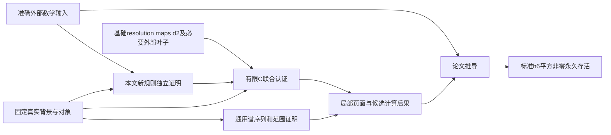

# 路线 C 的联合存在式边界与认证责任

本文件随第 0 步接口重构新增，不改写 `docs/audits/stage0-57647d2.md` 的历史判断。基线仍为 `57647d2158891da6cf7bd392f70f0f4158553dcd`；源数据库、CSV、生成记录的数学内容未在本次修改中重算或认证。

## 已冻结的数学目标

`KIP126.Computation.Route.Certification D G` 明确要求存在**同一个** `R : Realization D` 和 `L : Labels H`，满足七组条件：全部选定局部 E₂ 基、球谱 CSV 单项式解释、选定次数的真实 cobar 乘法比较、标准/路线/tmf 标签、有限记录语义、同一 ν 的 cofiber 底胞映射、同一塔悬移下的顶胞映射。定义在 `LinProgram/Route/Certification.lean`。

路线的四个非标准标签 L 是该解释的共同输出。因此不对任意预先选定的 L 或任意线性同构 R 断言结果成立。G 是 A(M) 同一个 tmf 标签包，其 `Standard` 条件用原始 IWX 低维计算中的唯一非零类识别。

生产声明 `Interface.Challenge.LinProgram.route_certification` 与消费公理 `Main.Axiom.Computation.route_certification` 的完整类型一致：背景为固定的 `StandardRouteModel Syn`，显式要求 `GeometricNuSourceIdentification D` 和 `G.Standard`。几何条件定义在 `Certification/Standard.lean`，包含两件不同的事实：标准 h₂ 非零永久存活及其对 **D 中实际 ν 映射** 的 Adams 检测；该映射严格等于 `Source.Hopf.geometricNu standardSourceBinding`，即同一实际普通谱来源下稳定化的四元数 Hopf 映射。生产声明不导入消费公理。

一般谓词现名 `NuDetectionIdentification`。仅有它不能唯一识别几何 ν：同一 leading term 还允许奇数倍 ν。标准适配器 `geometric_nu_source_identification` 保留 `hGeometry : StandardClassicalSourceGeometry A.classicalSource`，将 `A.bindings.classical.nu` 与 `hGeometry.nu` 两个等式直接复合；检测部分投影自同一个 A。`standard_final_of_accepted_computation` 因此显式接受 `hGeometry`，没有为任意 A 额外断言几何识别。来源模型的后续构造须把接受的标准经典来源见证与这里的 A 绑定，不能另选来源。这条适用条件不依赖 Cν 的待认证输出，没有形成计算循环。

消费端应 `rcases` 联合存在式，再用 `CertifiedRealization.toInputs` 包装这个已选定的 R/L。没有另一个全局 `Classical.choice`，没有从原来的大 Challenge 包投影而来的第二个坐标解释。七个原子目标可分开认证，但最终必须交付这个共同见证。

## 有限记录没有升级为永久性假设

原始 `Statement` 未改变：9000 对应 `ReachesPage 1000`；等式允许后页的零值；根层 T 试探是等式的否定；未知、缺次数和越界索引仍失败闭合。

新 `Main/Solution/Computation/Route.lean` 只给内部待证推论，不给新的计算或文献公理：

| 推论 | 足够且保留的前提/准确结论 | 证明责任 |
|---|---|---|
| `sphere_vanishing_line` | 正 stem 且 `0 < t-s < 2*s-3` 时真实球谱 E₂ 为零；排除零 stem | 独立基础/比较证明；Ravenel Th. 3.4.5(a), 印刷 pp.87,89。精确源界为 `2s-ε(s)`，ε=1,2,3；本式为其保守弱化 |
| `permanent_cycle_of_reaches1000` | `1 < t-s ≤127`，同一个 E₁₀₀₀ 代表与所有后续出微分目标消失，得到共同 Z∞ 代表 | 通用谱序列证明；允许该代表为入边界 |
| `nonzero_permanent_of_survives1000` | 另要求**非零** `SurvivesTo 1000` 及 `s<1000`；后续入源负过滤 | 通用谱序列证明；不是由 E₂ 非零直接推断 |
| `named_survive1000` | 同一 I 的完整基、记录及入边界重建，分别证明 U/correction/P/Q 在 E₁₀₀₀ 非零 | 有限线性代数与页面重建；4 个 9000 行本身不够 |
| `d3_x1266_candidates` | 完整 E₃ 候选组及根试探 2047477/2047478 的否定语义 | 有限候选穷尽及非零证明 |
| `high125_component` | E₄ 真正源/目标基、6 个根反证及已有 d₄([1])=[3] | 得到 (25,150) 的 **E₅** 唯一非零类 |
| `stem125_e5_zero_finite` | 26≤s≤64；38 条 staircase 行仅 level 2,3,4,9996,9997,9998 | 从实际 d₂–d₄ 与全局部基得到 E₅=0 |
| `sphere_page_zero_stem125_tail` | s≥65；125<2·65−3=127 | 独立消失线给任意后页为零，不以 t>261 缺行作零 |
| `classical_stem125_filtration26_zero` | 同一经典收敛比较、上述有限+无限范围、显式 `ClassicalSphereSeparated H` | 得到经典 F²⁶π₁₂₅=0；没有声称 synthetic 同伦的相同结论 |
| `high125_detected_choice_unique` | 相同 leading term、上一行 F²⁶=0 | 消除代表不定性以后才得严格等式 |
| `cnu_d3` / `cnu_target_through5` | 同一 R 和真实 cofiber；源局部坐标 [0,3,4]，d₃ 靶 [3]；另一目标 (14,139)[2] | 后者只断言 E₆ 非零及 d₂–d₅ 不被击中，未声称 Cν 无限永久存活 |
| `route_expression_labels` / `high125_label` | I 的 CSV/乘法/标准标签比较 | 连接 C 的 W/U/T/highClass 到论文 L 和 A 的 G；包含实际乘法结合律适配 |

这些目标中的 `sorry` 是公开的后续证明债。`ClassicalSphereSeparated` 单独写成真实经典塔过滤的 Hausdorff 性；D 现有的经典 associated-graded 比较不能冒充这一性质，synthetic 分离性也未被无条件改名使用。现由 Main/Axiom/Literature/Range.lean 显式接受 Ravenel 在标准完成球谱背景的独立收敛/分离性特化；它是有来源的一般 A，而不是新增数值 C。

消失线来源：Douglas Ravenel, *Complex Cobordism and Stable Homotopy Groups of Spheres*, Th. 3.4.5(a), pp.87,89；[原书 PDF](https://webhomes.maths.ed.ac.uk/~v1ranick/papers/ravenel2.pdf)。该原书包含证明，不只是搜索结果或未核验的二手摘要。

## 第一阶段仍须交付什么

1. 固定版本解析与数学语义：Lin `v126.3.cw49`，Zenodo 14875701；保留 SQL NULL、depth/reason、局部/全局编号、所有条件分支及 E₂ 坐标顺序。解析/哈希只检查字节或语法。
2. 自由 Steenrod 分辨率/增广/差分的准确解释及其与同一 H/M cobar 的比较；Cν 的同一 cofiber 共作用、cell 坐标与实际箭头比较；完整局部基与所有线性组合的认证。联合存在式的构造必须提供这一来源证据，不能任取 R 后依据同名/同次数声称命中原程序。
3. 对七组原子目标交付证明。可以直接证明准确数学命题，也可以实现有数学 soundness 定理的重放器。当前没有将某个返回布尔值的验证器宣告为认证完成。
4. 若重放使用本文广义 Leibniz/Mahowald 等规则，先从同一背景和准确外部输入证明这些规则；这些规则的证明不得使用正在认证的同批输出。新规则保持本文推导责任，不移入 A、M 或原始 C。
5. 提取所需依赖闭包并证明覆盖。最终消费者只有 sphere/Cν 不意味着重放仅需这两者；不能未经闭包分析要求全部 49 谱，也不能据此忽略 tmf 或辅助高 stem。

本次直接只读查询 `proofs.db.log where reason='M'` 得到以下三个手工叶子，正对应主论文 Appendix 在 `main.tex:2785–2794` 列举的源输入：

| log id | 对象 | 源 (s,t)，r，局部坐标 | 靶 (s,t)，局部坐标 | 原文数学叶子/归属 |
|---|---|---|---|---|
| 71642 | S0 | (25,88), 5, [1] | (30,92), [0] | d₅h₀²⁴h₆=h₀²P⁶d₀；image-of-J 外部结果与本版本坐标适配 |
| 71643 | S0 | (56,183), 6, [1] | (62,188), [0] | d₆h₀⁵⁵h₇=h₀²x₁₂₆,₆₀；image-of-J 外部结果与本版本坐标适配 |
| 71644 | tmf | (16,112), 3, [0] | (19,114), [0] | d₃v₂¹⁶=β⁵g；Bruner–Rognes 幂运算结果及 tmf 比较 |

这些是**整个程序**列举的初始叶子，尚未证明三个都处于当前选定输出的最小重放闭包中。其深度 0/M 行仍不是对应数学命题的证明。直接计算得到的 E₂、谱间 E₂ maps、d₂ 也各有基础数据/算法正确性义务。

已读根试探的诊断还暴露以下闭包要求：2047477/2047478 用球谱 h₂ 乘法访问 stem 129/128；154532–154535 用 stem 30、AF12 因子访问球谱 stem 156/155；154536/154537 用 S0→tmf、tmf 的 (stem,s)=(125,25) 比较。它们不会因最终 C 只留局部反证而自动消失。精确重放还须保留 enclosing contexts、staircase 快照和候选空间覆盖；没有把 root-level refutation 当正向等式。

## 仓外分辨率示例的实际范围

本次读了 `/Lin-program/program/ExtComplexCertificates/res_export.cpp`、`ActualResolution.lean`、`GenericFreeComplexProducer/actual.py` 及实际数据库。唯一找到的 `_Adams_res.db` 是 `ExtComplexCertificates/actual-s0/S0_Adams_res.db`，直接查询为 16 generators、max(t)=8。其 raw 导出固定了 Milnor 差分项和 local_id；来自 `Adams res S0 8`，source commit `23d12c973db2b294a6c00c15bd106e70b0af3fa6`，不是论文 release。

`GenericFreeComplexProducer/actual_t4/actual_t8` 是这个低次数样例的闭合导出；`Fact713ComparisonBatches` 是局部页面线性代数证书，不提供论文 near-126 的自由分辨率差分/augmentation。S0/Cν AdamsSS 数据库中的 generator `repr` 是整数局部编号，不是 Milnor cocycle；Cν 的 `cell`/`cell_coeff` 也不能代替 actual cofiber comparison。

因此这些材料可用于设计第一阶段认证器，但未被冒充为 near-126 完整来源见证。这是构造已准确声明的联合存在式见证时要补齐的材料；本文件没有预设或宣称算法认证已完成。

## 无环的责任划分

这是明确的证明责任图，不是已经核实了每一条程序日志的闭包图。第一阶段认证不可导入 `Main/Axiom/Computation/Route`；本文新规则的独立证明不可将当前 C、§7 特定结论或 T 当作前提。`Main/Solution/Computation/Route` 的局部派生推论位于 C 之后，不能反过来作为认证同一批 C 的叶子。

## λ 窗口的精确推导接口

`Main/Solution/Computation/Lambda.lean` 将 Remark 7.4/7.5 和 Proposition 7.8 所需窗口单独声明，参数为同一 A、I，不以 `sphere_facts` 的名字代替证明接口：

- BHS 的 `E∞ = Z∞ / B_(1+t-w)` 表明单步 λ 的 associated-graded 核来自新增 `B_(2+t-w)`；对应经典微分源固定为 `(s-r,t-r+1)=(w-m-2,w-1)`。`lambda_injective_of_source` 据此精确要求该源位置所有实际出微分为零，再使用同一 D 的 synthetic Hausdorff 性得到实际同伦单步注入。
- `lambda_powers_injective_of_source_halfplane` 要求整个 `q≤w-m-2` 源半平面，而不是把某个重量处单步结论无条件迭代。
- (62,64)：需要 stem63、AF≤0 的空源；当前 Raw 包含 AF0 空基，负过滤由真实塔消失。得到所有有限 λ 幂注入、同一 `D.recovery.realization.map` 注入；结合经典 π₆₂ 指数二，得到 `theta5_choice_order_two`。这没有将 Xu 的“存在一个二阶 θ₅”扩成外部“所有 synthetic 选择二阶”。
- (124,128)：需要 stem125、AF≤2 空源（当前 C 给 AF≤4）。得到所有 λ 幂及 localization map 注入，支持 θ₅² 的过滤分析。
- (125,130)：规范化实际只需要 λ:π₁₂₅,₁₃₀→π₁₂₅,₁₂₉ **单步**注入。对应源是 (3,129)；S0_ss 2380、唯一 E₂ 基 `h0*h6^2` 已被 d₂(h₇) 击中，故 d₂²=0 且 E₃以后全零，足以给所有出微分为零。由实际 λ-cofiber 正合性得到 `bx_finite_lambda_normalization`：对 r≥1，`a mod λ^r=0 ↔ (λa) mod λ^(r+1)=0`。

这里刻意没有假定 (125,130) 对**所有** λ 幂无 torsion 或 localization 注入。未排除的 d₁₂(h₆²)=T 分支在 synthetic 公式中会给 λ⁹T 的 λ²-torsion 候选，不能为了规范化先把该分支排除。主论文“doesn't contain any λ-torsion classes”的宽泛措辞不作为更强前提输入；实际消费所需、当前已冻结的接口是上述精确单步结论。最终 T 证明之后可再研究较强结论，当前接口不倒置依赖。

## §7 局部消费声明

`Def/Kervaire/Route/Goals/ExtensionSteps.lean` 与
`Main/Solution/Route/ExtensionSteps.lean` 将论文推导拆成单独的内部命题：

- ν 的 E₄ 扩张和 E₄→E₆ 有限提升，参数为 `(rEarlier,rLater,n,s,t)=(4,6,3,8,133)`；源为实际 S³。所需 Z₅/Z₃ 条件分别对应 X 到 E₆、Y 到 E₄。
- 含 `b=0` 的较强 crossing 排除在这个实例可由空源群证明：`(a,b)=(1,0),(1,1),(2,0)` 的源经过实际塔悬移为球 `(9,131)`、`(10,132)`。两处完整空基已在选集中，未新增程序断言。
- Q₅→Q₉ 的 ν 关系保留 `∃x,y` 和实际检测；Lemma 7.14 保留一个来自 Q₁₁ 的共同 α₁，以及每个 U 选择对应的 α₂、α₃。
- Massey 的全体定义系统、零不定性、Moss 方向的 crossing 排除、Q₉ 的 F₁₃ 以下候选穷尽分别有目标；后者只在实际同伦群的过滤商中陈述加法生成，未把同伦群设为 F₂ 向量空间。
- Corollary 7.18 的必要弱化保留 Y 检测者的存在性和对每个 Y 选择的量词；结论为 h₀Y 由 λ⁶T 非零检测，不再要求对任意代表都有严格 λ⁶ 可除性。两个 Y 选择之差在实际 F¹⁴，其 h₀ 像之差在 F¹⁵；weight133 的 F¹⁵ 余项经 λ² 到 weight131 后为零。`nu_extension_h0_leading_term` 仍单独承担 λ⁵Y 与 λ⁴Y 的代表选择/权重适配，结论仅为所需的 associated-graded 非零检测。
- P/Q 的实际 F₁₄ 估计、球谱上 λ⁴T 的 λν 可除性和其导致同一 Cν 底胞腔在 2≤r≤5 被击中，均为明确内部目标。最后一项与 C 导出的 `cnu_target_through5` 直接对接。

这些内部定理的复杂证明仍为 `sorry`，不是外部接受命题或原始程序认证结果。新增签名不表示它们已获证明；尤其从 Q₉ 关系回到球谱关系的存在选择、Toda 不定性和 λ 权重适配仍需第二阶段完成。

Lemma 7.16 的 B 位于 `(62,70)`，其阶二性没有套用 `(62,64)` 的 λ 单射。`lambda_kills_realization_kernel_62_71` 单独陈述 `(62,71)` 经典实现核经一次 λ 变为零；`two_torsion_62_70` 由经典 exponent-two 和 `λh₀=2` 导出。这里 stem63 AF7 的 d₄（row512）、AF6 的 d₂（row494）和相关永久循环下界均在原有选集中；无须新增原始 C。`b_lift_order_two` 与 `theta_b_synthetic_toda` 保留共同的存在见证、实际检测和阶数前提。它们仍需第二阶段完成核的过滤分析及 Moss/Toda 适配证明。

## 2026-09-29 再核查的声明边界

本轮重读 BHS `SynRevAdams.tex:74,101–110,126,324–355,380–414`，以及主论文 `main.tex:2571–2581`，并只读查询实际 SQLite/CSV。BHS 的 Bᵣ 包含 d₂ 至 dᵣ，故单步 λ 核源确为 `(w−m−2,w−1)`；π₁₂₅,₁₃₀ 对应 `(3,129)`，没有页数少一错误。B 的 weight71 核窗口使用 row494、512、513，仍需给出严格过滤证明，没有把 associated-graded 核枚举直接冒充实际同伦核。

本轮收紧 `H0ExtensionForAllY`：主论文 Corollary 7.18 字面写严格关系，但其任意选择论证只明确排除影响 AF14 首项的差值。这个证明路线实际只需要非零检测；不需要把所有 F¹⁵ 误差进一步断言成 λ⁶ 倍数。新增 `q9_y_choice_difference_filtration14`、`h0_q9_y_choice_difference_filtration15`、`q9_filtration15_zero_125_131`、`lambda_two_kills_q9_filtration15_125_133`，保留实际过滤、权重和 D 的分离性；均为内部待证引理。

实际记录显示有限商高过滤余项不能不经分析删除：SS3154 的 `(15,140)[3]`=`h₀*generator449` 支持 d₂，SS3256 的 `(16,141)[3]`=`h₀²*generator449` 也支持 d₂；在 Q₉ 最低 λ 层仍可能出现相应类。这里未声称这是带矛盾前提 C₃∧C₅ 的反模型，而是说明“leading term 相同”本身不提供旧严格可除性命题。

冻结范围仍是原始 C 的共同解释数学目标与本文消费接口，**没有采用或宣称已冻结 proofs.db 重放算法**。联合 Certification 可由直接数学证明交付，也可由未来具有准确数学 soundness 的证书交付。若选择后者，以上三个 M 叶子、实际用到的谱与映射、完整分支前提、候选覆盖及每类规则的同模型 source/适配命题，必须先写清，再认证；现有三行坐标表不等于已交付这套重放接口。这项区别不得用“只是认证没做”掩盖一个被宣称已采用却没有类型的验证器。
