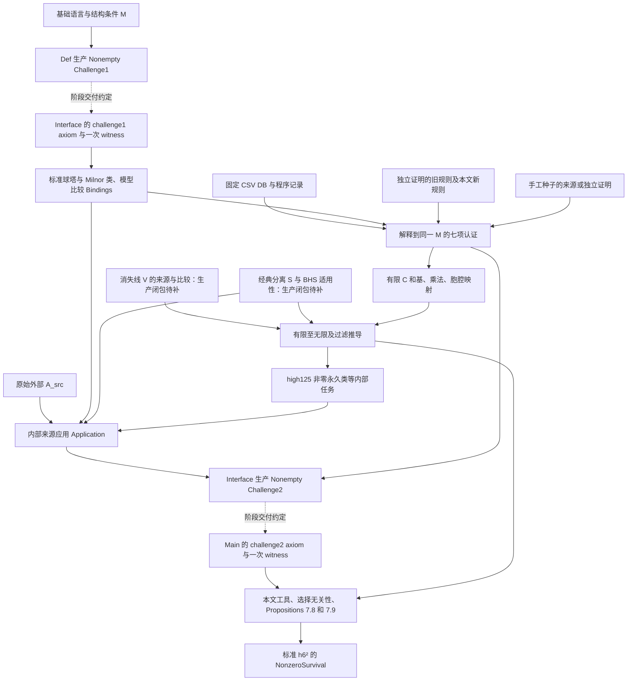

# KIP126 第 0 步数学接口独立审查（2026-10-03 快照）

> 历史检查证据：下文的源码路径、Challenge1/两次选择架构、阻塞项与检查输出对应 2026-10-03 基线，部分已被后续修订取代。当前目录与接口责任见 [STAGE_LAYOUT.md](../STAGE_LAYOUT.md) 和 [STAGE0_INTERFACES.md](../../STAGE0_INTERFACES.md)；后续来源补证见[补证记录](stage0-source-supplement-20261003.md)。本报告及附件保留原始检查范围、来源读取和日志查询证据，不作为当前待办清单或验收结论。

**总评：第 0 步未完成。** 标准目标本身及所选模型的大部分关键绑定已具备；本次确认的阻塞在于必要前提和来源适用性的交付闭包没有全部写清，而不是 `sorry`、阶段公理或计算尚未认证。尤其是从有限计算到无限尾部所用的球谱消失线，以及从 associated graded 到实际经典同伦群所用的分离性，没有接到同一个标准球谱的明确来源或内部生产声明。另确认 BHS 无限提升与滤过比较的原文适用条件缺少所选对象的生产接线。image-of-J 手工种子归来源证据缺口和认证债，不单独作为接口阻塞。

本报告以本次实读源码、主论文和原始计算实体形成判断，不采用既有冻结文档的完成度结论。三项硬标准分别为：

| 硬标准 | 本次判断 | 已确认的正面证据与限制 |
|---|---|---|
| M/T | 核心目标语义准确；完整使用前提尚未闭合 | 同一 HF₂.unit 球谱 Adams 塔、标准 Milnor h₆²、共同 Z∞ 代表及 E∞ 非零均可展开核对；classical separation 的前提闭包仍缺，见 B01；BHS 无限部分另见 B02。 |
| C | 有实质有限覆盖，尚不能认定完整冻结 | 固定记录、所有线性组合的基、乘法、同一 Cν 胞腔箭头和 root presentation 绑定已明确；有限至无限的前提闭包 B01、手工种子 E02/P01、认证规则的实际依赖需分别处理。 |
| A | 四层分离成立；仍有覆盖缺口与原文证据缺口 | Bindings/Statements/Application/Inputs 不能合并计算。若干主要原文已核对；V/S 与 BHS 无限结果的来源适用性未闭合，另有 Moss/Toda/BR21 等精确原文强度尚不能全数确认。 |

没有发现已核实的“把 T 或 Proposition 7.8/7.9 藏进 Route.Model”现象；没有发现一个可以完整列出的已成立数学依赖环。报告会指出潜在错误构造路线，但不把它们说成已经发生的循环。不得据此反向理解为已证明整个模型一致、所有声明正确或全部计算需求覆盖。

## 1. 本地基线、操作边界与证据层级

- 目录：`/inspire/hdd/global_user/baokangjie-CZXS25250151/KIP126-develop`。
- 基线开始：**2026-10-03 08:33:11 UTC**；文件摘要采集稍后完成，全部审查者读取同一目录。结束复核于 **2026-10-03 08:50:46 UTC** 完成：2,165 个基线文件摘要全部未变；详见同前缀 evidence JSON。
- 已先读 `README.md`、`PROJECT_BOUNDARY.md`；从根目录至仓库路径以及仓库内部检索，未找到确实存在且适用的 `AGENTS.md`。这没有阻塞审查。
- Lean：`leanprover/lean4:v4.32.2`，实际二进制输出 `Lean 4.32.2`，内部版本标识 `f3b06c705e6c85f5314019d5d3baab0fec5b580c`。
- Mathlib：`v4.32.2`，`lake-manifest.json` 固定为 `905b95818eb32af7874a58b427f50c1711a5e96c`；本地依赖目录版本相同、跟踪文件无 diff，依赖自己的 `lean-toolchain` 同为 4.32.2。这里只读取本地依赖版本，未查询项目提交历史或远端状态。
- 主论文：Lin–Wang–Xu, *On the Last Kervaire Invariant Problem*。以本地 `KIP126/Main/Axiom/Literature/MainPaper/main.tex` 为主要消费点文本，交叉读 `112.tex`、`paper.txt` 和 bibliography；本地 PDF 已记录摘要。版本台账对应 arXiv **2412.10879v2**，官方版本页确认日期为 **2025-02-22**：[官方 v2 版本页](https://arxiv.org/abs/2412.10879v2)。没有将线上后续版本替换本地文件。
- 固定数据：Zenodo **14875701 / v126.3.cw49**。目标仓 Raw 的七个大 CSV/DB 文件是 LFS pointer；在兄弟目录 `../KIP126/KIP126/Main/Axiom/LinProgram/Raw/` 找到同一版本八个所需实体，全部对照 `selected.json` SHA-256 核验一致后再只读查询。因此本次不局限于生成 JSON/Lean 记录。
- 程序/筛选：本地 `select-route.py` 及固定 release 程序源码按文件摘要记账；程序 release/实体核对和日志规则证据详见 C 附表。SHA 只表示文件身份，不表示输出命题为真。
- 本次不更改已有源码、数据、论文、生成文件、CI、依赖和报告；未 fetch/pull、切换分支、提交、推送、建立 PR 或发送外部消息。只新增本报告、同前缀证据附件和隔离临时检查文件。

关键 SHA-256：

| 文件（仓库相对路径） | SHA-256 |
|---|---|
| `KIP126/Challenge1.lean` | `c40ea453a8fb23e538c70e140b5c9761176b83c33925669a9e58d1a084da149b` |
| `KIP126/Challenge2.lean` | `69cdf84f4bb0e21c292d42fc3163e43702ddd7483a6c8c92e036b2658e733426` |
| `KIP126/Main/Axiom/Literature/MainPaper/main.tex` | `828ee5a5aa06e1f390b036a043230ed417446fa7be11a4e27eecc4a565135c4b` |
| `KIP126/Main/Axiom/Literature/MainPaper/112.tex` | `5eb83ef105ce9dbbda87a9f57726bb5c078308fd3718840ea29ee8100cbefabb` |
| `KIP126/Main/Axiom/Literature/MainPaper/2412.10879.pdf` | `7cae269851a88d10dd194651dbf7497b75ef8b8b914bc1901dfa3734cd8096b4` |
| `KIP126/LinProgram/Route/selected.json` | `5dd4b2d6e60feac833e9fe311d73fcf8075fba8b50a84003dce2eed2d72a3fab` |
| `KIP126/LinProgram/Translate/select-route.py` | `66bcd29ce0d05f478a06e6e47589ce3e5d96e4ca5d36b86d6e0fe9bebe79eec3` |

实际检查：

| 检查 | 结果 | 证据边界 |
|---|---|---|
| `python3 -B scripts/test_stage_boundary_layout.py` | 18 tests，通过 | 检查 import/目录/见证选择等结构，不证明数学闭包。 |
| `python3 -B scripts/check_route_literature.py` | 10 consumer fields、28 provenance groups、8 model groups、8 adapters、3 delivery packages、68 declarations、17 hashes，通过 | 枚举和身份一致，不证明原文等价或必要前提充分。 |
| `python3 -B scripts/check_source_inventory.py --skip-lean-projection` | 18 sources、88 artifacts，通过 | 本次只运行文件/元数据检查，明确跳过会触发 build 的 Lean projection。 |
| 固定实体上 `select-route.py --check` | 648 度、963 向量、671 claims、651 core rows、73 product pairs、4 bottom maps、8 refutations | 是重新筛选的一致性，不能以此证明数学覆盖充分。 |
| Lake 原生 `computeFileHash` 对照本地 trace | 检查依赖闭包 767 项；766 项源码 hash 与当前源匹配，766 个 olean 输出 hash 全部匹配；Main Challenge 占位模块没有可用 source trace | 缺 trace 的 Challenge 模块只按源码审核，不使用其编译记录作证。Mathlib 本地版本/源状态另核；没有全量重编依赖。 |
| 固定 Lean 下隔离 `AuditProbe.lean` | `#check`、`#print axioms`、最终类型 example 均成功 | 只用于精确签名和现有证明依赖；不认证未完成证明。 |

Lean 在普通沙箱内最初返回 `failed to locate application`；随后获自动许可，只读运行既有固定二进制，所有输出放 `/tmp/stage0-20261003-083311/`。没有更换工具链，也没有运行全量 build 或修改共享缓存。

实际数学阅读以 §7 Theorem 7.1、Propositions 7.8/7.9 及其 Lemmas/Facts 为起点，回溯到 §2–6 的检测、商塔、extensions、Toda/Moss、广义规则，并核对选中原始日志、数据库、基与胞腔映射。附表列出源码/原文实读范围。**767 个模块指纹匹配不等于逐行审读 767 个模块。** 未完成全体 49 个计算对象和全部日志的认证闭包重放，未逐项证明 401 个附录条目，未独立审计全部基础模块的每个 `sorry`，也未核完所有原始参考书/论文。上述未覆盖部分不作通过声明。

## 2. M/T 对象、五种状态与 §7 谓词

下列对象绑定表及定义展开由本次 M/T 分工完成，主审交叉复核了根见证、目标、永久存活、C3/C4/C5/D12、模型 convergence、乘法交付和最终组装。五态中的“声明有”不意味着“已构造/已证明”；“消费已接”指类型上的同一对象传递，含 `sorry` 的命题不能计作已实际使用全部输入完成推导。

### 2.1 对象绑定表

| 对象/操作 | 实际 Lean 声明与定义 | 绑定/范围 | 五态判断 |
|---|---|---|---|
| 抽象稳定同伦背景 | `KIP126.StableHomotopy.StableHomotopyCategory`，`Def/StableHomotopy/Context/Data.lean:31`；`KIP126.Challenge1.FoundationInput`，`Challenge1.lean:315` | additive、ℤ shift、monoidal unit；sphere 是 unit；π_n X 是 `Sphere n ⟶ X`，非全体 F2 向量空间 | 定义有；模型存在性待 `Def/Solution/Challenge1` |
| HF2/系数 | `FoundationInput.hf2`，`Challenge1.lean:327`；`FoundationInput.pi0Equiv/homotopy_vanishes`:320–322 | π0 HF2 ≃ ZMod2，其余 π_n HF2=0；root `CooperationInput` 同一 HF2 ring/Künneth/Milnor coproduct | 定义/准确结构要求有；见证未构造 |
| Milnor 标准坐标 | `KIP126.Challenge1.MilnorInput`，`Challenge1.lean:347`；`CooperationInput.coordinates_eq`:412–414 | actual E1 坐标和实际 d1；坐标等于 ring/Künneth/basis 构造，非仅任意 E2 等价 | 已绑定；见证/相关比较证明债 |
| 球谱 Adams SS | `KIP126.Classical.Adams.sphereAdamsModel`，`Interface/Solution/StageInput/StandardSphere/Sequence/Data.lean:13` | actual HF2.unit sphere tower；`adamsTowerInternalSpectralSequence` 位于 `Def/ClassicalAdams/TowerSSData/Sequence/Data.lean:18`；r0=2，dr degree=(r,r-1) | 定义及 generic successor 构造有；同一见证消费已接 |
| h6、h6² | `standardH6`、`standardH6Square`，`Interface/Solution/StageInput/StandardSphere/Classes/Data.lean:13,21` | `Sphere.Internal.hi/hiSquare` (`Def/ClassicalAdams/SphereClasses/Hi/Internal/Data.lean:25,32`) 从 `[ξ1^64]`、`[ξ1^64|ξ1^64]` actual first-page homology 进入同一 E2；次数 (1,64)、(2,128)，stem 分别为63、126 | 定义有；E2 非零有已给证明链；并未假设永久存活 |
| T | `KIP126.Challenge.Final.H6SquarePermanent.h6_sq_permanent`、`KIP126.Solution.Final.H6SquarePermanent.h6_sq_permanent`，`Main/Challenge/h6_sq_permanent.lean:17`、`Main/Solution/h6_sq_permanent.lean:18` | `NonzeroSurvival sphereAdamsData (2,128) standardH6Square`；不依赖 CSV 来定义目标 | 定义准确；最终 solution 消费同一两项 Prop7.8/7.9；证明未完成 |
| synthetic ν 与 λ | `NuFunctorData`、`SyntheticCategory`，`Def/Synthetic/Context/Data.lean:83,28`；`Route.ModelData`，`Def/Kervaire/Route/Model/Data.lean:37` | ν 是指定 functor，classical Hopf ν 为另一 `auxiliary.nuMap`；λ 为实际 natural transformation；λ^n 和 quotient 是其 cofiber | 定义/λ coherence 明确；模型见证待证 |
| synthetic family / tower | `Route.Model.towerPresentation`，`Def/Kervaire/Route/Model/Coherent/Data.lean:18`；`Synthetic.SpectralSequence.TowerPresentation`，`Def/Synthetic/AdamsSequence/TowerComparison/Data.lean:36` | all weights 上与 actual νHF2 tower 的 SSData 双向同构、dr commute、E2 自然性，不仅同名对象 | 已声明准确性质、绑定清楚；见证/比较待证 |
| 检测 | `TowerDetection.Convergence`，`Def/ClassicalAdams/Detection/Convergence/Data.lean:12`；synthetic `Model.convergence_canonical`:22 | classical canonical 在 actual J/cofiber/tower projection 上；synthetic canonical 相对于同一指定 P 及 weight tower；不是 arbitrary E∞ iso | 已有准确声明；canonical proof / witness 债 |
| Cν | `AuxiliaryData.nuTriangle/nuRouteTriangle`，`Def/Kervaire/Route/Objects/Data.lean:56,74` | 同一 ν:S3→S 的 cofib；bottom/top 就是 cofibι/cofibδ；`ClassicalObject.nuCofiber` 定义为它 | 定义/箭头绑定有；几何检测来自显式 A/Binding |
| η与 normalized maps | `NormalizedSyntheticMap`，`Def/Synthetic/NormalizedMap/Data.lean:37`；`HopfBindings`，`Challenge2.lean:568` | exponent 使用 actual AdamsFiltrationAtLeast；factorization 到 νf；η 等于实际 normalized η map，h1/h2 classical detection 明列 | 准确声明有；不把任意 normalized map 自动当 compatible triangle |
| tmf | root `ModelBindings.detectorIso/unit/mul`，`Challenge2.lean:2951–2958` | detector 同一 TmfModel target，unit 和 multiplication 的 equations 均有 | 已绑定；来源模型/比较见证另列，不能仅按名称算已构造 tmf |
| realization/E2 | `Literature.Route.Bindings.nuE2`，`Challenge2.lean:1903`；`RealizationTower.NuE2Binding`，`Def/Comparison/ClassicalSynthetic/RealizationTower/Route/Data.lean:46` | actual realization tower map，通过 D.towerPresentation，其 E2 把 D.nuE2 标签送回 x；系数同一 HF2 recovery，weight bases 同一恢复数据 | 非自由 iso；准确比较目标有，证明/实例未交付 |

`Interface.StageInput.witness` (`Interface/Solution/StageInput.lean:7`) 只 choice 一次 Challenge1；`StandardSynthetic`/`standardRouteModel` (`.../StandardSphere/Route/Data.lean:15,18`) 正是其 routeInput 投影。Main witness (`Main/Solution/StageInput.lean:7`) 只 choice 一次 Challenge2；root Challenge2 从头引用同一固定 Challenge1，`route_presentation` (`Challenge2.lean:3002`) 绑定 route 与 root Lin presentation。不能把这些独立证明债报告成另选谱序列或多见证混用。

### 2.2 永久存活、检测与 §7 逐项核对

`KIP126.Core.SpectralSequence.NonzeroSurvival` (`Def/SpectralSequence/Permanence/Predicates.lean:28–35`) 是存在一个 z∈Z∞，其 E2 投影等于指定 x，且该同一个 z 的 E∞ 像非零。`SSData` (`Def/SpectralSequence/Basic/Data.lean:33–65`) 的 Z∞ 是有限 Z 的 inf，B∞ 是有限 B 的 sup；actual tower 实例在 `Def/ClassicalAdams/TowerSSData/Data.lean:25–59` 使用实际 submodule 的 iInf/iSup。不是“每页各选代表”，不是有限窗口，也不是仅出微分为零。T 也没有额外断言 θ6 阶数或几何流形。

`RepresentsOnPage` (`Def/SpectralSequence/Computation/Predicates.lean:22`) 要同一 cycle 代表把 E2 和 Er 关联。`SurvivesTo`:36 要 Er 像非零，`HasDifferential`:72 要 source/target 实际 Er 代表，`HasNonzeroDifferential`:82 要 target 在 Er 非零。`ReachesPage`、`IsPermanentCycle` (`.../Computation/State/Predicates.lean:23,46`) 都有意允许后来/最终边界，不能升级为 NonzeroSurvival。

- `Kervaire.Route.C3` (`Def/Kervaire/Route/Conditions/Predicates.lean:30`) = d6(W)=0 的 HasDifferential，必须实际到 E6；W degree (8,134)，target (14,139)。没有用 vacuous DifferentialVanishesOn。
- `D12`:24 = h6² 到 target 的 E12 **非零** differential，target (14,139)。
- `C4At`:44 = θ² 被 λ6U 在 (10,134,128) DetectsNonzero；θ∈π62,64，θ²∈π124,128，degree 正确。
- `UChoice`:51 = U 在 (10,134,134) 对 u∈π124,134 的非零检测。
- `C5At`:58 = λ3ηu∈π125,133 被 λ6 target 在 (14,139,133) Detects，未无条件附非零。
- Detects (`Def/Synthetic/Detection/Predicates.lean:23–32`) 要求共同 Z∞ 代表、actual tower filtration lift 及 associated-graded 等式，允许 leading class 为0；保留 higher-filtration indeterminacy。DetectsNonzero:36–41 另加 E∞ 非零。
- C4/C5 的 existential quantifier 与 `ChoiceIndependence/c4_c5_choice_equivalence.lean:19–24` 的 universal target 分开；但此 equivalence 目前只是定义，证明必须使用非空 θ/U 选择与 indeterminacy 计算，不能单凭 ∀ 自动取得存在。

本次直接核对本地 MainPaper/main.tex:2181–2209（Propositions7.8/7.9）、2221–2257（Lemmas7.10/7.11）、2260–2262（Remark7.12）。上述定义符合原文刻意区分的 C4 非零与 C5 条件非零。

### 2.3 标准平方与一般乘法分别记账

`Sphere.Internal.product` (`Def/ClassicalAdams/SphereClasses/Product/Data.lean:17`) 是从固定 Milnor cobar concatenation 运输到 actual E2 的操作。actual tower 的 layer product `Sphere.Multiplication.firstProduct` (`Def/ClassicalAdams/SphereMultiplication/Data.lean:35`) 独立来自 tower/HF2 ring。

root `SphereMultiplicativeInterface P` (`Challenge2.lean:2298–2322`) 对所有 t+t'≤261 的 actual second-cycle representatives，要求 P.product 等于 actual firstProduct 的 class；并绑定 unit。其存在性生产声明 `KIP126.Interface.Solution.sphereMultiplicativeInterface` (`Interface/Solution/LinProgram/Multiplication.lean:8–10`) 的结果是 `∃ presentation, SphereMultiplicativeInterface presentation`，尚未证明；它并非替任意预选 P 生产该性质，这本身是准确比较的证明债。

Route `ProductCorrect` (`LinProgram/Interpretation/Route/Predicates.lean:50–53`) 在 selected product degrees 对所有 x,y 将 CSV quotient multiplication 等同 `Sphere.Internal.product`。与 root `route_presentation`:3002–3003、`LinE2Presentation.comparison_mul`:2078–2084、SphereMultiplicativeInterface 合并后，可在所选次数推导 actual/cobar product 一致性。**不能因未发现一个独立无界 general-product theorem 就判局部接口未绑定；也不能把局部比较当无界乘法比较。**

`KIP126.Interface.Solution.sphereSquare P` (`Interface/Solution/LinProgram/Square.lean:10–24`) 有真实证明：固定 LinE2 degree-(2,128) exhaustive/nonzero certificate + independent `standardH6Square_ne_zero` 给唯一非零元素相等。因此指定平方身份的证明并非仅靠任意 additive iso 的名称/次数。`KIP126.Classical.Adams.computedH6Square_eq_standardH6Square` (`Main/Solution/Computation/Comparisons/Classes.lean:9`) 则只是所选 Challenge2 的 `sphereSquare.standard_class` 投影。它的完整 stage 前提仍在所选 witness，不是新无条件认证；也没有证明所有类的 multiplication identity。

### 2.4 符号、自然性与有限 lifting


- `BiShiftCoherence` (`Def/Synthetic/Context/Coherence/Predicates.lean:17`) 对同一 biShift_comp/zero 要 associativity、左右 unit、λ centrality；Route.Model 实际存储它。不能仅根据裸 SyntheticCategory 缺 coherence 判 root 缺字段。
- sphere commutativity 只 topological degree sign 不是漏 weight sign：本次直接核对 `Sources/Pst/source/synthetic_spectra.tex:1958–1978`；Pst 首先给自然 sign，再调整 preferred sphere tensor comparison，得到 (-1)^(tt')，weight 不另生 sign。Route 的 `SphereProductCommutative` 明确要求该性质；模型构造需实现这个约定。
- normalized ν triangle 的三条实际 selected maps 不由 factorization 自动推出 distinguished。代码正确地将 `NormalizedTriangleCompatible` (`Def/Kervaire/Route/Triangles/Predicates.lean:15`) 单列、在 GeneralizedMahowaldLaw:32 明确要求，并通过 `NuCofiberSourceData/Results/LiftBinding` (`Challenge2.lean:1755,1806,1825`) 区分 source triple 与选择后的 maps。证明/构造仍未完成。
- 在检查的 Route.Model/conditions/StageInput 内没有发现自由 Prop、True 字段、直接 T/C3/C4/C5/D12 数值结论或未知运算用数据 sorry 偷渡。稳定/合成见证整体 `Nonempty Challenge1` 未构造是已声明模型存在性债，不能仅据此把准确接口判败。
- 最后 `permanent_of_propositions` (`Main/Solution/DifferentialReduction/Conclusion.lean:20–29`) 的逻辑正确；final solution 只调用同一 witness 的 η binding、Prop7.8、Prop7.9。两项 Proposition 证明仍 sorry；既不能说 T 已证明，也不能因它们未证明直接否定第0步。


FinitePageExtensionStretchingLaw 要 source 和 target 都属于后页 cycle 层，并排除 `FiniteExtensionNonliftableCrossing` 包含 b=0 的较强障碍候选 (`Def/Kervaire/Route/Extensions/Stretching/Predicates.lean:20–31`)。本次实读 MainPaper/main.tex:1981–2080，其 corollary 印的是 b>0。这是加强假设的充分条件版本，可作为内部待证引理，需证明/应用时给出更强前提；不能仅因强于论文就判错。它仅得有限页 relation 存在，没有指定早期严格解提升或无限相容解。

旧 `Interface/Solution/CoherentPageExtension.lean:72–135` 从指定初解与 actual restriction surjectivity 构造 compatible finite solution tower；没有 untruncated recovery 的结论。它使用另一 `NormalizedPageFamily` 接口，selected route 本身用 `Route.Finite/InfiniteExtensionWitness`，未见接入。不能宣称它已自动填补所选路线的 finite→infinite step；也不能未经证明将此一般接口强加为最终 T 的独立硬门槛。


## 3. C 的版本、语义链与论文反向覆盖矩阵


### 3.1 数据实体、版本与可重复检查

目标仓 `KIP126/LinProgram/Raw/` 的七个 CSV/DB 都是 Git LFS pointer（130–134 字节）；`ss.json` 是实体。没有把 pointer 当数据库。找到兄弟仓

`/inspire/hdd/global_user/baokangjie-CZXS25250151/KIP126/KIP126/Main/Axiom/LinProgram/Raw/`

的实体，**先逐一实算 SHA256，全部与当前 selected.json 及 pointer OID 一致**，之后才只读查询。来源版本：Zenodo 14875701 / `v126.3.cw49`。

|实体|字节数|本次实算 SHA256|
|---|---:|---|
|proofs.db|623042560|3a460683c023ee2d8f7e8f904ecef9044a474d88bb7184731e54978ba7dac248|
|S0_AdamsSS_t261.db|7913472|518a2ed86af6d4f7bcdc5db135ab6252bd50df34492ae208663aa1c140a820ed|
|S0_AdamsE2_generators.csv|149568|3c4e45a1e28837e651e729bee14e7c62a99f797bc650d69e8a79aec13a762c72|
|S0_AdamsE2_relations.csv|11634438|8b4b67d6fb3c9a3a264813ea780340e73b1a66290c8616d3308ae1fc19f3add5|
|S0_AdamsE2_basis.csv|1408908|6a337964ad3ac02b729a46fd839dced7cb6764d14d4cea413163987eba8de871|
|Cnu_AdamsSS_t200.db|3538944|e1274528151c3391f5e5f4de72f8428a68b5e145a07bb3cc946781efd9bfdbbe|
|map_AdamsSS_Cnu_to_S0_t200.db|40960|348873fdbe993aa6b266c34bb4eca6121ab4a44b086a951cb29026a19a0e57f1|
|ss.json|53978|a9a623bf7165e62fcf455e454fdf9195237491bf07bd148902e245aa1dba64d8|

执行：

```text
PYTHONDONTWRITEBYTECODE=1 python3 KIP126/LinProgram/Translate/select-route.py --check --raw-dir /inspire/hdd/global_user/baokangjie-CZXS25250151/KIP126/KIP126/Main/Axiom/LinProgram/Raw
```

通过，输出 `degrees=648, basis_vectors=963, claims=671, core_rows=651, product_degree_pairs=73, bottom_maps=4, refutations=8`。其中 579 equations、84 reaches、8 refutations，sphere 528、Cnu 143。脚本实际全读三份 UTF-16 CSV，与 sphere DB 的 generators/relations/basis/d2/local_index 比较（`import-selected.py:95–127`）；读取两个谱完整 basis/ss，并逐个 core degree 做 F₂ staircase rank 检查。这证明字节/解析/坐标一致与生成可重复，**不证明 actual Adams 页的任何事实**。

本次 selected.json SHA256 `5dd4b2d6e60feac833e9fe311d73fcf8075fba8b50a84003dce2eed2d72a3fab`；Selected.lean SHA256 `6f120b4a8b931f75bfbb3affb56d0d4b96dd799026a5a33189758f76188ee788`；其记录 MainPaper main.tex SHA256 `828ee5a5aa06e1f390b036a043230ed417446fa7be11a4e27eecc4a565135c4b`。

程序原文：另在本地 `Lin-program/program/upstream/source-code.zip` 找到发行源，5051993 字节，MD5 `66ce3684e92676604f8368191e35d5b3` 与同目录 Zenodo metadata 的该版本下载记录一致，SHA256 `dd784541626f4d693c35f3ca84d4a67e83758ac463aabe58ab6c9cc92be22a15`。核对 release-source 中 `ss/mylog.h,mylog.cpp,deduce.cpp,ss.cpp` 与 zip 中相应条目逐字相等；本次读相关 logging/rollback/reason/规则代码。未编译或运行上游程序，未重放证明算法。

### 3.2 实际选择范围与对象解释

`select-route.py:22–25,114–127` 的 core 范围不是简单完整矩形：

|谱|stem|core AF 范围|
|---|---|---|
|S0|62、63|0–10、0–9|
|S0|122、123、124|0–12、0–17、0–13|
|S0|125、126、127|0–136、0–135、0–134（t≤261）|
|Cnu|125、126、127|0–19、0–14、0–12|

另补 named atoms、73 个 product degree pairs 和所有坐标端点。次数窗口本身不证明需求充分，下面逐项核对用途。sphere stem125 AF26–64 有38条 staircase rows；≥65要独立消失线。sphere大范围AF65以上的空位置是显式空基命题，不是“missing lookup=zero”。

完整声明的关键语义链：

* `KIP126.Computation.Route.object`（`Interpretation/Route/Data.lean:19`）只取实际 sphere 与 `HasFunctorialCofiber.cofib D.auxiliary.nuMap`；`sequence` 是其实际 `adamsTowerInternalSpectralSequence H.unit`。
* `Realization.decode`（同文件:36）只在 fixed degree 与合法递增局部索引成功时给和；缺 degree、越界、重复索引失败，空向量在缺 degree 也失败。
* `KIP126.Computation.Route.BasisCorrect`（`Predicates.lean:33`）是 actual E₂ 与 `Fin length →₀ F2` 的 ℤ-linear equivalence，指定每个 unit vector 的逆像；同时表达生成与线性无关、空群和所有线性组合。`SphereBasisValue`:41 把 sphere basis 与 fixed relation-quotient 的 CSV 单项式绑定。
* `ProductCorrect`:50 对指定 degree pairs 中**所有** x,y 要求 `R.sphere (mulAt x y) = Sphere.Internal.product H M ...`，不是仅把乘积名称标成同一名字。
* `LabelsCorrect`（根 `Challenge2.lean:1983–1999`）给实际 Milnor hᵢ、平方、路线 x-label、tmf g 与 Δh₁g 的相等。`route_expression_labels`/`high125_label`（`Main/Solution/Computation/Route.lean:171,179`）准确声明合成表达式识别，目前 sorry。
* `BottomCorrect`（`Predicates.lean:56`）用同一 cofibι；`TopCorrect`:65 用同一 cofibδ 与 D 的实际 tower suspension 比较，完整把 ΣS³ 识别回 t−4 的 sphere。源 `map_AdamsE2_Cnu_to_S0` id1 的 `map="1,1"`、`ss.json` top sus4 与 bottom factor 0 均由脚本核对。此选择仍需 A/模型说明 ν 是几何 Hopf ν；不能对任意 ν-map无条件认证。
* `Inputs`（根:2004）和 `CertifiedRealization`:2017 同时保留 basis/csv/products/labels/results/bottom/top。`ComputationInterface.route_presentation`（根:3002）要求 ≤261 的 R.sphere 与**同一个**根 LinE2Presentation.comparison 相等。不同包同名数据没有被无条件混用。

### 3.3 论文反向需求覆盖矩阵

本节局部元素 `T` 指论文的 `(14,139)` 类（stem125），与本任务记号 `T(M)` 所指的最终定理不同。

表中论文定位均为本次直接阅读 `KIP126/Main/Axiom/Literature/MainPaper/main.tex`；`Derived.*` 完整 namespace 为 `KIP126.Computation.Route.Derived`；`Inputs.*` 与 `sphere_facts` 等完整 namespace 为 `KIP126.Computation.Route`。`Raw.claims` 全称为 `KIP126.Computation.Route.Raw.claims`，定义在 `LinProgram/Route/Selected.lean:657`。凡写“待证”不意味着第0步因sorry失败。

|论文消费点与需要|fixed raw/生成定位|同一M的声明/桥梁|状态/限制|
|---|---|---|---|
|Thm7.1 ← Prop7.8/7.9 (`thm:126survives`,2106; `possible_h_6_sq`,2181; `state5false`,2208)|全路线finite inputs|`Main.Solution.Route.proposition_7_8`、`proposition_7_9`（Route/Selected:26,34）在同一 Challenge2，本文推导|已准确连接主逻辑；两证明sorry，不是C字段|
|Remark7.4/7.5：π125,130 λ规范化，π62,64无λtorsion/任意θ5阶2，2127–2138|S0 ss2380：(3,129)来自d2入射；stem63低AF半平面；并非假设h6²存活|`lambda_injective_125_130`、`lambda_powers_injective_62_64`、`realization_injective_62_64`、`bx_finite_lambda_normalization`、`theta5_choice_order_two`（Computation/Lambda:70,88,96,111,120）|源控λ核、实际滤过分离、A的阶2；主要为准确待证适配。只声明125,130单步injective，未擅加all-power版本|
|Fact7.6(1)：W=x126,8,4+x126,8到E6，2156–2167|S0 ss2702 `(8,134)[0,3] level9994`；Selected:862|`Derived.SphereFacts.w_to_e6`(:79)，`sphere_facts`(:152)|原row只Reaches6，derived要求Survives6，需基+早期边界排除；未当同一性质|
|Fact7.6(2)：T永久cycle、仅d6(W)或d12(h6²)入射|ss3080 `(14,139)[1] level9000`，Selected:1000；完整stem126 degree+refutations|`t_permanent_cycle`、`OnlyIncomingT`、`t_only_incoming`（Consequences:56,80–81）|T非零永久存活并非输入：允许被d6/d12击中；无限outgoing依赖V|
|Remark7.7：x126,6的d3二选一，非零在E3，2169–2177|log2047477/8，depth1 T，Selected:1317–1318|`d3_x_126_6_candidates`（Route:122；Consequences:77）输出HasNonzeroDifferential|准确保留否定行；候选穷尽另由完整E3 group重建，不能数两条反证就完成|
|Fact7.6(3)：U=h0²x124,8非零∞|ss2693 `(10,134)[4] level9000`，Selected:907|`u_permanent`；`named_survive1000`(:112)→`nonzero_permanent_of_survives1000`(:101)|∞非零需入射重建+V，不从E₂非零/reaches直接推出|
|Fact7.6(4)/Prop7.8高125唯一E5类g⁴Δh1g，2166,2342,2796–2800|ss3992–3995 `(25,150)`；log154532–537六root反证+154545 d4[1]=[3]；Selected:1119–1122,1316,1319–1324|`High125Component`（Consequences:47）、`high125_component`（Route:129）、`high125_label`(:179)|E5非零+所有元素0或y明确；该类型**不是∞非零**，hhigh另有责任|
|高125 AF≥15其他消失、tmf注入/代表唯一，2342–2355|stem125 AF15–64全基/短d，AF≥65由独立消失线处理（65–136仍在已选空基窗口，≥137超出t≤261）|`stem125_e5_high_exhaustion`(:145), `classical_stem125_filtration26_zero`(:187), `high125_detected_choice_unique`(:196), `Lambda.high125_detector_nonzero`(:147)|需要V及实际经典S；这些前提没生产到root，见 B01；A的一非零同伦像不能直接给所有代表非零|
|Lem7.10 θ5选择差的AF≥6及平方差≥12，2221–2242|源IWX与stem62/63低权窗，非单纯numerical row|`ChoiceIndependence.c4_c5_choice_equivalence`与λ适配；A负责IWX|整体命题在Main已定义；具体过滤提升仍未写逐步证明|
|Lem7.11 U选择差：124stem AF11/12消失、AF13 h1作用零，2244–2258|完整124 AF10–13、h1乘积pairs；ss2778–2782、2845–2849、2914–2917|`SphereFacts.e5_stem124_af11`, `e4_stem124_af12`, `h1_correction_zero`（Consequences:106,114–115）|代码认真保留AF11有d4，故E5而非错误E4。纸面“d2或d3”概述不能机械照抄；实际所需λ/过滤推导尚待证明|
|Prop7.8 θ5²在π124,128无λtorsion、AF≥10、U/correction/更高三分，2328–2342|125stem s≤4显式空基；124低AF全部basis/ss；correction ss2916|`e2_stem125_low`、`correction_permanent`；`lambda_powers_injective_124_128`（Lambda:79）|无λtorsion准确单列；三分与过滤≥10仍是Prop7.8内部证明步骤，不是模型假设|
|Fact7.13/Lem7.14：V=x123,9+h0x123,8到E12且不被击中；d2x125,8=h1V+U，2377–2418|ss2569 `[0,1] level9988`；log5990 `(8,133)[1]→(10,134)[2,4]`；Selected:877,1310|`v_to_e12`,`v_not_hit`,`d2_x_125_8`（Consequences:66,88–89）|非零、not-hit仍由完整基/候选重建；输入只有限reach与普通方程|
|Lem7.14 AF13 correction与η作用，2426–2429|log153768 d3 h4x10912；e0Δh6g相关product+ss2916|`d3_h4_x_109_12`,`h1_correction_zero`,`correction_permanent`|finite数据齐相关degree；synthetic α2/α3存在和选择是Main推导|
|Lem7.14 λ³α1h0=0：AF11 d7与AF15 d3排除、映到λ9，2433–2445|log2671068 `(11,134)[0,1,3]→(18,140)[1] r7`；462481 `(15,138)[2]→(18,140)[2] r3`；Selected:1312,1314|`d7_source`,`d3_h0Sq_x_123_13_2`（Consequences:71–74）；stem123 AF≤17、h0乘积pairs|需要有限Bockstein/quotient运输；没有把有限页直接变无限lift|
|Fact7.15：Y=h0²x125,9,2到E5且never hit，2466–2468；Remark7.17条件下d5=0|ss2852 `(11,136)[3] level9995`；Selected:939|`y_to_e5`,`y_not_hit`（Consequences:90–91）|不假定d5=0；后者依赖C3和C5'，本文证明而非C输入|
|Lem7.16 Toda检测：T非h0 multiple，候选AF7/9/11、d3x126,4排AF7，2499–2530|log929469 d3；sphere125低AF全基及h0 pairs|`t_not_h0_multiple`,`d3_x_126_4`；低AF全线性组合|具体Toda候选/indeterminacy缩减仍属Main；不是已证明计算结论|
|Lem7.16 E3 Massey<h5²,h0,B>值、零不定性、Moss无crossing，2537–2555|log5541 d2h6；basis/d2 id513 h0^6h6；products (2,64;7,70),(1,64;8,70)；stem63≤9全基|`ThetaBMasseyDefiningSystem`, `ThetaBMasseyZeroIndeterminacy`, `SphereMossCrossing`（Def/Kervaire/Route/Massey/Predicates:21,45,49）；A.Moss保留这些前提|基础数据相关窗口存在；**未找到**从同一I产出这两个具体no-crossing和zero-indeterminacy的单独定理；仅语言+总Prop7.9 proof target。不可声称此适用性已核验完成；补准确内部派生目标/责任|
|Lem7.16 synthetic B阶2与h5²B=0，2545–2562|stem63 q≤7含d2/q6与d4/q7，products h5²B；ss493/494/511/512/513|`lambda_kills_realization_kernel_62_71`、`two_torsion_62_70`（Lambda:131,141）；`SphereFacts.h5Sq_B_zero`|精确为λ杀π62,71 realization核，从而π62,70阶2；不是错误的π62,70 λ-injectivity，需V/A/source comparison|
|Cor7.18 h0-extension对所有Y代表，2571–2586|前述finite数据+全h0 action spaces|C只给基础层；Main `c3_excludes_c5`总目标|具体代表不定性转换仍待证明；没有作为外部A/certified C偷渡|
|Fact7.19：X=h1x121,7到E6且never hit，2613–2615|ss2433 `(8,130)[0] level9994`；Selected:855|`x_to_e6`,`x_not_hit`（Consequences:92–93）|finite nonzero须重建|
|Lem7.20 Cν d3与两个cell map，2640–2658|log212838 d3[0]=[1,2,3]；Cnu ss3872 d3[4]=[1],3873 d3[3]=[2]；incoming ss4089直接[0,3,4]→[3]|`Derived.CnuDifferential`（Consequences:124）, `cnu_d3`（Route:159）；bottom/top |完整源确为三项和，代码没有把单独top项当论文源；各base index与global DB id已独立区分核查|
|Lem7.20 y非h2倍、Xh2=0、Cν no-crossing、λ³→λ⁵ AF10 correction消失，2649–2670|sphere divisors s10,t132全基、AF10 stem125全基；Cnu core 125–127|`y_not_h2_multiple`,`x_h2_zero`（Consequences:102–105）；actual map fields；Main GeneralizedMahowaldLaw|乘法/degree覆盖存在；具体no-crossing及quotient lift排除的单独生产lemma未找到，仍需Main责任明确|
|Fact7.21：P=h6Md0,Q=h5x91,11非零∞，2689–2696|ss2622 `(11,133)[1]9000`、2684 `(12,134)[0]9000`；Selected:926,954|`p_permanent`,`q_permanent`；named_survive1000 + V|准确区分reaches/nonzero∞；V来源闭包未交付|
|Prop7.9 两候选、T非h2 multiple、Ph2/Qh2是d2边界、AF13被d2/d4杀，2708–2730|basis/d2 ids2855,2923,2926；SS3010/3011 r4入射；selected乘积全空间|`t_not_h2_multiple`,`p_h2_boundary`,`q_h2_boundary`,`e4_stem125_af12`,`e5_stem125_af13`（Consequences:99,107–117）|普通方程到非零/所有候选是准确待证sphere_facts；3011对应的原始程序推导使用本文GeneralizedLeibniz，见 E03/P02|
|Prop7.9最终Cν目标不被d≤5杀，TableCnu126，2734–2777|Cnu target `(14,139)` ss4411 `[2]9000` + stem126 AF9–14全部basis/ss、较早边界stem127|`Derived.CnuTargetThrough5`（Consequences:132）→`cnu_target_through5`（Route:164）|准确只要求E6非零和NeverHitOnWindow 2–5，不要求Cν∞；完整有限range与actual cofiber绑定|
|§2–6一般工具证明中的计算/示例|§2 general ESS/§3一般刚性/§4–5一般extension/§6一般rules本身不依赖指定高stem数值；例6.13 Cν低degree d2见main:1964|本文rules只为Prop定义，未作为A；实际工具证明尚未完成|与T无关的低stem演示例不应强加进路线C；认证调用的实例必须另外审查，不能据此声称所有例/附录完成|

本矩阵未逐行核验所有附录401条非空条目与9个zero bands的typed AST；这是 PROJECT_BOUNDARY 全篇扩展范围。对T的直接数值需求已逐段提取；具体高阶操作/工具数学正确性由M/A审查，C这里只确认数据和相应派生语言的覆盖及缺少的闭包。

### 3.4 日志语义、认证依赖和循环审计

`Statement`（Interpretation/Route/Predicates:20–28）对equation是普通 `HasDifferential`，不擅加非零；refutation是其**否定**；reaches是 `ReachesPage`，允许该页class为0。`Def/SpectralSequence/Computation/State/Predicates.lean:23,46` 分开定义 finite reach 与 common永久cycle；后者不包含非零。所有非零升级在Derived中另声明。

`select-route.py:140–147` 将9000映到E1000；unknown outgoing只reaches r，unknown incoming只boundaryBy r；unsupported level直接报错。`Statement`需成功decode。选中671行实际无boundaryBy，但一般语言保留它。没有把SQL NULL/`-1`当零。

八条所选T记录均depth1，实际root反证可无额外分支前提；其余深层trial不进入路线C。`LinProgram/Interpretation/Branch/Decode/Data.lean` 的scopeStep保留完整ancestor stack；`Branch.ContextRealizes`及`CandidateCoverage`（Predicates:53,88）不把只成功解析的子集当全部context或完整候选。`Challenge2.LinBranchInterface`（根:2929附近）仍是参数化交付，**未进入总Challenge2并绑定全日志到actual谱目录/坐标**。这是后续认证工作，并非所选8个root行丢条件。

发行源 `deduce.cpp:332–387`：TryDiff在无矛盾时rollback删除尝试；`mylog.cpp:125–135`显示删除SQL；depth>0不记录一般所有推导。实际proofs.db只有log表，无exclusions表。因此 `info` 包含“However”只用于选择/完整性，不能认证矛盾；未留存候选也不能当不存在。

可核查的依赖例：

1. log2047477/2047478：sphere (s6,t132) d3[0]=0 或[2]的反证；其info经ν乘法到stem129,s7，与stem128,s10 [3]不在B2矛盾。认证所需degree超出消费窗口；当前Route把否定准确交付，但并未包含用于反证的所有premises。
2. log154532–535：d4 sphere(21,147)[0]的四个否定值，经stem30,s12乘法到stem156,s33与stem155,s37矛盾；log154536/7还用 `S0__tmf` 及 tmf(stem125,s25)[1]∉B3。认证至少涉及sphere范围外与tmf，不能因为Main只消费S0/Cnu就忽略它们。
3. log212838：Cnu top d3由 `C2__Q_CW_nu_eta_2` 自然性得出；紧邻log212835是C2 (7,128)d3[0]=[3]，之前212820–834尝试用Cnu、CW_nu_sigma、C2及sphere模作用排除候选。这是需认证的实际前提链，不能把单条map字符串当拓扑比较。
4. **本文新规则确在相关C中出现**：log2411720（depth0 reason `Syn`）是 sphere `(9,135)` d4[1]=[2]，info为 `Apply General Leibniz with map S0__S0_by_eta and k=4 where the Adams differential has crossing`。相同方程进入 `Raw.claims`，Selected:890/986（ss2791/3011），直接参与 `SphereFacts.e5_stem125_af13` 与Prop7.9过滤排除。`Tools.GeneralizedLeibnizLaw`（Main/Solution/Tools/GeneralizedLeibniz:26）只有准确待证Prop；这一行的“has crossing”要求验证另一无crossing分支，不能误读成违规。若重放该日志路径，独立新规则证明是认证前置，不是外部A输入。
5. 原文附录 main:2785–2794 和原始DB恰有3个manual M种子：71642 sphere `(25,88)` d5[1]=[0]（h0^24h6）；71643 sphere `(56,183)` d6[1]=[0]（h0^55h7）；71644 tmf `(16,112)` d3[0]=[0]。第一、二条原文归image J，第三BR21。71643进入当前所选Raw.claims，Selected:1289/1305（ss7370/7947），所以确为**当前交付**的认证义务；本次尚未证明它对最窄T路线不可删。BR21已有字段；A审查未找到image-J两条准确来源输入或独立seed生产陈述。不能一概“所有row由程序认证”掩去manual根，也不应要求所有49个谱都作为最终C字段。

未找到已实现的proof replay、数学soundness、选定规则proof dependency DAG。`CertifiedRealization`七字段只是精确目标。`Interface.Solution.LinProgram.Route.certify_of_parts`（Certification:15）接收7证明后组装；`certification`(:29)从 `Interface.Solution.challenge2` 的sorry投影。`Main/Solution/Computation/LinProgram/Route/Records.lean`是 `I.results` 条件投影；Main/Route/Selected是本文推导；三层不同。


## 4. A 的四层、来源强度与覆盖矩阵

### 4.1 四层与根其他文献叶


- `KIP126.Literature.Route.Bindings`：`KIP126/Challenge2.lean:1884`，固定 realization、代数乘法、Cλ 比较、May 约定、Toda 来源、full/hypercomplete kernel 模型、经典来源、tmf 来源与 detector/unit、ν 三个实际 lift，以及 Moss 数据。
- `Statements`：同文件 `1914`，外部来源叶为 `classical`、`bx`、`synthetic`、`realizationKernel`、`realization`、`may`、`toda`、`tmf`、`moss`。
- `Application`：`1931`，内部应用叶含 signed May、Toda、kernel、Moss、ν 来源组装与 ν applicability、tmf application。`toInputs` 在 `1942` 显式同时取 Statements 与 Application；`A` 在 `1959` 为结果接口兼容缩写。
- 根 `KIP126.Challenge2.ModelBindings` (`2940`) 与 `LiteratureInterface` (`2965`) 另外保存 `adamsOneLine`、`moss`、`br21`、路线 Statements。根结构 `Challenge2` (`3010`) 另取 `routeApplication`。根 tmf 与 route detector 的 iso/unit/mul 绑定不是凭名字认同对象。

### 4.2 覆盖矩阵

证据等级：**原**＝本次直接阅读原作者原文；**转**＝本次读主论文／其他论文对该结果的陈述；**录**＝只读已有核对记录、元数据或注释。同一行可有不同等级。未见全文处不宣称原始逐条核验。

| 实際需要的结果 | 当前完整声明／源码位置 | 原文与本次证据 | 适用性判断及责任 |
|---|---|---|---|
| Synthetic 范畴、τ/λ inversion、full 与 hypercomplete 比较 | `KIP126.Literature.Route.RealizationKernelSourceData` / `RealizationKernelSourceResults`，Challenge2:1310/1344；`RealizationKernelBinding`:1353 | **原** Pstragowski `Sources/Pst/source/synthetic_spectra.tex`：compact generators 约2015，τ telescope/localization 2290，νE-local/hypercomplete 2821，monoidal completion 2848，E-local τ-invertible 比较2867；BHSmot `Filtered.tex` 开头、`Deformation.tex` 及 paper.txt 的 Example C.15–C.17 | full 内源球的紧性与 included route target 的有限 λ 幂核分开；没有把 hypercomplete sphere 直接当 full compact generator。completion/source sphere 比较、λ maps、realization zero 都要绑定。精确模型与比较属于 M／Interface 后续工作。 |
| ν 保持余纤维的 H_* 短正合 iff | `KIP126.Synthetic.NuCofiberCriterion`，Challenge1:749；路线 `SyntheticLiftInput` Challenge2:518，`SyntheticSourceInputs.lifts`:840 | **原** Pstragowski 同文件2115 附近 lemma `fibre_sequences_that_are_short_exaft_sequences_on_homology_preserved...` | 实际 distinguished triangle 与全度短正合，非某个低维边界为零。此来源通过路线 Statements.synthetic 进入，不应误判为只在未用的 Challenge1 中。 |
| Adams 过滤给 normalized synthetic lift 与相容三角 | `SyntheticLiftComparison`:Challenge1:765；`SyntheticTriangleLiftComparison`:803；`SyntheticInterface`:812 | **原** Pst 上述余纤维比较；**原** BHS `SynRevBigraded.tex:149–178`、`SynRevAdams.tex:324–333` | 保留 factorization／λ 指数及 modulo λ-torsion 比较；不声称任意独立选的 lifts 自动成三角。 |
| 有限 E_r、λ^q 商、d_(q+1)、永久存活与 τ 寿命 | `FiniteLiftCriterion`, `BocksteinDifferential`, `PermanentLiftCriterion`, `DifferentialRigidity`, `EInftyInput`, `SyntheticSourceInputs`，Challenge2:约740–851；`RealizationDetection`:1250 | **原** BHS `SynRevBigraded.tex:149–178` theorem synthetic-Adams；`SynRevAdams.tex:77–128` A.8/A.9/A.11 | BHS A.1 总述带 E-nilpotent completeness 与强收敛；其有限商部分有更一般原文论证，不能认定有限条款必须携带这两项。无限提升/滤过版本的所选适用性仍须明确，见 B02。有限“lift exists”不偷换为非零存活；对 every lift 与 some lift 的量词有区别；r/q 页移一致。强收敛实际交付另见 S 缺口。 |
| BX/BJM θ5 选择、有限 ηθ² 判据、总边界及全程判据 | `BXDistinguishedInput` Challenge2:703；`BJMOriginalCriterion`, `BJMSourceTotalBoundaryIdentity`, `BJMUntruncatedCriterion`，`Def/Kervaire/Theta5/Synthetic/Predicates.lean:36/55/61` | **原** BX `BurklundXu/source/kervairev2.tex:587–600` Prop 7.19 及证明；**转** MainPaper:2120–2135。BJM 老原文未独立读 | 同一个存在 θ 同时满足 order 2、有限原式、total boundary、untruncated 式。原式 ηθ² mod λ^r 与 LWX ληθ² mod λ^(r+1) 分开，conversion 留 Main；未由所有有限页机械推出无穷结论。 |
| 经典 θ5 order 2／全部选择／62-stem 群与过滤 | `ClassicalSourceResults` Challenge2:899–920；`ClassicalSourceBinding` | **原** Xu `theta5_arxiv.tex:130–136` Cor1.3 仅给存在 order-2 θ5；**原** IWX `more-stable-stems` intro `cor:main-Adams` τ inversion，相关 Toda/background；62-stem 表与 E2 两个唯一标签精确 CSV 行属**录/部分转** | 当前源拆出 chosen theta 与整个 stem exponent-two、filtration gap，不把 Xu 的存在量词当任意 θ。全部选择结论须 IWX 组／过滤数据。具体 2022 Zenodo CSV row59、275 不在本地，本次未独立复验，保留证据缺口。 |
| May tensor/cofiber pushpull 与边界符号 | `MayContext`, `MayPushpullData`, `MaySourceResults`, `SignedBoundary`，Challenge2:971/985/1004/1009；`Interface/Solution/Literature/Route/May.lean:14/38` | **原，在线** May 2001 [作者原文](https://math.uchicago.edu/~may/PAPERS/AddJan01.pdf) ：§4 TC3、Lemma4.6（PDF约12–14页），p22 关于必要负号的说明 | 两条边界路径是负号关系；当前保留 signed source。无符号投影需明确 additive q 与像中 exponent-two，未从 F2 E2 偷推整数同伦2=0。与实际 tensor suspension 约定比较属于 M／Interface。 |
| 低维 Toda 与 2-symmetric bracket | `TodaSourceResults`:1109，`TodaApplication`:1118，`TodaSecondaryComparison`:1131；`Interface/.../Toda.lean:16/26` | **原** BHS `SyntheticTodaRange.tex:49–110` 低维 ring；**原** IWX `more-stable-stems-Toda.tex:17–46`，其 theorem 为 C-motivic 版 Toda1962 Thm3.6。Toda1962 原书未实读 | current Sources 只保留 h0、λh0=2、h0η=0、低 indeterminacy；synthetic 二级运算与 star_product 明确是内部 comparison。IWX C-motivic 结果没有被直接冒充 synthetic theorem；高维 bracket 只要 membership，没有抹去 indeterminacy。 |
| 经典 Moss convergence 及 no-crossing | 路线 `MossSourceInput` Challenge2:1619；根 `StandardSphereMossContext`/Statement 约2210；`Def/ClassicalAdams/Moss/Statement/Predicates.lean`、`Def/Kervaire/Route/Massey/Predicates.lean:50` | Moss1970 原全文未取得；**原，在线** Belmont–Kong [Belmont–Kong v1 原文](https://arxiv.org/pdf/2112.08689v1) ：Theorem1.1（后文 Theorem4.11 的概述，p2）、Definition2.10（p6）；**原** IWX background:495–572 的 convergence 陈述 | 原型要 tower pairings、permanent inputs、页上/同伦上零乘积、crossing 限制，结论为某 Massey 永久值检测某 Toda 值。当前 generic root 有四个 tower convergence 及 pairing；路线有 r=3 两个 crossing、ResidualInjectivity、full defining system。精确原 Moss 来源仍未逐字核验；BK 对当前自定义模型比较仍须证明。 |
| tmf connective/finite mod2 type、62-stem、κ̄/w、κ̄⁴w 非零像 | `TmfSourceResults` Challenge2:1552，`TmfBinding`:1529，`TmfLabels.Standard`:1542；`TmfHigh125Detection`:1185 | **原** BMQ `tmf/source/tmfhi9.tex:1751–1774` §7；在线 [BMQ v4 原文](https://arxiv.org/pdf/2011.08956v4) ：p2–3 Figure1.1 及图例，p46ff §7；IWX 标签原图精确行仍**录** | 2-local→completed 明确另作比较。§7 的 actual κ̄⁴w 与 labels 对应有依据。`vanishing62` 是整个 π62(tmf)=0，比 θ5 的像零强。本次 M/T 子审已用隔离 PDF renderer 直接核验本地 paper.pdf 第3页及 tmf2.pdf：62列无黑点；无限 c4 模式仅落在模8的0、1、2、4，62≡6不贡献；Δ8周期192亦不影响，故全群零有本次团队原图证据。2-local→2-complete 仍为独立比较债。 |
| high125 的 filtration25 非零永久存活及代表无关 | `TmfSourceResults.high125_nonzero`:1565；`tmf_of_source` Adapters:42–46；`application_of_parts`:52–63 | **原** BMQ §7 给实际同伦非零像；源码显式另要求 `hhigh : NonzeroSurvival ... (25,150) ...` | 同伦非零不保证其指定最低过滤关联分次非零。hhigh 已正确声明为额外内部前提；Main 高过滤消失与检测唯一性还要 C+V+S。当前未见 C→hhigh 独立 producer，但不能将其本身视为未声明外部公理或既成循环。 |
| ν cofiber 选定同一组三 lifts | `NuCofiberSourceResults`:1806；`NuCofiberLiftBinding`:1825；`nuCofiber_of_source` Adapters:24 | **原/内部** Pst+BHS 是底层来源；组合所需ν exponent1、bottom/top0、h2 normalized label、disttriangle 全部显式 | 这里名为 SourceResults 但注释／Application 所属均表明内部组装责任；实际三 maps binding 逐项运输，不能由分别“存在 lift”就免证相容。其准确待证不是 stage0 blocker。 |
| Adams 一线完整 j-family，非零 d2，May 低维永久性 | `KIP126.Challenge2.AdamsOneLineInterface` Challenge2:2825；`Interface/Solution/AdamsOneLine.lean` | **转** MainPaper:140–159；原始 May thesis／Adams 对每条家族未独立实读；Claims:713–718 仍指向历史 owner | 当前不是仅 h4；有全部 j、j≤3 nonzero permanent 与j≥4 nonzero d2等。主论文相邻 j≥3 的笔误已按实际 d2边界修正。历史 source ledger owner 漂移不是当前数学声明缺失。 |
| BR21 手工 tmf d3 | 根 `TmfModel.Br21Statement`／`LiteratureInterface.br21`，Challenge2:2247/2968 | **转** MainPaper:2791–2792；BR21 本地只有元数据／书目，原书下载未成功 | 绑定同一 tmf、同一 `(16,112)→(19,114)` coordinates；是 differential，不自带 nonzero/permanence。完整原文页码核验尚欠；其 typed leaf 已存在。 |
| 两个 image-J 手工种子 | 来源账本 `Def/References/Literature/Claims.lean:913–917` 的引号 Name `KIP126.External.ManualDifferentials`；当前 d6 目标另由 `CertifiedRealization.results` 承担 | **转** MainPaper:2791–2792；**原计算材料** raw proofs.db 三条 M log；selected 保留 d6 方程 | 没有专用来源 leaf，但当前 `CertifiedRealization.results` 已准确包含该 d6 目标。归原始来源证据缺口/认证债，不单独阻塞；见 E02/P01。 |
| 正 stem Adams 消失线 V 与实际球塔分离 S | `Def/ClassicalAdams/SphereVanishing/Predicates.lean:14/20`；`Main/Solution/Computation/Route.lean:34–57` | **原** Ravenel 第二版 Thm3.4.5(a) 支持 V 的保守数值范围；源码目前只有定义＋strong→separated 适配，实际 V/S 的来源/生产实例未接入根交付 | 源文 BHS 的强收敛前提不能由任意 canonical associated-graded iso 代替。Main 完整结论需要这些无限性质；第0步应落实生产责任／根入口。 |


## 5. 总交付、证明责任与依赖图

这里的 `M` 包括 Challenge1 所选基础与模型；`A_src` 仅指有准确出处的外部来源命题，`B` 指对象及模型比较，`App` 指内部来源应用。根 Challenge2 是这些数据加 C 的交付结构，既不是纯 A，也不是纯 C。应当展开的条件形式是：同一 M 上的 `B + A_src + App + Certified C + 必要基础适用性 → 本文推导 → T`；其中某些比较可由 M、来源定理内部导出，但必须明确其责任。



图中虚线是阶段生产目标与下一阶段消费公理的约定，不是当前 Lean 已经调用生产定理消掉公理。`RULE → CERT` 表示按已查原始日志路径认证时的规则前置，对 log2411720 已实际查到该程序推导依赖；不声称所有可能的独立证明方法都必须用这条规则；独立证明一般规则时不能回用它正在认证的同一数值结论。`DER → HH → AP` 是需要实现的无循环生产安排之一，并非声称已给出 high125 的完整证明。

| 层次 | 当前准确声明、实际状态与消费 |
|---|---|
| 模型生产 | `KIP126.Def.Solution.challenge1 : Nonempty KIP126.Challenge1`，`Def/Solution/Challenge1.lean:6`；尚用 `sorry`，但不依赖 `Interface.Axiom.challenge1` 或 Challenge2 消费公理。 |
| 第一次选择 | `KIP126.Interface.Axiom.challenge1` 只给 `Nonempty Challenge1`；`Interface.StageInput.witness` 一次 `Classical.choice`。同一 Foundation/Milnor/routeInput 决定标准球塔和 routeModel。 |
| Interface 生产 | `KIP126.Interface.Solution.challenge2 : Nonempty KIP126.Challenge2`，`Interface/Solution/Challenge2.lean:6`；依赖 challenge1 和 `sorryAx`，不依赖其要替换的 `Main.Axiom.challenge2`。 |
| 第二次选择 | `KIP126.Main.Axiom.challenge2` 给上述完全相同的根类型；`Main.StageInput.witness` 一次选择。`routeLiterature`/`routeComputation` 的模型、η、Labels、TmfLabels 全部来自这一个 input。 |
| 来源组装 | `KIP126.Interface.Solution.Literature.Route.application_of_parts` 明确接收 `secondary`、`hnu`、`hhigh`；`nuCofiber_of_source` 有实际等式运输证明；`tmf_of_source` 的准确证明仍待补。不能把整包叫作前人定理。 |
| 计算认证 | `KIP126.Computation.Route.CertifiedRealization` 七项性质；`KIP126.Interface.Solution.LinProgram.Route.certify_of_parts` 接收七项证明后组装。`certification` 从未完成的 Interface 生产目标投影，不是七项算法 soundness 的独立证明。 |
| 记录消费 | `Main/Solution/Computation/LinProgram/Route/Records.lean` 从 `I.results` 取固定条目。与固定数据文件 `LinProgram/Route/Selected.lean`、论文推导 `Main/Solution/Route/Selected.lean` 分属三层。 |
| 本文工具 | `KIP126.Main.Solution.Tools.GeneralizedLeibnizLaw`、`GeneralizedMahowaldLaw`、`FinitePageExtensionStretchingLaw`（对应 Tools 文件:26、29、27）是准确 Prop 定义；未给一般证明，不是外部 A 或 M 的字段。有限 stretching 保留较强的 later-cycles/排零条件，不能径自变为无限相容提升。 |
| 最终推导 | `proposition_7_8 input` 与 `proposition_7_9 input` 具有同一个标准模型及 input 标签，但两 body 仍 `sorry`。`permanent_of_propositions`（`DifferentialReduction/Conclusion.lean:20`）有条件逻辑证明；最终 `h6_sq_permanent`（`Main/Solution/h6_sq_permanent.lean:18`）确实调用同一两 Proposition。 |

固定 Lean 的本次 `#print axioms` 得到：

```text
Def.Solution.challenge1:
  propext, sorryAx, Classical.choice, Quot.sound
Interface.Solution.challenge2:
  propext, sorryAx, Classical.choice, Quot.sound, Interface.Axiom.challenge1
Solution.Final.H6SquarePermanent.h6_sq_permanent:
  propext, sorryAx, Classical.choice, Quot.sound,
  Interface.Axiom.challenge1, Main.Axiom.challenge2
```

这排除了当前两个生产定理直接调用各自下一阶段消费公理的情形；不能排除未来补证明时产生的数学循环。现有 `sorry` 也使“当前 proof term 没有用某字段”不足以证明该字段在论文路线中可删除。本次未发现可列出完整闭环的已实现循环，不用“可能循环”代替证据。

## 6. 问题清单与主审裁定

以下分类优先于分工时的初步措辞。特别是手工种子、high125 和无 crossing 的局部生产任务，不因为尚无单独 lemma 名字就自动成为接口阻塞。

### B01 — 消失线与经典分离性的前提生产闭包未接入（接口阻塞）

**证据。** `KIP126.Classical.Adams.SphereVanishingLine H`（`Def/ClassicalAdams/SphereVanishing/Predicates.lean:14`）精确定义了 actual sphere E₂ 在 `0 < t-s < 2*s-3` 的消失；`ClassicalSphereSeparated H`（同文件:20）要求同一经典 Adams 滤过的交为零。`KIP126.Computation.Route.permanent_cycle_of_reaches1000`、`nonzero_permanent_of_survives1000`（`Main/Solution/Computation/Route.lean:91,101`）、`sphere_facts`:152 和 `classical_stem125_filtration26_zero`:187、`high125_detected_choice_unique`:196 明确使用 V 或 V+S。`Computation/Lambda.lean:131,141,147` 也需要这些前提。

唯一现有的 S 桥梁是同文件:34 的 `classical_sphere_separated_of_strong_convergence`，它有真实证明，但先要求 `IsAdamsTowerStronglyConvergent H.unit SphereSpectrum`。`Route.ModelData.classicalConvergence`（`Def/Kervaire/Route/Model/Data.lean:59`）只给实际 associated-graded 的 canonical identification；`Route.Model.homotopySeparated`（`Model/Coherent/Data.lean:25`）针对 synthetic 群。二者不等于已经交付上述经典强收敛/分离前提。根 Challenge1/2、来源 Statements 及当前生产声明中，未找到绑定同一标准球谱的 V/S 来源特化或内部生产目标；最终两个 Proposition 仅接收根 Challenge2。

**原始数学事实交叉核验。** 消失线数值没有发现错误。作者官方第二版 [Ravenel, Complex Cobordism and Stable Homotopy Groups of Spheres](https://www.sas.rochester.edu/mth/sites/doug-ravenel/mybooks/ravenel.pdf)，书页87、Theorem3.4.5(a)（PDF107页），给模2 Ext 的更强分段消失线；其 ε 最大为3，所以本项目 `2s−3` 是保守弱化。这里仍需从该 Ext 陈述运输到同一个 actual tower E₂。仓库另引 Ravenel2.2.14 的 filtration decomposition 不能替代这个来源。

V/S 谓词及条件式消费者已经准确声明；缺口仅是该标准模型的来源特化或内部生产入口。

**影响。** finite level9000→E1000 的解释正确，但不能关闭无限出微分尾部；associated graded 消失不能独自排除无穷深滤过的非零同伦元素。因此不能声称当前根交付已完整表达论文路线所需的前提闭包。

**最小修正与阶段。** 第0步补准确且绑定当前 H/M 的 source specialization／内部生产声明，说明来源、比较及完整前提，并明确其如何进入 Main 使用链。S 可复用现有 strong→separated 证明，也可另声明确切所需次数的分离性运输。无需此时证明 V 或构造整个强收敛理论；不应为正 stem 用途未经核对就给未完成的 π₀ 强加全局完备性。模型比较与证明留模型/Interface，有限至无限使用留 Main。

### B02 — BHS 无限提升与滤过比较的来源适用性未明确交付（接口阻塞）

**证据。** 当前 `KIP126.Literature.Route.PermanentLiftCriterion`（`Challenge2.lean:780`）量化每个 `ClassicalObject`、所有 `(s,t)`，无条件断言永久循环等价于同一未截断 νX 中的 lift；`FiltrationLambda`（同文件:810）无条件给 Adams 滤过与 λ 可除性的比较。它们经 `SyntheticSourceInputs`（:839起）作为外部 BHS inputs 接入 Statements。BHS 本地 `Sources/BHS/source/SynRevBigraded.tex:124–150` 的 A.1 明列 E-nilpotent completeness 与强收敛；`SynRevAdams.tex:324–325` 的 `cor:tau-surj` 以及后续永久提升证明继续使用相应收敛条件。

`ClassicalSourceData`（`Challenge2.lean:890`）与 `ClassicalSourceBinding`:929 只保存所选 convergence/maps；`Bindings`:1884 没有给全部所选经典对象上述 applicability 的生产链。根 `KIP126.Challenge2.FiniteLambdaBocksteinInterface`（:2462）确实保留两项前提，但源码明确它是未扩充总包的参数化接口，不能自动补给当前 selected source clauses。

**限定结论。** 这不是断言所有 BHS 有限结论都需要强收敛。反方复核了 `SynRevAdams.tex:1,122–128,153–163,225–226`：该文有比 A.1 总述更一般的有限商论证，`lemm:comp1` 对有限 Cτ 商并不要求 X complete。因此 `FiniteLiftCriterion`、`BocksteinDifferential` 的删前提本身不列为已证数学错误。`DifferentialRigidity` 的 A.8 也不能一并误判。阻塞限于当前被当作外部来源特化的无限 lift/滤过结论，其来源条件或推广证明责任尚未明确接入；没有声称这些所选结论为假。

**最小修正与阶段。** 第0步分别冻结有限与无限版本：保留所引用原定理条件，补所选对象的 applicability／completion／comparison 生产目标；若使用更一般内部结果，准确陈述其充分条件并归于 Application／模型比较。与 B01 的 S 可共享生产链，但 B02 涉及整个所选对象族及未截断提升，不等同于仅球谱正 stem 的 Hausdorffness。证明可以留后续阶段。

### E01 — 若干外部结果仍缺本次直接原文核验（证据缺口）

**证据及范围。** A 矩阵逐项区分直接原文、二手转述和既有记录。Moss1970 原论文、Toda1962 原书、BR21 对指定 tmf d₃ 的精确原文、May thesis／Adams 一线全部家族，以及 IWX/Zenodo 指定 CSV 第59/275行的原始标签对应，本次尚未逐项取得并核验。Belmont–Kong 的原论文可提供另一 convergence 来源，但不意味着已实读 Moss 原文；Xu 给某个 θ₅ 的二阶性，不自动给所有选择。元数据检查通过不提升证据等级。

**已关闭的疑点。** BMQ v4 本地 PDF 第3页 Figure1.1 和 `source/tmf2.pdf` 已实际渲染并视读：stem62 无生成元，图例省略的 c₄ 系列仅贡献模8的0、1、2、4类，Δ⁸ 的非负192周期不贡献62。因此原图支持整个 π₆₂(tmf₍₂₎)=0。原图2-local对象到项目 completed 模型的比较仍是另列实现责任，不再将“图未读”列为缺口。

**最小行动与阶段。** 第0步来源核验取得准确原文定位及必要表行，逐项对量词、符号、过滤和对象实例化确认；取得前保留“暂不能确认”的标记。不得因此断言命题为假，也不得视为全部 A 已正面通过。

### E02 / P01 — image-J 手工种子的来源与认证责任（证据缺口、后续证明债；不单独阻塞）

**证据。** 主论文 `main.tex:2785–2794` 明列手工 differential；原始 `proofs.db` 的 reason=M 恰有71642、71643、71644三行。71643 是 sphere `d₆:(56,183)[1]→(62,188)[0]`；其中 `[0]` 是基编号0的非零坐标表示，绝非零向量。当前 `Selected.lean:1289,1305` 的 ss7370/7947 确包含它，degree56,183的第二基（:413）对应 `h₀⁵⁵h₇`。根 BR21 字段仅供 tmf 手工项；`Claims.lean:913–917` 的 quoted `KIP126.External.ManualDifferentials` 只是元数据，没有同名数学声明。

**主审裁定。** 这仍有 `CertifiedRealization.results` 的精确 actual `HasDifferential` 目标承担证明责任，用户允许计算认证留待后续。因此不能仅因没有另立 image-J source field 就判第0步失败，也不能强制把它加进外部 A。其对最窄 T 的不可删除性尚未证实。若选择程序重放路径，该手工根不能从日志存在直接认证，必须有原始定理特化或独立数学证明。

**最小行动与阶段。** 补原始 image-J 定理/实例的证据并选择明确的认证证明路径；或证明该条为冗余后再裁剪交付。原文定位属来源核验，数学种子及坐标比较属计算认证/Interface。此处不实际修改范围或源码。

### E03 / P02 — 认证依赖未全部递归审完，规则 soundness 待证（证据缺口、后续证明债）

**已确认的边。** log2411720 的 Syn 规则正是 General Leibniz，在当前数值窗口内参与 AF13 排除；log154536/7 用 sphere→tmf，log212838 用 `C2__Q_CW_nu_eta_2`，log2047477/8 用 ν 乘法与窗口外的反证。完整位置及分支语义见 C 矩阵/日志小节。这已经反驳“认证只需最终消费的两个谱”的未经分析断言，但也不足以要求所有49个对象纳入最终 C。

**限制与行动。** 尚未重放全部2,672,275行，也没有证明完整认证图无循环。七项精确认证目标本身允许后续独立证明；缺少当前实现不单独阻塞第0步。第一阶段为选定 outputs 确定实际使用的 rules、基础比较、种子、分支条件和候选穷尽证明；采用调用本文新规则的认证路径时，须先独立证明规则或安排可核验的非循环依赖。不得将日志文字、rollback 后未保留的候选或 parser true 当数学证明。

### P03 — 已明确的模型、乘法和特殊平方比较（后续证明债）

Challenge1 模型存在性、Milnor/cobar/actual tower 坐标、towerPresentation、canonical detection、comparisonCompatible、multiplicationCompatible、detectorIso/unit/mul、nuE2 realization binding 等已有实质准确类型。其见证尚待构造，不能按未证明直接判接口失败。`sphereSquare P` 有固定代数平方的实际证明链，但 P 的模型识别及一般乘法比较仍须交付。后续分别完成 Def 模型与 Interface 比较；不要把指定平方证书扩张成整个 C soundness。

### P04 — high125、Toda secondary 和 ν 相容三角（后续证明债）

`application_of_parts` 已显式列出三项前提，责任不是隐藏的外部公理。`high125_component` 只给 E₅ 结构；`named_survive1000` 的四类没有 high125；实际同伦像非零也不自动保证指定关联分次非零。应实现 C+V/S 与来源信息到 `(25,150)` 的 `NonzeroSurvival`，或明确其他独立证明；不能从待构造 Application 的 high125_detected 回取它再构造同一 Application。当前没有这种循环 proof term。Toda 与 ν 三个 lifts 同样按已声明类型完成内部 comparison，无需本次补证明。

### P05 — 论文工具、选择无关性及局部适用条件（后续证明债）

广义 Leibniz/Mahowald、有限 stretching、选择无关性、C₃/C₄/C₅ 关系和两 Proposition 属本文推导。Massey defining-system、zero-indeterminacy、no-crossing 以及 Lemma7.20 的 AF10 quotient-lift 排除已有相关语言/有限 C 窗口，当前主要由 Prop7.9 总证明目标承担，尚未拆成独立局部 producer。应在补证明时明确每一步使用的基/乘法/边界和 quantifiers；缺独立 lemma 不自动证明数值覆盖不足。无限相容 lift 必须有相容性/极限前提，不能从有限 stretching 无条件推出。

## 7. 非阻塞冗余与扩展范围

| 项目 | 分类与依据 |
|---|---|
| 671 selected claims 的重复 | 按谱、kind、页数、源/目标次数及坐标 payload 去重为474项，197份为重复语义（286项各1份、179项各2份、9项各3份），多为两端 staircase 或 log/ss 的不同来源；完整来源记录仍671条互异。保留 provenance 可以合理；不等于197条错误。 |
| Root sphereBulk、全 staircase | 10,907条闭合有限方程、23,822条 staircase 比路线宽；当前根确实要求这些交付。可复用/可能冗余，尚无全依赖证明支持直接删去；本次不声称已逐条认证。 |
| 高阶 operadic λ 商接口 | 当前 selected 路线消费 actual quotient monoids、action、restriction 与 detection equations；未发现其必须消费完整 CAlg moduli uniqueness 的位置。该更强 comparison 为项目扩展/证明债，不能因未构造完整∞范畴判核心 M/T 失败。 |
| generic FiniteLambdaBocksteinInterface、LinBranchInterface 等 | 准确的通用语言/复用目标；未接入 root 的参数化接口不能自动完成所选生产，但存在本身不构成冲突。 |
| `Literature.Route.A`、兼容命名和包装 | `A` 实为 `Nonempty Inputs`，包含 Application 的结果。是兼容包装；数学分类必须展开字段。 |
| `computedH6Square_ne_zero_of_check` | `Main/Solution/Computation/Nonvanishing.lean:9` 的 bool 参数不参与 body，仍取 Challenge2 的已承诺非零字段；兼容层，不是新增布尔到拓扑 soundness。 |
| 全附录、其他示例、几何推论 | PROJECT_BOUNDARY 的全篇扩展目标。本次围绕标准 T 的矩阵不等于401个附录条目及全部示例均核验；也不把每个无关例子加入 T 的硬门槛。 |
| KIPBase 与未消费内容 | 本次目标/交付声明依赖闭包以 KIP126 为根，没有将独立组件目录存在本身算作核心缺口。未对整个独立组件作数学认证或删除建议。 |
| stronger internal lemmas | 后续内部 lemma 比原文措辞强不自动错误；其准确前提、可实现性及用途须分项核对。若仅增加无用要求应记录可能冗余，而非当成外部事实已取得。 |

在本次检查范围未发现两套未关联的标准球谱、直接 `True` 占位替代关键性质、把全部同伦群当 F₂ 向量空间、空类型全称命题取代 θ/U 存在性，或 Model 偷含 C₃/C₄/C₅/T。此为有边界的源码审查结论，不是系统一致性证明。

## 8. 最小后续行动及验收边界

1. **第0步，先闭合 B01：** 给实际标准球塔 V、所需 S 的准确来源/内部生产接口，列出全部比较和适用前提，连接最终两个 Proposition 所依赖的交付。可以保留 `sorry`。
2. **第0步，闭合 B02：** 把 BHS 有限商版本、无限 lift 与 filtration 版本分开；为后两者补所选对象条件或明确内部推广责任。复用准确通用接口，不能只改注释说“strong”。
3. **第0步证据核验：** 取得 E01 的原始论文/书籍/表行，核对每条外部输入的精确强度；为 image-J 选定认证路线补来源证据。未完成的项仍标暂不能确认。
4. **第一阶段，认证：** 证明实际 E₂ 基/CSV/乘法/标签/bottom/top/results；逐条分清普通等式、非零 differential、reach、boundary、refutation，独立处理 manual seeds 和程序新规则依赖。源数据/生成成功记录无需无意义重跑。
5. **模型与内部适配：** 构造 Challenge1，完成同一对象上的模型/乘法/realization/detection 比较，完成 secondary Toda、ν 相容 lifts、high125 等已声明内部责任；来源适用条件必须先可取得。
6. **第二阶段，论文证明：** 独立证明新工具和局部适用条件，完成选择无关性、有限到无限推导、Propositions7.8/7.9，最后沿已经正确接线的逻辑得到同一标准 T。

第0步复验应检查第1–3项的接口与证据闭包，不能要求第4–6项全部证明完成才认可接口；反过来，当前准确条件组装、版本检查与 `#check` 通过，也不抵消 B01/B02 的生产/来源适用性缺口。

## 9. 实际阅读覆盖与可复核附件

下列是团队实际阅读分工，主审另复核所有 B 类证据及关键目标、原始日志和图表。检索结果只支持“当前未找到”的范围结论；读整个 CSV/数据库表的 parser 不等于对每个输出数学证明实读。源码行号以本次基线为准，完整目录前缀 `KIP126/` 在部分表中省略。


### 9.1 M/T 源码与原文


首先阅读 README.md、PROJECT_BOUNDARY.md；未发现适用 AGENTS.md（沿用主审查找结果）。

核心：Challenge1.lean（结构部分及边界说明）、Challenge2.lean（Route/Bindings、Statements/Application、ModelBindings、computation root、multiplication/basis/square 接口）；Interface/Solution/StageInput.lean、Foundation/Milnor 对象导航、StandardSphere/{Sequence,Classes,Route}/Data.lean、Classes/Proofs.lean；Main/Solution/StageInput.lean；Main/{Challenge,Solution}/h6_sq_permanent.lean。

Def：StableHomotopy/Context/Data.lean；ClassicalAdams/{MilnorCooperations/Data,SphereClasses/Hi/Internal/Data,SphereClasses/Product/Data,SphereMultiplication/Data,TowerSSData/Data,TowerSSData/Sequence/Data,TowerSSData/Assembly/Proofs,Detection/Convergence/Data,Detection/Convergence/Canonical/Predicates,Convergence/StrongData,Convergence/Tower/Predicates}.lean；SpectralSequence/{Basic/Data,Permanence/Predicates,Computation/Predicates,Computation/State/Predicates}.lean；Synthetic/{Context/Data,Context/Coherence/Predicates,AdamsSequence/Data,AdamsSequence/TowerComparison/Data,AdamsFiltration/Convergence/Canonical/Predicates,Detection/Predicates,NormalizedMap/Data,Sphere/Actions/Data,Completion/Predicates,PageExtension/Data,PageExtension/Solutions/Permanent/Data}.lean；Comparison/ClassicalSynthetic/RealizationTower/Route/Data.lean；Kervaire/Route/{Model/Data,Model/Predicates,Model/Coherent/Data,Conditions/Predicates,Objects/Data,Hopf/Data,Extensions/Data,Extensions/Witness/Data,Extensions/Predicates,Extensions/Crossing/Predicates,Extensions/Stretching/Predicates,Triangles/Predicates,Multiplication/Operations,Multiplication/Comparison}.lean；Kervaire/Theta5/Synthetic/Predicates.lean。

其余消费者/证明：Mathlib/ClassicalAdams/StandardSphere/{Data,Proofs}.lean；LinProgram/Interpretation/Route/{Data,Predicates}.lean（重点 products/bottom/top）；Interface/Solution/LinProgram/{Square,Multiplication}.lean；Interface/Solution/CoherentPageExtension.lean；Main/Solution/Tools/{GeneralizedLeibniz,GeneralizedMahowald,PageExtensionStretching}.lean；Main/Solution/Route/{Predicates,Selected}.lean；Main/Solution/Computation/{Route,Lambda,Comparisons/Classes}.lean；ChoiceIndependence/{any_choice_criterion,c4_c5_choice_equivalence}.lean；DifferentialReduction/{d12_dichotomy_and_condition_equivalence,Conclusion}.lean；ExtensionObstruction/c3_excludes_c5.lean。

论文直接阅读范围：MainPaper/main.tex §6 stretching (`prop:dec738d3`、`cor:dfc6043e`，1981–2080)、§7 Prop7.8/7.9、Lemmas7.10/7.11、Remark7.12（2181–2262）；Pst/source/synthetic_spectra.tex 的 sphere Koszul convention（1958–1978）。其他原始文献归 A 分工核验。本报告不将搜索到的引用、文件名或仓库自述当作实读原文。

未逐行核查范围：本分工未审完全部 Def foundational proofs、全部 higher-operad/∞模型比较、有限/无限 solution inverse-limit recovery 的所有证明、GeneralizedLeibniz/Mahowald 原文完整逐段证明、数据认证算法；也未运行 Lean 编译或 #print axioms。主审独立完成的原生源hash/olean检查与编译依赖证据不计为本分工独立验证。对于这些范围，不把“未查到错误”提升为已证明正确。


### 9.2 C 源码、程序和数据


全文/关键范围：README.md、PROJECT_BOUNDARY.md；MainPaper/main.tex §7和附录相关文本及§2–6计算/工具定位，112.tex用于定位图；Challenge2.lean 的Route Literature相关条件、Computation.Route全段、root bindings/presentation/interfaces；LinProgram/Route/{Raw.lean,Selected.lean,selected.json}；Interpretation/Route/{Data,Predicates}.lean；Translate/select-route.py、import-selected.py、import-proofs.py相关全分类逻辑；Raw/{manifest.json,README.md}；Generated/{Differentials,Staircase}/manifest.json；Interpretation/Branch/{Data,Predicates,Decode/Data}.lean；Def/SpectralSequence/Computation/State/Predicates.lean；Def/ClassicalAdams/SphereVanishing/{Predicates,Proofs}.lean；Def/Kervaire/Route/{Objects/Data,Model/Data,Massey/Predicates}.lean；Main/Solution/Computation/{Route,Route/Consequences,Lambda,Comparisons/Classes,Nonvanishing,Vanishing,Dimension,Reduction}.lean；Main/Solution/Computation/LinProgram/Route/Records.lean；Main/Solution/Route/{Predicates,Selected}.lean；Main/Solution/{ChoiceIndependence,DifferentialReduction,ExtensionObstruction}下所有本次rg列出的Lean文件；Main/Solution/Tools/{GeneralizedLeibniz,GeneralizedMahowald}.lean；Interface/Solution/{Challenge2,LinProgram/Route/Certification,LinProgram/Square,LinProgram/SphereBasis,LinProgram/Multiplication,Literature/Route/Adapters}.lean；square证书声明定位与BasisTable声明；docs/C_INPUT_FREEZE.md、COMPUTATION_DELIVERY_SPEC.md只作导航/差异核对。

数据实读：上述8个hash匹配实体；全部CSV与sphere DB代数行由脚本交叉比较，两个谱basis/ss及map/manifest；proofs.db selected 16个log和具体相邻证明范围、manual全部3行、相关Syn行、全表reason计数；本地发行source zip/Zenodo metadata、四个C++文件相关范围。没有把“读hash或执行parser”写成“证明数学”，没有完成全部日志递归证明审查。

### 9.3 A 源码与原始文献


实读 README.md、PROJECT_BOUNDARY.md、用户完整请求；Challenge1（重点735–830）、Challenge2（路线来源及根接口约500–1980、2120–2300、2790–2850、2920–3045）；Interface/Solution/AdamsOneLine.lean；Interface/Solution/Literature/Route/{Adapters,May,Moss,RealizationKernel,Toda}.lean；Main/Solution/Literature/Route/{Inputs,Applicability}.lean；Main/Solution/Computation/Route.lean、其 Consequences/Lambda 相关检索；Main/Solution/Route/Selected.lean、Main/Solution/h6_sq_permanent.lean；Def/Kervaire/Theta5/Synthetic/Predicates.lean、Def/Kervaire/Route/Massey/Predicates.lean；Def/ClassicalAdams/Moss/{Statement,Crossing}/Predicates.lean；Def/ClassicalAdams/SphereVanishing/Predicates.lean；Def/References/Literature/{Claims,SourceInventory,BJMOriginal}.lean；Main/Axiom/Literature/Synthetic.lean；docs/challenge2-route-sources.json。

主论文：MainPaper/main.tex 的 introduction140–193、§3约753–973、§7约2106–2353及2470–2573、Appendix2783–2803；main.bib 对应条目。来源树根为 `KIP126/Main/Axiom/Literature/Sources`：Pst 的 synthetic_spectra.tex；BHS 的 SynRevBigraded.tex、SynRevAdams.tex、SyntheticTodaRange.tex；BHSmot 的 Filtered.tex、Deformation.tex及 paper.txt C.15–17；BurklundXu/kervairev2.tex；Xu/theta5_arxiv.tex；IWX 的 more-stable-stems intro/Toda/background/相关表；tmf/tmfhi9.tex。其余仅书目/status/既有记录者已在矩阵说明。

计算交叉证据：Route Selected source degree basis 和两条 d6 claims；sibling 原始 proofs.db readonly SQL 的全部三个 reason=M 记录。详细 C 数据传播依赖及认证器由 C 子审负责。本报告没有从日志存在推导其已经认证，也没有复用论文结论认证生成该结论所需的种子。

### 9.4 图表证据与复核文件

本次实际渲染 BMQ v4 本地 `Sources/tmf/paper.pdf` 第3页及 `source/tmf2.pdf`，图例为 `source/tmfhi9.tex:197–229`。渲染工具仅安装在隔离临时目录；主审与 M/T 审查者均视读图像。三份源文件 SHA-256：


- `Sources/tmf/paper.pdf`: `4cf5ba296d4a6bc1402b4c0dbdac10b689c2d41dda039372bef357f67b45561b`
- `Sources/tmf/source/tmf2.pdf`: `e0d37d1d51d5bf959408bf009c5528c1a7c3cb419de8e1405177d4ed46aff98c`
- `Sources/tmf/source/tmfhi9.tex`: `0509d24b10bb9563e23302e37dac800e73e8fcd7dd70c54b3411a6c3c39d6381`

[文件摘要与检查证据](stage0-local-20261003-083311-evidence.json) 保存开始/结束文件摘要核对、版本、检查范围、源码/olean验证结果及五条主审独立 SQL 记录；[Lean 签名与检查输出](stage0-local-20261003-083311-checks.txt) 保存固定 Lean 的完整签名与 axioms 输出。其目的为保全检查证据，不替代上述数学审查。

报告整理完成时间：2026-10-03 08:52:27 UTC。本次仅新增本报告及两份同前缀附件。
