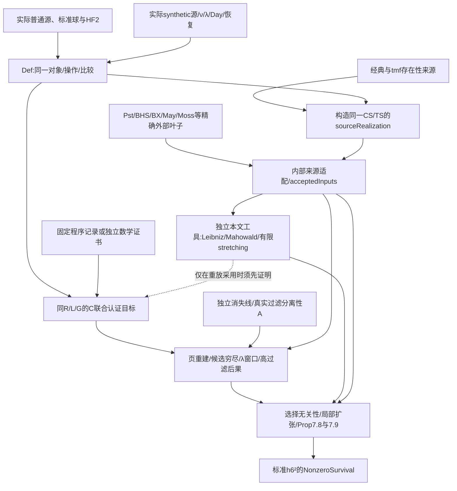

# 第 0 步第二轮迭代修改与独立自审

本报告针对基线 commit `57647d2158891da6cf7bd392f70f0f4158553dcd` **经本次修改后的工作树**，不是该 commit 的原始内容。日期：2026-09-29。具体文件指纹与验证记录见 [本轮证据清单](stage0-57647d2-iteration-2-evidence.json)。历史两份报告及其证据文件未覆盖；旧报告的阻塞判断不能代替当前定义的复查。

## 1. 总评与验收口径

**第 0 步完成：当前工作树已冻结通向指定标准 T 的数学接口。** 判定范围为论文通向指定 T 的完整接口，包括实际使用的新工具及其前提。模型构造、比较、认证和论文证明允许有明确 `sorry` 债；不以编译或清单数代替数学语义核对，也不以 `sorry` 数量判失败。

本轮在此前目录迁移之后继续修改了来源实现、混合悬移比较、有限商边界、preferred sphere pairing、同模型外部输入及最终实际接线。没有把 T、指定微分、局部乘积或 §7 结论变成 M 的成立字段，也没有整体公理化 `SourceApplicationData`、`ModelBindings` 或 `Inputs`。


| 硬标准 | 独立判断 |
| --- | --- |
| M/T：来源、次数、操作、标准类与非零永久存活 | **通过接口验收**。实际 ordinary/synthetic 来源及同对象比较已明确，标准 T 不含 A/C 或论文结论；模型存在与比较证明仍待完成 |
| C：论文反向覆盖、有限语义、范围与共同解释 | **通过接口验收**。固定选集保持原强度，增强结论有准确内部推导义务，无限尾部有独立范围 A；C 的数学认证未完成，未采用未定义的日志验证器 |
| A：实际外部来源、量词、同模型适用与内部责任 | **通过接口验收**。19组显式来源叶与其原文/直接特化逐项核对；实质加强和选择/模型适配留内部，不整体公理化 Inputs |
| 架构、接线与依赖 | **通过**。旧总包链移除、两个 C 生产/消费完整同型、Final 类型定义隔离；数学责任无已核实循环，未来构造与认证必须保持该顺序 |
| 冗余 | 单独分类；不作为通过或失败的替代指标 |

这个结论**不表示**已经构造全部模型、证明 C、完成本文工具或证明主定理。缺失材料与未选定认证策略列在第8节，不把这些记录成已核实。若后续证明发现准确性问题，应重新打开相应接口。

## 2. 固定基线、材料与覆盖

- Lean `leanprover/lean4:v4.32.2`，工具链 commit `f3b06c705e6c85f5314019d5d3baab0fec5b580c`；Mathlib `905b95818eb32af7874a58b427f50c1711a5e96c`。固定版本未改，共享依赖缓存未改。
- 主论文 *On the Last Kervaire Invariant Problem*，本地 `2412.10879v2`，TeX SHA256 `1125462bcae4a4ec56e3bfcaad15df4febf98757dfb83462b155af162c99c9e0`；PDF `7cae269851a88d10dd194651dbf7497b75ef8b8b914bc1901dfa3734cd8096b4`。同时读取 `112.tex/main.bib/paper.txt`。定位以主论文稳定 TeX labels 为主。
- Lin release：Zenodo 14875701，`v126.3.cw49`；S0 t261、Cν t200、谱间 maps、UTF-16 CSV、`ss.json`、`proofs.db` 实体均可读。`proofs.db` 623,042,560 字节，SHA256 `3a460683c023ee2d8f7e8f904ecef9044a474d88bb7184731e54978ba7dac248`，不是 LFS 指针。
- 起始时用户已有 `.agents/` 的 19 项删除和 `AGENTS.md` 删除全部保留。原始论文、数据库、CSV、依赖和 CI 未修改；迁移的生成 Lean import 与清单同步不算新认证。未提交、推送、创建 PR 或发送外部消息。

主审负责共同参数、来源模型、最终接线、检查与交叉复核；三位并行审查者分别负责 M/T、A、C，均使用同一基线和工作树。主要阅读闭包为：标准 Final 的全部定义层、Route Model/Conditions/Goals/Source、A 的来源与适配、C 的解释和选集、§3–6 工具、§7 choice/reduction/extension 及 Prop.7.8/7.9 消费链。没有把历史目录名作为数学分类。

直接原文核对包括本地主论文、Pst `1803.01804v3`、BHS `1910.14116v3`、BX `2302.11869v3`、BHSmot `2010.10325v2`、Xu `1410.6199v1`、IWX `2001.04511v3`、BMQ `2011.08956v4`、May TC3 作者稿、Ravenel 原书有关消失线与收敛段落；IWX 2022 原始 E₂/E∞ CSV 在隔离临时目录解码。源模型另直接比对 Mandell–May 的 orthogonal spectra/Thom category/稳定模型章节及 May 教材的拓扑构造。

本轮直接读取 [Belmont–Kong v2](https://arxiv.org/html/2112.08689v2) Theorem 1.1/4.10、Definitions 2.3–2.4、§1.2 前提及 Adams 应用 Example 5.1。v2 是 2024-08-16 的版本；网页生成日期不是论文版本。Moss 1970 原扫描与 Toda 原书仍未直接取得，不能称为本次核实；当前使用已直接核对的现代原始证明或 BHS 实际 synthetic 低维输入，相关加强保留内部责任。

**未做、也未宣称已做：** 全部数据库的数学认证、所有日志的递归重放闭包、near-126 原始 resolution/augmentation 的完整构造、源模型 coherence 的完整证明、全部附录/额外例子及几何推论。直接 C 数学目标已经固定；本阶段没有选定并声称完成一个 `proofs.db` 验证器。若后续采用重放，须先冻结各规则及外部叶子的准确 soundness，再作认证。

## 3. 架构与对象传递

| 位置 | 当前职责与实际状态 |
| --- | --- |
| `Def/` | 全部 M、来源呈示、实现/比较接口以及 A/C/T 的命题语言；可以声明待证一般性质，不能接受具体 A/C |
| `Interface/Challenge/` | `route_certification` 与 `basisTable_correct` 的完整认证目标，均 `by sorry` |
| `Interface/Solution/` | 保留有效的基、平方及表格辅助证明；路线联合认证尚未交付，不导入自身 C 公理 |
| `Main/Axiom/` | 显式接受准确来源 A 和两个同型 C；没有旧总包存在公理 |
| `Main/Challenge/Final/` | 唯一标准 T，类型及传递定义仅来自 Def/基础库，证明 `by sorry` |
| `Main/Solution/` | 来源直接特化的内部适配、独立论文工具、计算后果、§7 推导和最终实际外层组装；未完成部分明列证明债 |

`Interface/` 仅两个直接子目录，`Main/` 仅三个；旧 `Challenge1.lean/Challenge2.lean`、总包存在公理、全局 choice 见证及其投影/兼容别名链已删除。必要结构和一般性质迁入 Def，计算目标迁入 Interface，接受命题及推导分别迁入 Main 对应目录。迁移表为 [stage0-module-moves.json](../stage0-module-moves.json)。局部消去来源或联合计算的存在量词是保留原文/认证的量词，不是恢复旧总包传递机制。

最终 Solution 实际局部取得 CS/TS，调用 `sourceRealization CS TS hGeometry hBound hFinite`，将同一来源结果沿 `classicalSource_eq/tmfSource_eq` 运输，实例化 `acceptedInputs`，再调用 `standard_final_of_accepted_computation`。后者局部消去唯一 `∃ R L` 联合 C，保持 D、η、G、R、L 不变。最终外层不调用 Challenge，也没有新增 `sorry`；其被调用的模型、适配及论文引理仍含公开证明债，所以不能称为已证明主定理。

## 4. M/T 对象绑定

下表和后续矩阵的行号均对应本轮工作树，完整文件指纹见证据清单。性质签名准确与证明已完成分别记录；下表的“已绑定”不表示比较证明已完成。


表中路径省略 `KIP126/` 前缀；部分路径继承同一行的目录。完整声明名由所列 namespace 与名称组成。

|论文对象/接口|当前定义、类型及定位|同一对象约束/消费者|当前状态与责任|
|---|---|---|---|
|普通稳定谱来源|`KIP126.StableHomotopy.Source.StablePi`，`Def/StableHomotopy/Source/Prespectra.lean:101`；`stableEquivalences:124`、`StableCategory:129`|实际基点拓扑 prespectrum 的稳定同伦类；稳定弱等价逐个整数次数测试后局部化|不是自由 `isActualSpectrum : Prop`。点集/稳定比较定理大量 proof sorry，属于模型证明债|
|H𝔽₂ 与完成|同 namespace `Mod2Source`，`Prespectra.lean:172`；`mod2Equivalences:180`、`CompleteCategory:184`|指定实际谱、π₀ 与 ZMod 2 的同构且保零、非零次数消失；局部化所逆映射逐个悬移测试到同一系数谱的映射|仅定义 H𝔽₂ 局部化；没有将其对任意无界谱直接称为 Moore 2 完成。识别论文有界下对象的比较为证明债|
|固定普通 Foundation 与球、H𝔽₂|`Source.RealizedFoundation`，`Source/Realization.lean:238`；`standardRealization:248`；`Classical.Adams.standardFoundation`，`Def/ClassicalAdams/StandardFoundation.lean:7`|Foundation、TensorInput、Mod2Source、Binding 同一个 record；standardFoundation/standardTensor/standardSourceBinding 只是同一 record 的投影|`standardRealization` 的 `sorry` 是受完整 source Binding 约束的模型构造债，不是已经构造的见证；未引入第二 Foundation|
|普通 source 比较的单位与系数单位|`Source.Binding`，`Source/Realization.lean:57`，字段 `sphereIso`、`monoidal`、`braided`、`monoidal_unit_eq`、`coefficientIso`、`coefficientUnit_eq`|同一 CompleteCategory 与 Foundation 的等价，强对称幺半结构的单位箭头等于 sphere comparison；H𝔽₂ unit 同源实际箭头|比较声明明确；无局部微分/乘积值/永久存活字段。性质与联合模型存在性未证明|
|HF₂/tower 全部所需 ordinary smash|`Orthogonal.derivedSmashPointset`，`Source/Orthogonal/DerivedSmash.lean:65`；同文件 `derivedSmashIso:74`|实际 `Q(E) ∧ Q(F)`，cofibrant 正交谱的 enriched Day pairing、monoidal localization；通过 SAME Q projection 与 localized tensor 比较|已超出原来只有 suspension spectra/CW 生成元的范围；HF₂ 及其 powers/tower 项都在定义域。cofibrancy/弱等价/局部化/IsIso 仍是证明债|
|普通 tensor 与 shift 混合比较|`Source.cofibrantTensorComparison`、`orthogonalSuspensionComparisonMap`，`Source/Realization.lean:28,42`；`Binding.tensor_right_suspension:111`、`tensor_left_suspension:124`|右方块直接用 `Orthogonal.suspensionSmashMap`、kification 恒等箭头、第一 J 坐标插入、same shiftIso 与 same μ；左方块用 same braiding|最近下沉到普通 Binding 本身，防止在 SourceModel 中对一个未约束的固定 R 事后断言相容。当前声明已通过本轮完整编译；比较证明仍待补|
|ordinary internal Hom shift|`Source.Binding.ihom_unit_shift/ihom_counit_shift`，`Source/Realization.lean:131–132`|所选 ihom CommShift 与所选 left tensor CommShift 经同一 closed adjunction 的单位、余单位为 mate|不是对任意 CommShift 的 exactness 全称要求；same-operation 约束明确|
|实际高阶 mapping spectrum|`Orthogonal.functionSpectrum`，`Source/Orthogonal/Function.lean:41`；`derivedMappingSpectrum:83`|同一 enriched internal Hom，先 Q 域、R 陪域；给 ν 的谱值 presheaf，保留高阶映射信息|没有用 Ho Hom 集或 naive sequential spectrum 的不成立 bonding 替代；UP/模型性质证明债|
|固定 Milnor/cobar 坐标|`Classical.Adams.standardMilnorCooperations`，`Def/ClassicalAdams/StandardMilnor.lean:7`|坐标定义字面取 `sphereFirstPageMilnorEquiv`，参数是 standardMod2Ring/standardKunneth/standardReducedMilnorBasis；仅 restrictScalars ℤ|不是另选线性同构。实际 ring/Künneth/basis 构造及 first differential 比较待证明|
|固定 cooperation 比较|`Classical.Adams.standardCooperationComparison`，`Def/ClassicalAdams/StandardCooperations.lean:15`|ring、kunneth、basis 均同上述三个标准值；suspension/diagonal/unit/coproduct 明确，`coordinates_eq` 为 `rfl`|前四类比较 proof sorry；不包含 h₆² 存活。此附加比较模块不进入 T 类型的 imports 闭包|
|唯一标准球 Adams SS|`Classical.Adams.sphereAdamsModel`，`Def/ClassicalAdams/StandardSphere/Sequence/Data.lean:13`；`sphereAdamsData:19`|直接 `adamsTowerInternalSpectralSequence standardFoundation.hf2.unit SphereSpectrum`，无另选同名 SS；起始页和微分次数为实际塔声明的投影|SSData 与塔的性质证明债可追踪。没有要求内部 SSData 与 Mathlib SS 形式强制等价|
|标准 h₆ 与平方|`Classical.Adams.standardH6`、`standardH6Square`，`StandardSphere/Classes/Data.lean:13,21`|同一 E₂ 的 `(1,64)` 与 `(2,128)`；后者是 `[ξ₁⁶⁴|ξ₁⁶⁴]` 的 `Sphere.Internal.hiSquare`；stem 126|T 元素不依赖 CSV；实际塔乘法与 cobar/route 乘法比较另有明确责任，不能只据同次数称相同|
|非零永久存活|`Core.SpectralSequence.NonzeroSurvival`，`Def/SpectralSequence/Permanence/Predicates.lean:28`|同一个 `z ∈ Z⊤` 投到指定 E₂ 元素，且 `pageπ ⊤ z ≠ 0`。`SSData.Z_top_greatest/B_top_least`，`Basic/Data.lean:49,51` 固定无限交/并含义|正确区别出微分为零、有限页到达、被入微分消掉与 E∞ 非零；不要求最终几何 Kervaire 对象或阶数加入 T|
|CSV square 与标准平方|`Classical.Adams.computedH6Square_eq_standardH6Square`，`Main/Solution/Computation/Comparisons/Classes.lean:15`|在 same sphereAdamsData 上，用 `LinE2Presentation` 的穷尽维数信息与独立标准非零证明；后续 survival iff 只作同页元素改写|现有证明不是数据认证；该 legacy presentation 仍有自身输入债，不能将此 theorem 当成新 route 全 C 已认证|
|StandardRouteModel|`Classical.Adams.StandardRouteModel`，`StandardSphere/Route/Data.lean:10`|字面 `Kervaire.Route.Model standardFoundation.hf2 standardMilnorCooperations Syn`|不是第二球谱/系数/Milnor witness；source SourceModel 进一步绑定其中 synthetic operations|
|有限 E-projective site|`Synthetic.Source.FiniteSpectrum/FiniteSite`，`Source/Site.lean:26,35`；`HomologyCover:62`|局部化前的实际有限正交谱呈示（有限稳定同伦型 retract），cover 用同一 ordinary realization/HF₂ 同调逐次数满射|site 未误换成 completed finite spectra。HoFiniteSite 只给 homotopy-group sheafification 使用|
|synthetic 来源范畴|`Synthetic.Source.SpectralPresheaf`，`Source/Presheaves.lean:19`；`HomotopyInvariant:21`、`Spherical:28`、`localStableEquivalences:82`、`HypercompleteCategory:90`|谱值 strict diagrams，在整幅相对 diagram 上局部化；局部等价测试全部关联 homotopy sheaves。保留 point-set morphisms 后才局部化|明确选择 hypercomplete convention；这一模型与相应高阶 sheaf 模型的呈示/下降定理仍待证明，不能由普通 localization UP 自动认为已证明|
|ν 来源|`Synthetic.Source.connectiveRepresentable`，`Source/Nu.lean:38`；`nu:102`|`P ↦ τ≥0 derivedMappingSpectrum(P,X)`，通过 same hypercompletion 与 ordinary HF₂ localization 下降；connective cover 用同一个 counit 固定各次数 π|不是任意 ν functor；ConnectiveCover 的选择受全部稳定次数与 counit 条件约束。下降/同伦不变/finite-coproduct/构造证明债|
|λ 与双移位|`Synthetic.Source.biShift`，`Source/Operations.lean:86`；`lambdaOnDiagram:157`、`lambda:179`|双移位在有限输入端/值谱端使用 actual derived shifts；λ 经实际 cone span comparison、Q/R arrows、loop/counit roof 构造|不是任意自然变换。所有被逆箭头都有明确 weak/local equivalence 义务；coherence 未完成证明|
|Day tensor 与单位|`Synthetic.Source.sourceMonoidal/sourceSymmetric`，`Source/DayCoherence.lean:715,717`；`sourceDayTensorComparison:732`|actual Day pairing UP 与 monoidal localization，unit 固定为 same ν(ordinary sphere)，经 nuSphereComparison 连到实际 sphere generator|associator/unit/unique extension/coherence 仍有 proof debt；不是仅声称“存在某个 symmetric tensor”|
|Day 与 shift 的实际箭头|`Synthetic.Source.biShiftTensorIso`，`Source/DayShifts.lean:281`；`Binding.biShift_tensor`，`Source/Realization.lean:80`|用实际 restricted shift-smash zigzag 同时处理值谱和有限输入，Day UP 逆像固定 shifted pairing；实现 comparison 用 same equivalence μ|此 mixed 方块不能由分别存在 tensor/shift 同构替代；现已明确|
|Pst preferred sphere 符号|`Synthetic.Source.PreferredShiftBinding`，`Source/SpherePairing.lean:229`|raw sphere pairing 按论文构造，再显式乘 `(-1)^(w*t′)`；preferred action addition 由这个 pairing 和固定 Day strength 诱导。Base Binding 不再额外强制 raw-add|规避“看到源码没有显式符号便盲 twist raw comp”的错误。preferred coherence 与 action/sphere compatibility 是待证命题，不能宣称已算完全部 Koszul 验证|
|synthetic triangle 与 exact shift|`Binding.distinguished_source`，`Source/Realization.lean:105`；`SourceShiftExactBinding`，`ShiftExactness.lean:49`|全部三个三角箭头经同一个 inverse comparison；actual double-suspension coordinate permutation 决定 value-shift `t-w` 的 exactness comparison|与 sphere product 的 preferred mixed 符号分开。point-set boundary square/负号比较证明仍待补|
|实际 recovery 与 ν recovery|`Synthetic.Source.realization`、`nuRecoveryMap/nuRecoveryIso`，`Source/Recovery.lean:91,96,102`；`Binding.realizationIso/nuRecovery_eq`，`Realization.lean:112,114`|realization 是 actual spectral Yoneda 的左伴随；ν recovery map 是同一个 adjunction/counit 复合，非另选恢复同构|没有把 ν 自身错误当作右伴随；full faithfulness、existence、λ localization 比较仍为模型债|
|recovery 乘法与悬移|`CanonicalRecoveryMonoidal/RecoveryMonoidalBinding`，`Source/RecoveryMonoidal.lean:204,216`；`RecoveryShiftBinding`，`Source/RecoveryShift.lean:122`|realization μ⁻¹ 的 adjunction mate 固定为 actual functionSmashPairing→Day UP 配对；recovery suspension 用同一 λ、νSuspension、νRecovery、ordinary mixed tensor shift|不能由“任意 F.Monoidal + F.CommShift”冒充。现已由 SourceModel 明列、普通侧约束下沉；proof debt 未完成|
|ν 的实际 lax 乘法|`Synthetic.Source.nuTensor/nuLaxMonoidal`，`Source/NuMonoidal.lean:56,66`；`nuTensorSphereIso:93`|actual Yoneda pairing 通过 connective counit 的唯一自然 lift；沿 same Binding 运输到实现。sphere强同构只宣称明确有限对象范围|没有 arbitrary MonObj 来给 νtmf 指定乘法；unique lift、finite strongness 与 monoidal coherence 待证|
|synthetic E₂ label|`RealizationTower.NuE2Binding`，`Def/Comparison/ClassicalSynthetic/RealizationTower/Route.lean:46`|actual F.map 作用于 same tower representatives，same coefficient/unit、weight recovery bases；`label` 方块将 D.nuE2 的实际页类映到原 classical x|不是任意线性同构；真实 tower Comparison 构造、兼容性仍 proof debt|
|第一 λ 商 label|`RealizationTower.ActualFirstQuotientLabel`、`FirstQuotientBinding`，`RealizationTower/FirstQuotient.lean:63,85`|用未取商塔的 actual realization E₂ map、actual quotient inclusion、same tower J、共同 Z∞ representatives 的 E∞ 类与 stage-zero lift。明确没有直接 F(CλνX) 去定义 x|第一商实现为零不再被错误用作 label 来源；比较在 associated graded，未强行相等任意 E₂ lifts。唯一性 theorem:99 保留 `FirstQuotientNextFiltrationZero` 条件|
|有限 λ 商边界|`Route.FiniteQuotientBoundaryBinding`，`Route/Source/QuotientTower.lean:65`|实际 λ powers 的 cofiber projection 与 shifted quotient inclusion 给 delta；第二 boundary 方块也明列，已有 rho 与自然性继续复用|仅正有限层和实际消费范围；没有引入任意方块上的强 functorial cone 结论。最后符号/边界复核须结合 A 的专项检查|
|η/ν 的几何身份|`Literature.Route.StandardClassicalSourceGeometry`，`Inputs/Literature/StandardClassicalSource.lean:13`；`Source.Hopf.geometricEta/geometricNu`，`Source/Hopf.lean:119,124`|explicit complex/quaternionic Hopf maps 经同一 standardSourceBinding、sphere/shift comparisons 稳定化；CS 的 η/ν 直接等于它们|不再只靠 h₁/h₂ leading term（对 ν 可容许不同奇数倍）识别。geometry 是来源绑定，低阶 detection 的证明责任另列|
|§7 谓词|`Route.C3/D12/C4At/C5At`，`Route/Conditions/Predicates.lean:30,24,44,58`|C3 用有真实 E₆ 代表的 HasDifferential；D12 用 E₁₂ 非零 target 的 HasNonzeroDifferential；C4 用 DetectsNonzero；C5 仅 Detects，量词保留存在 admissible θ/u|未把 C4 的非零性无条件塞给 C5；检测保留 associated-graded 与选择不定性|
|有限商乘法/作用/过滤|`Route.FirstQuotientMultiplicationCompatible/FiniteQuotientMultiplicationCompatible/FiniteQuotientSphereActionCompatible`，`Route/Multiplication/Comparison.lean:28,42,61`；`Literature.Route.AlgebraBinding`，`Inputs/Literature/AlgebraBinding.lean:17`|actual quotient MonObj product 与 same `Sphere.Internal.product` 比较；finite-only homotopy classes可消费；检测与过滤在同一 model上，无需无限相容提升|这些为内部结构比较，不是原文外部结果直接增强。AlgebraBinding 接六项明确比较，具体构造/证明属于模型或论文适配债|
|联合 source M 与固定 T 连接|`Route.SourceModel`，`Route/Source/Data.lean:39`；`sourceRealization`，`Source/Construction.lean:50`；`Main.Solution.h6_sq_permanent`，`Main/Solution/Final/h6_sq_permanent.lean:17`|SourceModel 把以上 same bindings、CS/TS、e2/FQ/quotient边界集于一个 D；constructor参数保 geometry、TS bounded-below/finite-mod2-type；Final消去准确 source存在证据后用 same D/η/G 组装 A/C，目标仍原标准 T|constructor仍 `sorry`；外层 Final 本身已有实际接线，但不能据此宣称模型或论文推导已证明。A/C adapter正确性须以主审及A/C矩阵为准|


## 5. C 覆盖矩阵

表中 Lean 路径省略 `KIP126/` 前缀。


`KIP126.Computation.Route.Certification` 在 `Def/Computation/LinProgram/Route/Certification.lean:45`：

```lean
∃ (R : Realization D) (L : Labels H), CertifiedRealization R L G
```

`CertifiedRealization`（同文件:31）逐字段要求同一 R 的 `basis/csv/products/labels/results/bottom/top`。`Realization` 本身在 `Data.lean:46` 只有解释数据；不能离开全部七组性质将其当成正确解释。

| 原子目标 | 当前准确语义与绑定 | 准确声明定位 | 后续责任 |
|---|---|---|---|
| 完整基 | 所选每个次数的真实球/Cν E₂ 与有限 F₂ 坐标的整数线性等价；包含空次数和全部线性组合 | `KIP126.Computation.Route.BasisCorrect`，`Data.lean:73` | 证明实际 E₂ 基，不是只证数据库 staircase 矩阵满秩 |
| CSV | 每个球谱基向量是同一关系商中对应齐次单项式经 `R.sphere` 的像 | `SphereBasisValue`，`Data.lean:81` | 关系商、齐次性、坐标及实际 cobar 比较 |
| 乘法 | 73 组次数上对所有因子，CSV 乘法映到固定 `Sphere.Internal.product H M` | `ProductCorrect`，`Data.lean:90` | 不是仅核几个命名乘积；后续有限商乘法/模作用还经过同 D 上独立的结构比较 |
| 标签 | h₀/h₁/h₂/h₄/h₅/h₆ 及平方、四个 L 标签和 G.g/G.deltaH1g 均通过同一 `R.sphere` 识别 | `LabelsCorrect`，`Data.lean:127` | 标准 Milnor 类、真实 sphere E₂、标准 tmf 标签的比较；不含永久性 |
| 有限记录 | 成功解码后，分别为 `ReachesPage`、`IsBoundaryBy`、`HasDifferential`、`¬HasDifferential` | `Statement`，`Data.lean:60` | 每条记录准确数学证明；不能把 E₂ 非零升级为后页非零 |
| 底胞映射 | 同一个 `cofib D.auxiliary.nuMap` 的实际 `cofibι` 所诱导 E₂ map | `BottomCorrect`，`Data.lean:96` | Cν 分辨率/cell 坐标到同一 cofiber 箭头的比较 |
| 顶胞映射 | 同一个 `cofibδ` 和 D 的四次塔悬移，将 Cν `(8,134)[0]` 送球 `(8,130)[0]` | `TopCorrect`，`Data.lean:105` | 真实 connecting arrow、悬移次数与 map 数据比较 |

`decode`（`Data.lean:52`）与 `Raw.coordinatesValid`（`Raw.lean:56`）失败闭合：缺次数、越界、重复/乱序索引均无解释；缺次数的 `[]` 也不能默认为零。当前 671 个选定断言中实际为 **579 equation、84 reaches、8 refutation、0 boundaryBy**；语法允许 `boundaryBy` 不等于当前数据存在这种条目。

乘法消费的下一层比较没有被混为原始 C：`KIP126.Kervaire.Route.FirstQuotientMultiplicationCompatible`、`FiniteQuotientMultiplicationCompatible`、`FiniteQuotientSphereActionCompatible`、`SphereActionFiltrationCompatible` 分别在 `Def/Kervaire/Route/Multiplication/Comparison.lean:28/42/61/78`。当前由 `KIP126.Literature.Route.AlgebraBinding`（`Def/Kervaire/Inputs/Literature/AlgebraBinding.lean:17`）逐项携带到消费者，且明确属于 source 到此模型的结构适配，并不是文献直接给出任意预选乘法都满足条件的断言。根代理的 A/source 构造负责给同一 witness 的这些字段，C 不替它们提供证明。

标准生产/消费边界完整同型：

- `KIP126.Interface.Challenge.LinProgram.route_certification`，`Interface/Challenge/LinProgram/Route.lean:16`；
- `KIP126.Main.Axiom.Computation.route_certification`，`Main/Axiom/Computation/Route.lean:14`。

二者参数均为 `D : StandardRouteModel Syn`、同一个 G、`GeometricNuSourceIdentification D` 和 `G.Standard`，结论 `Certification D G`。几何条件（`Certification/Standard.lean:19`）同时保留 h₂ 检测与 `D.auxiliary.nuMap = Source.Hopf.geometricNu standardSourceBinding`。单独的 `NuDetectionIdentification`（`Certification.lean:54`）不被误当作几何唯一性，因奇数倍 ν 可有相同 leading term。

`geometric_nu_source_identification`（`Main/Solution/Route/LiteratureAdapters/ComputationPrerequisites.lean:34`）使用**同 A.classicalSource** 的显式 geometry，通过 `A.bindings.classical.nu.trans hGeometry.nu` 连接，不借用 C。`standard_final_of_accepted_computation`（`AcceptedComputation.lean:18`）在:24 局部 `obtain ⟨R,L,cert⟩`，全程消费该同一解释，没有新增全局 choice。检查文件 `Checks/ClassicalAdams/RouteCertification.lean:22` 比较生产/消费完整类型并拒绝生产者依赖消费公理；本轮全库编译已运行并通过该检查。

### 5.1 选集的实际范围

本次重新统计 JSON：648 个次数、963 个基向量、671 个断言、73 组乘积次数、4 个底胞映射、36 个命名生成元。球谱 577 个次数（265 个空基），Cν 71 个次数（8 个空基）。这些是本次直接读取的计数。

| core 谱/stem | 全选过滤 s | 说明 |
|---|---|---|
| S0 / 62 | 0–10 | θ₅/B 相关低维基础 |
| S0 / 63 | 0–9 | λ 核、Moss crossings 的入微分来源 |
| S0 / 122 | 0–12 | X、P、Q、ν 扩张 |
| S0 / 123 | 0–17 | V、d₇ 与 η/h₀ 关系 |
| S0 / 124 | 0–13 | U、修正项与 θ₅² 不定性 |
| S0 / 125,126,127 | 分别 0–136、0–135、0–134 | 原球数据 t≤261；含高过滤完整空基 |
| Cν / 125,126,127 | 分别 0–19、0–14、0–12 | 短微分及结尾 d₂–d₅ 排除窗口 |

此外包含 36 个命名元素、73 组乘积的完整因子/目标次数，以及所有有限记录的坐标端点。故 Cν 实际选集端点可到 s=23、t=147，不能把 core 窗口误报为整个选集的最大范围。脚本入口 `Main/Axiom/LinProgram/Translate/select-route.py:20`、`:111`、`:135`、`:145`；这是人工决定的范围，不是筛选完整性的证明。

### 5.2 从 Theorem 7.1 / Proposition 7.8 / 7.9 反向的覆盖矩阵

记以下完整前缀：

- `CR = KIP126.Computation.Route`；`D.* = CR.Derived.*`；
- `ER = KIP126.Main.Solution.Route`；
- `Rec = Def/Computation/LinProgram/Route/Records.lean`，`Sel = .../Selected.lean`；
- `CRoute = Main/Solution/Computation/Route.lean`，`CLambda = .../Lambda.lean`，`EStep = Main/Solution/Route/ExtensionSteps.lean`。

所有表中 `(s,t)` 是 Adams 次数；stem=t−s，局部坐标在各自次数内编号。数据库 `basis` id、`ss` id、`proofs.db/log` id 属于不同表，不能混用。

| 论文消费点 | 必需数学事实/条件 | 原始记录及当前解释 | 同 R 派生接口与认证责任 |
|---|---|---|---|
| Theorem 7.1 (`main.tex:2106`、`:2212`) | Prop7.8 给出永久性/唯一 d₁₂ 二分；Prop7.9 排除 C₃∧C₅ | 没有把这两条命题写入 C | `ER.proposition_7_8` (`Conditional:53`) 为内部证明债；`:58` 的 `proposition_7_9` 已实际组合球谱可除性、Cν 命中与有限不命中矛盾；`:69` 得 `permanent_of_inputs` |
| Fact7.6(1)，Prop7.8 的 C₃ | W=x1268_4+x1268 在 E₆ 有非零代表；d₆ 的唯一可能靶为 T | S0_ss **2702** `(8,134)[0,3]` 只给 `ReachesPage 6`，Rec:32 | `D.SphereFacts.w_to_e6/w_d6_targets` (`Consequences:96/99`)，由 `CR.sphere_facts` (`CRoute:137`) 从完整基、先前微分、乘法及标签推出；不能单靠此 reaches 行 |
| Fact7.6(2)，Prop7.8 | T 为共同永久循环，但允许被入微分击中；唯一可能 incoming 是 d₆W 或 d₁₂h₆² | S0_ss **3080** `(14,139)[1]` 是 reaches1000，Sel:1000/Rec:47；incoming 源 stem126 的完整选集 | `CR.permanent_cycle_of_reaches1000` (:76) + `D.OnlyIncomingT` (`Consequences:73`) + `sphere_facts`；任意晚 incoming 源负过滤由实际塔消失，不靠有限扫描 |
| Fact7.6 后 Remark (`:2169–2176`) | x1266 的 d₃ 两个非零候选，不能杀 T | log **2047477/2047478**，depth1/T，分别否定靶 `[]`、`[2]`；Rec:87/92 | `CR.d3_x1266_candidates` (`CRoute:107`) 另重建实际 E₃ 靶空间；两条否定并非完整候选穷尽本身 |
| Fact7.6(3)，θ₅² 与 C₄/C₅ | U 在 E∞ 非零 | S0_ss **2693** `(10,134)[4]` 仅 reaches1000，Sel:907 | `CR.named_survive1000` (:97) 先以完整 incoming/staircase 证 E₁₀₀₀ 非零；再 `nonzero_permanent_of_survives1000` (:86) 用 V 与负过滤尾界；没有从 E₂ 非零直接升级 |
| Lemma7.11 与 Prop7.8 的 θ₅² 修正 | correction=e₀Δh₆g 为永久类，h₁correction=0；124-stem AF11/12 可消 | S0_ss **2916** `(13,137)[1]` reaches1000，Sel:981；完整 AF11/12 basis 与 d₂–d₄、所选 h₁ 乘法 | `D.SphereFacts.correction_permanent/h1_correction_zero/e5_stem124_af11/e4_stem124_af12` (`Consequences:102/123/131/132`)；准确保留 AF11 的 **E₅** 消失，不照搬正文“全被d₂/d₃杀死”的过窄表述 |
| Fact7.6(4)，Prop7.8 tmf 排除 | (25,150) 的 E₅ 唯一非零类为 high125；同 G；高过滤再无类 | log **154532–154537** 六个根反证；**154545** 正向 d₄ `(21,147)[1]→(25,150)[3]`；Sel:1316、Rec:97–122；完整 E₂/d₂/d₃ 空间 | `CR.high125_component` (:114)，`D.High125Component` (`Consequences:64`) 明确非零在 E₅；`CR.high125_label` (:164) 经同 products/labels 等于 G.high125。BMQ/tmf 的 source 强度与适配仍归 A/内部工作 |
| 同上一项的“没有别的高过滤候选” | 所有 s≥15、s≠25 的 stem125 E₅ 为零；实际 F²⁶π₁₂₅=0 才消严格代表不定性 | s26–64 有 **38** staircase 行：4092 起至7247，levels 2/3/4/9996/9997/9998；空次数亦选入。s≥65 不从数据库缺行推零 | `CR.stem125_e5_zero_finite` (:122)、`stem125_e5_high_exhaustion` (:130)、`sphere_page_zero_stem125_tail` (:59)；`classical_stem125_filtration26_zero` (:172) 另需 **S=实际经典塔分离性**，`high125_detected_choice_unique` (:181) 才得相同 leading term 的严格等式 |
| Remark theta5choice、BX λ 规范化、Prop7.8 | (62,64)/(124,128) 所有 λ 幂单射；(125,130) 只需单步单射 | 球 `(0,63)` 与 stem125 AF0–4 完整空基；S0_ss **2380** 即 d₂h₇=(3,129)[0]=h₀h₆²，Sel:809 | `CLambda:23/29/36` 的三个 NoOutgoing；`:61/68` 两个 all-power；`:75` 单步125130；`:98` 有限商规范化。需 BHS 精确 Bᵣ 页面公式、same λ 和 D 的真实分离性，不把“无λ-torsion”无条件扩大为125130全部幂或实现单射 |
| Fact7.13、Lemma7.14 | d₂x1258=h₁V+U；V 到 E₁₂、不被 incoming；h₀/η 关系及 higher indeterminacy | log **5990** `(8,133)[1]→(10,134)[2,4]`，Rec:57；S0_ss **2569** `(9,132)[0,1]` reaches12，Rec:37；log **462481**、**2671068** 分别 d₃/d₇，Rec:67/77 | `D.SphereFacts.d2_x125_8/v_to_e12/v_not_hit/...`；`ER.alpha_one_relations` (`EStep:72`)，其目标 `Goals/ExtensionSteps:54` 保留同一 Q₁₁ lift α₁ 及随 U 选择而变化的 α₂、α₃，不把检测强改为任意代表严格等式 |
| Lemma7.16 的 B、Massey/Moss | B 位于 E₂(8,70)，h₅²B=0，E₃ 的〈h₅²,h₀,B〉唯一值由 h₆B 的共同代表给出，须保留定义系统及 crossing | log **5541** d₂h₆，Rec:52；S0_ss **494/512/513** 分别 stem63 AF6 d₂、AF7 d₄、AF7 d₂，Sel:827/837/838；basis/d₂ **513** 重复交付后一式，Rec:127；同乘法窗口含(2,64)×(8,70)、(1,64)×(8,70) | `ER.theta_b_massey_value` (`EStep:80`)、`theta_b_moss_no_crossing` (:92)，保留 full Massey subset/零不定性与真实 Moss crossing；不能由单独 log 行当作 Toda 结论 |
| 同一 Lemma7.16 的阶二与联合选择 | B 的实际 synthetic lift 位于 (62,70)，须阶二；与 θ₅、Toda 输出 q 联合存在 | 上述 494/512/513 加 SS436/493/511 的有限 reaches1000；绝不能套用 θ₅ 的 weight64 λ 单射 | `CR.lambda_kills_realization_kernel_62_71` (`CLambda:118`) 精确杀该次数实现核，`:128` 的 `two_torsion_62_70`；`ER.b_lift_order_two` (`EStep:261`) 与 `theta_b_synthetic_toda` (:273)。q 次数(125,134)，Moss/实际同伦核过滤分析为第二阶段证明债 |
| Lemma7.16 的“所有 Toda 候选” | Q₉ 的 π125,132 模实际 F¹³ 由 h₀²x1255、λ²h₆B、λ⁴Y 三类生成，允许零项 | 球 stem125 AF5–12 的完整基、d₂–d₄；log **929469** 给 d₃x1264=h₀²x1255，Rec:72 | `ER.quotient125_low_filtration_generation` (`EStep:101`)，目标 `Quotient125LowFiltrationGeneration` (`Goals/ExtensionSteps:76`) 是实际加法群的过滤商，不是把同伦群设为 F₂ 向量空间；Y 项须为零或有非零检测者 |
| Cor7.18 与 Prop7.9 的首项 | C₃∧C₅ 下存在 Y lift，且每个 Y lift 的 h₀ 像均被 λ⁶T 非零检测；只控制首项 | 同 stem125 的完整 AF11–14 基与微分；SS3154 `(15,140)[3]`、3256 `(16,141)[3]` 支持 d₂，不能未经分析消除有限商高过滤余项 | `H0ExtensionForAllY` (`Goals/ExtensionSteps:91`)，`ER.h0_extension_for_all_y` (`EStep:141`)，`:112/125` 分别把 Y 差送 F¹⁴、h₀差送 F¹⁵；`:151/160` 用 Q₉ weight131 窗口杀 F¹⁵，故 weight133 误差只在乘 λ² **后**消失。没有原先“任意代表严格λ⁶可除”加强 |
| Fact7.19 / Lemma7.20 的 X、Y | X 到 E₆；Y 到 E₅，不擅自假定到 E₆ | SS **2433** `(8,130)[0]` reaches6，**2852** `(11,136)[3]` reaches5；Rec:27/42 | `D.SphereFacts.x_to_e6/x_not_hit/y_to_e5/y_not_hit` (`Consequences:107–110`)；C₃∧C₅ 下 Y 的额外生存来自内部推导，不预置 C |
| Lemma7.20 的 Cν d₃ | `(8,134)[0,3,4]` 的 d₃ 是 `(11,136)[3]`，并且是后页非零微分 | log **212838** 给 `[0]→[1,2,3]`，SS **3872** 给 `[4]→[1]`，**3873** 给 `[3]→[2]`；Rec:82/17/22，三式在 F₂ 相加 | `CR.cnu_d3` (`CRoute:144`) 的 `D.CnuDifferential` (`Consequences:141`) 要求完整解码与 **HasNonzeroDifferential**；不能只取顶胞 log 就丢掉两个底胞校正 |
| 同 ν 的 bottom/top 与 Mahowald 消费 | 实际 cofiber 两箭头，顶胞四次悬移正确 | bottom basis-id 对 **2703→3873、2702→3872、2853→4090、3080→4412**，局部值分别 `[3]→[4]、[2]→[3]、[3]→[3]、[1]→[2]`；top basis **3869→2433**，map表 id1=`1,1` | `BottomCorrect/TopCorrect` (`Data:96/105`) 和 `ER.nu_extension_e4/e6/nu_quotient_relation` (`EStep:39/51/65`)；basis id 与 SS id 在此不同，认证必须逐表比较 |
| Lemma7.20 的有限跨页提升 | earlier4→later6，n3、源 S³、(s,t)=(8,133)，真实 Z₅/Z₃；含 b=0 的 crossing 排除 | 球 `(9,131)`、`(10,132)` 全空基，本次 JSON 重查均为空；原始范围已含，无新增程序断言 | `ER.nu_stretching_crossing_absent` (`EStep:30`)；`:51` 有限提升。只得到所需 Q₅/Q₉ 关系，未声称无限相容提升 |
| Prop7.9 中两个 Y 权重的比较 | Lem7.20 Y weight131 与 Cor7.18 Y weight132 不可直接识别；要 λ/高过滤适配 | 同一 I 和上面所有窗口，不另添加 C | `ER.nu_extension_h0_leading_term` (`EStep:189`) 显式交付所需(14,139,131)非零 associated-graded 检测，实际量词存在；不是替换两个任意代表 |
| Fact7.21、Prop7.9 P/Q 分支 | P、Q 分别 stem122 AF11/12 的非零永久类，乘 h₂ 的边界和 F¹⁴ 估计 | SS **2622** `(11,133)[1]`、**2684** `(12,134)[0]` reaches1000；basis/d₂ **2855、2923、2926** 给相应 h₂ 边界，Rec:132/137/142 | `named_survive1000` + V；`ER.p_q_nu_filtration_bounds` (`EStep:206`) 对实际检测的 sphere lifts；`:226` 的 `target_lambda_four_divisible` 联合选择 t,z 后给真实 sphere 等式，不将其加入 C |
| Prop7.9 末端 Cν 矛盾 (`main.tex:2729–2777`) | 同底胞 T[0] 在 E₆ 非零且不被 d₂–d₅ 击中 | Cnu_ss **4411** `(14,139)[2]` 仅 reaches1000（Sel:768）；同度完整基4维及其 SS4410/4412/4413，与 stem126 AF9–14 全部入源 | `CR.cnu_target_through5` (`CRoute:149`)，目标 `D.CnuTargetThrough5` (`Consequences:149`) 精确只需 `SurvivesTo 6 ∧ NeverHitOnWindow 2 5`；`ER.cnu_boundary_of_lambda_nu_divisibility` (`EStep:244`) 得同 decode 值在该窗口被击中；`Conditional:58` 实际组合矛盾。无 Cν 无限永久性断言 |

尾界的独立语言为 `CR.SphereVanishingLine`（`Consequences.lean:31`）：正 stem 且 `t−s<2s−3` 时真实 E₂ 为零；零 stem 被明确排除。`CR.sphere_vanishing_line`（`CRoute:33`）是沿同 H/M 比较的独立基础证明目标；Ravenel Th.3.4.5(a) 原界更强。stem≤127 在 s≥66 为零，stem125 在 s≥65 为零。`ClassicalSphereSeparated`（`Consequences:38`）是真实塔像过滤的 Hausdorff 性；`classical_sphere_separated_of_strong_convergence`（`CRoute:41`）明确从真实强收敛导出。二者不能由某个任意 E∞≅gr 的同构替代。

### 5.3 直接数学认证与未选择的日志重放

**当前已选择的接口**是同一标准背景上的联合存在式 C。第一阶段可以直接证明其中每项数学命题，然后构造共同 R/L；也可以选择未来的证书/验证器作为证明方法。当前代码没有一个已选定的 `proofs.db` 递归验证器，更没有声称“日志解析成功→C”。因此不能把没有设计重放器说成已经完成认证；也不应要求先完成未被采用的完整算法，才允许冻结本来已经准确的 C 数学目标。

如果未来采用重放，则以下事项必须在该重放子接口验收时明确；目前均不能报告成已核实：

1. 所选记录的实际依赖闭包，包括 enclosing branch contexts、候选空间、staircase 快照、所有反证的临时假设及消解方式。当前8个 depth1/T 是根试探否定目标，不意味着更深日志可无条件搬入。
2. 完整 source 分辨率/augmentation/差分到同 H/M cobar、actual Adams E₂ 的比较；同几何 ν cofiber 的 cell/module/map 比较。现有 `repr` 整数坐标与 hashes 均不能代替它们。
3. 所有实际使用的基础 E₂、E₂ maps、d₂ 和外部叶子，以及 Leibniz、自然性、本文新规则的准确 soundness。最后 C 只有 sphere/Cν，不意味重放只需两谱；也不能不提取闭包便强制全部49谱。

本轮重新只读查询 `proofs.db.log where reason='M'`，准确得到三行：

| log id | 实际原行 | Appendix 对应数学式 | 当前证据强度 |
|---|---|---|---|
| 71642 | S0, depth0/M, (25,88)[1], r5, dx[0] | d₅h₀²⁴h₆=h₀²P⁶d₀ | 本轮直接核日志与 main.tex:2790；原 image-of-J 结果及本版本标签适配尚未逐项核对原始 image-of-J 文献 |
| 71643 | S0, depth0/M, (56,183)[1], r6, dx[0] | d₆h₀⁵⁵h₇=h₀²x12660 | 同上；不能由 M 字符当作数学证明 |
| 71644 | tmf, depth0/M, (16,112)[0], r3, dx[0] | d₃v₂¹⁶=β⁵g | 本轮直接核日志与 main.tex:2791；BR21 原结果与此标签比较需另交证据 |

这三行是整个数据库的手工叶子，不是已证明属于当前选集最小闭包的三项。根试探的实际 `info` 还直接显示：2047477/2047478 访问球 stem129/128（h₂ 乘法）；154532–154535 访问 stem30 因子和球 stem156/155；154536/154537 访问 S0→tmf 和 tmf `(stem,s)=(125,25)`。这些额外范围属于可能重放依赖，而非当前七字段 C 包遗漏的最终消费者。

`Main/Solution/Tools/Route.lean:27/32/36` 的 `KIP126.Main.Solution.Tools.generalized_leibniz/generalized_mahowald/finite_page_extension_stretching` 仅以同 M/A 为前提，没有 C/T 参数，故允许先独立证明再用于认证。其 `sorry` 不是“规则已证明”，也不是整份日志 soundness。相反，`Main/Solution/Computation/Route` 的局部后果已经在 C 之后，不能回用作认证同一批 C 的叶子。

上一轮直接读取仓外 resolution 样例时，只找到源 commit 不同且 max(t)=8 的实际 S0 自由分辨率数据库；其 `actual_t4/actual_t8` 示例与局部页面证书不能冒充 near126 完整来源。本轮收尾未重读这些仓外文件，所以这里仅保留**上一轮已记录的材料范围**，不标成本轮新核验。取得与 release 匹配的 near126 认证 payload，或另行完成直接数学证明，是第一阶段仍要安排的实际工作。


## 6. A 覆盖矩阵

证据等级：P 为审查者本任务直接阅读本地原文；P-协作为本任务另一审查者直接阅读、主审已交叉核对定位；P-外取为直接获取原文或作者固定版本数据。原扫描未取得、二手转述和仅元数据分别注明，不合并计为已核实。论文消费与定理类型表明证明责任；正文尚为 sorry 时不声称该依赖已在完整证明项中验证。

### 6.1 版本与原文定位键


表内 `Src/...` 均指 `KIP126/Main/Axiom/Literature/Sources/...`；`Paper` 指 `KIP126/Main/Axiom/Literature/MainPaper/main.tex`。论文版本以以下实际字节和固定 locator 为准，不用未固定的最新网页覆盖本地文献。

| 键 | 本次可核材料、版本与定位 | 证据等级与限制 |
|---|---|---|
| Pst | 本地 `Src/Pst/source/synthetic_spectra.tex`，SHA256 `8cf4dea5a56c89ed6d7adf6e8774a7c4be31a5da447b91c8c6c9061f292cd890`；doi:10.1007/s00222-022-01173-2；Lemma 4.23 的稳定 label 是 `lemma:fibre_sequences_that_are_short_exaft_sequences_on_homology_preserved_by_synthetic_analogue_construction`，2114–2122 行。双移位乘法约定直接见 1958–1978 行；hypercomplete 变体还需该文末尾对应章节。 | P。本地 TeX 字节固定；没有冒称已把源码模型的全部局部化/单体 coherence 证明完成。 |
| BHS-B | `Src/BHS/source/SynRevBigraded.tex`，SHA256 `3b9394fbf7b40946bd19fb85563e72b7177d50096934240af2db185682a54231`；doi:10.4310/acta.2023.v231.n2.a1。Lemma 9.15=`lemm:adams-fil1`，86–108 行；A.1=`thm:synthetic-Adams`，149–178 行。 | P。对读了 A.1 开头完备/强收敛条件和各项存在/任意选择的差异。 |
| BHS-A | `Src/BHS/source/SynRevAdams.tex`，SHA256 `22e5f3c7c8b734f2611b812ee50f4de48c3ce2a2cf123615f3ded88613dc0943`。A.8=`thm:synth-ASS`，77–96 行；A.9=`cor:synth-ASS`，101–110 行；A.11=`cor:synth-ctau-ASS`，122–132 行；`cor:tau-surj`，324–355 行。 | P。原文第三坐标与 LWX 不同，项目用 `(s,t,t+a-k)`；不能直接照抄原文 `(s,k,w)`。 |
| BHS-L | `Src/BHS/source/SyntheticTodaRange.tex`，SHA256 `d1ab0ecaddde05a9f4ba038c2cb0ccb16e885e958b1880688a4f3ce81570c29e`；`prop:syn-toda-range` 49 行起，relations (0),(9)，以及 150–160 行对低类选择的说明。 | P。低环结果不同于一切高 stem Toda 括号值。 |
| BX | `Src/BurklundXu/source/kervairev2.tex`，SHA256 `34cdb9d20d21eafb3d502418b535b6517337a11a985487497003832de888491a`；doi:10.1007/s00222-024-01298-6。Prop.7.19 及证明 587–605 行；`cnstr:bock-maps` 170–191 行。 | P。前者原始有限公式是 `ηθ₅² mod λ^r`，不是 LWX 后来的 `ληθ₅² mod λ^(r+1)`。 |
| BHSmot | 本地 `Src/BHSmot/source/Filtered.tex`（SHA256 `e24f321a6c2217a79842a951ffc90a43c231a994e42afb9fb91720f18fc435cc`）与 `Deformation.tex`（`614d8c7ebf1707861e9b32b7699eca97e037ea99432739d8e9825981442fbc74`）；arXiv:2010.10325；Appendices B/C、Example C.15=`exm:syn-part-one`，`Deformation.tex:327–335`。 | P。读到 deformation/filtered 构造；并用 BX 自己的 `cnstr:bock-maps` 直接核实全 `q≥1` 商代数和限制塔。因此支持不是只靠 LWX 一句话。具体 hypercompletion 与预选商图的运输仍是内部比较责任。 |
| Xu/IWX | Xu 本地 `theta5_arxiv.tex` v1，SHA256 `ee83a8162dfedd7a8cc07d117ffc025e0999387644017d6c03e4e701265f4b89`，Cor.1.3 在 132–136 行。IWX v3 的 `more-stable-stems-intro.tex`（SHA256 `c690105bd338fd1e5ff045ea54d5aa05e89d440e070c92c82842221ae3720d63`），`cor:main-Adams:233–240`；62-stem 表第 370 行。 | P。Xu 只给一个二阶 θ₅ 的存在；全部经典 62-stem 指数二和 AF 缺口另用 IWX，不混成 Xu 的原始结论。 |
| IWX 图数据 | 作者 Zenodo record 6987157，v1 (2022-08-12)，IWX v3 所引图。`/tmp/kip126-a-iwx-Adams-classical-Einfty.csv`，SHA256 `1e3b79c97472241543f1c58e713cf4c96447f553d99a94a7fc6ce3eeaac8393b`；CSV 204–207 行仅 stem62 的 AF2/6/8/10。`/tmp/kip126-a-iwx-Adams-classical-E2.csv`，SHA256 `0b103227bf84d8c335b3e65c91219e1e2a7913bc95bac03f2ba52011abfaaa4c`；59 行 g、275 行 D h1 g。 | P-外取，本分审直接按列读取，主审交叉核对。这里是已发表前人计算的接受证据，不是本仓库 Lin C 的认证。哈希只固定所读字节。 |
| tmf | BMQ arXiv:2011.08956v4；`Src/tmf/source/tmfhi9.tex`，SHA256 `0509d24b10bb9563e23302e37dac800e73e8fcd7dd70c54b3411a6c3c39d6381`；Fig.1.1=`fig:tmf2:204`，Theorem1.2=`thm:main:233`，§2 `H_*tmf=A//A(2)_*` 在 424 行，§7 1751–1759 行的球谱类及单位检测，1770–1774 行的非零乘积 `κ̄⁴w`。 | P；Fig.1.1 视觉空列由主审直接查看本地 PDF（P-协作），不是只搜文本。“tmf 是 E∞”是已有构造的性质；本轮没有复证 Goerss–Hopkins–Miller 构造。2-local→2-complete 限于同一 connective、逐次有限对象及所用正 stem。 |
| May | 作者原 PDF `https://math.uchicago.edu/~may/PAPERS/AddJan01.pdf`，`/tmp/kip126-stage0-May-AddJan01.pdf`，SHA256 `61f6f38ffc88becad1d482270526477de03c03e64b8871d353e3b3116d655763`；TC3，PDF 12–13 页；Lemma4.6，PDF 14 页。 | P-外取，本任务中直接读取/查看。仓库 `May01/citation.bib` 本身只有元数据；不能将它计作原文。 |
| Moss/BK | Moss (1970) Th.1.2 的原扫描未取得。用于此次独立核验的是主审直接读取的固定 `https://arxiv.org/html/2112.08689v2`（2024-08-16）；Belmont–Kong Th.1.1 = **4.10**、Defs.2.3–2.4、§1.2、Ex.5.1。另读到 IWX 的 `thm:Moss`/crossing 语言。 | BK 是 P-协作、固定版本网页原文；未下载 v2 字节、没有其 SHA。Moss 原扫描仍为缺口，IWX 是原 Moss 的二手复述；v1 的 4.11 不可冒作 v2 locator。 |
| Ravenel | 作者 418 页 `https://webhomes.maths.ed.ac.uk/~v1ranick/papers/ravenel2.pdf`；Th.3.4.5(a)，印刷 p.87，证明 p.89；§2.1 Th.2.1.1、Lemma2.1.12 及 completion 论证，印刷 pp.41–47。 | P-协作：主审/C 审查者在本任务直接读相关页，本分审未重读全文。该作者 URL 已读，但未存本地固定 PDF/hash；属于版本字节证据限制，不据此声称定理是假。 |

### 6.2 十九组显式来源公理矩阵

以下所有声明均在 namespace `KIP126.Main.Axiom.Literature`，完整名逐项列出。`SM` 是同一个 `KIP126.Kervaire.Route.SourceModel D η G`，不是自由 `Prop` 或 `isActual` 标签。列中的“内部”表示已具名且有准确类型的后续证明责任。

| 组 | 完整声明与源码定位 | 论文消费、原始结果及保留条件 | 同模型绑定、实际消费与内部责任 | 来源结论 |
|---|---|---|---|---|
| A01 | `KIP126.Main.Axiom.Literature.classical_source`；`Main/Axiom/Literature/Source.lean:24` | §7 θ₅ 选择、二阶性、Hopf η/ν；Xu Cor1.3 给一个经典 θ₅，IWX 给整个 62-stem 指数二与 AF3/4/5 空；实际 h₀/h₁/h₂ 检测及 h₅² 非零存活。`ClassicalSourceResults` 在 `Def/Kervaire/Inputs/Literature/ClassicalSource.lean:25`。 | 结果是 `∃ CS, Results CS ∧ StandardClassicalSourceGeometry CS`，几何 Hopf 图由实际 complex/quaternionic Hopf 映射指定。Final 19 行只取一个 CS；`SM.classical` 固定同一 convergence/ηMap/νMap。`classicalInputsOfSource:66` 是已实现直接运输；`source_eta:24` 另证明 synthetic η 标签。未把所有 synthetic θ₅ 二阶接受成外部事实。 | P。几何映射/谱塔形式化比较是基础证明债，不是 IWX CSV 自己证明的东西。 |
| A02 | `KIP126.Main.Axiom.Literature.tmf_source`；`Source.lean:29` | §7.8 的 tmf 反证；BMQ Fig1.1 的 π₆₂=0、§2 低过滤63零群、§7 实际 κ̄⁴w 在单位像中非零；IWX 同源 g、Δh₁g 标签。还保留 connective/有限 mod2 type 与 commutative ring 性质。 | `StandardTmfSourceExistence` 是 `∃ TS, TmfSourceResults TS ∧ IsCommMonObj TS.spectrum`；Final20行取一个。`SM.tmf.detectorIso/unit/g/deltaH1g/sphereConvergence` 固定实际对象/单位/标签。`Tmf.lean:44 tmf_high125_detection` 要求另外的 `ClassicalHigh125Tail D`，才推广到全部同 AF25 检测代表；tail 来自 C+range，不在 A02 内。DetectorAlgebra 使用同 TS 的环和实际 `implementationNuLax`，不另选 ν(tmf) 乘法。 | P + Fig 的 P-协作。2-completion、乘法检测及 universal representative 结论属于显式内部责任；原文非零乘积没有被增强为任意代表非零。 |
| A03 | `KIP126.Main.Axiom.Literature.sphere_vanishing_line`；`Range.lean:24` | 论文有限表外的必需尾部控制；Ravenel Th3.4.5(a) 的弱化 `0<t-s<2s-3 ⇒ E₂^(s,t)=0`；零 stem 排除，不抹去 h₀ 塔。 | 类型 `SphereVanishingLine standardFoundation.hf2`，`Def/Computation/LinProgram/Route/Consequences.lean:31`；`AcceptedComputation.lean:28` 显式交给条件推导。与 C 的 AF26–64/stem125 E₅ 穷尽及后页 subquotient 结合；不伪装成某条 CSV。 | P-协作；准确普通球谱定理的保守特化。 |
| A04 | `KIP126.Main.Axiom.Literature.sphere_separated`；`Range.lean:27` | 真正经典 Adams 过滤的交为零；Ravenel §2.1 有限型完成球的 Adams 收敛。不是仅给一个 E∞ 同构。 | `ClassicalSphereSeparated standardH`，`Consequences.lean:38` 对实际 `filtrationSubmodule` 量化；`AcceptedComputation.lean:29` 使用。与 A03/C 联合得经典 F26π₁₂₅=0，不直接得 synthetic λ-torsion 为零。 | P-协作；模型/塔适配已定位，证明待补。 |
| A05 | `KIP126.Main.Axiom.Literature.nu_cofiber`；`Synthetic.lean:21` | Paper `prop:1f7950df:759`、§4–6 normalized 三角工具。Pst Lem4.23：实际经典 fibre sequence 经 ν 仍为 fibre sequence，当且仅当 E-homology 短正合。 | `Synthetic.NuCofiberCriterion` 在 `Def/Foundation/Interfaces.lean:387`；SM.synthetic 固定实际 hypercomplete source ν 与三角。`acceptedLeaves:193`；`source_triangle_lift:34`、`source_nu_triple:80` 内部结合 A06；不接受预选三条 normalized map 自动构成三角。 | P；full→hypercomplete/源三角运输是模型比较债。 |
| A06 | `KIP126.Main.Axiom.Literature.full_lift`；`Synthetic.lean:24` | Paper `prop:ef21f9bc:912`；BHS Lem9.15 的实际 AF≥k ⇒存在 `νX→Σ^(0,-k)νY` 且乘 λᵏ 等于 νf。 | `SyntheticLiftComparison` 在 `Foundation/Interfaces.lean:403`，保留同一个 lift 的分解等式。`acceptedLeaves:194`；`source_triangle_lift` 与 ν triple 是独立内部结合/选择无关性，不由此单独推出任意 lift compatible。 | P；不把存在性强化成任意 normalized map 版本。 |
| A07 | `KIP126.Main.Axiom.Literature.finite_lift`；`Synthetic.lean:27` | Paper A.1 引用 `thm:17e90ac0:813`、§4–7 各有限 λ 商。BHS A.1(1a,b)：d₂…d_q 为零 ⇔ lift 到 νX/λ^q，q>0。 | `Literature.Route.FiniteLiftCriterion` 在 `Def/.../Synthetic.lean:49`；保留 cycles `Z_q`，容许零/边界标签；未用 nonzero `SurvivesTo` 替换。同 D.firstQuotient、实际 ρ；SM.adams 保留 complete/strong 条件，SM.firstQuotient 锁实际塔代表。`acceptedLeaves:195`。 | P；有限 lift 不冒作无限相容族。 |
| A08 | `KIP126.Main.Axiom.Literature.bockstein`；`Synthetic.lean:30` | 同 A.1(1c)，Paper §3–6 由 λ 边界识别 d_(q+1)。原文负号在目标 mod2 E₂ 消失。 | `BocksteinDifferential:60` 为存在一个适当 lift；`bocksteinLabel` 明确目标 `(s+q+1,t+q)` 并用实际页 `HasDifferential`，不是任意代表严格相等。SM.finiteQuotientBoundaries 固定 δ，SM.preferredShift/exactShift 控制换序和边界符号。`acceptedLeaves:196`。 | P；“所有 lift 都给同一 E₂ 向量”没有被接受。 |
| A09 | `KIP126.Main.Axiom.Literature.permanent_lift`；`Synthetic.lean:33` | BHS A.1(2) 与有限判据的反向方向；Paper §3/§7 把 permanent cycles 解释为未截断 νX 的 lift。 | `PermanentLiftCriterion:72`：`x∈Z∞` ⇔存在同一 q=1 label 的完整 lift。这里的 permanent cycle 可为边界；没有把所有这类 x 判非零永久存活。SM.adams 给适用范围；`acceptedLeaves:197`。 | P。非零终点仍必须单独使用 `NonzeroSurvival`。 |
| A10 | `KIP126.Main.Axiom.Literature.differentials`；`Synthetic.lean:36` | BHS A.8，Paper `thm:rigid:799`；classical d_r x=y 对应 synthetic d_r x=λ^(r−1)y，且没有额外微分。 | `DifferentialRigidity:81` 在相同已有 SS family、同源 `D.nuE2` 上双向；所有整数 shift a、非负 k 和 r≥2；SM.e2 将 ν E₂ 标签固定到实际 realization tower map。`acceptedLeaves:198`。 | P。A.8 原文本身比 A.1 的收敛条件弱；当前 SM 要求更强背景只是统一范围，不会凭空加强结论。 |
| A11 | `KIP126.Main.Axiom.Literature.eInfty`；`Synthetic.lean:39` | BHS A.9/A.11；Paper `prop:30e8b746:841`、`prop:59f111f:849`，§7 过滤/商计算。有限商有明确两侧零区和 `Z/B` 窗口。 | 结果 `Nonempty (EInftyInput D)`；`acceptedLeaves:199` 只选择一次。类型 `Synthetic.lean:126` 有 presentation、weightShift、λ/ρ compatibility、labels，不能任取同维线性同构。`source_algebra_binding:177` 的商乘法唯一性使用此叶，第一商“标签是真实塔代表”的 SM.firstQuotient 本身不预设该 BHS 结论，避免反向循环。 | P。公式/自然性来源可核；具体实现的全比较图证明仍待补。 |
| A12 | `KIP126.Main.Axiom.Literature.filtration_lambda`；`Synthetic.lean:42` | BHS `cor:tau-surj:324`；Paper §3 与§7 将 AF 条件变为 λ 可除性。 | `FiltrationLambda:107`：`w−m≤s` 下实际 AF≥s ⇔能从 weight m+s 乘非负次 λ 回来。使用同 νH 塔，而非自由 filtration。`acceptedLeaves:200`；complete/strong scope 在 SM.adams，不从仅 associated graded 同构推得。 | P；不包含某个 θ₅² 的特定过滤值。 |
| A13 | `KIP126.Main.Axiom.Literature.e2_weight_vanishing`；`Synthetic.lean:45` | BHS A.8 的 E₂=classical E₂[τ]；Paper §3 的三次分级和后续过滤边界。 | `E2WeightVanishing:118` 对同 `D.family`，`w>t+a` 群为零；与 D.nuE2 非零区域互补。`acceptedLeaves:201`。 | P；不是把超出固定 CSV t 上界的未知群默认为零。 |
| A14 | `KIP126.Main.Axiom.Literature.realization_detection`；`Synthetic.lean:48` | BHS A.1(2a,b),(3a,b)；Paper §7 对实际代表、阶数/选择不定性的运用。 | `RealizationDetection:44` 在构造的 `sourceRealizationCoordinates D` 上：每个 permanent lift 在已非零 E_(r+1) 下 λ^(r−1) 非零；E∞非零类检测其 realization；每个指定被检测的经典类有合适 lift；被 d_r 击中时只保证**某个** lift 被 λ^(r−1) 消去。`acceptedLeaves:190,202`；坐标 unit/λ 递推不是可重选同构。 | P。严格区分每个/存在、非零页代表/边界和 associated graded 检测。 |
| A15 | `KIP126.Main.Axiom.Literature.bx`；`Synthetic.lean:52` | Paper `thm:bjmbx:2117`/Remark 7.6，BX Prop7.19 及 proof。只保留某个共同 θ₅ 的原有限判据、总 δ₁h₆²=ληθ₅²、未截断 iff。 | `BXDistinguishedInput:18` 是 `∃ θ, Original ∧ TotalBoundary ∧ Untruncated`，三条同一 θ；额外 hη 由内部 `source_eta` 供给。`acceptedLeaves:203`。LWX 的 λ 规范化、任意 choice 版本及 synthetic θ₅ 二阶由 `Conditional.choice_criterion/choice_equivalence` 等内部目标承担。 | P；不是用 LWX 的加强陈述伪装 BX 原定理。 |
| A16 | `KIP126.Main.Axiom.Literature.low_ring`；`Synthetic.lean:57` | BHS `prop:syn-toda-range` (0),(9)；§7 Toda 扩张证明的低维 2、η 及不定性项。 | `Nonempty (TodaInputs D η)`；`Toda.lean:48` 仅 h₀ 标签、λh₀=2、h₀η=0、h₀π_(2,3)=0。同 hη 标准化，选一次 (`acceptedLeaves:204`)。`synthetic_eta_squared` 与 `synthetic_symmetric_two` 是 `Main/Solution/Route/LiteratureAdapters/Toda.lean:26,36` 的内部 theorem，非此公理字段。 | P；原 Toda 书未读不会被说成这些 synthetic bracket 已由原书核实。 |
| A17 | `KIP126.Main.Axiom.Literature.may_tc3`；`Synthetic.lean:62` | Paper §6 `lem:452d218c:1755`，May TC3/Lemma4.6。必须保留 TC3 原有负边界号。 | 对 SM 所确定的 `sourceMayTensor D η G SM` 和实际两条 `HoCofiberSequence` 存在 pushpull 数据；不是任意 CommShift。`SourceMay.lean:19,29,38` 从同 tensor、shift、braid 构造左右比较。`acceptedLeaves:205`；`may_boundary_after_exponent_two_projection:27` 才在 exponent-two 条件下得到论文消费的正号。 | P-外取。synthetic 源模型满足该 tensor/triangle 适用性仍是内部构造/比较证明债。 |
| A18 | `KIP126.Main.Axiom.Literature.quotient_algebras`；`Synthetic.lean:67` | Paper §3:785 和§4–7 有限商乘积/模作用；BHSmot Apps B/C、Example C.15；BX `cnstr:bock-maps:176–186` 明确给所有 q 的 commutative algebra 塔和 restriction。 | `Nonempty (QuotientAlgebras D)`；`Algebra.lean:29` 的对象是实际 S/λ^q，unit=既定 incl、sphere action 和 ρ 乘法兼容。SM 已锁 λ、商三角与限制/边界。`acceptedLeaves:206` 选一次；第一商/cobar、有限商检测乘法及过滤 `AlgebraBinding` 由 `source_algebra_binding` 内部承担，而非整个一起公理化。 | P。现声明只取 E∞ 构造的普通交换环对象后果；未把 `MonObj` 宣称等同于完整 E∞ 结构。 |
| A19 | `KIP126.Main.Axiom.Literature.sphere_moss`；`Moss.lean:17` | Paper §7 Toda 排除，2533–2545 行；原 Moss Th1.2 的可核现代 primary 表述为 BK v2 Th1.1/4.10。 | 输入 c 是同一标准球塔 convergence；`standardMossModel c` 的 actual mapping tower/pairing/common representatives 将乘法与检测固定。`Moss.SphereStatement` (`Def/ClassicalAdams/Moss/Statement/Predicates.lean:76`) 保留 coherence、detection compatibility；`StatementAt:33` 保留两个产品塔弱收敛、两个页乘积=0、实际复合=0、两个 crossing 范围，结论仅存在某永久 Massey 类检测 Toda 元素。`accepted_moss:23` → `moss_specialization:13` → assembler273行，使用 D.classicalConvergence sphere。 | BK 为 P-协作；Moss 原扫描未核验。cobar cup→actual page pairing 和 E₂上 d₂ defining system 的专化仍为内部证明债，没接受指定 Massey 值/无 crossing 计算。 |


## 7. 证明责任与数学依赖



这是当前准确声明的证明责任图；不声称已经完成数据库重放的全部数学依赖提取。实际 Lean import 图无环只是辅助证据。

- `SourceModel` 的普通/synthetic 来源、E₂/FQ、preferred/exact shift、商边界、实际检测等是数学背景与比较。它不含局部 Lin 结果或本文新工具结论。`sourceRealization` 在 Def，不导入 Main；未来不能调用要求完整 SM 的 `full_lift SM` 或 `acceptedInputs SM` 来构造这个 SM。其点集、模型、比较证明须独立完成。
- `SourceApplicationData` 的 13 字段是消费语言，故既有外部结果，也有内部适配结果；**不是一个接受公理**。只有列明的 Main/Axiom 命题被接受。`ModelBindings`、ν 三角兼容、realization kernel、同一 λ 商代数的比较和归一化映射识别由内部适配器提供。
- 三种论文新工具的签名不含 C/T；有限 stretching 保留 cycle、crossing、nonliftable 等前提，没有从有限提升跳到无限相容提升。若计算重放用这些规则，先独立证明工具，再证明认证 soundness；不能使用 C 后果认证其上游记录。
- `standard_final_of_inputs` 使用相同 D、η、G、L、A、C 和范围前提 V/S。`permanent_of_propositions` 只承担条件逻辑终步；Prop.7.8、choice/reduction 以及 Prop.7.9 所用关键扩张引理仍为第二阶段证明债。
- `Main.Solution.h6_sq_permanent` 的最终公理闭包显式列 A/C，同时包含 `sorryAx`；没有以外层几行组合证明掩盖其下游占位，也没有把 `def … : Prop` 当作成立证明。

## 8. 迭代发现、修正及残余责任

| 编号 / 分类 | 已核实差异、数学影响 | 本次处理 / 最小后续行动 |
| --- | --- | --- |
| I0-01 接口阻塞，已修正 | 原来源 smash 只覆盖 CW 悬挂谱，不足以固定 HF₂、其 powers 和 Adams 塔层的运算 | ordinary 正交谱 enriched Day smash、Q/R、局部化及全源强对称幺半比较；全部所需对象均在定义域。模型/比较证明另列债 |
| I0-02 接口阻塞，已修正 | synthetic ν/λ/恢复若只给普通 Ho 载体或同名同构，不能接 Pst/BHS | 谱值严格图表整体局部化、同伦 sheaf 条件、actual RHom/connective cover、λ 的实际映射、Day pairing 与恢复伴随 mate 均有定义；同 SM 绑定 |
| I0-03 接口阻塞，已修正 | 分别有 monoidal/exact/CommShift 不保证是同一张量悬移；legacy 类型还错误要求任意 CommShift 都 exact | ordinary Binding 明确混合方块和内 Hom mate；synthetic exactShift/recoveryShift 明确实际悬移；legacy exactness 只指已选相容结构 |
| I0-04 接口阻塞，已修正 | raw sphere pairing 与 Pst preferred pairing 不能凭名字相同或机械补符号识别 | 从 actual preferred sphere pair 定义 preferredBiShiftAdd，锁定 D 的 biShift_comp；保留 raw 源归一化并区分作用次序。未同时强加两套不等的 add 公式；符号/相容证明债明确 |
| I0-05 接口阻塞，已修正 | 第一商标签若通过零 realization 或任意 E₂ 同构定义，会丢失对象身份 | actual tower realization→E₂，第一商 inclusion 的共同代表、actual J 和 tower lift；严格相等另需下一过滤层消失 |
| I0-06 接口阻塞，已修正 | 有限商 λMap/δ 的边界图与所选 biShift/投影不明确 | `FiniteQuotientBoundaryBinding` 用 actual proj/incl、preferred shift 及 topological swap 固定边界；ρ 使用原 quotient_restriction 的两个实际方块 |
| I0-07 接口阻塞，已修正 | 对任意预选 D 接受文献存在结论、整体接受 Applicability，会掩盖适配和选择加强 | 经典/tmf 来源保留存在量词；synthetic 14 叶要求同 SM；内部 source adapters 组装 Inputs；tmf commutativity 随实际同一 algebra 运输 |
| I0-08 接口阻塞，已修正 | 有限状态码、E₂ 非零或缺记录可能被误升为永久性、后页非零或零群 | 保留 Reaches/Survives/入边界差别，完整基与空基；独立消失线、分离性及明确范围派生接口控制无限尾部 |
| I0-09 接口阻塞，已修正 | 任意选择的检测被误作严格等式；(125,130) 全幂无 torsion 会预排除 d₁₂ 分支 | C₄/C₅ 区分非零检测，h₀Y 用 associated graded，保留高过滤余项及 λ² 消去条件；仅声明实际所需单步 λ 注入 |
| I0-10 接口阻塞，已修正 | Hⁿ 与 UCT 下标不一致；可能误把所有同伦群作 F₂ 模 | Hⁿ=[Σ⁻ⁿX,HF₂]；πHF₂ 模结构独立命名，普通稳定同伦群仍为相应整数群 |
| E0-01 证据缺口，认证阶段材料 | near-126 resolution/augmentation/cofiber coaction 的完整基础实体、选集递归重放闭包尚未取得/提取 | 当前 C 目标允许直接数学证明，未采用缺 soundness 的验证器。第一阶段若用重放，补实际叶子与规则接口再认证；不能凭哈希/解析宣称认证 |
| E0-02 证据缺口，原书版本 | Moss1970扫描、Toda原书未直接读取；BK网页未保存内容哈希 | 当前接受集合使用直接读过的 BK v2/BHS 等相应结果，原书额外命题不冒充已核实；将来新增使用必须补原文 |
| E0-03 证据缺口，基础证明的引用 | BHS applicability 的内部基础目标引用 Bousfield Th6.6，本轮未直接逐页核验该原文；Ravenel相关收敛段落已直接读 | 该目标保留内部证明责任，不作为未核验的显式 A 接受；后续证明若调用其具体定理，补准确原文与模型特化 |
| P0-01 后续证明债 | `standardRealization/sourceRealization/standardMossModel`、源模型性质及运算比较仍 sorry | 完成固定来源上的模型/比较证明，不能利用需完整 SM 的 A 叶构造自身 |
| P1-01 后续证明债 | 两个 C Challenge 明确占位，路线七字段联合认证尚无 Solution | 第一阶段证明同型目标；若实现验证器则给实际 M 上的 soundness，不导入所认证 C 公理 |
| P2-01 后续证明债 | source adapters、新工具、候选/过滤/λ后果、选择、局部扩张及 Prop.7.8/7.9 仍有 sorry | 第二阶段逐项证明；新规则用于认证时其独立证明须前置。外部已明确接受的 A 无需在本项目重证 |

所有“已修正”表示错误或缺失的语言/绑定已由当前准确声明替换，不表示相应数学性质已证明。若后续证明发现前提仍不够，应重新打开相应接口，不允许用 `sorry` 保留已知错误。

## 9. 非阻塞冗余与保留理由

| 内容 | 分类与依据 |
| --- | --- |
| 旧 Challenge1/2 总包、存在公理、默认 choice 投影、无消费者兼容别名 | 已确认失效，删除；必要字段逐项迁移，不恢复平行传递体系 |
| 旧 MossInterface/StandardSphereMossInterface 组合包装及其未使用 Solution sorry | 已确认无消费者；删除，改用 actual `StandardMossModel` +独立来源 `sphere_moss` +内部 specialization。原 long-layer 有用证明保留 |
| legacy LinE2Presentation/完整表证书/已有平方与边界证明 | 合理复用；均显式参数化，无默认公理见证。当前路线通过同一 R/L 解释，不混用旧自由乘法 |
| raw 与 preferred shift/sphere pairing 两层 | 必要比较，不是重复最终对象；前者给点集/loop归一化，后者给论文约定，唯一 Binding 连接 D |
| 选集中空基、高过滤零群、未直接出现在最终几行的工具前提 | 必需的候选穷尽和过滤尾界，保留；不能因没有同名最终标签而删除 |
| 全附录、全部49谱、额外几何结论 | 项目扩展/潜在认证范围；不自动成为指定 T 的硬标准，也不未经依赖分析认定冗余 |
| 来源 inventory、历史审计、Blueprint | 来源/规划/历史证据，各有作用；不等于数学认证或当前完成状态，旧报告保留快照结论 |

## 10. 实际检查记录

| 检查 | 最终结果及实际限度 |
| --- | --- |
| 固定工具链 `lake build` | **通过，5098 jobs**；包括当前 Def、Interface、Main、Checks 及库目标。日志 `kip126-iteration2-full-build3.log`。未使用另一 checkout 的结果；保留预期 sorry/linter 警告 |
| StandardFinalBoundary / FixedFinal | **通过**；T 的类型仅定义层，标准次数及微分次数逐式核对；条件结论、实际最终组装与 Challenge 的完整类型相同；外层不新增 sorry，公理闭包只含基础公理、sorryAx 和具名 Main/Axiom |
| StageInputDeclarations / RouteCertification | **通过**；两个 C 的 Challenge 与 axiom 完整 Lean 类型相同，联合 producer 不依赖 consumer，消费声明确为 axiom |
| `check_stage0_architecture.py` | **1570 个 Lean 模块通过**；目录精确、Def 传递依赖隔离、无旧总包链、Solution 不消费 Challenge、计算认证不消费自身 C 公理、无 import 环。此为静态检查，不单独证明数学无环 |
| `check_route_literature.py` + 生成 Lean 清单 | **107 个声明实际 Lean 检查通过**；13 应用字段、29 来源组、17 文件哈希，另7组绑定/9组内部适配；逐一枚举实际19个来源公理。只支持声明与清单一致 |
| `check_source_inventory.py`（包含 Lean 投影） | **18 sources / 88 artifacts 通过**；22项已有来源清单回归测试通过 |
| `select-route.py --check` | **648 次数 / 963 基 / 671 断言 / 651 core rows / 73乘积次数 / 4底胞映射 / 8反证一致**；筛选完整性另由论文反向矩阵审查，不由重生成证明 |
| 既有 selected importer 回归 | **5项通过**；未知/条件/有限语义检查，不替代数学认证 |
| Blueprint 当前声明检查 | **1514 个引用通过**；复用既有隔离环境中的固定 renderer。环境缺部分 PDF/vector imager，未报告 PDF 或图片质量验收；Lean 引用检查实际成功 |
| 原始材料、固定版本与用户改动 | **20个固定文件逐一同 SHA256**，包括迁移但未改字节的 Raw/Data.lean；20项原有用户删除保留，LFS数据实体可读。未改原始论文、数据库、CSV、依赖或CI |
| `git diff --check` | **通过** |

本轮完整编译先发现 `RecoveryShift` 中遗漏的同一 `TensorInput` 实例及新增回归代码语法错误，修正后又发现 tmf 交换性需连同 MonObj 实例沿来源等式运输，已用完整依赖类型的 `congrArg/Eq.mpr` 修正。最终清单检查还纠正了过时 `nu_source_identification` 与 Blueprint 的 `ExternalInputs` 引用，并重新执行成功。没有通过删除必要条件或放松隔离检查使检查通过。

工具链受沙箱路径限制时在获准的固定本机环境运行，没有安装新版 Lean/Mathlib 或写共享依赖。上述检查不等于消除模型存在性、数据认证或论文推导中的任何 `sorry`。没有执行“零公理/零 sorry”作为本阶段门槛。


## 11. 下一步最小行动

1. 模型与比较：在已有准确来源及实际箭头上完成 `standardRealization`、`sourceRealization`、Moss 映射塔和各比较证明；保持 Def 无 A/C 消费依赖。这是公开证明债，不能再通过无语义选择替代。
2. 第一阶段：交付两个 C 目标的实际 Solution；先建立实际基/线性组合/乘积/胞腔映射，再验证有限页结果与候选穷尽。若改用日志重放，先确定依赖叶、条件分支及每类规则的 soundness。
3. 第二阶段：完成来源适配、独立新工具、范围与 λ 分析、选择无关性、局部扩张和 Prop.7.8/7.9。外层标准 Final 已接好，但其下游所有证明债仍须完成后才能声称主定理成立。
4. 以后新增范围或改变认证策略时，增补对应来源/声明并重跑隔离及同型检查；不把原始文件存在、编译、哈希或 Blueprint 声明存在性当成证明完成。
