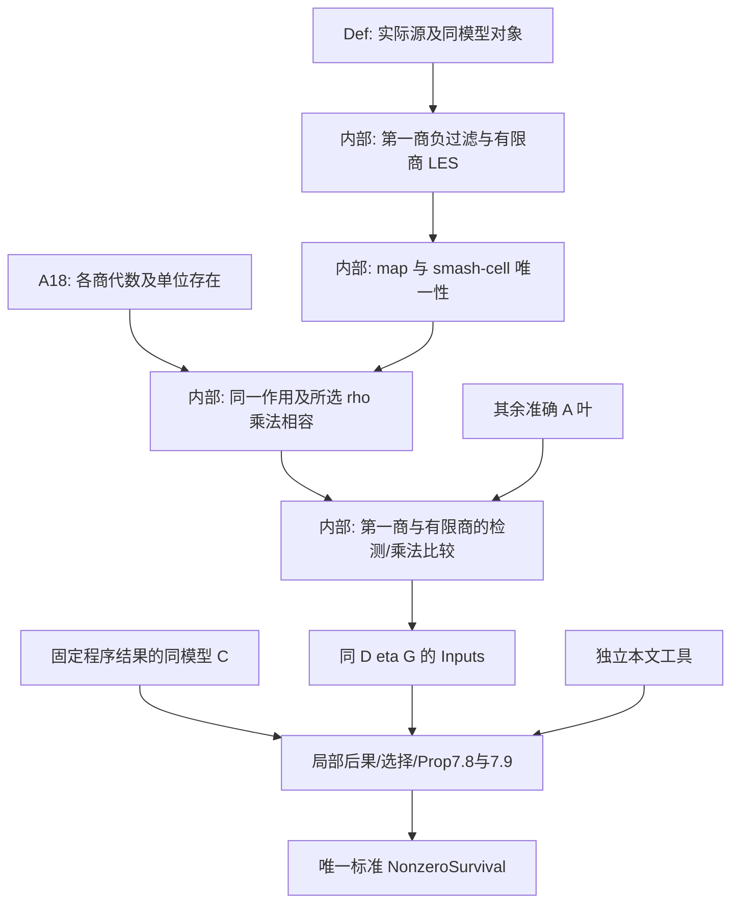

# 第 0 步第三轮修改、自审与验收

日期：2026-09-29。基线 commit：`57647d2158891da6cf7bd392f70f0f4158553dcd`；审查对象是该基线上持续修改后的**当前工作树**，不是原 commit。本报告接续并更正[第二轮报告](stage0-57647d2-iteration-2.md)，不覆盖历史记录。具体文件指纹、日志摘要及未修改材料核查见[第三轮证据](stage0-57647d2-iteration-3-evidence.json)。

## 1. 当前判定与本轮纠错

**第 0 步完成：本轮修改后的当前工作树通过指定标准 T 路线的接口验收。** M/T、C 覆盖和 A 覆盖三个硬标准分别通过；对象绑定、准确范围与后续责任已明确。本轮发现的 A18 阻塞已经修正并重审，最终实际检查全部通过。这个判定基于源码、原文和消费依赖的核对，编译只是声明及接线的辅助证据。

本轮重新展开 M/T 来源、A 的量词与适配、C 的实际有限记录和消费者，发现第二轮 A18 存在一个真实职责缺口：原 `quotient_algebras` 接受的完整包包含所选 cofiber 限制映射的乘法相容性，但并没有独立完成从文献代数塔到该预选映射的识别声明。仅说 SourceModel 锁定商和边界，不足以免除这项适配。**第二轮对 A18 的无保留通过判断不够准确，本报告明确更正。**

现已缩小接受命题至文献确实给出的各商交换代数及其单位；保留完整消费结论，并新增内部有限胞腔比较定理承担球作用与所选 ρ 的相容性。没有删除必要结论，也没有把它们改塞进 M。新比较证明可暂用 `sorry`，但次数、范围、共同参数及独立证明路径已明确。

| 验收项 | 本轮复核及当前接口 |
| --- | --- |
| M/T | 标准普通来源、球谱塔、Milnor 类、双次数和共同代表的非零永久存活保持不变。再查标准 T 的 194 个本地导入模块，不含 Main/Interface 或 A/C 输入；联合 source 模型构造仍是明确证明债 |
| C | 同 D、G 的联合 `∃ R L` 七条件保留；选集覆盖与原记录强度未改变。新增 235 处入微分源和 671 条坐标的只读核查；无限尾部仍由独立消失线、负过滤及真实过滤分离性控制，不能由快照代替 |
| A | A18 的原始存在命题与内部运输现已分开；其余 18 组接受声明保持。补充 BX 对一个共同 synthetic θ₅ 二阶性的精确原文定位，与任意选择的内部加强区别 |
| 职责/依赖 | 新的商比较只依赖实际第一商、有限三角和 source 张量；不需 E∞ 输入、C 或 T。论文新工具、选择、Prop.7.8/7.9 继续由内部推导承担 |
| 架构 | Interface 仅 Challenge/Solution；Main 仅 Axiom/Challenge/Solution；旧阶段总包传递链已移除。标准 Final 只依赖定义层；C 的生产/接受类型保持完全相同 |
| 冗余 | 单独处理，不据此判成败。原始/完整商代数两种类型现在有不同数学责任，不能再次合并成接受公理 |

验收范围为通向指定标准 T 的完整接口及其所需工具。**不表示模型已构造、计算已认证或主定理已证明**，也不宣称全附录、全部 49 谱和额外几何推论均已覆盖。

## 2. 固定版本、实际阅读与边界

Lean `v4.32.2`（`f3b06c705e6c85f5314019d5d3baab0fec5b580c`），Mathlib `905b95818eb32af7874a58b427f50c1711a5e96c`。主论文为仓库固定 `2412.10879v2`；Lin 程序/数据为 Zenodo 14875701、`v126.3.cw49`。完整材料版本与来源状态保留在第二轮第2节，第三轮证据核对其当前字节身份。没有更换依赖、修改论文/数据库/CSV/CI，也没有提交、推送或发送外部消息。

本轮直接重读：SourceModel/Construction、ordinary convergence 的 J/塔投影、normalized maps、标准 Final 定义闭包；`Algebra/Data/Synthetic/SourceAdapters` 的完整商接口；Pst hypercompletion 与 λ-inversion 范围；BX `cnstr:bock-maps` 和 `kervairev2.tex:624–630`；C 的七条件及记录解释、范围推导和实际 selected JSON；固定 release 的 `TryDiff`、`NULL_DIFF`、`try1` 记录源码。三位协作审查者与主审使用同一工作树，主审交叉复核了 A18 和 trial 语义，不照抄历史“通过”。

当前程序源码证据来自同目录树旁的 `Lin-program/program/upstream/release-source/SSeqCpp-master/ss/`。它说明所固定发布程序如何编码日志，不证明每条日志的数学正确性。八条 trial 行和原始局部 SS row ids 另存[有限覆盖证据](stage0-57647d2-iteration-3-c-evidence.json)。

未检查为已证明的范围：所有 source coherence 与模型存在性、数据库的数学 soundness、完整日志递归重放、near126 基础分辨率/augmentation 的全部实体。Moss1970 扫描、Toda 原书仍未直接取得；当前接受的实际命题另有直接核对的 BK v2/BHS 原始来源，不能把未读原书记为已核实。Bousfield 原文的具体基础比较仍属于内部证明责任，未额外接受一个缺来源的叶子。

## 3. A18 的对象、来源与准确修正

以下行号对应本轮最终源码；完整名称的前缀分别为 `KIP126.Literature.Route`、`KIP126.Main.Axiom.Literature` 和 `KIP126.Main.Solution.Literature`。

| 对象/责任 | 准确声明与位置 | 当前状态 |
| --- | --- | --- |
| 原始商代数存在性 | `QuotientAlgebraStructures`，`Def/Kervaire/Inputs/Literature/Algebra.lean:29`：∀ q>0，在同一 `XModLambdaN S00 q` 上给 MonObj、交换性、unit=实际 incl | 命题语言在 Def；只取文献 E∞ 构造的普通交换代数后果，未声称 MonObj 是完整 E∞ 结构 |
| 显式 A18 | `quotient_algebras`，`Main/Axiom/Literature/Synthetic.lean:69`：固定 `SourceModel D η G` 上 `Nonempty (QuotientAlgebraStructures D)` | 接受原文存在结果的直接运输。原 BX `cnstr:bock-maps` 给交换代数塔，BHSmot Apps B/C、Example C.15 给其构造；不再接受预选 ρ 的乘法性 |
| 同一个原始见证 | `ExternalLeaves.quotient_algebras`，`Def/Kervaire/Inputs/Literature/Data.lean:76`；`acceptedLeaves`，`SourceAdapters.lean:264` | 只在同一组装中选一次，不恢复旧阶段 Nonempty 总包链 |
| 完整消费语言 | `QuotientAlgebras`，`Algebra.lean:40` extends 原始结构，加 sphere_action 和指定 D.ρ 的 restriction | 所需结论完整保留；这些字段由内部适配提供，不是新外部事实 |
| 独立零窗口 | `quotient_negative_window`，`SourceAdapters.lean:110`：q>0 且 `w+q−1<m` ⇒ `Subsingleton (BiHom m w Qq)` | 准确内部引理，proof sorry；不需 quotient algebra、EInftyInput、C、T |
| 映射歧义 | `quotient_restriction_ambiguity_vanishes`，:119；`quotient_map_under_unit_unique`，:128 | 对 0<i≤j，π_(1,−j)Q_i=0；同 bottom unit 的 Q_j→Q_i 相同，未推广成任意 TR3 filler 唯一 |
| 乘积歧义 | `quotient_cross_top_cell_vanishes`，:136；`quotient_unit_map_multiplicative`，:159 | π_(2,−2j)Q_i=0，加两块 π_(1,−j) 消失；实际 smash 胞腔过滤使 bottom 限制单射，保单位映射乘法相容 |
| sphere action | `quotient_structure_sphere_action`，:142 | 同一 tensor、sphere pairing、代数单位与 route action 的内部比较，proof sorry |
| raw→完整 Q | `source_quotient_algebras`，:172 | 组装本身实际使用上述定理，并由 `D.comparisonCompatible.quotient_restriction` 和 `XModLambdaN.incl_restriction` 得既定 ρ 保单位；无新增接受假设 |
| 同模型消费 | `inputsOfSourceLeaves`，:342 | 先得完整 Q，再给 `sourceAlgebra` / `source_algebra_binding`，随后组装相同 D、η、G 的 Inputs |

零窗口的数学核对：q=1 的实际第一商为 E₂，其过滤 `s=w−m<0`。q>1 用同一有限商三角 `Σ^(0,−1)Q_(q−1) → Q_q → Q_1`，左端的权重变为 w+1，因此归纳条件仍是 `w+q−1<m`。对 0<i≤j，取 `(m,w)=(1,−j)` 和 `(2,−2j)` 均满足。Q_j∧Q_j 的过滤含 bottom、两块 `(1,−j)` 和一块 `(2,−2j)`；必须使用两类消失，不能把“分别在两条轴上为零”直接当作已经选好相容零同伦。当前声明和证明占位已明确这项责任。

这一独立路径避免用 BHS E∞ 限制映射公式来证明这些公式所需的 ρ 识别。`FixedFinal.lean:38` 新增回归，拒绝完整 Q 泄漏进 A18，并检查新适配声明没有额外接受公理依赖。这仅是声明/依赖检查，`sorry` 仍须日后由实际 LES 与胞腔过滤证明替换。

BX 的另一个更正仅涉及来源定位：`BurklundXu/source/kervairev2.tex:624–630` 明文给共同 θ₅ 的 synthetic `2θ₅=0`，并说明经典比较和相应次数无 λ-torsion。BX `(62,2)` 在本项目是 `(62,64)`。它支持原始共同选择；LWX λ 规范化及任意 admissible 选择的二阶性依然在内部证明。第二轮 A15 对二阶性一概归内部的措辞应按这个区分理解。

## 4. C 的增量覆盖矩阵与原始语义

完整论文反向需求矩阵、七条件解释链、有限/无限范围与数据定位见第二轮第5节；本轮未修改这些数学声明或选集。本轮新增检查保存原始 row id 与每个次数，不只统计条目数。

| 消费范围 | 从消费者反算的检查 | 结果与限度 |
| --- | --- | --- |
| U、correction、P/Q/V/X/Y/T、h₆² | 每个 (s,t) 的全部非负过滤入源 `(s−r,t−r+1)`，2≤r≤s | 均有完整所选次数及 core staircase；矩阵行数/秩等于 E₂ 基维数。未证明其 actual page 意义 |
| high125 E₅ | 15≤s≤64，目标 `(s,s+125)` 的 d₂、d₃、d₄ 入源 | 有限空间覆盖；s≥65 仍由独立消失线处理，实际高过滤为零另需分离性 |
| Cν 的最后反证目标 | (14,139) 在 r=2..5 的四个入源 | 原基/SS 行数 4/4、4/4、3/3、5/5；只用于 E₆ 非零目标范围，不升级为永久性 |
| 全部选定记录 | 648 次数、963 基、671 断言：579 equation/84 reaches/8 refutation，73 乘积次数 | 671 个源/靶均存在，坐标严格递增且未越界，次数 `(r,r−1)` 正确；不是数学认证 |
| 八个 trial | proofs.db/log ids 2047477、2047478、154532–154537；depth=1、reason=T | 保留原 r/坐标，命题为 `¬HasDifferential`；未把后续矛盾诊断页改写为原 trial 页 |

`ss/deduce.cpp:332–388` 的 `TryDiff` 在 AddNode 分支中试等式，成功分支回滚日志，矛盾分支保留并在 depth0 记 exclusion；`mylog.h:33–40` 将 try1 编码为 T。`ss.cpp:314–325` 区分未知 NULL_DIFF 与明确零目标，因此 9000 只支持当前定义的有限 `ReachesPage 1000`，不自行给非零或永久性。原库没有 exclusions 表；没有声称八条反证已完成 soundness 认证。

235 处入源核查通过，结果由 `scripts/check_stage0_selected_coverage.py --output <新报告.json>` 可复跑。脚本只以 SQLite mode=ro 读库，说明未知/无材料范围，不修改或重生成数据。它既不证明筛选对所有未来工具完整，也不证明所有 staircase 规则正确。

当前已选认证交付仍为直接数学 `Certification`，不是日志验证器。如果第一阶段另选重放方案，必须补其实际基础数据、分支条件、其它谱/手工叶子闭包及每种规则在同 M 上的 soundness。工具独立证明必须先于用它认证的 C，不能以 C 的后果反过来证明同批 C。

## 5. 用户七项要求的最终核对

| 要求 | 当前对应实现/边界 |
| --- | --- |
| 1 同一 M/A/C/T | `StandardRouteModel` 字面使用 standardFoundation.hf2 与 standardMilnorCooperations；SourceModel 固定 ν、λ、商、η/ν、tmf 与实际 maps；A/C 在同 D、η、G 上组装 |
| 2 指定目录职责 | 三层定义/认证/论文目录已按要求迁移；有效现有证明保留并迁移，入口只导出；当前规范、README、Blueprint 与脚本已同步 |
| 3 T 定义隔离 | `Main/Challenge/Final/h6_sq_permanent` 仅定义层；T 是同球塔标准 `(2,128)` h₆² 的共同 Z∞ 代表且 E∞ 非零；普通 π 未误设全部 F₂。实际来源/比较有明确声明，不用自由真实性 Prop |
| 4 C 完整同型 | route_certification 和 basisTable_correct 的 Challenge/显式 axiom 完整 Lean 类型相同；认证 Solution 不消费待证 C；尚未完成的联合认证明确是第一阶段债 |
| 5 移除总包链 | Challenge1/2 文件、存在公理、全局 witness/投影和兼容别名已移除；来源原文的局部存在量词保留必要数学含义 |
| 6 语义修复及冗余 | 来源识别、ν/BHS/tmf 单位、无限尾部、坐标/乘法比较、UCT 符号已具名；本轮再修 A18。空基及消失/穷尽数据保留，旧无用途包装移除 |
| 7 迭代及验证 | 目录迁移后继续 source/符号/对象审查，再查 A18 并补准确内部目标；当前实际编译、依赖/同型/来源清单/只读数据验证逐项记录，不以编译替代语义 |

## 6. 证明责任、剩余缺口与冗余

| 编号/分类 | 状态、影响及最小后续行动 |
| --- | --- |
| I3-01 接口阻塞，已修正 | 原 A18 偷带预选作用/ρ 适配。现在 raw/full 分离、具体负窗口和胞腔适配声明齐备；A 接受强度有原文支持，完整消费结论未弱化 |
| E3-01 证据缺口 | near126 分辨率/augmentation 与完整重放闭包仍未取得；当前未采用该验证器。第一阶段如选择重放必须补材料、规则和同模型 soundness，不能凭数据库存在宣称完成 |
| E3-02 证据缺口 | 原 Moss/Toda 书未直接取得、部分在线原文无本地字节哈希；准确接受命题已有所列直接原始替代来源。新增引用不得冒用这一验收 |
| P3-01 后续证明债 | `standardRealization/sourceRealization/standardMossModel` 与 source 比较仍含 sorry；构造不能循环使用要求已具完整 SourceModel 的 A 叶 |
| P3-02 后续证明债 | 新有限商负窗、smash 胞腔比较、球作用及既有 AlgebraBinding 待证明；其签名准确，不用扩大 A 隐藏责任 |
| P3-03 后续证明债 | 两项 C 的认证、内部工具、范围后果、选择、Prop.7.8/7.9 与 T 的实际证明仍未完成；不是第0步应当假装消除的工作 |
| R3-01 非阻塞冗余/必要分层 | 原始/完整商代数两个类型现在分别对应接受与内部推导，均必要；legacy 表比较保留显式参数，不与 route R 偷换；空基是穷尽必需，未删除 |

标准 Final 外层已有同对象 A/C 接线，但下游含 sorry；`permanent_of_propositions` 只完成条件逻辑终步。没有据此宣称形式证明了主定理。完整现有冗余分类仍见第二轮第9节，本轮没有重新引入总包交付体系。

## 7. 实际验证与后续最小工作

| 本轮实际检查 | 结果及限度 |
| --- | --- |
| `lake build` | **通过，5098 jobs**，退出码0；日志 `kip126-iteration3-build2.log`。包括最终接线、T 类型边界、两项 C 完整类型一致性及新增 A18 回归；保留 intentional sorry/linter 警告 |
| `check_stage0_architecture.py` | **通过，1570 Lean modules**；精确目录、Def 传递隔离、无旧总包链、无 import 环、Solution 不消费 Challenge，认证不依赖自己的接受公理 |
| `check_route_literature.py` | **通过**；13 应用字段、29 来源组、115 声明、17 原文文件哈希、7 组绑定、10 组内部适配。准确来源需另靠原文核对，不能由此自动证明 |
| 生成的 Lean 来源清单 | **115 个声明通过实际 Lean 环境检查**；退出码0，无输出错误 |
| `check_stage0_selected_coverage.py` | **235 处入源及671条坐标检查通过**；只读 finite coverage/grammar，完整结果另附 JSON；不证明 actual page、非零或 soundness |
| Blueprint 声明检查 | **1514 个当前声明引用通过**，退出码0；复用固定 renderer。可选 PDF/vector imager 缺失，未声称 PDF/图片视觉验收 |
| 固定文件/用户改动 | **20 个固定文件再次逐一 SHA256 相同**，论文和数据库实体可读且非 LFS 指针；用户起始20项删除保留。历史审计未覆盖 |
| `git diff --check` | **通过**；没有以降低隔离/同型检查标准来取得通过 |

其他未变内容的来源清单22项回归、selected importer 5项回归及选集重生成结果仍见第二轮证据，不能写成本轮重新执行。第三轮保存变更文件列表与完整当前指纹，明确区分复用证据与新执行检查。所有检查使用固定当前工具链，不运行“零公理/零 sorry”作为第0步门槛。

本轮首次编译发现新球作用适配的 `algebraProduct` 名称歧义，已明确为同一 `KIP126.Literature.Route.algebraProduct` 后重新完整编译通过。来源清单的两个枚举值不符合既有 schema（responsibility、proof_status），已改成既有的准确分类，保留细节说明，没有放宽验证器。

下一步最小工作是完成已经明确的模型/比较证明、第一阶段 C 认证和第二阶段论文推导；特别是新商适配应按独立负过滤/胞腔路径证明，不能回用它正在识别的 E∞ 公式。如果未来发现陈述错误或改变范围/认证策略，应重新打开对应接口验收。
