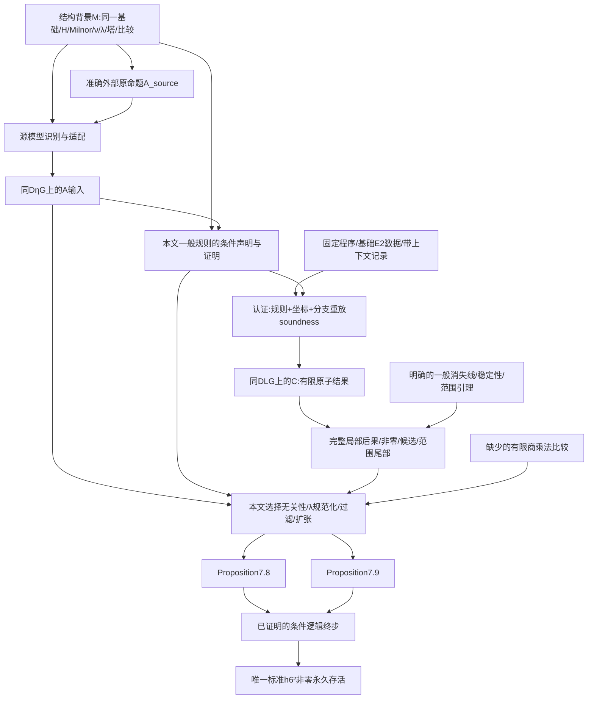

# KIP126 第 0 步数学接口独立审查

审查日期：2026-09-28。固定提交：`57647d2158891da6cf7bd392f70f0f4158553dcd`（下文简称 `57647d2`）。审查对象是通向指定标准 `h₆²` 非零永久存活的完整必要接口，不是消除全部 `sorry`，也不是重做计算或证明主定理。

## 1. 独立总评

**第 0 步未完成。** 已核实的阻塞是具体的接口和依赖交付缺口，不能只归为以后补证明：

1. 有限 λ 商中的乘法／模作用与同一 cobar E₂ 乘法之间，缺少供实际论文消费点使用的准确检测比较声明。
2. C 的有限记录尚无绑定同一路线的范围与推导接口，足以交付论文所需的无限永久性、高过滤穷尽性和若干有限页非零／候选排除后果。
3. 路线 A/C 已共享参数，但尚未声明它们如何给出本文工具及 Proposition 7.8/7.9；现有条件终步仅接受这两个待证命题本身。
4. tmf 的来源到模型、单位及标准标签识别仍停留在注释中的适配义务，缺少准确的数学连接声明。

synthetic Toda 的来源强度和运输责任另列为 E-03 证据缺口，不作为第五项已核实阻塞。

这不是因为 Final、模型构造或认证仍有 `sorry`。本次确实确认了一批接口已经表达正确，尤其是标准 T、共同 Z∞ 代表、E∞ 非零、C₃ 的真实 E₆ 代表、D₁₂ 的 E₁₂ 非零、C₄/C₅ 的不同检测条件、Cν 实际 cofiber 箭头、以及 C 中失败即拒绝解释的解码方式。

| 硬标准 | 本次结论 | 判定边界 |
|---|---|---|
| 1：M/T 同一数学事实 | **T 的核心表述通过；完整 M 的必要操作比较未闭合** | 标准球谱、Milnor 类、次数及非零永久性未发现被替换；有限商乘法比较及来源适配仍阻塞整体接口。并未要求先构造稳定 ∞ 范畴或与 Mathlib SS 建立等价。 |
| 2：C 完整、准确覆盖 | **未完成** | 已交付的有限原子陈述多数强度保守且对象绑定明确；有限截断到论文所有消费结论之间缺少精确范围和推导接口。重生成一致不证明覆盖完整。 |
| 3：A 完整、准确可用 | **未完成；部分原始来源另有证据缺口** | BX/BHS 等多项可直接核对；tmf 对象适配尚缺准确声明；synthetic Toda 的来源强度与运输责任另待核实。Moss 原扫描、Toda 原书未取得。 |
| 冗余 | **单独汇报，不据此判失败** | 历史包装、附录全量目标、几何推论及重复记录不是本次阻塞的独立理由。 |

报告中“已核实”是本次直接读源码、原文或查询数据所得；“推断”不等于已证；“未核验”不会计入通过。以下分项矩阵列出仍未完成的覆盖，不能将已读样本推成整库认证。

## 2. 审查基线、版本与检查范围

### 2.1 固定快照及工作区

- 仓库：`/inspire/hdd/global_user/baokangjie-CZXS25250151/KIP126`。
- HEAD：`57647d2158891da6cf7bd392f70f0f4158553dcd`，提交时间 `2026-09-28T11:33:16+00:00`，主题 `fix: validate route computation projections with default heartbeat budget`。
- 开始时用户已有 20 个 tracked 删除：根 `AGENTS.md` 及 19 个 `.agents/skills/leanblueprint-*` 文件。未恢复、未改写这些文件；数学源码、数据、论文与 HEAD 相同。所有审查分工使用这一个工作区和同一个 commit，未混入邻近 `KIP126-develop`。
- 只新增本报告及其审查证据 JSON；临时检查放 `/tmp`。没有修改 Lean、论文、数据库、生成内容、依赖或 CI，没有提交、推送、PR 或外部消息。
- 分工：M/T、C、A 三个独立阅读分支；主审读阶段边界、最终接线、§7 全部实质论证及工具入口，复查重要定义和数据行，并统一分类。分项发现不是未经复核的投票结论。

### 2.2 工具链、论文和数据

| 材料 | 固定版本／本次证据 |
|---|---|
| Lean | `lean-toolchain:1` 固定 `leanprover/lean4:v4.32.2`。旧 trace 自报 Lean commit `f3b06c705e6c85f5314019d5d3baab0fec5b580c`，仅作历史构建元数据。 |
| Mathlib | `lake-manifest.json` 固定 `905b95818eb32af7874a58b427f50c1711a5e96c`、tag `v4.32.2`；本次 `.lake/packages/mathlib` HEAD 相同且 status 无改动。 |
| checkdecls | 固定 `3d425859e73fcfbef85b9638c2a91708ef4a22d4`。未更换依赖。 |
| 主论文 | 仓库保存的 LWX v2，`MainPaper/main.tex` SHA256 `1125462bcae4a4ec56e3bfcaad15df4febf98757dfb83462b155af162c99c9e0`；`112.tex` 为 `5eb83ef105ce9dbbda87a9f57726bb5c078308fd3718840ea29ee8100cbefabb`；PDF 为 `7cae269851a88d10dd194651dbf7497b75ef8b8b914bc1901dfa3734cd8096b4`。本次实际重算，非只抄 inventory。外部 [arXiv v2 页面](https://arxiv.org/abs/2412.10879v2) 确认修订日期 2025-02-22、66 页；未声称另下载远端 TeX 并逐字比对。 |
| 数据发行 | [Zenodo 14875701](https://zenodo.org/records/14875701)，`v126.3.cw49`（2025-02-15），仓库 `Route/selected.json` 固定 8 个原始输入。 |
| SSeqCpp 程序 | 仓外已有 `Lin-program/program/upstream/source-code.zip`，5,051,993 bytes，MD5 `66ce3684e92676604f8368191e35d5b3` 与本次读取的 Zenodo 文件元数据相符；SHA256 `dd784541626f4d693c35f3ca84d4a67e83758ac463aabe58ab6c9cc92be22a15`。以发行归档固定版本，未杜撰 Git commit。审查使用的 `ss/deduce.cpp`、`ss/ss.cpp`、`ss/database_ss.cpp` 与 ZIP 对应成员逐字相同。 |
| 数据归档辅助证据 | 仓外 `kervaire_database.rar`、`kervaire_csv.rar`、`proofs_csv.rar` 的 MD5 分别为 `91ea5d8ef613828b9ef66f6d9f879166`、`631257d058529916d62d858e0da27417`、`84726047bac3ae562de325e7b78e92ae`，均与发行元数据相符。未重放程序，亦未由这些摘要推断数学正确性。 |
| LFS | 环境没有 `git lfs` 子命令；但本次逐文件读到全部 8 个输入的完整实体、重算 SHA256，DB 可只读查询，CSV 可正常解析；**不是 LFS pointer 缺失**。`.gitattributes` 的 DB/CSV 跟踪规则与实体是否可用分开判断。 |

本次直接读取的 `Raw/proofs.db` 为 623,042,560 bytes，SHA256 `3a460683c023ee2d8f7e8f904ecef9044a474d88bb7184731e54978ba7dac248`。球谱 SS 数据固定 `t_max=261`，Cν 为 `t_max=200`，两者 `d2_t_max=177`；这些字段是数据版本表信息，不是任意范围内的数学正确性保证。Cν→S⁰ 映射版本表明确 `from=Cnu,to=S0,filtration=0,suspension=4`。

其余实体摘要、初始工作区状态及程序归档核验附在 [stage0-57647d2-evidence.json](stage0-57647d2-evidence.json)。外部论文各自的具体 arXiv 版本、实际阅读位置与可用性见 A 矩阵；没有把目录内只有元数据的来源报告为已读原文。

### 2.3 实际执行的检查及其限制

| 检查 | 结果与可以支持的结论 |
|---|---|
| Git、manifest、文件头／大小／SHA256 | 核实本次固定快照与所读实体身份；不证明数学结果。 |
| `python3 scripts/check_route_literature.py` | 通过：10 input fields、28 source groups、41 declarations、17 file hashes。只验证清单完整性与字节身份，不验证 41 个定理成立。 |
| `python3 scripts/check_source_inventory.py --skip-lean-projection` | 通过：18 sources、88 artifacts。**明确跳过 Lean 投影**，不能宣称完整来源到 Lean 对照已编译检查。 |
| `PYTHONDONTWRITEBYTECODE=1 python3 KIP126/Main/Axiom/LinProgram/Translate/select-route.py --check` | 通过：8 固定输入、CSV/DB 一致性及生成内容；648 degrees、963 basis labels、671 claims、73 product degree pairs、4 bottom maps。没有重生成覆盖仓库文件。 |
| SQLite `mode=ro&immutable=1` | 读取 schema、版本、关键 staircase/试探／微分／基／映射行；没有写库。C 表列明定位。 |
| 静态导入图及声明搜索 | 对 1504 个 `KIP126/**/*.lean` 抽取 import 闭包，结合逐字段读取；只作声明接线证据，不等于数学无环认证。 |
| Lean 当前检查 | `lean --version` 及固定 v4.32.2 绝对路径均返回 `error: failed to locate application`。未换工具链、未改缓存、未全量 build；本次未获得新的 `#print axioms` 或编译结果。 |
| 已有 `.olean/.trace` | 确有 `RouteBoundary`、`RouteFixedFinal`、`Challenge2`、`Conclusion` 等缓存。trace 没有足以直接确认本 commit 全依赖对应关系的审查证据；其编译路径还引用历史 release 缓存。仅作历史参考，未将其升级为本次编译通过。 |

主要源码实际阅读覆盖：`Challenge1/2` 的总包和相关参数化接口；StandardSphere、Permanence、实际塔及 Milnor/cobar 定义链；整个 Route Model/Conditions 与路线 A/C；本文 Tools、ChoiceIndependence、DifferentialReduction、ExtensionObstruction；所需历史 Near126、LinProgram Raw/Translate/Interpretation 及 Checks。主要论文阅读覆盖：LWX §7 非注释正文及反向引用的 §2–6 定义／工具和附录相关表；Pst、BHS、BX、Xu、IWX、BHSmot、BMQ 的相关原始段落；新增在线取得的 May、Belmont–Kong 文献片段。`112.tex` 是图表证据，不把图中虚线候选当已知微分。

没有执行的工作：全部 49 谱的证明重放、全部附录 401 行的数学认证、所有 Mathlib/Def 证明的逐行重证、主定理证明、所有历史接口的全面可满足性证明、以及缺失原书／原扫描的全部原文核验。认证所需辅助谱范围尚不能由最终消费包的两个谱推定，详见 C 分项。

以下行号针对 `57647d2`。完整路径相对于仓库根；以 `Def/`、`Interface/`、`Main/`、`Checks/`、`Challenge1.lean`、`Challenge2.lean` 开头的省略路径均位于根下 `KIP126/` 中，各表另外说明的 `Route/` 等缩写按该表解释。分项中的旧文档结论只作对照，结论以实际源码、原文及查询为准。

为避免字母混淆，本报告统一用 `L : KIP126.Kervaire.Route.Labels H` 表示路线标签，用 `G : KIP126.Literature.Route.TmfLabels H` 表示 tmf 相关的球谱 E₂ 标签。实际 A 文件将后一参数局部命名为 `L`，这里仅作 α 重命名：共同背景上要比较的是 `KIP126.Literature.Route.Inputs D η G` 与 `KIP126.Computation.Route.Inputs D L G`，不是两份独立选择的同型标签。两者还隐含同一 `C/Syn/H/M`、相同 typeclass 与 cofiber 结构；`M : MilnorCooperations H` 不是本报告整套数学 M。

## 3. M/T 对象绑定与逐定义核对

### M/T 核对结果

**T 的核心定义准确，不能因 Final 的 sorry 判第 0 步失败。** `NonzeroSurvival sphereAdamsData (2,128) standardH6Square` 是同一标准基础的实际 mod-2 球谱 Adams 塔中指定 Milnor 双字的共同无限循环代表、其 E₂ 值为指定类且 E∞ 值非零。它没有把几何结论、阶数或仅“出微分为零”混进 T。C₃、C₄、C₅、D₁₂ 的现有定义也保留用户要求的区别。

**但是 M/适配语言仍不足以覆盖已读到的全部必需证明步骤。** 已核实缺少把有限 λ 商上的球作用及 first quotient 标签与同一 cobar E₂ 乘法联系起来的准确命题，具体阻塞论文 Lemma `lem:x1239` 等“Ext 乘积 → 商对象同伦乘积的检测/过滤”步骤。现有未截断乘法相容性不能直接代替这一桥。tmf 作为参数化 pointed detector 本身合法，但它与原文 tmf 对象、unit、BMQ 命名类的绑定仅留在注释，需来源到模型的准确适配声明（不要求第 0 步实现 tmf）。因此不能把 M/T 相关接口整体判为已经冻结完毕。

### 对象绑定表

本节省略路径按第2节约定；行号来自固定快照。简称 `K.R.` = `KIP126.Kervaire.Route`，`C.A.` = `KIP126.Classical.Adams`，`S.C.` = `KIP126.Synthetic.Context`。此外，本节 `SphereClasses/` 位于 `Def/ClassicalAdams/`；`Model/`、`Labels/`、`Objects/`、`Conditions/`、`Extensions/` 位于 `Def/Kervaire/Route/`；`AdamsFiltration/`、`Localization/`、`Detection/` 位于 `Def/Synthetic/`；`Basic/Data.lean`、`Computation/Predicates.lean` 位于 `Def/SpectralSequence/`。

| 论文对象 | Lean 定义、类型/次数与来源 | M/A/C/T 的同对象接线与状态 |
|---|---|---|
| 稳定背景与球谱 | `KIP126.StableHomotopy.StableHomotopyCategory`，`Def/StableHomotopy/Context/Data.lean:31–46`：范畴、预加性、ℤ shift、幺半、零对象、预三角；`SphereSpectrum := 𝟙_ C`，同文件109；`HomotopyGroup n X := Sphere n ⟶ X`，115 | 同伦群为加法群/ℤ 模，**没有**把全部 π 设 F₂。Challenge1 `FoundationInput` 311–327；`TensorInput`354–365 给同一对象三角性、对称幺半、加性、选定 tensor shift/exactness。实际模型存在性仍阶段输入，不是已构造几何模型。依本任务允许抽象基础，不能仅此判错。 |
| H𝔽₂ 与 unit | `Mod2EilenbergMacLane`，`Def/StableHomotopy/Cohomology/Data.lean:24–33`，π₀ ≃+ ZMod 2，其余 π 为 Subsingleton；unit 是 π₀ 的 1 经零移位回到球 | fixed foundation 与 Challenge1 witness 同一；不是任意字面 HF2 载体。环、Künneth、Milnor coop 另由 `Challenge1.CooperationInput`376–386 提供。 |
| 经典 Adams 塔及谱序列 | `C.A.adamsTowerInternalSpectralSequence`，`Def/ClassicalAdams/TowerSSData/Sequence/Data.lean:18–23`；由 unit 和 X 的塔、既有 PreSS、循环边界与 d²=0 装配，底环ℤ，从 E₂显示，dᵣ 次数(r,r−1) | `Interface/Axiom/StandardSphere/Sequence/Data.lean:13–19` 的 `sphereAdamsModel` 和 `sphereAdamsData` 是 fixed HF2 unit 的实际球塔，firstPage/differentialDegree 均 rfl；没有独立指定第二谱序列。无需另加与 Mathlib SS 的等价要求。 |
| Milnor坐标/标准 hᵢ | `C.A.MilnorCooperations`，`Def/ClassicalAdams/MilnorCooperations/Data.lean:41–48` 给 E₁ 到 cobar cochains 的坐标及 d₁ 方程；`Sphere.Internal.hi`/`hiSquare`，`SphereClasses/Hi/Internal/Data.lean:25–36`，指定 cocycle 经实际页商 | 裸 MilnorCooperations 的线性同构本身不够；**已核实固定版本还通过** `Challenge1.CooperationInput.coordinates_eq`384–386 锁定它为实际 cooperation ring/Künneth/Milnor basis 派生 `sphereFirstPageMilnorEquiv`。不要误报固定标准类仅靠任意线性同构。该整包见证仍待交付。 |
| h₆ 与 h₆² | `C.A.standardH6 : sphereAdamsData.Page 2 (1,64)`、`standardH6Square : ... (2,128)`，`Interface/Axiom/StandardSphere/Classes/Data.lean:13–22` | 指定 `[ξ₁^64]` 与 `[ξ₁^64\|ξ₁^64]`，stem=t−s=126；均在同一 Challenge1 基础与 Milnor 数据；CSV未参与定义。 |
| cobar乘法/路线乘法 | `Sphere.Internal.product`，`Def/ClassicalAdams/SphereClasses/Product/Data.lean:17–25` 是固定 cobar cup 经固定同页比较运输；`MilnorCohomology.hiSquare_eq_cup`，`Def/ClassicalAdams/MilnorCohomology/Multiplication/Proofs.lean:38–43` 有真实证明；`comparison_hiSquare`，`Def/ClassicalAdams/MilnorCohomology/Comparison/Proofs.lean:39–43` 有证明 | `K.R.Labels.U` 与 `target`，`Labels/Data.lean:28–34` 均以该运算定义，非自由运算；C `ProductCorrect` 把 CSV 运算联系到此运算。旧 Challenge2 的 `P.product` 到 actual layer 有另一个准确声明，但与此运算缺少比较见 MT-01。 |
| 路线总模型 | `K.R.ModelData H Syn`，`Model/Data.lean:37–76`；`K.R.Model H M Syn`，`Model/Coherent/Data.lean:16–21` 追加 towerPresentation、comparisonCompatible、separated、commutative、multiplicationCompatible | D 统一承载 ν、family、恢复、firstQuotient、λ塔、对象closure、convergence、suspension、normalizedMap、E₂标签。没有 C₃/C₄/C₅、指定 dᵣ、Proposition7.8/7.9 或 T 字段。这里参数 `M : MilnorCooperations H` 只是数学整体M的一部分。 |
| 标准路线模型 | `C.A.StandardRouteModel Syn`，`Interface/Axiom/StandardSphere/Route/Data.lean:9–11` | 只是 `Model standardFoundation.hf2 standardMilnorCooperations Syn` 别名，足以限定后续模型必须用同基础；它没有给 Nonempty、实际 D、A/C witness 或最终消费连接。构造准确类型 witness 的证明可后补，不能把 alias 当 witness。 |
| synthetic ν、λ、quotients | `S.C.NuFunctorData`，`Def/Synthetic/Context/Data.lean:83–95`，同一 additive functor/unitIso/suspensionIso；`lambdaPow`51–67，`XModLambdaN`74–76 真正取 λⁿ cofiber；`LambdaRecovery`，`Localization/Recovery/Data.lean:29–38` | ν realization 恢复同一经典 C，不把 ν 当 realization 的右伴随；λ-invertible equivalence、reflector明确。`ComparisonCompatible.quotient_restriction`21–24 锁实际ρ与自然性；Bockstein `Route/Synthetic.lean:27–44` 是同一 actual δ。没有自由 deltaH6。 |
| synthetic Adams family | `TowerPresentation`，`Def/Synthetic/AdamsSequence/TowerComparison/Data.lean:36–55` | forward/inverse SSDataMorphism 保所有循环/边界、相互逆、交换同一 dᵣ，natural_e2 锁实际 νHF₂ tower map；不是仅按名字选择 family。`Model.nuE2`65–68 与 `sphereE2`75–76 规定 λᵏx 的权重 t+a−k / t−k；BHS适配另给窗口外消失及标签/λ/ρ约束。 |
| 真实过滤和 detection | `Synthetic.SpectralSequence.TowerConvergence`，`AdamsFiltration/Convergence/Data.lean:20–23` 的目标是 actual towerFiltration；`Detects`，`Detection/Predicates.lean:23–32`；`DetectsNonzero`36–41 | ∃共同 Z∞代表与实际同伦类的 associated graded 等式；不定性保留。检测不等于任取严格代表之间相等。`ComparisonCompatible.convergence_natural`56–60 指定实际同伦/∞页映射自然性；比较等式/模型见证尚待证明/提供。 |
| η、ν、Cν | `AuxiliaryData.etaMap/nuMap`，`Objects/Data.lean:13–21`；Cν由 `ClassicalObject.obj`34 真正取同一 nuMap cofiber；`nuRouteTriangle`74–82 固定原箭头/cofibι/cofibδ | A `HopfBindings`，`Main/Solution/Route/DependencyTypes.lean:78–85` 用 h₁、h₂及同一 normalized η 标识；`NuCofiberApplicability`52–63 给 ν指数1、bottom/top指数0、h₂标签和真正 normalized distinguished triangle，exponent_sum67–73 已有证明，避免空泛∀。C bottom/top通过 actual箭头和塔悬移，不能用独立胞腔函数替换。 |
| normalized maps | `NormalizedSyntheticMap`，`Def/Synthetic/NormalizedMap/Data.lean:37–42`；e(f)19–23定义为真实 Adams filtration≥1 的0/1选择 | map : Σ^(0,e(f))νX→νY，factorization强制λ^e后等于νf；不是任意指定过滤数。仅factorization不推出三角性，模型没有藏入结论；实际Cν兼容由A适配额外明确。 |
| tmf对象/unit/标签 | `AuxiliaryData.detector`/`detectorUnit` 为 pointed C 对象；`Literature.Route.TmfLabels`，`Route/Tmf.lean:18–28`，g:(4,24)、Δh₁g:(9,54)，high125=(25,150)由同 cobar product构成 | A/C的G可共用同一个参数；C LabelsCorrect142–143锁CSV标签；A TmfInputs37–66将 θ₅ vanishing/high detection/low AF63表述在同对象上。**尚无原文tmf/unit及BMQ类→这些参数的准确识别声明**，见MT-02；历史tmf CSV Mon C模型不能自动填补。 |
| extension与crossing | `FiniteExtensionWitness`，`Extensions/Witness/Data.lean:18–40`；`InfiniteExtensionWitness`42–57；实际 filtered two-term map的 `ExtensionEquation`、`EssentialExtension`，`Synthetic/ExtensionRelation/Predicates.lean:14–28` | 有r≥2、e(f)≤n≤r−2+e(f)、源靶实际cycle、同一有限商上的∞代表、实际filtered解纤维。永久版本明确使用无限循环。essential排实际较短扩张边界，crossing保全部存在量词与范围，非手选候选或自由Prop。 |
| Massey/Toda | `ThetaBMasseyDefiningSystem`，`Route/Massey/Predicates.lean:21–36`；结果(9,134)，两nullhomotopy在(1,64)、(7,70)上使d₂分别等于指定乘积；`ThetaBMassey`39–46保整个E₃子集/非空及零不定性；`ThetaBToda`，`Route/Toda/Predicates.lean:10–13` | 真正用同一 d₂、cobar product及cofiber Toda.Relation。与Moss外部定理、经典到synthetic的所需适配仍须逐一审，不因有定义或provenance wrapper便认为已证明或适配已完成。 |

### T、C₃/C₄/C₅、D₁₂ 的逐定义核对

1. `KIP126.Core.SpectralSequence.NonzeroSurvival`，`Def/SpectralSequence/Permanence/Predicates.lean:28–35`：存在 `z∈Z⊤`，同一个 z 映到 E₂ 指定 x，并要求 `pageπ⊤ z ≠ 0`。`SSData.Z_top_greatest/B_top_least`，`Basic/Data.lean:48–51` 锁定 Z∞ 是有限 Z 的交、B∞ 是有限 B 的并；不是独立任取∞页。Final两版本均同一签名（Challenge:17–19，Solution:16–18）；二者sorry属保留目标/未完成证明，不是本定义的语义缺陷。
2. `K.R.PermanentH6Square`，`Conditions/Predicates.lean:19–21` 用完全相同的参数化actual sphere tower和hiSquare6，标准特化在定义层应直接对应唯一Final；`Checks/Kervaire/RouteFixedFinal.lean:9–10` 明确以 `Iff.rfl` 连接标准目标；当前alias没有提供实际模型见证或 A/C 消费证明，见第6节。
3. `K.R.D12`24–26 用 `HasNonzeroDifferential`；展开 `Computation/Predicates.lean:82–88`，`yr≠0`要求在 actual E₁₂ 中，非E₂非零。(2,128)+(12,11)=(14,139)准确。
4. `K.R.C3`30–32 用 `HasDifferential`。展开72–78，∃真实xr/yr与共同cycle代表，并非无代表时全称真；目标E₂为0，于页r也为0，故确实陈述d₆W=0。(8,134)+(6,5)=(14,139)。`SurvivesTo`与`ReachesPage`不可混用，C₃自身没有额外要求E₆非零，但论文Fact `theta5sqAF`(1)应由C提供该事实。
5. `C4At`44–46要求 `DetectsNonzero` 于(10,134,128)，实际乘积θ²∈π₁₂₄,₁₂₈；`C4`48保留∃θ与ThetaChoice。与主论文2181–2203的(4)一致，未把“some”误为“any”。
6. `UChoice`51–53要求 U 在权重134检测非零实际π₁₂₄,₁₃₄类；`C5At`58–61只`Detects` λ³ηu 于(14,139,133)，其同伦度125、权重133；未附非零，符合原文Remark main.tex2260–2262其非零另依C₃。
7. `c4_c5_choice_equivalence`，`Main/Solution/ChoiceIndependence/c4_c5_choice_equivalence.lean:19–24`只是待证Prop，lhs存在，rhs为所有允许选择。其逆向仍需要A提供θ存在、C的U永久性配convergence给UChoice存在；不得凭注释或Prop定义称已证明。这里不是一条只依D/η就被全局证明的错误定理。

### 已核实的接口缺口与最小处理

#### MT-01（接口阻塞）：有限 λ 商作用的标签乘法比较缺少准确声明

已核实事实：

- 论文 `lem:x1239` 的实际推导 `main.tex:2415–2429` 使用E₃关系 `h₁·(x1239+h₀x1238)=U`，推在 `S/λ^r (2≤r≤11)` 上 `ληα₁+λ[U]` 过滤≥11，并用Ext中 `h₁·e₀Δh₆g=0` 推ηα₂ λ可除。α₁来自到E₁₂的有限循环（2406–2413），没有假设可提升未截断球谱。
- `Model.MultiplicationCompatible` (`Model/Predicates.lean:66–76`) 只量化α、β都在`S00`上的已检测同伦类；没有商对象、商上检测或一般sphereAction条件。
- `FirstQuotientHomotopyComparison` (`Def/Comparison/ClassicalSynthetic/FirstQuotient/Data.lean:20–24`) 仅是加法等价；`ComparisonCompatible`的first_quotient/nu_first_quotient、λ、naturality均非乘法方程。
- A `QuotientAlgebras` (`Route/Algebra.lean:28–40`) 已正确提供**实际**各个 `S/λ^q` 的commutative MonObj、actual unit、restrictions和sphere_action。但没有把这些代数操作经firstQuotient或finiteTargetLabel送到`Sphere.Internal.product`的方程。
- 旧 `Challenge2.SphereMultiplicativeInterface`584–608约束独立`LinE2Presentation.product`与actual first-layer product；它的字段/适配没有把这个product等同路线`Sphere.Internal.product`。`CobarCupCalculus`1080–1094只处理cobar cup与指定标准平方。两种局部证明不能用相同“product”字样合并。
- 定向rg检查整个 `Def/Comparison/ClassicalSynthetic`、`Def/Synthetic`、`Def/Kervaire/Route`、`Main/Axiom/Literature/Route`、`Main/Solution/Route`、`Main/Solution/Tools`相应乘法/作用词，没有找到所需比较命题或从更基础字段到该命题的明确待证引理。

数学影响：有限代表α₁/α₂不能直接喂给只适用于未截断sphere的乘法相容字段；实际π商上的作用与E₂的cobar乘法之间存在声明层缺环，因而不能仅把这一消费义务标为“已有正确声明待证明”。

最小修正：在同一D、同一 `QuotientAlgebras` 见证上准确声明first-quotient乘法比较（或足够的有限商sphereAction检测比较），并声明其对实际λ、ρ及相应associated graded的局部推广。需要附s,t,k,q条件和共同代表/不定性；可保持证明sorry。把classical actual layer配对与路线cobar product比较声明补入同一H/M/ring，或明确证明路线从另一条已准确绑定的基础接口推出这项比较。结构比较/来源适配与内部推导责任分别记录；第一阶段只认证CSV乘积值。此修正不要求第0步证明generalized Leibniz/Mahowald或整个乘法谱序列理论。

#### MT-02（接口阻塞，针对来源适配，不针对抽象 detector）：tmf 与 BMQ 类仅有文字绑定

已核实：`AuxiliaryData`只有任意pointed detector；`Tmf.lean:32–45`以注释说“interpreted as tmf”“identification ... part of supplying this input”，但`TmfInputs`63–66只列三条局部性质，`Applicability`78–80只有Moss/Cν，没有tmf/unit/BMQ标签的适配类型。C `LabelsCorrect`142–143可把同一G绑定CSV，却不能凭同名CSV把它绑定BMQ的g、Δh₁g。历史`Def/ClassicalAdams/Tmf/Model/Data.lean:54–57`是任意`Mon C`的bounded CSV presentation，注释也明确不构造/识别tmf，并且没有到路线D的连接。

数学影响：这三条局部性质作为**有条件的抽象输入**完全有数学意义；本发现不声称所有detector都会满足它们，也不要求构建完整tmf。但按用户要求的外部来源准确性，缺少把“BMQ在实际tmf上证明的事实”实例化到所选D/G的准确模型识别/存在性声明，无法将注释当数学适配。对应来源强度的原文核对见第5节，统一归I-04。

最小修正：补局部源模型/pointed detector/unit/相关标准类的同一性见证，或精确声明BMQ来源给出一组D/G局部实例并经固定sphere/Milnor比较运输；无需扩大为无关的全局tmf构造。证明可暂sorry，且不能把实质的新乘法/检测加强整体冒称BMQ原定理。

### 不应误报为阻塞的项目

- **M中复杂性质字段本身**：`towerPresentation`、`classicalTriangulated`、`shiftExact`、`convergence`、`homotopySeparated`等表达结构约束；没有指定局部微分/乘积值或最终存活。准确结构属性的模型构造仍待交付本身属后续证明债。
- **F₂与同伦群**：E₂经cobar/CSV得F₂结构、页面底层使用ℤ模，与π群也为ℤ模相容；π没有被错误强制成F₂向量空间。
- **Cν/cofiber maps**：在实际读到定义中是同一nuMap的cofiber与cofibι/cofibδ；不是任意cofiber载体或两个无关胞腔映射。
- **非零永久性**：没有用有限快照或“∀d=0”替代T；SSData已有无限交并条件。
- **§7关键条件**：C₃真实E₆代表、D₁₂真E₁₂非零、C₄/C₅区别、检测不定性均保留。
- **广义规则**：`GeneralizedLeibnizLaw`、`GeneralizedMahowaldLaw`、`FinitePageExtensionStretchingLaw`为本文待证命题定义，未作为Model/A字段；它们不是已证定理。

### finite stretching 核对及局限

原文 Proposition `prop:dec738d3` main.tex1981–1992 的更短essential extension讨论允许b≥0；Corollary `cor:dfc6043e`2074–2080印b>0。代码 `FiniteExtensionNonliftableCrossing` (`Extensions/Stretching/Predicates.lean:20–31`) 明确允许b=0，并明确要求更短源不在later所需cycle层；`FinitePageExtensionStretchingLaw` (`Main/Solution/Tools/PageExtensionStretching.lean:27–37`)还要求目标在later所需cycle层。

这是比印刷Corollary更强的**充分条件**接口，不能只因强于论文就判错。结论只给 `FiniteExtension` 存在，没有声称任意严格早页解都可提升，也没有声称相容无限解塔。实际ν-extension的应用原文2661–2671只从λ³到λ⁵再推λ⁹，确为有限对象；不能未经证明宣称“有限stretching已交付无限extension”。当前Main/Solution仅有工具Prop及大结论Prop，没有在该应用逐项陈述其更强b=0排除/目标cycle前提如何从C得出；这应和主审的消费者/反向覆盖缺口合并，不凭工具签名本身断言不可能。

## 4. C 覆盖矩阵与认证责任

本节除特别标明外，`Route/` 指 `KIP126/Main/Axiom/LinProgram/Route/`，`Translate/` 指其同级目录；`main.tex` 为固定主论文。所有行与版本均采用第2节基线。

### C 核对结果

C 原子交付类型已相当具体，不能再把它误报为“只有标签/哈希/未经约束的任意SS”。它把指定有限基、CSV 商乘积、原始记录、胞腔映射全部约束到同一个 `D : Kervaire.Route.Model H M Syn` 的实际球谱/Cν Adams 塔。然而，从这些有限原子输入到论文需要的无限存活、无限过滤范围、有限商乘积与检测、局部不定性/穷尽后果的**准确同模型推导接口尚未全部声明**。因此硬标准2不能通过，属于第0步接口未完成，不能只说“阶段1认证还没做”。已有原子条件的证明、已有准确的比较/认证命题的证明则是正常后续债。

本分审没有发现选中8条根层反证被误译成正向微分、没有发现9000被直接升级为非零永久存活、没有发现Cν顶部第212838行被单独误当完整组合微分。以下具体证据支持这些正面结论。

### 实际材料和检查

直接阅读了 `Route/{Raw,Data,Selected,Records}.lean`、`selected.json`、`Translate/select-route.py`、`import-selected.py` 的被复用检查、`Def/SpectralSequence/Computation/{Predicates,State/Predicates}.lean`、`LinProgram/Interpretation/{State,Branch}`、旧 `Literature/Near126/Sphere/{Data,Predicates}.lean`，及 Route 的 A/模型比较、Massey、工具声明。反向阅读 `main.tex` §7 全部证明主干：Th7.1、Prop7.8/7.9、Fact7.6/7.13/7.15/7.19/7.21、Lemma7.10/7.11/7.14/7.16/7.20、Cor7.18、附录高类候选和Cν表；阅读 §6 两个一般工具及伸展命题证明，追踪其引用的 §3–5 比较/扩张/无crossing接口。§2–6的一般工具证明本身没有新增固定数字计算前提；具体示例不能自动视为 T 必需，但认证某些行可能间接用到其结果。没有声称逐个验证所有示例或全部49谱。

直接读取八个Raw实体及SQLite表/特定行，`proofs.db`、两谱SS DB、top-map DB头均为SQLite实体。使用 `mode=ro` 连接，无数据库写入。执行：

```text
PYTHONDONTWRITEBYTECODE=1 python3 KIP126/Main/Axiom/LinProgram/Translate/select-route.py --check
```

结果：648个次数、963个基向量、671条claim、651条核心staircase行、73个乘积次数对、4个bottom值、8条refutation，`check=true`。它核对八个哈希、球谱CSV/DB、局部基编号/单项式次数、端点、staircase各局部基矩阵的秩、生成文件逐字一致。**未做Lean build，也未把这些检查报告为数学认证。**

671条的独立计数：S0 465条equation/55条reaches/8条refutation；Cν 114条equation/29条reaches；无boundaryBy实例。归一化全部数学端点/次数/坐标后有188组重复断言，共197份额外副本，主要为正反staircase同一等式及额外log记录。

程序/数据版本：Zenodo14875701，`v126.3.cw49`。八个完整SHA保存在本报告配套 `stage0-57647d2-evidence.json` 和已有 `Route/selected.json`，本次全部复核。S0 DB `version`表：schema3，`t_max=261`，`d2_t_max=177`；Cν schema3，`t_max=200`，`d2_t_max=177`。不能把`t_max261`说成所有d₂均由原始secondary算法直接计算到261；更高记录还可能经传播。top-map metadata：from=Cnu、to=S0、filtration=0、suspension=4、t_max=200。

直接读取仓外发布源：`/inspire/hdd/global_user/baokangjie-CZXS25250151/Lin-program/program/upstream/release-source/SSeqCpp-master/ss/{deduce.cpp,ss.cpp,mylog.cpp,mylog.h}`，不是阅读其审计结论。对应 `source-code.zip` MD5=`66ce3684e92676604f8368191e35d5b3`，与仓内保存的Zenodo metadata一致；SHA256=`dd784541626f4d693c35f3ca84d4a67e83758ac463aabe58ab6c9cc92be22a15`。四个源文件与zip成员逐字相同。`deduce.cpp:332–387` 的 `TryDiff` 在无矛盾时Rollback，有矛盾时保留；`ss.cpp:282–329` 的 `SetDiffSc` 明确unknown进入10000-r层、零微分推进到r+1。仓内LWXMachine原文 `source/ms.tex:478` 明说9000的“永久”解释依赖可见非平凡微分长度小于1000的约定，因此Route弱化为有限1000是正确谨慎的解释。

本次另外核对仓外 `kervaire_database.rar`、`kervaire_csv.rar`、`proofs_csv.rar` MD5与同一metadata相符；仓内S0/Cν/top-map DB及ss.json与仓外`kervaire-49`拷贝逐字哈希一致。没有重新提取rar或验证`proofs.db.rar`原包到当前623MB数据库的完整提取链；这仍是来源链证据缺口，不是声称数据已经失真。本次已直接打开固定Zenodo页面核对发行元数据；摘要匹配本身仍不证明来源真实性或数学正确性。

### C(M)字段的逐字段语义审查

| 全名（统一前缀 `KIP126.Computation.Route.`） | 准确位置 | 本次核实含义与边界 |
|---|---|---|
| `object`、`sequence`、`Page` | `Route/Data.lean:35,39,41` | 两谱是`SphereSpectrum`与`cofib D.auxiliary.nuMap`；都是`adamsTowerInternalSpectralSequence H.unit`；Page固定E₂(s,t)，没有另选SS。 |
| `Realization` | 同文件46 | `sphere`只是逐度ℤ线性CSV商解释、`basis`只是标签选择；必须与以下全部Inputs字段联读，单独不能声称正确。 |
| `Realization.decode` | 52；`Raw.lean:55` | degree缺失→none；重复、乱序、越界局部索引→none；有效坐标按F₂基的加法求和。零列表在缺失degree也失败。 |
| `BasisCorrect` | 73 | 每个指定degree的整个实际E₂群与`Fin n →₀ F2`线性等价，逐个标准基绑定，覆盖全部线性组合和空基；未给实际同伦群F₂结构。 |
| `SphereBasisValue` | 81 | 每个球谱基值是指定CSV单项式经同一个sphere解释的值，带齐次性存在证据；不是只比较同维度。 |
| `ProductCorrect` | 90 | 73个指定次数对上对所有x,y量化，`mulAt`映到`Sphere.Internal.product H M`。这是cobar乘法比较；尚需同实际塔层/检测乘法的其他比较（下见C-B3）。 |
| `LabelsCorrect` | 127–143 | h₀,h₁,h₂,h₄,h₅,h₆、h₀²,h₅²,h₆²绑定标准Milnor类；L的4标签和G的g、Δh₁g使用同一个R；G.high125由实际乘积组成，并有对应73个pair。 |
| `Statement` | 60–68 | equation是`HasDifferential`，允许后页零；reaches是有共同代表但可为零；refutation是`¬HasDifferential`。必须另证后页非零、核像与候选穷尽，不能把E₂非零补入原始断言。 |
| `BottomCorrect` | 96 | 四个值通过同一个ν的`cofibι`在实际E₂上的映射。 |
| `TopCorrect` | 105–123 | `cofibδ`、D.classicalSuspension、两次标准shift-addition、四次下降，(8,134)Cν[0]送(8,130)球谱[0]。 |
| `Inputs`/`CInput` | 148/160 | 数据与所有性质相关联，D/L/G保持一致；Nonempty是交付命题而非已构造模型/认证见证；Route不读取Challenge2消费axiom。 |

一个需要避免的过度正面说法：Lean decoder确实fail-closed，但selector在固定完整计算范围内，将DB无basis行的degree写为“空基”。这些零群的数学可靠性来自将来证明`BasisCorrect`的全基穷尽性，不来自Python字典默认空表本身。当前`Inputs.basis`要求了准确强度，故这是明确认证义务，不单凭此判接口错误。

### 从论文反推的C覆盖矩阵

本节局部元素 `T = h₁h₄x₁₀₉,₁₂ ∈ E₂^(14,139)` 与本报告的最终命题 `T(M)` 是不同记号；后者始终为指定 h₆² 的非零永久存活。

下表的“覆盖”首先指原子记录和比较已有准确交付类型；除非明确说明，**没有声称推导定理已存在或已证明**。数据版本均为上述固定v126.3.cw49；`ss#n`分别指对应谱`*_AdamsE2_ss`表全局id，`basis#n`指`*_AdamsE2_basis`，方括号是degree局部F₂索引，不是全局id。所有球谱解释均为`I.realization.sphere/basis`→实际同D的E₂；所有结果为`I.results`。接口缺口统一归C-B1/B2/B3，已有准确命题的证明另归后续阶段。

| 论文消费位置 | 所需事实/条件 | C中的直接条目或可导出路径 | 原始行与精确次数/系数 | 认证、推导与缺口 |
|---|---|---|---|---|
| Remark7.5，Lemma7.10；main:2133–2138,2233–2239 | classical θ₅二阶、差的AF≥6传输到synthetic；π₆₂,₆₄无λ-torsion | classical部分属A；C选stem62 s≤10、stem63 s≤9的完整degree/状态；h₀乘积对覆盖62茎s0..10 | `select-route.py:112–114,64–67`；h₅²/B均入选 | 需由BHS+具体周期/边界分析声明synthetic无torsion与任意选择二阶的推导，不能把经典结果当合成结果。现仅消费目标与文字清单，无完整C推论桥。 |
| Fact7.6(1) main:2159 | W=x₁₂₆,₈,₄+x₁₂₆,₈非零到E₆ | `Inputs.W_reaches_e6` +完整局部基/早期微分/入射源 | S0 ss2702，(8,134)[0,3]，reaches6；Records:32–34 | reaches本身可为零；非零需算早页核像和入射。原始义务精确，后果桥缺C-B2。 |
| Fact7.6(2) main:2161–2162 | T=h₁h₄x₁₀₉,₁₂无出微分、只可能被d₆W或d₁₂h₆²打中 | 73pairs中h₁h₄和再乘x；T绑定；`Inputs.T_reaches_e1000`；stem126所有低AF源和2条root排除 | S0 ss3080，(14,139)[1] reaches1000；Records:47–49；log2047477/8 | 入射r>14可用负过滤，有限候选仍需页上计算；出微分r≥1000没有声明的范围闭合C-B1。 |
| Fact7.6(3) main:2164；Prop7.8 main:2333 | U=h₀²x₁₂₄,₈非零E∞ | I.products、I.labels、完整stem124/125输入 | S0 ss2693，(10,134)[4] reaches1000；同degree ss2690–2694 | 非零/无入射可由有限输入进一步分析，但无限出微分/共同Z∞代表接口缺C-B1。不能把9000当证毕。 |
| Fact7.6(4)、Appendix main:2796–2799 | (25,150)E₅仅0与g⁴Δh₁g | g²/g⁴/g⁴Δh₁g三对ProductCorrect；早页完整基；6条refutation+一条d₄ | basis3992–3995；ss3992–3995；(21,147)ss3749/3750；log154532–154537、154545 | 若先由早页数据证明E₄目标基为{[2],[0,1],[3]}，则结合d₄[1]=[3]及对d₄[0]的六项排除0,[3],[2],[2,3],[0,1],[0,1,3]，仅剩[0,1,2](+[3])，再计算该商得到[2]方向。这是条件推导路径，本次未认证该早页基；还需核像/非零/穷尽证明及同D推论声明，不应强行再加完整结论为C原始事实。 |
| Remark7.7 main:2175；Lemma7.16 main:2520 | d₃x₁₂₆,₆两个非零候选，不能打中T | reaches3+S0(9,134)完整早页基；2条根层反证 | ss2574，(6,132)[0]；log2047477/8分别¬d₃=0、¬d₃=[2]；Records:87–94 | 先计算E₃目标并穷尽四候选，再排除；不能从两个refutation自行推“另两个总有一个”。本次未完成实际页矩阵认证，桥缺C-B2。 |
| Lemma7.11 main:2255–2257 | U的所有检测选择差，经λ³η后AF≥15 | stem124 s11..13完整基、d₂/d₃/d₄及h₁全部degreepair | (11,135)ss2778–2782中ss2781记有出d₄等式，非零性需早页核像核对；(12,136)ss2845–2849；(13,137)ss2914–2917 | 按论文Table:S124.12及staircase标注，应以E₅消失为目标，不能未经核像计算把E₄设为零。旧SphereVanishingFacts写E₅；论文句子“all killed by d₂/d₃”与d₄记录的关系须按实际λ权重及页上状态解释。有限商检测/乘法桥C-B3必需。 |
| Prop7.8 main:2328–2331 | stem125 AF≤4零群⇒π₁₂₄,₁₂₈无λ-torsion | `Inputs.basis`的空基degree +BHS公式 | S0 core stem125 s0..4，明列空基 | 零群是BasisCorrect数学义务；torsion结论是论文推导，不是CSV结果，缺明确推论入口。 |
| Prop7.8 main:2335–2342 | θ₅²低过滤三个分支；correction=e₀Δh₆g永久；h₁ correction=0 | stem124 s≤13；pair(1,2,13,137)；correction的CSV表达 | S0 ss2916，(13,137)[1] reaches1000；basis2915=`9,1,251,1` | correction永久与尾部C-B1；乘积0从关系商求证且需映到检测乘法，C-B3。 |
| Prop7.8 main:2342,2349,2353 | 在π₁₂₅,₁₃₀ AF≥15唯一可能高类并被tmf检测，故detector注入 | high局部计算+A.TmfHigh125Detection；stem125..127 t≤261数据 | selector112–114限stem125 s≤136；`DependencyTypes.DetectorInjectiveAt D 125 130 15`只是定义(99) | s>136没有输入；不存在所需消失线/过滤尾部准确声明，C-B1。不能拿(25,150)局部E₅唯一性替代所有高过滤穷尽。 |
| Fact7.13 main:2380–2383 | V非零到E₁₂且永不被打中；d₂x₁₂₅,₈=h₁V+U | `Inputs.V_reaches_e12`, `Inputs.d2_x125_8`；完整stem124入射源+products | ss2569：(9,132)[0,1] reaches12；log5990：(8,133)[1]→(10,134)[2,4] | 共同代表存在已写；后页非零/全入射排除需核像和负过滤，不由名称给出。C-B2。 |
| Lemma7.14 main:2415–2429 | ληα₁+λU过滤≥11；λ³后≥13，仅correction，h₁ correction=0 | 上述d₂、s11..13全部状态、h₁乘积，log153768排除h₄x₁₀₉,₁₂ | log153768：(13,137)[2] d₃→(16,139)[0] | 有数值覆盖，但E₃等式→q=2..11商中的乘法/检测过滤桥尚未准确声明C-B3。 |
| Lemma7.14 main:2435–2445 | λ³α₁h₀在λ¹¹商AF≥17，映λ⁹商归零 | stem123 s≤17、h₀全部pair；具名d₇/d₃ | log2671068：(11,134)[0,1,3]d₇→(18,140)[1]；log462481：(15,138)[2]d₃→(18,140)[2] | 需要q11与q9不同状态/λρ公式，不得只对最终q9检查两微分（它们在q9为零）。数值端点保留；推论/商乘法桥欠C-B2/B3。 |
| Fact7.15 main:2467 | Y=h₀²x₁₂₅,₉,₂非零到E₅且不被打中 | `Inputs.Y_reaches_e5`+入射窗口 | ss2852：(11,136)[3] reaches5；Records:42–44 | 不预设d₅Y=0；论文Remark7.17仅在C3∧C5'假设下推出更强结果。当前原子接口没有错加d₅Y=0。 |
| Lemma7.16 main:2505–2529 | λ⁹商AF≤12仅AF7/9/11三方向；AF7可选λ²扭结代表 | stem125 s≤13、候选排除、d₃x₁₂₆,₄ | log929469：(4,130)[0]d₃→(7,132)[0] | ordinary HasDifferential没有靶E₃非零；需额外早页分析，BHS只给“某个代表被λ²杀”，不能全称化。C-B2/B3。 |
| Lemma7.16 main:2538–2543 | Massey定义系统、E₃零不定性、Moss无crossing | log5541、basis513；d₂定义系统4个product对；stem62/63完整低AF；`ThetaBMasseyZeroIndeterminacy`与`SphereMossCrossing`已定义 | d₂h₆：(1,64)[0]→(3,65)[0]；d₂h₀⁶h₆：(7,70)[2]→(9,71)[0] | 模型的d₂/cobar乘法兼容也要桥；`SphereMossCrossing`量化任意m>3，需在小源过滤排除任意长出微分，有限输入不自动够。已有谓词但无从I得到相关条件的声明C-B1/B2。 |
| Lemma7.16 main:2545–2562 | synthetic θ₅、B二阶，Toda链各不定性0；h₅²B=0≠U排除AF9 | A经典二阶+BHS/torsion分析；pair(2,64,8,70)关系商；U基 | 73pairs含h₅²B、h₀B、Masseyindeterminacy pair(2,64,7,70) | 经典二阶不直接给synthetic二阶；有限商中的过滤比较是C-B3；没有把内部新Toda论证外置到C，方向正确，但推导接口未齐。 |
| Cor7.18 main:2571–2580 | h₀-extension从存在代表到任意Y代表 | Y所在125茎更高AF完整局部窗口，h₀各pair | 125茎s5..13 h₀pair selector65 | 差的过滤/leading term与实际严格等式之间须保留调整选择；无单独同D lemma；C-B2/B3。 |
| Fact7.19 main:2613–2623 | X=h₁x₁₂₁,₇非零到E₆且不被打中 | `Inputs.X_reaches_e6`、完整stem123低入射 | ss2433：(8,130)[0] reaches6 | 适用于λ⁴X在λ⁹商检测非零；不是X永久。C-B2。 |
| Lemma7.20 main:2637–2658 | 同一ν的Cν中q(xbar)=X，d₃xbar=i(Y)，无crossing，i(Y)非零 | `TopCorrect`、四`BottomCorrect`、三条Cνd₃、Xh₂=0和Y非h₂倍数pair | 顶basis3869：(8,134)[0]；top-map id1=`1,1`→球basis2433；Cνss3872 [4]→[1]、3873 [3]→[2]、3874 [0]→[1,2,3]；和为[0,3,4]→[3] | 完整xbar确为三条线性相加；log212838只有第三条。底Y=Cνbasis4090局部3，绑定实际cofibι。仍需局部no-crossing/非零和Mahowald各前提推论。 |
| Lemma7.20 main:2661–2671 | λ³商关系提升λ⁵再乘λ⁴至λ⁹；AF10纠正项不存在或可选0 | S0(10,135)完整状态、Xh₂=0乘积、有限E∞/ρ/λ公式 | corestem125 s10；pair(1,4,8,130) | 这不是有限伸展自动给无限提升；此处是特定q3→q5的有条件关系提升。缺准确的局部待证接口与有限商乘法桥C-B2/B3。 |
| Fact7.21 main:2692–2693；Prop7.9:2712 | P=h₆Md₀、Q=h₅x₉₁,₁₁非零永久，并可提升未截断关系 | ss2622、2684 +对应products；低入射源完整 | P(11,133)[1] reaches1000；Q(12,134)[0] reaches1000 | 明确有限→无限缺口C-B1；其他相关值/过滤升阶是论文推导。 |
| Prop7.9 main:2708–2728 | T不是h₂倍数、低AF只P/Q、Ph₂和Qh₂是d₂边界、stem125 AF13在E₅为0 | 全component基与h₂pair；三个basis.d₂；(13,138)全部ss | basis2855：(10,136)[0]→(12,137)[2]；2923、2926分别(11,137)[0]/[3]→(13,138)[3]/[4]；ss3008–3012 | 边界值需用CSV关系识别Ph₂/Qh₂；不能说单靠选了因子就算完。旧SphereBoundaryFacts有语义，未和当前R接线；同D接口C-B2/B3。 |
| Prop7.9 main:2730–2777 | 由同ν商几何⇒Cν T[0]应在r≤5被打中；数据反证 | A.NuCofiberApplicability + `Inputs.bottom` T + Cνstem126 s9..14所有基/状态、stem127早边界 | T底spherebasis3080局部1→Cνbasis4412局部2；Cν表全部s9..14；selector113 | 有限短入射可由全矩阵求证；不要求全部Cν模乘法。无该NeverHitOnWindow 2 5的当前同D推论声明C-B2。 |

### 确定的接口阻塞

#### C-B1：有限范围闭合尚无准确声明（已核实）

证据：`select-route.py:112–114,123,133`；`Route/Data.lean:60–68,148–157`；`Def/SpectralSequence/Computation/State/Predicates.lean:23–26`。`KIP126.Computation.Route.Inputs.T_reaches_e1000` (`Records.lean:48`)确实只是有限存在代表。U/correction/P/Q分别ss2693/2916/2622/2684也同样。论文要求无限结论的消费为main2164、2338、2692–2693、2712；高过滤唯一性为2342。固定sphere t≤261意味着stem125只到s136，不能排除s>136；reaches1000亦不能排除d1000或以后，不提供共同永久代表。

全库定向搜索`Vanishing/vanishing/tail/stabil/ReachesPage/NonzeroSurvival`和实际读取 `Def/ClassicalAdams/{SphereVanishing,TowerVanishing}/Proofs.lean`，找到负过滤、0线和h₆²专用无入射定理，**没有找到能闭合这些指定源出微分或125茎全高过滤穷尽的准确范围声明**。`Model.HomotopySeparated`只有“所有过滤均落入⇒零”，不提供具体何处起全零；BHS E₂权重消失只有`w>t+a`，不能代替classical Adams高过滤消失。

最小修正（第0步）：为实际消费的stem/页/过滤明确声明Adams消失线、E_r尾部稳定性、有限数据到共同Z∞代表/非边界的充分条件，准确列M/A/C归属，并给出各U/P/Q等实例的条件连接。证明允许sorry留阶段2/基础建设；不要把这些新结果直接伪装成原始CSV条目，也不要只把1000改为∞。

#### C-B2：原子C到所需数学后果的同模型交付桥没有冻结（已核实）

旧 `KIP126.Computation.Near126.Sphere.{Permanent,Survival,HighComponentExhaustion,OnlyIncomingT}`（`Near126/Sphere/Predicates.lean:16–43`）通过固定全局`linToSphereE2`/`sphereAdamsData`定义；`SphereFacts`保留相应ExternalEvidence，但不是当前`Inputs D L G`的投影或结果。当前 `Route/Records.lean`仅投影原始Statement；`Main/Solution/Route/DependencyTypes.lean`给`DetectorInjectiveAt`、Moss前提等语言，没有其从A/C得出的函数或定理。全Lean搜索 `Computation.Route.Inputs/CInput/record_/I.results`未见数学消费者（除Record投影与Checks）。主审也独立确认缺A/C→Prop7.8/7.9或最终T的完整条件入口。

影响：文档“以后算核像/不定性/穷尽/比较可推出”未冻结条件与责任，不能作为覆盖完成证据。不是要求每条后果都另加独立假设；可以给一组最小同D推论或一份明确整体条件交付声明，允许这些证明留sorry。尤其要区分普通eq→非零eq、reaches→非零生存、局部E₅唯一→全高过滤唯一、旧标准对象→当前R的比较。

最小修正（第0步）：给同一D/L/G/η的C派生事实接口及A+C→派生事实/7.8/7.9的准确声明，列有限范围/乘积比较等真实前提；旧包若保留，增加其与R.sphere的指定同对象比较。阶段2完成矩阵/过滤/选择推导证明，阶段1只认证原子输入。

#### C-B3：有限λ商中的乘法/模作用与计算E₂乘积的比较声明缺失（与M/T审查合并，已核实）

`KIP126.Computation.Route.ProductCorrect` (`Route/Data.lean:90–93`)只到`Sphere.Internal.product H M`；`Model.MultiplicationCompatible` (`Def/Kervaire/Route/Model/Predicates.lean:66–76`)只量化未截断synthetic球的两个被检测元素。`Literature.Route.QuotientAlgebras` (`Route/Algebra.lean:28–40`)给同一S/λ^q的MonObj、unit、sphereAction相等和rho保乘法，却没有关于`quotientConvergence`、`quotientLabel`、associated graded、firstQuotient乘法的条款。`RealizationDetection`仅处理未截断νX；`SyntheticInputs.eInfty`提供加性公式和λ/ρ相容，没有乘法比较。

main2415–2429、2560–2562、2663–2665实际在λ^r商内用h₁V=U、h₅²B=0、Xh₂=0来提升过滤/排除等式。MonObj的存在不能使所选加性E₂标签自动乘法相容。

最小修正（第0步）：准确声明经典cobar cup与实际塔配对的比較，以及所用q=3,5,9,11（或包含它们的一般范围）sphereAction/quotient product与实际过滤associated graded/所选E₂标签相容的命题；若由外部定理直接得到，保留source适配，否则列内部模型比较。证明留后续。不能把局部乘积值或特定extension结论放入M。

### 认证责任、依赖与无环审查边界

1. **原始输出**：完整有限基、CSV关系商、已确定d₂列、staircase状态、root log等式/反证、cell map记录。`Inputs`逐项声明了在实际M上的正确性；没有现成值，证明属于阶段1。`BasisCorrect`强于“CSV文件有这些行”，但这是应有的准确认证目标。
2. **输出的数学后果**：早页核像、候选穷尽、非零、无限尾部、Massey/Toda不定性、λ-torsion、商中的过滤提升，属本文/基础推导（可能结合A），不是程序文件直接真值。表中指明原子路径，不应重复塞成未经区分的C事实。
3. **认证程序本身**：secondary Steenrod d₂算法正确性、完整Ext basis/relations和范围、自然性/Leibniz、图谱比较、分支候选穷尽、GM/GL规则。已有 `LinProofs.Branch.{CandidateCoverage,CandidateElimination,RetainedTrialRefutations,RetainedConditionalFacts,ContextRealizes}` 是准确参数化语言；不是固定归档或当前D上的已绑定soundness证明。当前Route不采用一个已实现布尔验证器，可直接把Inputs当最终数学交付，故“没有完整验证器”本身不判第0步失败。

本次直接读8条refutation的完整`info`：

- log2047477/2047478：借h₂乘法把stem126问题送到stem129源/128靶，目标[3]不在B₂；当前最终C局部窗口未直接含这些全部认证前提。
- log154532–154535：借stem30、AF12元素的Leibniz传播到stem156源/155靶，目标[0]不在B₃。
- log154536–154537：经`S0__tmf`得到tmf `(stem,s)=(125,25)`（即 `(s,t)=(25,150)`）的[1]不在B₃。
- `main.tex:2785–2794`原文还列算法底层所有CW谱E₂、图谱映射、d₂以及3条手加微分（sphere两条image-J、tmf一条power-operation），再用普通/广义Leibniz和广义Mahowald传播。

所以阶段1认证可能需要tmf及更远球谱范围；当前最终C只消费球谱/Cν是合理的。但未对671条结论递归展开全部上游记录/新规则用途，不能宣称“这批C的认证只依赖两谱”或“认证数学依赖已证无环”，也不能反过来要求把49谱全装进最终C。当前查见的结构是：基础E₂/算法/手加外部结果→独立证明的GL/GM规则→原子C认证→本文7.x推导→T。若将后两者反过来喂给规则认证会成环；本次未找到已经实现的具体闭环，因此报告为待补依赖图/证据范围，**不宣称发现实际循环**。

## 5. A 覆盖矩阵与原始来源核对

本节缩写：`L/` = `KIP126/Main/Axiom/Literature/`，`R/` = `L/Route/`，`S/` = `L/Sources/`，`P` = `L/MainPaper/main.tex`。Lean 声明除明确另列者均在 `KIP126.Literature.Route` 命名空间。

### 方法、基线与来源等级

实际阅读了 `R/{Data,Classical,BX,Synthetic,Realization,Algebra,May,Moss,Toda,Tmf,Applicability}.lean` 全文，展开 `KIP126/Main/Solution/Route/DependencyTypes.lean`、`Def/Kervaire/Theta5/Synthetic/{Data,Predicates}.lean`、`Def/Kervaire/Route/{Model,Objects,Massey}`、`Def/ClassicalAdams/Detection/Predicates.lean`、`Challenge1.lean:549–810` 的底层语义。论文从 P §7 Thm7.1、Prop7.8/7.9 反查 §3、§6、Lemma7.10/7.11、7.14、7.16、7.19 的引用与隐含前提；§2/4/5 的通用扩张结构及 §6 两新工具不因引用前人成为外部结果。没有运行 Lean build，也没有使用“零 sorry”门槛。

下表“直接原文”表示本次实际打开相关源 TeX 或官方/作者 PDF 的指定片段；不是从已有 `sources.json` 的 checked 字段复制状态。

| 来源 | 本次固定版本与原文定位 | 本次证据等级 |
|---|---|---|
| Pstrągowski | `1803.01804v3`, 2022-11-10；`S/Pst/source/synthetic_spectra.tex` 1891–1924（定义、ν）、2015–2016（compact）、2114–2125（Lemma4.23）、2398–2420（realization 与 colimit） | 直接原文 |
| BHS | `1910.14116v3`, 2022-05-10；`SynRevHom.tex:4–33`（A.1）；`SynRevAdams.tex:77–132,324–355`（A.8/A.9/A.11、过滤）；`SynRevBigraded.tex:86–134`（Lemma9.15、完备性）；`SyntheticTodaRange.tex:49–118,150–160`（低维类及选择） | 直接原文 |
| BX | `2302.11869v3`, 2024-11-09；`kervairev2.tex:176–195,587–605,618–628` | 直接原文 |
| BHSmot | `2010.10325v2`, 2022-06-30；`Filtered.tex:8–109`，并由 BX `cnstr:bock-maps:176–186` 核对实际所有 λ 幂商的代数塔 | 直接原文；没有独立重做 Appendix C 全部构造 |
| Xu | `1410.6199v1`, 2014-10-22；`theta5_arxiv.tex:110–136` | 直接原文；Cor1.3 只断言存在一个二阶 θ₅ |
| IWX | `2001.04511v3`, 2023-01-19；`more-stable-stems-intro.tex:222–240,285–300,368–370`，`...background.tex:494–573`，`...Toda.tex:17–46`；原稿引用的作者 Zenodo 图表 v1 (2022-08-12), [record6987157](https://zenodo.org/records/6987157)，classical E∞ CSV 行204–207 | 本次直接原文及原始作者数据；stem62 AF=2,6,8,10 已独立核实，见补充记录 |
| BMQ/tmf | `2011.08956v4`, 2021-11-20；`tmfhi9.tex:197–240,1731–1774`；本地 `paper.pdf` 第3页 Figure1.1 | 本分审直接读文字原文；主审本次实际渲染并查看 Figure1.1 stem62，已关闭图表视觉缺口；源对象适配问题保留 |
| May 2001 | 作者 PDF [AddJan01.pdf](https://math.uchicago.edu/~may/PAPERS/AddJan01.pdf)，本次打开 TC3 pp.12–13、Lemma4.6 p.14（31页作者稿） | 本次在线直接原文；本地只有引用元数据，不能写“本地已读” |
| Moss 1970 | 原文 DOI `10.1007/BF01129978`；本地只有 metadata；尝试 EUDML 原文入口返回访问失败 | 原始文献证据缺口；IWX 转述已直接读 |
| Belmont–Kong | [2112.08689v1](https://arxiv.org/pdf/2112.08689v1)，2021年12月；Thm1.1/4.11、Def2.10、Prop2.12 | 本次直接读独立推广论文；不是 Moss 原始扫描 |
| Toda 1962 | Theorem3.6 原书本地未存，官方出版入口本次无法读正文；`IWX/...Toda.tex:17–46` 明称其 C-motivic 版本 | 原始书证据缺口；IWX 为直接读到的二手/异背景重述，不能等同读过 Toda 原定理 |

特别注意 IWX 表 `intro.tex:370` 的 stem62 同时列 `2^4` 与奇素数分量 `3`。`OrderTwo62` 只能在项目指定的 2 完备/2 局部球谱上解释；不是未局部化稳定 π₆₂ 的指数二命题。源版本由各保存 `paper.txt` 头部直接确认；文件版本没有拿在线 latest 替换。

### A 覆盖矩阵（十个 Inputs 字段逐一展开）

表中“有准确类型、未提供证据”是后续证明债，除非另说明绑定、来源强度或缺少陈述的问题。“消费”是论文数学消费；A 总包目前在 `Main/Solution` 无实际消费者，不能把矩阵理解成已接通 Lean 主证明。

| 编号／消费点 | 必需外部命题与原始条件 | Lean 表述（完整名为上述 namespace + 名） | 同模型实例化、精度与状态 |
|---|---|---|---|
| A01 Thm7.3、Lemma7.16 | Xu Cor1.3：θ₅ 存在，存在一个满足 2θ=0 的经典选择；h₅² 为标准检测 | `ClassicalTheta`, `Theta5Existence`，`R/Classical.lean:18–28` | 使用 D.classicalConvergence、standard Milnor h₅²；显式 `NonzeroSurvival` 避免零 leading term 满足存在。没有把 Xu 加强成所有 θ 二阶。准确专门化待交付。 |
| A02 Lem7.10、7.16 | IWX 已计算 2-primary π₆₂=(Z/2)^4 | `Stem62ExponentTwo`，`R/Classical.lean:32`; 展开 `KIP126.Main.Solution.Route.OrderTwo62`，`DependencyTypes.lean:106–107` | 是实际球同伦的 `∀ α, α+α=0`。源表直接支持 2-primary 版本；绑定必须保持标准完备球。 |
| A03 Lem7.10 | IWX classical θ 的差属于 AF≥6，依赖 classical AF=2,6,8,10 的完整低范围计算 | `Theta5FiltrationGap`，`R/Classical.lean:38–41` | 精确是同一实际 tower filtration subgroup 中 θ−θ′。本次从 IWX v3 `cor:main-Adams`（classical图表完整到90）追至其引用的2022作者Zenodo v1数据，完整筛取stem62仅AF2/6/8/10四行，故AF3/4/5空已原始证据核实。相同leadingterm相减入F³，再由F³/F⁴=F⁴/F⁵=F⁵/F⁶=0得到F⁶；同D的收敛/过滤运输属于后续适配证明债。 |
| A04 低维归一化、7.14/7.16/7.19 | 标准 h₀ 检测真乘二；h₁/h₂ 检测 η/ν，且合适 synthetic lift；BHS 低维计算 | `TwoDetection`, `HopfInput`，`R/Classical.lean:45–58`; `KIP126.Main.Solution.Route.HopfBindings`，DependencyTypes:78–85 | 真实 classical maps 与 standard h₁/h₂ 相接，η 与同一个 D.normalizedMap 精确相等，非同名另选；这一相等是模型应用义务，不能由“存在 lift”直接填任意固定 lift。 |
| A05 Thm7.3、Prop7.8 | BX Prop7.19 及证明：共同特定 synthetic θ 的有限 ηθ²/λʳ 判据、δ₁(h₆²)=ληθ²、无限判据 | `BXDistinguishedInput`，`R/BX.lean:18–22`; 展开 `KIP126.Kervaire.BJMOriginalCriterion`, `BJMSourceTotalBoundaryIdentity`, `BJMUntruncatedCriterion`，`Def/Kervaire/Theta5/Synthetic/Predicates.lean:36–64` | **直接原文核实正确分开**：BX kervairev2:589–600 确实包含所有三部分。θ 同一个、η 同一个；输入含 θ 检测与阶二，有限 r≥1。LWX λ^(r+1) 规范化和任意选择仍内部任务；没有从所有有限页直接推出无限页。 |
| A06 §3 Prop3.1/3.14/3.15、§6 Mahowald | Pst Lem4.23 完整同调短正合 iff ν三角；BHS Lem9.15 正 AF 给 lift，证明提供相容连接箭头 | `SyntheticInputs.lifts`，`R/Synthetic.lean:130`; `KIP126.Synthetic.SyntheticInterface`，Challenge1:718–783 | 同 H、D.nu；full lift map 与 factorization 同 witness；triangle lift 兼顾 distinguished，和任意 full lift 仅模 λ-torsion 比较。原文是存在；固定 normalized ν 的指定应用另见 A27，不应省略。 |
| A07 §3 Thm3.7 | BHS A.1(1a–b)：d₂…d_q 消失 iff 实际 νX/λ^q lift，允许零/边界 | `FiniteLiftCriterion`，Synthetic:49–54 | q>0，classical cycles q（Z_q），ρ1q 真映射；不是非零 SurvivesTo。这一指数与原文匹配。|
| A08 同上 | BHS A.1(1c)：可以选 lift 的 Bockstein 代表 −d_(q+1)x | `BocksteinDifferential`, `bocksteinArrow`, `bocksteinLabel`，Synthetic:27–68 | 正确目标 (s+q+1,t+q)，实际 δ_(q,q+1)，存在 lift 而非任意 lift；`HasDifferential` 保留后页边界。符号仅在 F₂ E₂ 标签中省略。 |
| A09 §3→选择、Prop7.8 | BHS A.1(2)：permanent cycle 有 untruncated lift；原文 E-nilpotent complete、strong convergence | `PermanentLiftCriterion`，Synthetic:72–76 | 用共同 `permanentCycles`，不是永久非零，合适。D 只选择对象 closure；“这些是完整对象”的适用事实需要标准模型来源说明，不能凭注释生成。 |
| A10 §3 Thm3.6、7.8/7.9 | BHS A.8 classical dᵣx=y 对应 synthetic dᵣ(λᵏx)=λ^(k+r−1)y，r≥2 | `DifferentialRigidity`，Synthetic:81–92；`Inputs.differentialLift`，Data:54–58 | tridegree shift 保持 w=t+a−k；同 family/actual classical SS，未造另一个 differential。双向标签版本是原定理+逐页识别的适配，原文 A.8 证明论证所有微分来自同一式。 |
| A11 同上 | BHS A.8 E₂ 位于 w≤t+a | `E2WeightVanishing`，Synthetic:115–118 | 明确排除 nuE2 同构之外的高权重额外类。准确范围声明；来源 witness 待交付。 |
| A12 §3 Prop3.9/3.10、§4–7 | BHS A.9/A.11：Z∞/B 与有限 Z/B 公式及实际 λ/ρ | `EInftyInput`，Synthetic:123–127；`EInftyLabelAgreement`，DependencyTypes:41–57 | 同 D.family、ν、quotient tower；labels 协议保留 E₂ 共同代表。公式数据+maps+labels 俱在，不能只给抽象线性等价替换。**未给有限商乘法检测比较，见 A-I2。** |
| A13 Lem7.10、Prop7.8 | Pst realization kernel 是有限 λ 幂 torsion；compact sphere / colimit Hom | `RealizationKernel`，Synthetic:97–99 | 只选中 SyntheticObject closure，原文 Pst:2414–2420 可核对 colimit；不冒充指定 π 的无 torsion。原文到反射/选择 comparison 需 witness。 |
| A14 Prop7.8、7.14 | BHS cor:tau-surj，E-nilpotent complete+strong convergence；AF≥s iff λ^(m+s−w) 整除 | `FiltrationLambda`，Synthetic:104–110 | 显式 w−m≤s 使指数非负；同 νCoefficientUnit tower，不把 θ² 的具体过滤值当输入。 |
| A15 classic/synthetic 运输 | Pst τ^−1 Smw ≃ S^m、ν恢复恒等、τ反演；选择比较应具几何相容 | `RealizationCoordinates`，Realization:18–28；`realizeNu`, `realizeNuZero`:30–38 | 同 D.recovery.realization，unit 和 λ normalization 条件已明确。还不能凭这些等式称所有悬移/Toda/乘法 comparison 自动相容；需所用范围适配。 |
| A16 Prop7.8、7.16 | BHS A.1(2a)：永久 cycle 的**每个**lift，若 x 非零存活到 E_(r+1)，λ^(r−1)lift≠0 | `RealizationDetection.lifetime`，Realization:46–51 | r≥1，指数 r−1 正确；没有混淆 finite survival 与 infinite。 |
| A17 Lem7.10、7.16 | BHS A.1(2b)：非零永久 x 的任意顶权 lift实现相应 classical detection | `RealizationDetection.detection`，Realization:52–56 | 同 x、D.classicalConvergence 与 realizeNuZero；输入不是任选孤立 E∞ 同构。 |
| A18 同上 | BHS A.1(3b)：指定被 x 检测的经典 α，可以选 lift恰好实现 α | `RealizationDetection.prescribed_lift`，Realization:57–62 | 保留 α 参数和存在量词。由“某个 lift”到指定 lift没有偷换。 |
| A19 Lem7.16 AF7 排除 | BHS A.1(3a)：dᵣ target 可选某 lift被 λ^(r−1)消去 | `RealizationDetection.boundary_lift`，Realization:65–70 | **存在某个** lift，不要求所有；与论文“it can be chosen”吻合。 |
| A20 §3商代数、7.14/7.16 | Pst symmetric monoidal/ν lax；BHSmot B/C，BX cnstr:bock-maps λ商代数塔 | `AlgebraInput`, `QuotientAlgebras`，Algebra:28–40,63–69 | 同 MonoidalCategory、实际 λ 商；unit等于商incl，ρ保乘法，代数乘法扩张实际sphereAction。有准确普通同伦范畴陈述，不伪称构造完整E∞。仅有此仍不足识别 finite detected module products。 |
| A21 Prop7.8 tmf论证 | tmf真实环谱/Hurewicz环映射、ν lax symmetric | `DetectorAlgebra`，Algebra:46–57 | D.detector/unit、νdetector同一个；几何单位和sphereAction固定。源到该 object/unit 的识别缺精确适配声明，见 A-I1。 |
| A22 §6 Lem6.13→广义Mahowald | May TC3、Lemma4.6 的 pushpull 给 element lifting | `MayInput`，May:15–22；`KIP126.Stable.MaySmashBoundary`，Challenge1:565–573 | 同 tensor、两组CommShift/exact witnesses，boundary 结论明确。作者原文已读；**TC3 的边界含负号，与项目正等式的 convention 适配没有核闭，见 A-E3**。不能把无条件tensor exactness当May。 |
| A23 Lem7.16 classical Massey→Toda | Moss1.2/BK1.1：三个永久代表检测同伦类、两个零复合、Massey有定义、no-crossing，存在永久成员检测 bracket成员 | `MossInput`，Moss:20；`KIP126.Main.Solution.Route.ThetaBMossInput`，DependencyTypes:114–133 | 同标准 h₅²,h₀ 与 B∈E₂^(8,70)；目标 z∈E₂^(9,134) stem125；实际 Toda relation。Massey集合及不定性真实展开。结论允许零 associated-graded（原文也不承诺非零）。 |
| A24 上项 crossing与收敛 | BK Def2.10 与IWX crossing方向；固定classical tower residual可应用 | `SphereMossCrossing`，Def/Kervaire/Route/Massey/Predicates:50–53；`MossTowerApplicability`，Moss:25–26；`Applicability.moss`，Applicability:79 | 对r=3、p=(3,65)/(9,71)，source q<p.s−2、target q+m>p.s，正是更低源、更高靶的Moss方向。ResidualInjectivity 真 tower 条件保留；不是零不定性或局部微分排除。它是模型适用性待证，而非 Moss 定理无条件给的结果。 |
| A25 7.14/7.16低维Toda | BHS low groups：[h₀]∈π0,1，λ[h₀]=2、[h₀]η=0；低bracket η²∈<[h₀],η,[h₀]>及低不定性 | `TodaInputs.{h0,h0_label,lambda_h0,h0_eta,eta_squared,low_indeterminacy}`，Toda:49–61 | 标准 h₀ first quotient标签明确；Toda suspension加(1,0)，η²次数(2,4)匹配；低π2,3消不定性，不把高stem不定性取消。BHS原文直接给ring relations，但指定低bracket还需 classical Toda/Moss 与同模型低维运输；原书未读。 |
| A26 Lem7.16 symmetric Toda | Toda3.6/IWX C-motivic cor:2-symmetric 对2β=0给包含τηβ | `TodaInputs.symmetric_two`，Toda:64–65 | 精确主张 **synthetic** λ²ηθ∈<2,θ,2>，θ∈π62,64 且2θ=0，度(63,64)正确，保留包含/不定性。但不是直接抄录 IWX motivic τ；generic stable symmetric Toda 的源假设与到synthetic的适配没有独立声明，见 A-E2（主报告 E-03），不能仅称“原文已核”。 |
| A27 Lem7.19、Prop7.9 | Pst/BHS 旋转同一νcofiber，选 compatible normalized lift | `NuCofiberApplicability`，Applicability:52–63；`Inputs.nuTriangle`，Data:62–66 | ν/bottom/top exponent分别1,0,0；normalized ν 的 h₂标签，三角distinguished；`exponent_sum`:67–73 已证，避免真空∀。这是选定D的实际见证义务，不是任意lift天然有效。 |
| A28 Prop7.8 tmf | BMQ Thm1.2+Fig1.1 stem62 后果：classical θ₅的tmf像为零 | `TmfTheta5Vanishing`，Tmf:37–39 | 只是classical零像，未偷放synthetic detector injectivity。BMQ原文文字已核；本次已直接查看本地PDF Figure1.1 stem62空列，结合图例周期框规则，图表证据已关闭。另需2local→2complete与detector身份。 |
| A29 Prop7.8 tmf高类 | BMQ §7 ring map、g/Δh₁g检测 κ̄,w，κ̄⁴w∈π125tmf非零 Hurewicz像 | `TmfLabels.{g,deltaH1g,high125}`，Tmf:18–28；`TmfHigh125Detection`:46–51 | high125用实际Sphere.Internal.product，度(25,150)。BMQ:1758–1759给g,w检测和map非零；1773给κ̄⁴w。Lean还量化所有同leadingterm的α像非零；需要tmf associated-graded像非零及自然性，不能仅用“存在某preimage”证明。精确待证适配缺独立接口及source标签身份，见A-I1。 |
| A30 Prop7.8低线 | 已知 H_*tmf=(A//A(2))_* 的change-of-rings，stem63 s≤0为零 | `TmfLowFiltration63`，Tmf:57–58 | 范围小且合理，为synthetic零像运输服务；非 Lin 新计算。此项的条件是实际 connective tmf/HF₂，其standard detector绑定不能靠名字。 |

### 关键发现与建议

#### A-I1 — 接口阻塞：tmf 来源到固定 detector / labels 的适配只有文字承诺

**已核实代码事实。** `AuxiliaryData` (`Def/Kervaire/Route/Objects/Data.lean:13–21`) 给 `detector : C` 和 `detectorUnit : SphereSpectrum ⟶ detector`；`TmfLabels` (`R/Tmf.lean:18–20`) 给两个任意同度 E₂ 元素。A 在这个相同 D 上约束三条局部事实，C 用 `LabelsCorrect` 对齐相同标签，因而包之间不是误用两个不同参数。但 `Applicability` (`R/Applicability.lean:78–80`) **仅有 moss、nuCofiber**；没有源 tmf object/unit、标准 g/Δh₁g，以及2local→2complete比较的准确身份声明或命名适配定理。`R/Tmf.lean:33–45` 的“interpreted as tmf / part of supplying”是文字。A 的三条局部性质自身可在抽象 detector 上成立；它们不是 detector=原文tmf 的定义。

**影响。** 不能由 BMQ 的 canonical tmf theorem 直接给任意先选 D 的 `TmfInputs D G`。`TmfHigh125Detection` 的全称非零像比“存在κ̄⁴w的球preimage”还需明确 associated-graded 自然性论证。此缺口关乎源适配与对象绑定，不是要求先构造完整 tmf，也不是否定把局部结果抽象化。

**最小修正。** 指明同一标准背景下的 source-realization / detector identification witness（真实unit一起运输），以及 G 的两个标签比较；声明从 BMQ 精确原始结果和这些比较到三条 `TmfInputs` 的适配。图表/有限群后果可作准确外部特化；全称 leading-term 推论作为命名内部lemma，证明可 sorry。第0步只要准确类型与责任，构造/证明后续完成。

#### A-I2 — 接口阻塞：有限 λ 商的乘法/模作用检测比较未冻结

**已核实代码事实。** `QuotientAlgebras` (`R/Algebra.lean:28–40`) 在真实S/λ^q给交换代数，unit、sphere action、ρ均受约束；但没有关于其 E₂/E∞ leading term 的乘法定理。`KIP126.Kervaire.Route.MultiplicationCompatible` (`Def/Kervaire/Route/Model/Predicates.lean:66–76`) 仅处理两个未截断球同伦类。`EInftyInput` (`R/Synthetic.lean:123–127`) 和 `EInftyLabelAgreement` (`DependencyTypes.lean:41–57`) 是同页、同代表的加法识别，并没有有限商 module product 的标签识别。

**论文消费。** P:2387起 Lem7.14 的 α₁ 只在 S/λ⁹，不能假设存在未截断lift；P:2490–2568 的括号和 h₀/η 模作用也发生在有限商。真实代数乘法的存在和 functorial E∞ map，不会自动证明该map等于由 `Sphere.Internal.product` / CSV cup 标签指定的作用。

**最小修正。** 增加仅所需范围的 finite-quotient/module detected-product 比较，或明确先证明 tower multiplicativity与cobar cup比较、再给导出此有限商比较的命名lemma。允许证明sorry。该比较属通用M/来源模型适配；具体乘积值属C；过滤跳跃属论文内部证明，不应混合。

#### A-E1 — 证据缺口：若干“source checked”的历史标签超过本次直接证据

本次没有读到 Moss 原始扫描、Toda 原书；May 已在线直接补查，不能仍误称May缺原文。追加定向核查已关闭 IWX classical AF2/6/8/10 与 tmf Fig1.1 stem62 的证据缺口：前者是本分审直接读取原作者固定版本CSV，后者经本次实际查看本地原始PDF。Moss原始扫描仍缺，但明确接受Belmont–Kong v1的准确适用特化可作为替代原始外部结果；Toda原书及广义到synthetic的适配仍不能由历史 checked 状态补足。

#### A-E2（主报告 E-03）— 来源强度与运输责任未核闭：synthetic symmetric Toda 不是 IWX motivic 公式的直接特化

**已核实差异。** IWX `more-stable-stems-Toda.tex:25–35` 讲 C-motivic sphere，含 τηβ；Lean `TodaInputs.symmetric_two` 则在选定 `Syn` 中给 λ²ηθ。次数换算是正确的；类别替换及低类α*=λ²η的识别是实质适配。`R/Toda.lean:3–6` 诚实说明 source transport，因而不能仅据“未证”定罪；但总 A 输入保留此命题时仍须给可接受的广义对称Toda结果及适用条件，或将这个 precisely typed synthetic版本归内部lemma并从源结果/低维计算证明。当前未见泛型稳定对称Toda+stable action接口到本式的命名适配，不能把“有来源名”算已核实。本报告统一分类为**来源强度与运输责任未核闭（证据缺口）**：直接确认当前只有synthetic目标输入，没有泛型源定理及同模型运输前提的独立Lean声明；能否把它视作前人泛型定理的直接特化，仍取决于未取得原书的实际范围与适用性，不仅凭没读原书升级为已证数学错误。若核验显示需要实质泛化，则必须把泛化归为内部适配并补准确声明；若属直接特化，补原始假设、低类比较和同模型对应即可。准确适配定理的证明可留sorry，不能仅以 `source-transport` 注释使所有实质加强无条件作为外部接受命题。

#### A-E3 — May 边界符号比较没有闭合：不能仅用模2消号

本次 May 作者 PDF 的 TC3 p12 图，对 `X∧Z′→Σ(X∧X′)` 的箭头明确标 `−id∧h′`，另一侧 `Z∧X′→Σ(X∧X′)` 为 `h∧id`；Lemma4.6 给同图的pushpull。项目 `KIP126.Stable.MaySmashBoundary` (`Challenge1.lean:565–573`) 要求两条实际 connecting 严格**正**等式，与主论文 Lem6.13 (`P:1755–1777`) 的正等式一致。项目 `HoCofiberSequence.map` (`Def/StableHomotopy/Context/Mapping/Data.lean:13–21`) 采用 `F.map h ≫ commShiftIso.hom`，`connectingHomomorphism` (`Context/Proofs.lean:41–53`) 无额外统一负号。

这里还需要检查选择的左/右 tensor suspension comparison 是否按源文约定吸收符号；目前 `MayInput` 只提供两组shift witnesses与最终boundary，没有 source comparison 定理。不能由原文“commutative diagram”四字直接认定Lean正式成立，也不能因为E₂=F₂忽略一般同伦群符号。**本次分类为来源适配证据缺口/需定向检查，不将尚未构造反例的符号疑点写成已确认矛盾。** 最小行动：明确本项目与May的tensor-shift/三角旋转约定，声明带准确符号的运输lemma；若正式只在实际所需模2范围成立，应限制范围，不把一般正等式无条件归May。

#### A-D1 — 后续证明债，不是阻塞本身

所有上表准确绑定的 source result、`NuCofiberApplicability` 的指定 lift 三角、BHS各比较、`MossTowerApplicability` residual条件、classical→synthetic检测等都没有实际 witness；`A D η G := Nonempty (Inputs D η G)` 只是命题。第0步不要求证明它们，但未来供应A必须同时给原文适用条件与同D比较，不能用`Classical.choice`从未证明的存在性建模。

#### A-D2 — 第二阶段仍须独立承担的本文结论

BX原有限判据→LWX λ规范化；任意θ的二阶性与选择无关性；synthetic β 的二阶性；Lemma7.10/7.11；有限商α₁/α₂/α₃构造；指定Massey值/零不定性；Moss no-crossing计算；Toda/classical→synthetic bracket lifting；detector injectivity at (125,130,15)；generalized Leibniz/Mahowald/stretching；Prop7.8/7.9。这些均不得重新命名成A。这些从A/C出发的桥梁没有全部声明，见第4、6节；目前A总包只提供`Inputs.differentialLift`、`Inputs.nuTriangle`两个投影，`Main/Solution`无A包消费者。


### 追加定向核查记录（同一审查快照）

#### IWX 经典62茎过滤的原始数据

本地 IWX v3 `more-stable-stems.tex:549–556` 将 `Isaksen14a` 固定为2022年 *Classical and C-motivic Adams charts*，DOI概念记录 `10.5281/zenodo.6987156`；本次访问其固定版本 [Zenodo v1, 2022-08-12](https://zenodo.org/records/6987157)。本地 `more-stable-stems-intro.tex:233–240` 的 `cor:main-Adams` 明确 classical sphere ASS 由该图表完整给至90茎，这为62茎穷尽性提供原论文声明。没有将Hatcher群图的图形y位置误读成Adams filtration。

实际下载 [Adams-classical-Einfty.csv](https://zenodo.org/records/6987157/files/Adams-classical-Einfty.csv?download=1) 到 `/tmp/kip126-a-iwx-Adams-classical-Einfty.csv`（14491字节），SHA256 `1e3b79c97472241543f1c58e713cf4c96447f553d99a94a7fc6ce3eeaac8393b`；MD5 `7bdf67400fbaa2368c6849171aeceb76` 与作者固定版本页所列相同。哈希只确认下载字节与公开文件标识一致；数学依据仍为作者论文及其图表解释。

使用Python标准csv解码完整文件、精确筛选 `stem == 62`，第一行表头明确 `name,stem,Adams filtration`；唯一四条记录如下（CSV物理行号）：

| 行号 | name | stem | Adams filtration |
|---|---|---|---|
| 204 | h5^2 | 62 | 2 |
| 205 | h5 n | 62 | 6 |
| 206 | E1 + C0 | 62 | 8 |
| 207 | R | 62 | 10 |

故相关外部计算确给F³/F⁴、F⁴/F⁵、F⁵/F⁶为零。本次核查使 A03 来源证据关闭；从这些项和同一leadingterm推出 `Theta5FiltrationGap D` 的准确定义不需加入另一项高stem新假设。此处未形式认证CSV或构造D的原图表适配，后者是准确外部结果的实例化证明责任。

#### tmf Figure1.1 的主审交叉核验

主审已用隔离临时PDF渲染环境实际查看本地 `Sources/tmf/paper.pdf` 第3页图1.1及第2–3页图例，图像临时路径 `/tmp/kip126-stage0-tmf-fig11.png`。图例说明纵向位置不具有Adams过滤意义、盒子标c₄周期族；62列为空，48起的相关周期族也不贡献62。A28图表阅读的证据缺口因此关闭；不能从此越过源tmf、unit和任意D.detector之间仍未声明的身份比较。

## 6. 整体接线、证明责任与循环审查

### 6.1 两道阶段边界并不等于数学 M/C

逐字段展开总包得到下面的分类。这里的“输入”不等于一个新 Lean `axiom`；只有两条消费公理是实际全局阶段公理。

| 包／字段 | 实际角色、对象绑定与路线关系 |
|---|---|
| `Challenge1.foundationInput` | 稳定背景、球谱、H𝔽₂；数据及同伦刻画。不是全部数学 M。 |
| `Challenge1.milnorInput` | 同一基础球塔 E₁ 坐标及 d₁ 与 cobar 的方程。不能脱离下一行单独说它只有任意线性同构。 |
| `Challenge1.tensorInput` | 同一背景的三角／tensor／closed／shift 结构条件。 |
| `Challenge1.cooperationInput` | 同一 H 的 ring、Künneth、Milnor basis、suspension/diagonal/unit/coproduct 及 `coordinates_eq`；后者绑定 `milnorInput`。总包精确见 `Challenge1.lean:514–518`。 |
| `Challenge1` 文件中的 synthetic、λ completion、Toda、geometry 等其他类型 | 多数是参数化接口，**不是这四个字段以外已经装入总 witness 的保证**。有通用基础、有 A、有后续推导，有几何扩展目标；不能按文件名归类。 |
| `Challenge2.presentation` | 同一固定球序列的有界 CSV E₂ 比较及独立页面乘法；属计算解释数据与结构比较的混合项。 |
| `Challenge2.sphereBasis` | 同一 presentation 的全局有界局部基坐标与逐 CSV 值方程；属于固定计算认证。与新路线有限 `BasisCorrect` 有重叠，但不是同一个解释 witness。 |
| `Challenge2.sphereMultiplicative` | 同一 presentation.product 与实际球塔 first-layer 乘法、unit 的比较；是准确的比较义务，不等同 C 的具体乘积值，也不自动是 Route 的 cobar product。 |
| `Challenge2.cobarDerivedExt` | 同一 H/M 的 cobar-resolution／derived Ext 比较，属于结构／通用理论交付。 |
| `Challenge2.adamsOneLine` | 经典文献输入及低维事实，不是程序输出。 |
| `Challenge2.moss` | 实际 mapping Adams tower 配对、收敛、检测、不定性及 Moss；外部结果与模型适用性的混合。`StandardSphereMossInterface` 的 mapping sphere 到路线 sphere 还需相关适配，不能只看名称。 |
| `Challenge2.tmfDifferential` | 选定 `Mon C` 和 CSV coordinates 上 BR21 的 d₃ 等式；未给实际 tmf 身份，也未额外断言非零。它与路线 detector 不是同一个已绑定 witness。 |
| `Challenge2.tmfMultiplicative` | 对上一字段同一对象的 unit/实际层乘法比较；不是新的 tmf detector 识别。 |
| `Challenge2.sphereStaircase` | 固定球谱逐行成功解码且数学真实性；9000 只给 E₁₀₀₀ 的 reaches。 |
| `Challenge2.sphereTable_sound` | 固定 10,907 条球谱 depth=0 闭合微分等式的解释真实性；不是所有日志、分支、所有谱或自动非零微分。总包见 `Challenge2.lean:1227–1241`。 |
| `Challenge2.LinBranchInterface` 等文件内其他组 | 参数化条件日志语言，不是已装入 `Challenge2` 总 witness 的字段；尚需实际谱字典和认证。 |

两对生产／消费声明为：

```lean
KIP126.Def.Solution.challenge1 : Nonempty KIP126.Challenge1
KIP126.Interface.Axiom.challenge1 : Nonempty KIP126.Challenge1
KIP126.Interface.Solution.challenge2 : Nonempty KIP126.Challenge2
KIP126.Main.Axiom.challenge2 : Nonempty KIP126.Challenge2
```

生产 theorem 各在对应 `Solution/Challenge1.lean:6`、`Solution/Challenge2.lean:6`，目前证明为 `sorry`；消费 axiom 各在 `Interface/Axiom/Challenge1.lean:11`、`Main/Axiom/Challenge2.lean:11`。各消费端仅一次 `Classical.choice`（14–15 行）取得 witness，随后按字段投影。它们不是每个命名对象各选一次，数据与性质在同包内有关联。

本次静态闭包核对：Challenge1 生产者不导入任一消费公理；Challenge2 生产者通过固定基础导入 Challenge1 消费端，但不导入自己的 Challenge2 消费公理。这是允许的阶段先后依赖，没有发现“生产者借用自己要消除的消费公理”的源码路径。`sorry` 仍未证明生产者成立，不能据静态无自引用就称构造完成。

### 6.2 已有连接与缺失连接必须分开

1. **已准确声明并有证明体**：`KIP126.Classical.Adams.computedH6Square_eq_standardH6Square`，`Main/Axiom/LinProgram/Interpretation/Classes/Comparison/Proofs.lean:11–13`。它用同一 E₂ 分量的穷尽性和标准类独立非零识别 CSV 类；不是靠同名或最终 T。仍依赖历史阶段输入及其类型内的证明债，未做本次运行时公理闭包认证。
2. **定义层连接**：`KIP126.Kervaire.Route.PermanentH6Square standardMilnorCooperations` 到唯一标准 T，`Checks/Kervaire/RouteFixedFinal.lean:9–10` 写出 `Iff.rfl`。这是正确的目标绑定，并不构造 `StandardRouteModel` 或 A/C。
3. **已准确声明、后续证明待补**：两个生产包的 `Nonempty`、准确的实际塔／cofiber／convergence 比较、以及 Final 的目标本身。只要内容准确且绑定清楚，证明占位不单独阻塞第 0 步。
4. **只有命题定义，没有从输入到命题的条件声明**：`KIP126.Solution.Near126.OnlyD12.d12_dichotomy_and_condition_equivalence`、`KIP126.Solution.Near126.C3NotC5.c3_excludes_c5`、`KIP126.Main.Solution.Tools.GeneralizedLeibnizLaw` 等。它们精确定义了待证结论，但没有把所需 A/C 或额外结构输入列为证明前提。
5. **准确但仅逻辑的最后一步**：`KIP126.Main.Solution.permanent_of_propositions`，`Main/Solution/DifferentialReduction/Conclusion.lean:20–30` 接受 `hη`、`h78`、`h79`，然后消去两种情况。它没有 `Literature.Route.Inputs` 或 `Computation.Route.Inputs` 参数。不能把它报告成已声明或已证明 `A(M) ∧ C(M) → T(M)`。

全库静态引用检查和入口闭包一致：Final Solution 的 178 个本地模块含 Challenge1 消费端、不含路线 A/C；Conclusion 的 201 个本地模块均不含两条阶段消费公理或路线 A/C；A.Data、C.Data 各自的闭包也没有调用两个全局消费公理。路线 A 有 `Inputs.differentialLift` 与 `Inputs.nuTriangle` 两个投影；路线 C 的消费者主要是 Records/Checks。没有发现把它们联合接入本文工具、局部引理及两大命题的声明。

所以“同 D、η、L、G 的参数语言存在”与“闭合的条件证明接口存在”是两件事。要补的是准确签名及每个额外前提的归属；本次不要求证明这些签名。

### 6.3 数学责任图



这是应当表达并核验的责任图，**不是已实现的证明调用图**。计算认证可使用本文规则，但这些规则必须先在不依赖待认证那批 C 的前提下证明。LWX `main.tex:2785–2794` 明列 E₂、E₂ 映射、部分 d₂ 和三个手工输入，再以 Leibniz、naturality、广义规则传播。

本次读取的根层试探具体显示：`proofs.db/log` 154536/154537 的反证用 `S0__tmf` 和 tmf `(s,stem)=(25,125)` 的非边界；2047477/2047478 用球谱 stem129/128 及 E₂ 上的 h₂ 乘法与 Leibniz 规则。这超出最终 C 消费包的两个谱局部窗口。最终 C 可以仍保持局部接口，但认证依赖不能因此被删掉；也没有依据直接要求把全 49 谱装入最终 C。

**未发现已实现的显式数学循环，但没有证据确认未来完整认证依赖已无环。** 目前准确的规则定理前提、局部后果生产声明及重放依赖尚未闭合，很多位置还没有证明体。危险路径是“待认证 C → 推出其所用新规则 → 认证同一 C”，或“目标微分排除 → 认证该排除所用分支”。必须在责任图／签名中断开；本次没有把这种可能风险报成已经发现的实际循环。

## 7. 统一问题清单

下表以主审交叉确认的分类为准；分项编号 MT/C/A 用于定位详细证据。

| 编号／分类 | 已核实证据与数学影响 | 最小修正建议及阶段 |
|---|---|---|
| I-01 **接口阻塞**：有限 λ 商的乘法检测比较 | `Def/Kervaire/Route/Model/Predicates.lean:66–76` 只管未截断球谱两同伦类；`Main/Axiom/Literature/Route/Algebra.lean:28–40` 有真实商代数但无到 cobar 标签的乘法方程。LWX `main.tex:2415–2429` 的 α₁ 只在有限商有提升；2560–2562、2663–2665 也用有限商乘法／过滤。主审及 M/T、A、C 三分支均复核。 | **第0步**声明同D、同q、同firstQuotient/quotientLabel、同cobar product的模作用检测／过滤比较及所需条件；若由更基础 actual tower pairing 得到，应写准确中间声明。其证明属于结构比较或第二阶段。不能只把已有球谱字段用于不满足类型的α₁。 |
| I-02 **接口阻塞**：有限记录到无限／穷尽结果的范围桥 | 直接查询 S0 `_ss` 2693(U)、2916(correction)、2622(P)、2684(Q) 均 `level=9000,diff=NULL`；生成器133行只给 `ReachesPage ... 1000`。论文2164、2338、2692–2693、2712需要永久性；2342的高过滤穷尽也不能由 t≤261 自动外推。历史 `SphereSurvivalFacts` 有目标却绑定另一全局解释，不是从路线 I 导出的桥。 | **第0步**给这些具体元素/相关stem的准确一般范围、非零、无入射及共同无限代表接口，并在同路线参数上声明如何由有限 C 得出。界值必须真实足够；不能把尾部结论直接塞回原始记录。范围定理和导出证明可后补，认证仍属第一阶段。 |
| I-03 **接口阻塞**：A/C 到本文推导的闭合签名缺失 | `Main/Solution/DifferentialReduction/Conclusion.lean:20` 只取h78/h79；两大命题和三新工具只是Prop定义；全库未见路线 A/C 联合消费到其结论的条件声明。强充分条件 stretching 的 b=0/cycle 前提也无实际应用交付。 | **第0步**增加同DηLG上工具、必要局部后果、Prop7.8/7.9及标准特化的准确条件声明，列出全部额外前提归属；允许sorry。**第二阶段**再证明。不是把“主定理未证明”本身列为问题。 |
| I-04 **接口阻塞**：tmf 原文对象／标签适配未写清 | `Def/Kervaire/Route/Objects/Data.lean:20–21` 是一般pointed detector；`TmfLabels`为E₂元素，C仅连接同名CSV；`Main/Axiom/Literature/Route/Tmf.lean:63–66`为局部性质，`Main/Axiom/Literature/Route/Applicability.lean:78–80`仅Moss/Cν。BMQ的tmf/unit/g/w对应目前是注释承诺。 | **第0步**写局部源模型识别／pointed对象与单位／命名类比较，或精确存在及运输声明，把BMQ原结论送到同D/G。无须先构建完整tmf。证明可后补；不得把源对象识别仅留文字。 |
| E-03 **证据缺口／适配责任待明确**：synthetic Toda 来源强度 | `Main/Axiom/Literature/Route/Toda.lean:56–65`把synthetic低括号及全θ的二阶对称括号结论装入A；本次可直接读到的IWX源是C-motivic版本。仅标 `source-transport` 不能确认它是前人原命题的直接特化；没有读到Toda原书，也不能据此宣称该synthetic公式错误或一定不是直接特化。 | **第0步来源审查**补通用源定理、synthetic实例与λ²η身份的准确对应；若有实质运输，则命名为内部待证引理并列前提，证明留第二阶段。零不定性仍留本文/C后果，不得整体塞A。 |
| E-01 **证据缺口**：部分原始来源／符号适配 | Toda原书、Moss原扫描及部分认证手工源未直接核完。May原文已取得，但所选CommShift/边界符号适配的精确对应须按A矩阵保留状态；不能用模2的E₂系数消去整数同伦群的符号。 | 补原始可读文本与具体定位；对使用替代外部定理的路线，明确替代定理及适用前提。只有元数据或二手说明的条目不得标“已核原文”。 |
| E-02 **证据缺口**：本次Lean环境核验 | 固定可执行文件无法启动；旧trace未建立全依赖同commit证明。本次无新的编译／公理闭包结论。 | 在可运行的**同一**工具链／依赖环境中做最小签名和必要axioms检查；不得将其作为数学正确性认证。此项不改变已由源码确认的未完成判定。 |
| P-01 **后续证明债**：模型和准确比较见证 | `Nonempty Challenge1/2`生产端、`StandardRouteModel`实例、towerPresentation/convergence及A/C多数见证未完成；准确结构属性不等于隐藏关键微分。 | 后续构造并证明，按结构、第一阶段、第二阶段分配；保持同一witness。**不要求第0步消除所有sorry。** |
| P-02 **后续证明债**：计算认证本身 | `Inputs.results/basis/products/...`有准确的局部认证目标；原始日志、hash、布尔check都不是其证明。 | 第一阶段提供同M的soundness或逐项证明；必要基础数据、手工输入及规则必须显式。验证器可后实现，不能仅返回parse成功。 |
| P-03 **后续证明债**：论文定理 | 已正确表达的C₃/C₄/C₅、BX λ规范化、任意选择转换、规则、7.8/7.9和最终T尚待推导。 | 在补完I类声明后，第二阶段从准确A/C证明。禁止把本文中间结论重命名为前人事实。 |

E-03 的具体支持范围及证据状态以紧前 A 分项原文比对为准；它不意味着经典 Toda 结果本身被反驳。E 类未核实事项不被用作确定的数学反例，总评的确定阻塞由 I-01 至 I-04 独立成立。

## 8. 非阻塞冗余、合理兼容与范围

| 内容 | 分类及依据 |
|---|---|
| `StandardFoundation`、`StandardMilnor`、`StandardRouteModel` | **合理复用／兼容**：明确指向同一witness或其类型特化。不能因层层包装就要求删除。 |
| cobar cochain、Milnor cohomology、actual E₂ 的三个标准类层次 | **必要比较层次**：对象类型不同，已有明确比较，不是三个任意同名元素。 |
| 历史 `Challenge2` 与路线 C 的球谱 basis、微分和staircase范围重叠 | **可能冗余／不同消费者**：旧包全局t≤261，路线包局部且含Cν；没有同解释witness桥。不能据此说新C已经消费旧包，也不能仅因未消费断定全部旧数据无用。若要复用，解释等式须补在I-02/I-03责任中。 |
| `KIP126.Solution.Near126.ExcludeEta.c3_excludes_c5` | **已确认同义兼容别名**：`ExtensionObstruction/c3_excludes_c5.lean:23–25`等同同文件主Prop。可精简，不影响验收。 |
| `DependencyTypes.SyntheticLiftInput`、`DifferentialLiftInput`等与A字段重叠 | **合理类型复用**：A.Data有明确projection；但这些projection不能替代缺失的本文证明消费者。 |
| 旧 `StableHomotopyContext`、`ClassicalESS`、早期自由载体原型 | **历史实现／需按消费者判定**：标准Final/路线定义使用实际塔模型；全局仍有历史API和检查。未证明与当前数学对象冲突，未把其所有存在判为阻塞；若后续复用必须显式适配。 |
| `GeometryInterface`、Browder、HHR、全部Kervaire维数／θ₆阶数问题 | **项目扩展目标**：从指定T推出几何存在性，或处理其他维度／额外阶数，不属于本次T必须提前交付的条件。不能强加到T。 |
| Appendix全401行、额外例子、全部49谱 | **项目完整论文范围或认证候选依赖**：T只需实际依赖的部分；49谱中的若干可能被认证间接用到，须沿证书追踪，不能统称冗余。 |
| 局部记录中的同数学等式重复来源 | **合理来源冗余或可能可去重**：staircase、basis.d₂和日志可以指向同一数学事实；保留来源链有审查价值。重复次数不等于结果数，也不影响第0步。 |
| `MAC_T_INPUT_AUDIT`、`STAGED_INTERFACE_REVIEW`等历史文字 | **历史记录**：其中“仍缺路线标签、products等”的旧描述已部分被当前`Route/Data`补上；本次没有照搬。不同范围文档并存应标清时点，不修改历史记录，不据此判数学失败。 |

在已检查的必要路线中未发现 `True`、自由 `Prop` 或无语义的数据 `sorry` 被用作主结论的遮蔽。`Model` 的字段是具体结构条件；`Nonempty (Inputs...)`是真实带条件witness的存在命题。保留阶段公理和 `sorryAx` 的实际角色已上列；本次没有证明整个系统一致性，也没有执行不适合第0步的“零axiom/零sorry”门槛。

## 9. 下一步最小行动清单

只为第0步补齐接口与证据，建议按依赖顺序执行：

1. **补声明／绑定**：有限商的first-quotient乘法、sphereAction检测和相关λ/ρ比较；明确cobar/tower product比较或实际采用的替代推导路径。以 Lemma7.14 的有限α₁为验收例，防止只写可无限提升版本。
2. **补范围声明**：把U/correction/P/Q的永久性和stem125高过滤穷尽，连同有限页非零、无入射、候选集合、Moss crossing、无λ-torsion需求，在同D/L/G上写成有明确前提的局部后果；补真实有效的有限到无限范围桥。不得将9000改名为E∞。
3. **补来源及适配**：BMQ对象/unit/标准类识别；Toda经典结果到synthetic及λ²η的运输；May符号和所选tensor shift适配；缺失原文或可替代的已读外部结果。直接接受前人结果与内部适配引理分开。
4. **补条件连接**：写出同DηLG的工具条件定理、局部后果到7.8/7.9、`A ∧ C → PermanentH6Square`及标准特化。所有额外参数须归入结构背景、准确A、有限C、通用定理或本文待证引理；在声明层检查认证规则不依赖它认证的C。
5. **最后做最小类型复核**：恢复可运行的固定环境后，检查这些签名、同一witness投影与必要公理闭包，记录commit/工具链/依赖/范围。编译结果仍只是类型证据。

以下继续留给后续阶段，**不作为本次第0步必须证明完的事项**：实际标准模型及复杂比较的证明；CSV基线性无关与生成、关系/乘积认证、日志重放及分支反证soundness（第一阶段）；一般新规则、选择无关性、无torsion推导、7.8/7.9与Final证明（第二阶段）。阶段可并行，数学依赖必须沿明确、无循环的签名连接。

本报告的“未完成”由I类已核实缺口成立；即使稍后补齐E类证据，也不能仅凭现有编译、清单或归档校验将第0步改判完成。
