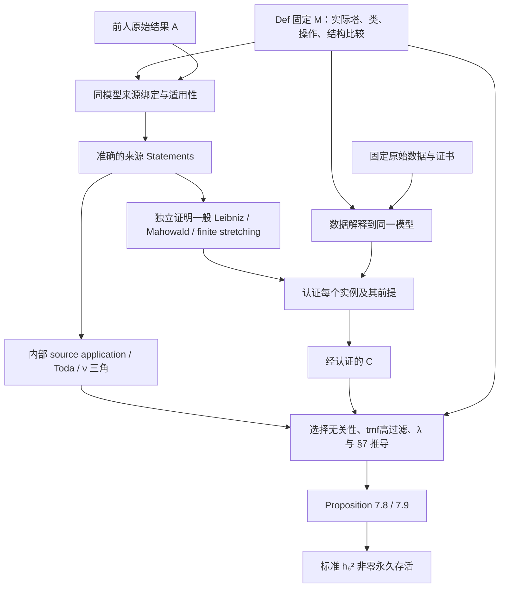

# KIP126 第 0 步独立审查：876865e，重点 A(M)

审查日期：2026-10-06。所有源码及原文行号均对应下述冻结提交；报告写回用户工作树，但不以其未提交修改为审查对象。

## 1. 独立结论

**总评：第 0 步未完成。** 已确认的接口阻塞是：缺少显式接收同一文献/计算交付、保持其依赖关系、得出标准 T 的条件最终声明。当前有准确的标准 T，有部分参数化的中间声明，也有使用同一全局临时见证的开发证明路径；这三件事尚不等于已经声明所要求的 `A(M) ∧ C(M) → T(M)`。这里要求补的是合同及消费连接，证明可以暂用 `sorry`，不要求现在完成第二阶段，也不要求改变获准保留的无参数开发目标。

**尤其就 A(M) 而言，本次没有在已直接比对的 Pstrągowski、BHS、BX、Xu/IWX、May 2001、tmf 核心条款中确认“把本文关键结论冒充前人结果”的错误。** 当前源码比旧路径/旧包的名称所暗示的更谨慎：`Statements`、来源绑定、内部 `Application` 和最终消费 `Inputs` 已经分开；`Inputs` 本身不是纯 A。BX 总边界式、BHS 提升的量词、May 的负号、tmf 存在性与普遍性之间的区别，都不能仅凭接口名称下结论。

但是，**A 的全部覆盖及精确原文强度仍不能宣布核验完成**。Moss 原始 Theorem 1.2 未取得；完整 Adams/May 一线包缺逐字段原始定位；Toda 1962 原著未直接核读，虽其 synthetic 适配已正确留在内部证明责任中。固定 synthetic 来源实现也未完成，应记作来源识别的可审计性限制及模型构造债，不能将注释当成完成识别，也不能单凭整个构造仍 `sorry` 判接口错误。

| 硬标准 | 本次判断 | 判断边界 |
|---|---|---|
| M/T 同一数学事实 | 已展开的核心定义与 §7 指定谓词未发现阻塞 | 标准 Milnor 类、实际球谱塔、共同无限循环代表、E∞ 非零、associated graded 检测和辅助对象比较均有准确语言；模型构造、比较证明未完成。不是全库一致性证明。 |
| C 的准确性与完整性 | §7 主要有限需求未发现已确认漏项；整体证据仍不足 | 逆查所得需求有直接条目或明确 Main 推导出口；七个大型原始制品仅有 LFS pointer，未直接核查 DB；未穷尽全部附录和所有额外例子。canonical manifest 的实际计算来源链有具体缺口。 |
| A 的准确性与可用性 | 多数核心条款有原文支持；整体证据不足，条件消费合同缺失 | 不把内部适配 `sorry` 当原文结论，也不把历史来源状态当本次核验。详见第 4 节。 |

以下“未发现错误”均限于明确列出的阅读范围；没有将抽样、文件哈希、导出一致或声明存在升级为数学认证。

## 2. 基线、版本、操作和材料

### 2.1 冻结基线

- 实际查询远端 `https://github.com/SII-MATH/KIP126.git` 的 `refs/heads/develop`，取得完整 SHA：`876865e013ebd6ac0b7980db1af1cdfa9f53c929`。不是 prompt 参考的 `06144c3…`，也没有切换到 main。
- 原工作树：`/inspire/hdd/global_user/baokangjie-CZXS25250151/KIP126-develop`；隔离 detached worktree：`/tmp/kip126-stage0-876865e`。所有审查分工使用这一快照。
- 已读适用 `AGENTS.md`、`README.md`、`PROJECT_BOUNDARY.md`。现架构无 Challenge1：Def 固定背景，`Interface/Challenge/Challenge2.lean` 交付相关联的 literature/computation，Main 消费唯一临时公理。旧入口缺失不作为数学缺失证据。
- 保留用户已有九个 tracked 文档/blueprint 修改及既有 untracked 目录、报告、工具；未改 Lean、论文、数据、生成文件、依赖、CI 或旧报告；未提交、推送或创建 PR。
- 仓库允许无参数开发 Final，与本次要求并不矛盾；`PROJECT_BOUNDARY.md` 仍明确要求保留外部前提的条件最终定理。不能用开发例外免除条件合同。

### 2.2 版本和实体

| 项目 | 本次固定值 / 状态 |
|---|---|
| Lean | `leanprover/lean4:v4.32.2` |
| Mathlib | `v4.32.2`，manifest rev `905b95818eb32af7874a58b427f50c1711a5e96c`；依赖 manifest 的具体 rev 亦固定，不能因某个 inputRev 名为 main/master 就称依赖未 pin |
| 主论文 | 本地 `MainPaper/main.tex`、`112.tex`、`2412.10879.pdf`；清单指向 arXiv `2412.10879v2`，但 TeX 是标签规范化副本，本次以固定字节为准 |
| 主论文 TeX SHA-256 | `828ee5a5aa06e1f390b036a043230ed417446fa7be11a4e27eecc4a565135c4b` |
| 主论文 PDF SHA-256 | `7cae269851a88d10dd194651dbf7497b75ef8b8b914bc1901dfa3734cd8096b4`；内嵌 CreationDate 为 `20260708081722Z`，未声称这是未改动的 arXiv 原始下载 PDF |
| 程序/数据 | Zenodo `14875701` / `v126.3.cw49`；sphere internal degree `t ≤ 261`，Cν 数据库名称上界 `t200` |
| 精选导出 | `KIP126/LinProgram/Route/selected.json` version 1；SHA-256 `5f12d2bf25b1c5e2fcf29fe1328d444c3d6fd3c058ca74d8fbc317fb93cb4e64` |
| 筛选脚本 | `KIP126/LinProgram/Translate/select-route.py` SHA-256 `0b4b0fb2c66b484de8c42c5a32c202c567888417f107a072c1c05564bbdc64dc` |
| LFS | `proofs.db`、S0/Cν 两个 AdamsSS DB、Cν→S0 map DB、三份 S0 E2 CSV 均只有 130–134 字节 pointer；`ss.json` 为实际实体。隔离快照、原工作树及所检查的其他本地副本均未发现这些 DB 实体 |
| 文献实体 | MainPaper/Source 所列 PDF/TeX/text 为实体，不是 LFS pointer；Moss、Toda 原著及部分老文献不在本地全文集中，见第 4 节证据等级 |


| 来源 | 出版/获取身份；本次不推定未记录的 vN |
|---|---|
| Pst | Inventiones 2023，DOI `10.1007/s00222-022-01173-2`；arXiv `1803.01804`，本地source-status未给vN |
| BHS | Acta 2023，DOI `10.4310/acta.2023.v231.n2.a1`；arXiv `1910.14116`，采用本地TeX labels定位 |
| BX | DOI `10.1007/s00222-024-01298-6`，清单出版年2025；arXiv `2302.11869`；文件名kervairev2不单独作为arXiv v2的证据 |
| Xu | Geometry & Topology 2016，DOI `10.2140/gt.2016.20.1611`；arXiv `1410.6199` |
| IWX | Publications Mathématiques 2023，DOI `10.1007/s10240-023-00139-1`；arXiv `2001.04511`；采用本地TeX及Adams-classical E2/Einfty CSV |
| tmf / BMQ | Geometry & Topology 2023，DOI `10.2140/gt.2023.27.2763`；arXiv `2011.08956`；接口说明为v4，本次按本地tmfhi9.tex及图的固定字节核查 |
| BHSmot | arXiv `2010.10325`；本地Filtered/Deformation章节，source-status未给vN |
| May01 | Advances in Mathematics 2001，DOI `10.1006/aima.2001.1995`；本地原PDF |
| BR21 | AMS书2021，DOI `10.1090/surv/253`；本地为作者preliminary书稿，使用printed/PDF双页码，未混用另版页码 |
| Ravenel | 1986书籍，作者托管本地PDF，printed p.87/PDF p.107；未推定所有印次内容完全一致 |

### 2.3 实际执行的检查

从标准 Final、Proposition 7.8/7.9 和 §7 逆向阅读定义、应用、计算需求，再核对 §§3–6 的被用工具及外部前提。主审重点直接展开 `Interface/Challenge/Literature/Route.lean`、`Def/Kervaire/Route/SourceLanguage.lean`、来源适配、canonical convergence、synthetic lift、模型背景、StageInput 和 Final；与 M/T、C、接线三个分项审查交叉核对关键结论。

直接阅读的主要原文是：Pst 的 synthetic 构造/三角/局部化/完备化段落，BHS 的 Lemma 9.15、Appendix A 及低 stem 环，BX Proposition 7.19 所在命题及证明、商代数构造，Xu 的 order-two 结论，IWX 的 stem62 表和 Toda 段落，May 2001 TC3/Lemma 4.6，tmf 的 Figure 1.1、§2/§7，BR21 Table 5.4/Theorem 5.18，Ravenel Theorem 3.4.5(a)。PDF 用本地提取并对所需图表作图像阅读；不把只搜到的书目当原文。

有限机械检查包括：109 个 canonical 文献 artifacts 实体/哈希一致；静态 import 闭包；selected.json 的度唯一性、坐标合法性、522 个 core 度 F₂ 秩；生成 differential 文件哈希；LFS pointer OID 与 selected 所记哈希一致；`ss.json` 实体哈希一致。这些检查只支持各自的字节/结构结论。

**没有执行**全量 build、`#print axioms` 编译审计、原始 SQLite 查询、完整 proof replay、`select-route.py --check` 重生成或计算认证。没有把其他提交的 build 记录当当前提交证据。未逐条读完附录 401 行、所有额外例子、全部经典基础文献及每个 `sorry` 的预期证明。

## 3. M/T 对象绑定和目标语义

代码目录默认相对仓库内 `KIP126/`；表中较短的路径按该行模块目录解释，下面的关键问题均给出完整路径。

| 对象 | 实际定义及来源 | A/C/T 接合与状态 |
|---|---|---|
| classical 范畴、球谱 | `KIP126.Implementation`，`Def/StableHomotopy/Implementation/Data.lean:275`；同包 `foundationInput/sourceComparison/sourceTensor`。球谱为幺半单位 `StableHomotopy.SphereSpectrum` (`Context/Data.lean:127`)。 | `Def.fixedImplementation` (`Implementation/Fixed.lean:7`) 是 `implementation_exists` 的一次 choice。存在证明 `Def/Solution/Implementation.lean:8` 未完成，但类型明确要求实际源比较；不能说已构造，也不能说任意载体。 |
| classical 源识别 | `SourceCategory` 是实际 sequential prespectra 的 stable-equivalence localization (`Implementation/Prespectrum.lean:145`)；`CompletedSpectrum` 是 HF2-local 对象 (`Completion.lean:109`)，completion 的 universal property 在 `:124`。 | `SourceComparison` (`Comparison.lean:27`) 固定 completed sphere、suspension、cofiber 两箭头、同伦群/加法、HF2 与 unit；`TensorComparison` (`Tensor.lean:43`) 固定同一实际 smash。准确识别声明已存在，证明待完成。2-complete sphere 的单独识别为 `completedSphere_twoComplete`/`completedSphere_moore_universal` (`Completion.lean:153,156`)；没有对任意 unbounded spectrum 偷换 HF2-local 与 Moore-complete。 |
| H𝔽₂ / π | `FoundationInput` (`Implementation/Data.lean:50`) 给 π0≃+ZMod2 和其他同伦群消失；同包 `CooperationInput` (`:144`) 给 ring/Künneth/Milnor basis 及 `coordinates_eq`。 | `standardFoundation/standardMilnorCooperations` 均投影同一个 `Def.StageInput.witness`。一般 π 是 `Sphere n ⟶ X`，`HomotopyGroups : AddCommGrpCat` (`Context/Data.lean:133,136`)，未把一般同伦群变成 F2 向量空间。内部页用 `ModuleCat ℤ`；Milnor/CSV F2 结构通过明确整数线性等价连接。 |
| actual Adams tower | `adamsTower` (`Def/ClassicalAdams/Tower/Data.lean:41`) 反复取 `X → H⊗X` 的 fiber；其页、微分来自 tower。 | `sphereAdamsModel` (`Def/StageInput/StandardSphere/Sequence/Data.lean:13`) 直接 specialize 此 tower。`sphereAdamsData` 同时用于标准 T 和 C。不是自由选序列。 |
| 页编号、次数 | `adamsTowerPreSS` (`TowerSSData/Differential/Data.lean:33`)：`r₀=2`，`diffDeg r=(r,r-1)`。底层 tower 也构造 E1。 | h6∈E2^(1,64)，h6²∈E2^(2,128)，stem=t−s=126；D12 靶 `(14,139)` stem125；C3 源 `(8,134)` stem126。均与论文一致。 |
| standard h6² | `standardH6Square` (`Def/StageInput/StandardSphere/Classes/Data.lean:21`) = `Sphere.Internal.hiSquare H M 6`。`SphereClasses/Hi/Internal/Data.lean:32` 通过 `internalClassOfCocycle` 取真实 cocycle；`SphereClasses/Data.lean:31` 展开为 E1 同调商→真实 E2。 | Milnor cochain 是 `[ξ1^64\|ξ1^64]` 的 cup；`CobarCupCalculus.standard_squares` (`Def/Comparison/StageInterfaces.lean:520`) 及 `Proofs/Cobar.lean:27` 明确 square/cup。该定义不需要 CSV；标准 E2 非零 `standardH6Square_ne_zero` (`Classes/Proofs.lean:8`) 不冒充永久性。 |
| 程序 h6² / 乘法 | `SphereSquareInterface.standard_class` (`Interface/Challenge/Computation/Sphere.lean:173`)；`LabelsCorrect.h6_square` (`Interface/Challenge/Computation/Route.lean:30`)。 | `computedH6Square_eq_standardH6Square` (`Main/Solution/Computation/Comparisons/Classes.lean:9`) 只投影同一 Challenge2。`ComputationResults.route_presentation` (`Interface/Challenge/Computation/Delivery.lean:50`) 把 route interpretation 与 sphere presentation 绑在一起。标准 T 不依赖重写至计算类。 |
| cobar / tower / synthetic 乘法 | `Sphere.Internal.product` 是 cobar cup 经固定 Milnor comparison 传回 E2 (`SphereClasses/Product/Data.lean:17`)。 | 不能把该定义称作已证明 tower pairing comparison。实际塔乘法另由 `SphereMultiplicativeInterface` (`Interface/Challenge/Computation/Sphere.lean:67`) 固定所有 bounded second-cycle representative 的实际 firstProduct；route `ProductCorrect` 另接 `Sphere.Internal.product`。synthetic/homotopy 乘法由 `Model.multiplicationCompatible`、`FirstQuotientMultiplicationCompatible`、有限 quotient 配对等绑定。比较声明与计算认证/结构证明须分别保留。 |
| synthetic ν/λ/ρ/δ | `SyntheticCategory` (`Def/Synthetic/Context/Data.lean:28`)；λ 真正为 natural transformation，`lambdaPow :51`，`XModLambdaN :74` 为其实际 cofiber；`NuFunctorData :83` 绑定 unit 与 νΣ≅Σ^(1,1)ν。 | `ModelData` (`Route/Model/Data.lean:37`) 持有同一 ν、recovery、family、first quotient、quotient tower、normalized maps；`Model.comparisonCompatible` 固定 rho 及 naturality。finite quotient 标签 `quotientLabel :92` 由实际投影诱导，未独立选取。 |
| synthetic Adams / detection | `Model.towerPresentation` (`Route/Model/Coherent/Data.lean:18`)；`TowerPresentation` (`Synthetic/AdamsSequence/TowerComparison/Data.lean:36`) 给双方 SSData morphism、逆、全部 cycle/boundary 与 dr 及 E2 naturality。 | `Model.convergence_canonical :22` 针对同一 presentation；`TowerConvergence.Canonical` (`Synthetic/AdamsFiltration/Convergence/Canonical/Predicates.lean:17`) 将 E∞ identification 锁在 actual tower lifts/J 上。经典 `TowerDetection.Convergence.canonical` 同样明确 (`ClassicalAdams/Detection/Convergence/Data.lean:12`)。并非任意 graded iso 就算 detector。 |
| η、ν、Cν | `AuxiliaryData` (`Route/Objects/Data.lean:13`)；Cν 定义为同一 `nuMap` 的 cofiber (`:35`)，`nuRouteTriangle :74` 的 bottom/top 是 `cofibι/cofibδ`。 | `ClassicalSourceBinding` (`Route/SourceLanguage.lean:501`) 给 source η/ν 及 normalized_eta 的严格对象绑定；source 的 h1/h2 检测另属 A。`standardRouteEta` (`Background/Fixed.lean:34`) 是同一实际 normalized lift 的 regrade，`standardEtaExponent` 是明确待证性质。`NuCofiberLiftBinding` 与 `NuCofiberApplicability` 精确识别三支箭头；其内部组装不应冒称 Pst/BHS 原文定理。 |
| tmf / unit / labels | `standardTmfTarget` (`Background/Fixed.lean:17`) 使用 D.auxiliary.detector；`standardTmfTarget_unit :25` 保持实际 unit。 | `Bindings.tmfSource/tmfBinding` (`Interface/Challenge/Literature/Route.lean:603`) 独立保留 source 比较；BHS completion detector iso/unit 为 `:612`。同一个 `tmfLabels` 被 A 和 C 消费。该绑定的来源强度见本报告 A16。 |
| 固定球完备与分离 | `standardSphereApplicability` (`Def/StageInput/StandardSphere/Sequence/Proofs.lean:11`)；`BHSObjectApplicability` (`ClassicalAdams/Convergence/BHS/Predicates.lean:21`) 明确 ENilpotentComplete 和 strong convergence。 | 固定源上的内部 theorem `sorry`，不是给任意模型无条件的 BHS；`standardSphereSeparated :21` 为后续同一 sphere 分离义务。正确而未证，归构造/比较证明债。 |

### 3.1 标准目标及 §7 谓词

`KIP126.Solution.Final.H6SquarePermanent.h6_sq_permanent`（`KIP126/Main/Solution/h6_sq_permanent.lean:18`）与 Challenge 的类型相同：

```lean
NonzeroSurvival sphereAdamsData (2, 128) standardH6Square
```

`KIP126.Core.SpectralSequence.NonzeroSurvival`（`Def/SpectralSequence/Permanence/Predicates.lean:28`）要求一个共同 `Z∞` 代表，其 E₂ 投影等于指定类，且其 E∞ 投影非零。实际塔的 Z∞/B∞ 使用有限循环交/边界并，相关比较在 `KIP126/Def/ClassicalAdams/TowerSSData/Permanence/Proofs.lean:98,133`。这不同于只说没有出微分、有限 E1000、或每页另选不相容代表。

次数约定：经典 `(s,t)`，stem=`t-s`，`d_r` 次数 `(r,r-1)`；`h₆` 在 `(1,64)`，平方在 `(2,128)`。synthetic `(s,t,w)` 的标准 E₂ 标签权重 `w=t`，乘 λ 只减权重；同伦使用 `(stem,weight)`。BX 使用 `(stem,filtration)`，转换为本项目 `(a,b)↦(a,a+b)`；BX 三角悬移 `(1,-1)` 转为项目 `(1,0)`，故总边界的 BX 靶 `(1,-2)` 转为 `(1,-1)`。不能按相同符号直接混用。

`Def/Kervaire/Route/Conditions/Predicates.lean` 当前逐项正确区分：

| 谓词 | 实际语义 | 状态 |
|---|---|---|
| `D12`，:24 | `HasNonzeroDifferential 12`，源 `(2,128)`，靶 `(14,139)`；非零位于 **E12** | 与主论文一致，未用 E₂ 非零替代 |
| `C3`，:30 | `HasDifferential 6 (8,134) (14,139) W 0`；要求真实 E6 代表 | 不会因没有延续代表而空泛成立 |
| `C4` | 存在 `ThetaChoice`；平方在 synthetic `(10,134,128)` 的 `DetectsNonzero` | 非零 associated graded，未硬编码任意代表严格相等 |
| `C5` | 存在非零检测的 `UChoice`；其 λ³η 倍数在 `(14,139,133)` 用 `Detects` | C5 的目标检测允许零，不与 C4 混同 |
| 任意选择版本 | `KIP126.Solution.Near126.Thm7_3BJMBX.any_choice_criterion`、`c4_c5_choice_equivalence` | Main 的准确待证命题，需存在性/不定性论证；Prop 定义不是证明 |
| finite stretching | `KIP126.Kervaire.Route.Tools.FinitePageExtensionStretchingLaw`，`KIP126/Def/Kervaire/Route/Tools/PageExtensionStretching.lean:28` | 要求后页 cycles 和无 shorter nonliftable crossing；只给有限关系，未承诺无限相容提升 |

没有把几何 θ₆ 存在、阶数或 framed manifold 结论加入 T。`homotopy_lambda` 的输入已经是实际无限同伦类，只断言允许零的 associated graded 检测；它不创造无限提升、不保证非零。BHS `SynRevAdams.tex:369–381` 的 filtration/reduction 因子化支持其一般比较含义。`TodaTensorInterface` 的 tensor 左右字段本身显式保留 `CommShift`/`IsTriangulated`（Implementation/Data.lean:255），也未发现因外层实例较弱而丢 exactness。

## 4. A(M)：逐来源、逐字段审查

### 4.1 本提交中什么才是 A

下文采用两个路径缩写：

- **LR** = `KIP126/Interface/Challenge/Literature/Route.lean`，其中完整命名空间为 `KIP126.Literature.Route`。
- **SL** = `KIP126/Def/Kervaire/Route/SourceLanguage.lean`，其来源语言也在 `KIP126.Literature.Route`。

`KIP126.Challenge2.LiteratureResults`（`Interface/Challenge/Literature/Delivery.lean:21`）的五项是 `sphereVanishing`、`adamsOneLine`、generic `moss`、`br21`、`route`。`route` 的来源结果是 LR:633 的 `Statements` 九项。与它相关的 `Bindings` 保留选定源、同模型比较和实际适用条件。

LR:582 的 **`Inputs` 不是纯 A(M)**：它把外部来源、Def 结构、内部适配，以及用 C 推导的 tmf high125 结果组合起来。`Main.StageInput.routeLiterature`（`Main/Solution/StageInput.lean:95`）实际调用 `Statements.toInputs`，后者显式要求 `Application` 和内部 `TmfInputs`。不能把整个 `Inputs` 在分类表中笼统标为“外部公理”。

证据等级：**原文**=本次直接核对对应原文；**原文＋适配债**=原始结果已读，同模型传输/内部推论仍未证；**二手**=只由另一论文转述该老结果；**元数据/未核**=未取得或未定位到所需原始条款。仓库历史 `route_review.status` 不改变本次等级。

### 4.2 从论文消费点反向提取的 A 覆盖矩阵

| 编号 / 消费位置 | 原始结果、范围与精确定位 | 项目表述、适配和消费者 | 本次判定 |
|---|---|---|---|
| A01，§3 synthetic 背景；全文工具 | Pst `Source/Pst/source/synthetic_spectra.tex`，Definition 4.6，Lemma 4.23（:2114），τ 局部化 :2289、:2405，hypercompletion :2835–2874；Adams-type E，取 HF₂ | `Model`、实际 ν/λ/商/塔；`Def.Solution.standardRouteInput` :26；Background 的 realization/monoidal/νE₂ 比较 | **原文＋构造债**。允许抽象背景；没有声称完成了 ∞-site 构造。单独来源识别类型较弱，见 P01 |
| A02，§3 :759、:912、:929；§6 Mahowald 的三角前提 | Pst Lemma 4.23 要求同伦 cofiber 序列对应 E-homology short exact；BHS `SynRevBigraded.tex:86–118` Lemma 9.15 要求正 Adams filtration，证明构造相容 connecting lift | LR `SyntheticSourceInputs.lifts`；SL:73 `SyntheticLiftInput`；Implementation/Data.lean:487–554 的 lifting/cofiber/triangle 条款 | **原文**。`triangle_lift` 有 BHS proof 的直接支持；两种 full lift 差为 λ-torsion 是 factorization 直接推论，不应仅因 LWX 再陈述而判新定理偷渡 |
| A03，§3 Theorem 3.7；有限商与扩张工具 | BHS A.1(1a–c)，`SynRevBigraded.tex:149–162`；`SynRevAdams.tex` canonical tower 和有限页分析；d₂…d_q 消失↔lift mod λ^q，合适 lift 的 Bockstein 为 −d_(q+1) | LR `finite_lift`,`bockstein`；SL:306、317；使用同一实际 ρ、firstLabel、HasDifferential | **原文＋比较债**。cycles 可含零/边界，不错误要求非零存活；Bockstein 只断言存在合适 lift。符号在模2 E₂ 消去，不能推广为整同伦群无负号 |
| A04，§3 A.1 的无限部分；§7 λ-torsion/detection | BHS A.1(2),(3)，同文件 :149–177；原始条件为 E-nilpotent complete + strongly convergent ASS；every lift 的寿命与 some lift 的 torsion 分开 | LR `permanent_lift`,`BHSRealizationSourceResults` :368；`RealizationDetection` :305；完成对象和传输由 BHSCompletionData/Comparison 单列 | **原文＋适配债**。寿命 `λ^(r−1)` 对应非零 E_(r+1)；被 d_r 打中只保证**某个** lift 被 λ^(r−1) 杀。未误写所有 lift |
| A05，§3 Theorem 3.6、E∞ 公式；§4–7 页语言 | BHS A.8/A.9/A.11，`SynRevAdams.tex:73–137`，labels `thm:synth-ASS`,`cor:synth-ASS`,`cor:synth-ctau-ASS` | LR `differentials`,`eInfty`,`e2_weight_vanishing`,`finite_quotient_page_vanishing`；SL:338，EInftyLabelAgreement:86 | **原文＋比较债**。`d_r(x)=y` 对应 `d_r(λ^kx)=λ^(k+r−1)y`，权重相同；有限窗 `0≤t−w<q`，E∞ 为相应 Z/B；包含 λ/ρ/共同标签兼容，非任意商同构 |
| A06，§7 过滤与 λ-divisibility | BHS `SynRevAdams.tex:324–333`，`cor:tau-surj`，保持完备/强收敛；指数非负时 filtration 等同 λ-divisibility | LR `filtration_lambda`；SL:363 的 `w−m≤s`；completion 比较后才得 selected-model 版本 | **原文＋适配债**。没有以一般等式预设 θ₅² 的局部过滤结论 |
| A07，§7 从 realization 核得有限 λ-torsion | Pst full category compact generators :2014–2018，τ-inversion telescope :2289–2305；full→hypercomplete adjunction :2835 起 | LR `RealizationKernelSourceResults` :410；SL `RealizationKernelSourceData` :824、Binding:859；Interface `realizationKernel_of_source` | **原文＋直接推论/比较债**。compact sphere → telescope 的零元素在某有限级消失；不把 completed sphere 当 compact。代码有 actual adjunction、λ 幂和 realization-zero 比较 |
| A08，§3 :785；§6/7 商中乘法、restriction | BX `cnstr:bock-maps`，`kervairev2.tex:171–185` 给一整塔 commutative algebras 和 restriction/cofiber；BHSmot `Filtered.tex:94–110`,`Deformation.tex:504` 支撑 filtered/synthetic 背景 | SL `QuotientAlgebraStructures` :898；`QuotientAlgebraBinding` :964 的 sphere action/restriction；进入 Def.Background.algebra/quotientBinding | **原文＋构造债**。不只核了 Cλ 而误称全部 λ^q；BX 明确给全塔。原文存在不自动认定任意 TR3 filler 是 ring restriction，代码另列比较。其数学来源须仍记账，不能因移入 Def 消失 |
| A09，§6 May lemma :1755–1777 | May 2001 *The Additivity of Traces in Triangulated Categories*，本地 PDF pp.12–14，TC3 与 Lemma 4.6；tensor/triangulation compatible，六个 pushpull squares | LR `MaySourceResults` :183；SL `MayContext` :521、`MayPushpullData` :535、SignedBoundary:553；Main generalizedMahowald | **原文**。保留 boundary 的负号；投影后消号需额外 exponent-two 条件。无依据接受一般 unsigned 同伦恒等式 |
| A10，Theorem 7.3/Remark 7.4 :2110–2138；7.8 :2301 | BX Proposition 7.19，`kervairev2.tex:587–605`；区分命题的有限判据及证明里的 `δ₁(h₆²)=ληΘ₅²`、permanent-cycle iff | `BXDistinguishedInput` SL:250；`BJMOriginalCriterion`、`BJMTotalBoundaryIdentity`、`BJMUntruncatedCriterion`（Theta5/Synthetic/Predicates.lean:36,55,61） | **原文＋直接适配债**。只给一个相容 θ；标准类非零及无 incoming 将 permanent cycle 转成项目非零版本。不能仅看命题正文便误报总边界式没有来源；也不能把 LWX λ 规范化/任意选择版本混入此输入 |
| A11，θ₅ 存在与经典二阶性；§7 :2136、:2233、:2536 | Xu `theta5_arxiv.tex:134–136` Corollary 1.3 给**存在** order-two θ₅；IWX intro 的 π62 表和 E∞ 数据给 `(Z/2)^4`，其余生成元 AF6/8/10 | LR `ClassicalSourceResults` :113，`classicalInputsOfSource` :152；源 convergence、η、ν 与 D 有等式绑定 | **原文＋适配债**。所有经典 π62 元素 exponent two 来自 IWX，不是 Xu 单独给所有 θ。AF3–5 无关联 graded 给两 θ 差落 F6；synthetic order two/no λ-torsion 归 C+Main |
| A12，Hopf η/ν、2 标签 | BHS `SyntheticTodaRange.tex:49–126` 及 :149–160，低环中 h̃₀/η/ν 的唯一性；经典 IWX 低维表，标准 h₀/h₁/h₂ 检测 | LR ClassicalSourceResults 的 two/eta/nu detection 与 η/ν permanent；Bindings.classicalBinding/synthetic_eta | **原文＋比较债**。实际几何 η/ν 与 normalized η 有独立 binding；不从名字推检测 |
| A13，§7 低 Toda 与消低不定性 | BHS Proposition `prop:syn-toda-range`，同文件 :49 起：λh̃₀=2、h̃₀η=0、低 stem 环；适用所指定标准低类 | LR `TodaSourceResults` :234：h0_label、lambda_h0、h0_eta、low_indeterminacy | **原文＋适配债**。`h̃₀·π_(2,3)=0` 是低环后果；这不证明高 stem Toda bracket 不定性为零 |
| A14，§7 对称 Toda 操作及 bracket shuffle | Toda 1962 Theorem 3.6 原著未读；IWX `more-stable-stems-Toda.tex:17–46` 给 **C-motivic** theorem/cor:2-symmetric，其结论 `<2,β,2>` 包含 τηβ | LR `TodaApplication` :243；SL `TodaSecondaryComparison` :628；`Main.StageInput.todaSecondaryComparison` :62 | IWX 为**本次直接读到的 motivic 原文**，对 Toda1962 属二手；synthetic λ²ηθ 不能直接从 motivic τ 符号替换得到。当前作为内部准确待证适配，不是 A 加强。原著缺口影响来源路线确认，不把该 `sorry` 自动判阻塞 |
| A15，§7 Moss 应用 :2536–2555 | Moss 1970 Theorem 1.2；本地只有 metadata，本次在线原始入口也未取到 theorem 正文 | LR `MossSourceInput` :484；`SphereMossCrossing`；root `StandardSphereMossStatement`；Main `theta_b_moss_no_crossing`,`synthetic_theta_b_toda` | **证据缺口**。源码保留 order-two/composites、Massey defining system、两个 product 度的无 crossing、ResidualInjectivity；但精确 crossing 量词与原 theorem 不作已核实结论 |
| A16，7.8 三次 tmf 排除，:2342 等 | BMQ *The 2-primary Hurewicz image of tmf*，本地 `tmfhi9.tex` v4，Figure 1.1、§2、§7 :1749–1774；2-local connective tmf，π62=0，κ̄、w 检测 g/Δh₁g，κ̄⁴w 在 stem125 非零 | LR `TmfSourceResults` :438；SL `TmfSourceData` :1014、high125:1026、Binding:1035；Main `tmf_inputs_of_computation` | **原文＋2-completion/比较债**。源是选定两球谱类的**实际乘积**像非零；不是所有检测 g⁴Δh₁g 的类都非零。IWX E₂ 表在 `(4,24),(9,54)` 各一非零类支持标准标签。强 high125 检测由 C+消失线+分离+乘法比较在 Main 推导 |
| A17，计算认证可能用到 tmf d₃；附录 :2791 | BR21 作者书稿 Table 5.4/Theorem 5.18，printed p.196/PDF p.213；本地 paper.txt:26878–26936 | `LiteratureResults.br21` 是实际源 tmf 上 `HasDifferential 3 (16,112) (19,114)`；BR21 源类经 detectorIso 与 C 坐标绑定 | **原文＋坐标比较债**。原靶为 βg⁴；选定 β⁵g 需另做商关系比较，项目保留了这一步。只给方程，不添非零 E3 存活 |
| A18，超过有限数据范围的 tail | Ravenel *Complex Cobordism…* Theorem 3.4.5(a)，printed p.87/PDF p.107：`0<stem<2s−ε`，ε≤3 | `KIP126.Classical.Adams.SphereVanishingLine`（Def/ClassicalAdams/SphereVanishing/Predicates.lean:14）；Main finite→permanent、stem125 tail | **本次直接读书中原陈述**。项目采用较保守 `0<stem<2s−3`，排除 stem0 的 h₀ tower；未冒称读过 Adams/May 最早原论文。same tower 比较和固定sphere分离另归内部 |
| A19，root 完整一线包与额外低维结果 | Adams58/60、May thesis；canonical metadata 的 May 条目实际指1966 J. Algebra 文章，不能代替1964 thesis准确页码 | `KIP126.Challenge2.AdamsOneLineInterface`（Sphere.lean:99–129）：幂次一维、其余零、永久 iff j≤3、j≥4 非零 d₂、若干低乘积/平方永久 | **元数据/未核全族原文**。次数/范围未发现错误，且没有沿用主文 j≥3 的明显反向笔误；但每个原始定理/页码未核完。不能把这包记作全部来源已确认 |

Moss 获取记录：本次访问 [Moss 原出版页](https://link.springer.com/article/10.1007/BF01129978) 只取得书目信息及订阅提示；EuDML 原条目超时。没有把现代论文、搜索摘要或 IWX 引用当作已阅读 Moss Theorem 1.2。Toda 原著章节入口亦未返回可读 theorem。May 2001 则已从本地原 PDF 直接阅读，与 [作者提供的论文](https://math.uchicago.edu/~may/PAPERS/AddJan01.pdf) 对应。

### 4.3 `Inputs` 十字段与 `Applicability` 两字段的分类

| 完整字段（均前缀 `KIP126.Literature.Route`） | 展开后的责任归属 | 核查结果 |
|---|---|---|
| `Inputs.classical` | A 的 ClassicalSourceResults + 同 convergence/η/ν 的内部 binding；五项 theta5_exists、stem62_exponent_two、theta5_filtration_gap、two_detection、hopf | 已逐项区分经典/合成、存在/所有及检测 |
| `Inputs.bx` | A 的一个 distinguished BX θ 及原有限/总边界/无限结论 | 未把任意 θ 或规范化有限版本直接接受 |
| `Inputs.synthetic` | BHS 来源字段；无条件 selected-model permanent_lift/filtration_lambda 由完成比较适配；realization_kernel 由 Pst source 传输 | 不等同于原 theorem 全部无假设 |
| `Inputs.realization` | RealizationCoordinates 是实际 source→model数据；四 detection/lifetime 条款从 BHS source+comparison得到 | EVERY 与 SOME 分开，指数正确；canonical convergence 排除了任意 E∞ 同构 |
| `Inputs.algebra` | Def.Background.algebra 中的对称结构/实际商代数/detector代数 + 内部 quotientBinding | 来源已能定位；构造并未完成。属于允许的结构及其来源义务，不是指定局部乘积表 |
| `Inputs.may` | May pushpull source + SignedBoundary；依赖真正 tensor exactness/shift | 负号保留；不能无条件替换成 unsigned |
| `Inputs.toda` | A 的低环四式 + Main TodaApplication 两个 membership | 后两项是内部适配；高维不定性另证 |
| `Inputs.tmf` | A 的 tmf source + C、vanishing、separation、产品检测比较 → Main TmfInputs | **不是外部输入**；high125 stronger conclusion没有进入Challenge2 |
| `Inputs.moss` | 经典 local MossSourceInput 经同 convergence迁移，MossInput并未自带本文所需计算无crossing | 原文证据缺口；经典→synthetic bracket是Main义务 |
| `Inputs.applicability` | `Applicability.moss` = `MossTowerApplicability`；`Applicability.nuCofiber` = actual normalized ν三角条件 | 前者是 residual/tower适用性；后者独立内部 construction，未预设 Lemma7.19 ν-extension |

### 4.4 `Bindings` 和 `Application`：存在结果如何落到同一个 D

LR:596 的所有 binding 字段均已阅读，不能把“原文某个对象存在”当“固定 D 自动满足”。

| 字段组 | 精确绑定内容 | 当前证明责任 |
|---|---|---|
| `todaSource` | 固定同一 h̃₀；A 的四个低环式及 Main secondary comparison 均用它 | 按 BHS 选取标准低类；不是任取 h̃₀ 后无条件应用 |
| `kernelSource`,`kernelBinding` | full source 范畴/localization、completion⊣inclusion、同伦加法同构、λ幂相容、realization_zero | source存在/比较未完成；已有适配证明消费这些准确条件 |
| `classicalSource`,`classicalBinding`,`synthetic_eta` | 同一 classical convergence、几何 η/ν、normalized η 等式，及 EtaChoice | 经典结果不自动给任意 synthetic lift；此处明确承担识别 |
| `tmfSource`,`tmfBinding` | 同一 tmf谱、actual unit、g/Δh₁g标签、sphere convergence、选定κ̄/w | 2-local→2-complete及同模型运输未完成；具体检测结果另在A |
| `bhsCompletion` | 每个相关经典对象的完成体、实际 q 和 canonical convergence | 不仅“存在一个完成” |
| `completionApplicability` | 完成体的 ENilpotentComplete、strong convergence以及map mod2 equivalence | 内部适用性，不删除BHS假设 |
| `completionComparison` | permanentCycles、first quotient image、filtration、有限λ-divisibility的同map比较/反射 | 精确而较强的内部待证比较，不是原文无条件额外定理 |
| `realizationComparison` | 同一 q/νq 的 survivor/hit、realization/detection自然性、prescribed/torsion lift反射 | 内部比较债；不能用 E₂同构自动代替所有条款 |
| `bhsDetectorIso`,`bhsDetectorUnit` | completed detector就是上述tmfSource，且比较携带同一个unit | 排除两个同名tmf各取一份的风险 |
| `nuSource`,`nuBinding` | 三条真实 normalized lift与D内选择严格对应；不只记录指数 | Main另证兼容triangle、h₂ label，见nuSourceResults |
| `moss` | 实际经典sphere tower的Moss适用性/residual条件 | 不包含本文所需的局部无crossing计算 |

LR:650 `Application` 九项：`bhsApplicability`、`bhsComparison` 是同 binding 的证书；`realization` 经 BHS comparison 运输；`may` 保留负号；`realizationKernel` 经 full/complete comparison；`moss` 经经典source比较；`toda` 由实际 secondary comparison；`nuSource` 与 `nuCofiber` 由相容 ν 三角组装。后四类并非统一叫“原文特化”就能免证。

实际 `Main.StageInput.routeApplication` 调用 `application_of_parts`，但 `todaSecondaryComparison`（:62）和 `nuSourceResults`（:67）仍是内部 `sorry`。这是明确的后续证明债；当前没有将其变成 `Statements` 外部字段。

### 4.5 必须保持的五条强弱边界

1. **BX**：原 Proposition7.19 的有限式是 ηθ² 在 mod λ^r 为零；LWX 使用 ληθ² 的 shifted finite version，靠指定次数无 λ-torsion。BX proof 已有总边界和 untruncated statement；任意 θ 版本、synthetic θ order two及有限规范化由 Main+A+C负责。BJM老文献缺全文不使已独立读到的BX来源失效，但不能声称本次重核了BJM原文。
2. **BHS**：有限cycles允许边界；survival非零另说。无限提升需要相应收敛条件。every permanent lift 的非零寿命，与 some boundary lift 的有限torsion不是同一量词。`TowerDetection.Convergence` 有 canonical 字段（Detection/Convergence/Data.lean:12），不是任意associated-graded等价。
3. **May**：TC3 中 `−id∧h′` 产生负号。当前 `MayPushpullData.boundary` 保留负号；消号出口 `may_boundary_projected_of_exponent_two` 要求投影后 exponent two。没有把所有稳定同伦群当F₂向量空间。
4. **Toda/Moss**：Massey→经典Toda、经典→syntheticToda、shuffle、乘后不定性消失是不同步骤。LR没有接受论文中的高stem zero indeterminacy；`Section7.theta_b_massey_value_and_indeterminacy`、`theta_b_moss_no_crossing`、`synthetic_theta_b_toda`、`theta_b_multiplied_indeterminacy` 保留为本文推导。
5. **tmf**：A接受某些实际球谱类的乘积 κ̄⁴w 映像非零及tmfπ62=0。`high125_detected`、F15 detector injectivity、weight130全体高过滤类穷尽由Main+C推导。普通classical E5在AF15/18仍有d5相关类，不能擅自把“synthetic weight130只有一个剩余可能”改为所有classical AF≥15除25都零。

## 5. C(M) 的逆向覆盖和认证责任

本节路径缩写：`Records.lean` 位于 `KIP126/Main/Solution/Computation/LinProgram/Route/`；`Consequences.lean` 位于 `KIP126/Main/Solution/Computation/Route/`；`Computation/Route.lean` 与矩阵内单写的 `Route.lean` 指 `KIP126/Main/Solution/Computation/Route.lean`；`Section7.lean` 位于 `KIP126/Main/Solution/Route/`。行号仍以冻结提交为准。原始行号均来自已提交 selected.json 保留的记录，非本次直接查询 DB。

### 实际 C(M) 的合同

`KIP126.Challenge2.ComputationBindings`（Interface/Challenge/Computation/Delivery.lean:13）只选择一个 presentation、一份 `routeRealization standardRouteModel`，tmf 坐标也对应已固定 `standardTmfTarget`，并与同一 literature binding 的 BR21 源类相等。其 `routeLabels`（30）由同一 realization 的四个 program image 定义。

`KIP126.Challenge2.ComputationResults`（同文件 39）是 sphereBasis、sphereMultiplicative、sphereStaircase、sphereSquare、全局导出的 sphereTable_sound、route、route_presentation；最后的等式逐 `(s,t)`（`t≤261`）把 route realization 和同一个 sphere presentation 绑定。

`KIP126.Computation.Route.Realization`（LinProgram/Interpretation/Route/Data.lean:30）不是任意谱序列：`object`（19）分别为真正的 `SphereSpectrum` 与实际 `cofib D.auxiliary.nuMap`，`sequence`（23）是这两个对象的内部 Adams 塔。decode（36）在度缺失、索引越界时返回 none，包括缺失度的空坐标，未知不解释成零。

`KIP126.Computation.Route.CertifiedRealization`（Interface/Challenge/Computation/Route.lean:54）有七个原子义务：所选全度基、sphere monomial 坐标、所选度对的全输入乘法、标准类/route/tmf labels、每条 claim、四个 bottom images、一个 top image。没有只对“命名向量”给基的漏洞：`BasisCorrect`（Interpretation/Route/Predicates.lean:41）要求与完整 F₂ 坐标空间的整数线性等价；空基同样意味着实际页面零。

`Statement`（同文件 20）给 reaches / boundaryBy / equation / refutation 四种真正数学语义；equation 是 `HasDifferential`，允许目标在该页为零，不自带非零。refutation 是该有限方程的否定，不是一个正微分。`ReachesPage`（Def/SpectralSequence/Computation/State/Predicates.lean:23）仅表示存在 r 页代表，可为零。`IsPermanentCycle`（46）仍允许最终成为边界；`NonzeroSurvival` 才是最终非零存活。第 7 节所需差异被保留。

### 本次分项审查实际执行的有限数据核对

从 selected.json 独立统计：648 个唯一度；671 claims = S0 方程 465、S0 reaches 55、S0 refutations 8、Cν 方程 114、Cν reaches 29；73 个乘法度对；4 个 bottom map。所有 claim 两端坐标都落在其公开度基中，索引有序无重复。对 522 个 core 度直接在 Python 做 F₂ 高斯消去，所选 staircase base 向量均满秩，个数也等于该度完整 E₂ 基的大小。这只核对导出数据内部的线性覆盖，不证明其为真实 Adams 页。

core 精确窗口（由数据重算，与 select-route.py:117–121 一致）：

| 对象 / stem | AF 闭区间 |
|---|---|
| S0 / 62, 63 | 0..10, 0..9 |
| S0 / 122, 123, 124 | 0..12, 0..17, 0..13 |
| S0 / 125, 126, 127 | 0..136, 0..135, 0..134（均 t≤261） |
| Cν / 125, 126, 127 | 0..19, 0..14, 0..12 |

另外还有 126 个仅为命名元素、坐标端点或乘法因子/乘积补入的度；不得把这些补入度都说成“完整 staircase 窗口”。

对已生成文件另行数行：86 个 Differential shards 有 10,907 条；187 个 Staircase shards 有 23,822 条。Differentials manifest 列出的生成文件哈希均匹配。这些数目不是机器证明重放的数目。导出器 `import-proofs.py:55` 明确仅接受 depth=0、S0、支持的 reason、2≤r<999、已知坐标与有界两端；总日志中其余记录不能说成已解释或已核证。

另将 selected.json 的八个 raw hashes 与本地制品核对：七个 LFS pointer 的 OID 均一致，`ss.json` 实际字节 SHA-256 一致。前七项只是 pointer 元数据一致，不是大文件内容哈希已重新核验。

### 第 7 节逆向计算矩阵

以下将若干同类计算合并。全名 `Derived.*` 均在 `KIP126.Computation.Route.Derived`；`Inputs.*` 在 `KIP126.Computation.Route`。矩阵中的主要导出结论仍有未完成证明；已实现的投影、组装和范围适配不等于整包认证完成。

| 论文必要事实（MainPaper/main.tex 行） | 当前输入 / 数学强度 / 后续出口 | 判定与阶段 |
|---|---|---|
| Fact 7.6(1)：W 到 E6（2159） | S0_ss2702 = reaches6，[0,3]；`Inputs.W_reaches_e6`，Records.lean:32。`Derived.SphereFacts.w_to_e6`，Consequences.lean:79，要另证该页非零 | 原输入弱于所需非零存活是正确的保守设计；第 2 步重建 |
| Fact 7.6(2)：T 为永久 cycle，只可能被 d6(W)/d12(h6²) 打中（2161） | S0_ss3080 只 reaches1000，Records.lean:47；`OnlyIncomingT`，Consequences.lean:56，对所有整数 r 量化 | 需要列举低 AF 源 + 负 AF 消失 + 独立 vanishing line；不是单行直接推出永久 |
| Fact 7.6(3)、Fact 7.21：U、P、Q 非零永久；AF13 correction（2164,2338,2692） | `named_survive1000`，Computation/Route.lean:112；`nonzero_permanent_of_survives1000`，101；SphereFacts 84–87 | 到 E1000 非零要先排尽入边界；E∞ 尾部归通用消失定理，第 2 步，当前 sorry |
| Fact 7.6(4)：AF25 E5 仅 highClass（2166） | S0 (25,150) E2 基维 4；ss3992 是 d4([1])=[3]，另有 reaches1000 [2]、[0,1]；六个根层 T 反驳 154532–154537，`high125_component`，Route.lean:129 | 不能单看两个 permanent 状态判断 E5 是二维；要用整 E4 候选空间与六反驳，当前第 2 步目标正确保留 E5 非零 |
| Prop 7.8 高 AF 消去 / tmf 检测（2342,2349,2353） | `stem125_e5_zero_finite` AF26..64（Route.lean:137）+ s≥65 tail（71）；`high125_weight130_exhaustion`（High125.lean:102）有明确 BHS、vanishing、实际 separation、highClass 真永久依赖 | 正确保留有限/无限边界。AF15 d5 源、AF18 d5 靶在 classical E5 仍非零，不能假称 AF≥15 除25全零；代码没有这样假称。weight130 synthetic 消去仍是第 2 步 |
| C4/C5 选择独立性：AF11/12 消失、AF13 h1 杀死（2255–2257） | SphereFacts e5_stem124_af11、e4_stem124_af12（113–115）、h1_correction_zero（106），73 乘法度对覆盖全部输入 | 应注意原文“d2/d3”粗略说法与原始 AF11 向量 [1,2] 的 d4 不同；现源码用 E5，未偷写 E4。仍需第 2 步按 synthetic 权重解释 |
| Fact 7.13 与 Lemma 7.14：V 到 E12、never hit；d2(x125,8)；两条排除微分（2380–2445） | ss2569 reaches12；log5990 d2、log153768 d3、log462481 d3、log2671068 d7；Records.lean:37,57,62,67,77；SphereFacts 66,69–74,88–89 | 记录及相邻完整空间存在；never hit、有限商 filtration 与乘 λ 后等式归第 2 步 |
| Fact 7.15：Y 到 E5 / never hit；C3∧C5 才有 d5(Y)=0（2467,2479） | ss2852 only reaches5；SphereFacts 90–91；`Section7.conditional_y_d5_zero`，Section7.lean:157，保留 hc3,hc5 | 正确未把未知 d5 改成无条件零，更未给 Y 永久性 |
| x126,6 的两个 d3 候选（2175,2520） | 两个根层 refutations2047477/2047478（否定零/被排除靶）；`d3_x_126_6_candidates`，Route.lean:122 | 两条反驳不是候选穷尽；仍须整个 E3 靶空间，输入已给完整基。第 2 步 |
| Toda/Massey 与零不定性、Moss crossing（2538–2553） | log5541、basis/d2 513；完整度 (7,70),(1,64) 与乘法对 (2,64,7,70),(1,64,8,70)；Section7.lean:45 的 `theta_b_massey_value_and_indeterminacy` 与 55 的 `theta_b_moss_no_crossing` | d2 方程不能自行推出零不定性；完整源乘法和 low stem63 条件已独立列出；应用仍第 2 步，没有作为 C 新 field |
| h5²B=0、T 不为 h0/h2 倍数、Y 不为 h2 倍数、Xh2=0（2502,2562,2655,2663,2708） | SphereFacts 95–106；`ProductCorrect` 对选择度对的所有 x,y 量化，`BasisCorrect` 覆盖整个可能因子空间 | 数学语言包含全称排除而非只查个别名称；验证具体商关系/基像属第 1/2 步 |
| Lemma 7.20 Cν 真正三项源 d3（2640–2648） | Cν_ss3874 / log212838 给 [0]→[1,2,3]，3872 给 [4]→[1]，3873 给 [3]→[2]；xor 后 [0,3,4]→[3]，`Derived.CnuDifferential`，Consequences.lean:126 | 独立核对坐标确为三项相加；不是误把 top 单项当整条论文微分。非零与 top/bottom 真对象比较还需认证/证明 |
| Cν q_*、i_*、无 crossing（2647,2652,2655） | BottomCorrect 实际 cofibration inclusion；TopCorrect 实际 boundary + 四重 suspension（Interpretation/Route/Predicates.lean:64,73）；`cnu_d3_no_crossing`，Section7.lean:133 | Cν(9,135) 全空间进入选择；没有以“zero-length”文字代替实际 no-crossing 应用证明 |
| Q3→Q5→Q9 的 AF10 correction 消去（2661–2671） | S0(10,135) 有完整 5 维 E2；记录含 1 个 incoming d2、1 个 outgoing d3、3 个 outgoing d2；`nu_extension_lifts_to_fifth_quotient`，Section7.lean:124 | 没有错误断言这 5 维群 E2=0；消去可能的代表、构造实际 lift 是第 2 步 |
| P h2 / Q h2 为 d2 边界及 AF13 后续消去（2716–2725） | basis/d2 rows2855,2923,2926，Records.lean:132,137,142；SphereFacts 107–117 | 原始式及整度/乘法在接口；从边界到可选 torsion lift、再 lift Q9 等式不能跳过，是 Main 义务 |
| 最终矛盾：Cν 底胞 T 不被 d2..d5 打中（2777） | Cν(14,139) ss4411 [2] reaches1000，完整 stem126 AF9..12 入微分源；`CnuTargetThrough5`，Consequences.lean:134，要求 E6 非零并 NeverHitOnWindow 2 5；`cnu_target_through5`，Route.lean:178 | 有限排除窗口正好匹配论文，不要求 Cν class 永久。第 2 步重建仍 sorry |

### 试探条件、认证与附录界线

八条选中的 T 均在内嵌原记录中 depth=1，无外层试探，作为无条件反驳目标的选择方式没有发现漏条件。一般日志解释 `Branch.ContextRealizes`（Interpretation/Branch/Predicates.lean:88）用 List.Forall₂ 保存全部祖先；RetainedConditionalFacts（102）对 D/DI 只给完整上下文蕴含。未知/哨兵不当作有限方程。`select-route.py:154` 检查 info 含 “However,” 只是选取标准，不是 Lean 证明；`CertifiedRealization.results` 仍须数学认证。

`certify_of_parts`（Interface/Solution/LinProgram/Route/Certification.lean:15）只是七义务的结构组装。`certification`（29）从 `Interface.Solution.challenge2` 抽取，而该 aggregate 在 Interface/Solution/Challenge2.lean:6–10 仍 all_goals sorry。因此没有独立证明 C(M) 存在。这里属于第 1 步正常未完成工作，不可单凭存在定理名或编译视为已认证。

部分原日志自然性路线经过 Cη/C2/其他 CW。只给球面/Cν 结论符合项目决定；不得因 Challenge2 无 Cη/C2 字段判覆盖失败。未来沿程序重放时这些中间对象、实际映射及模型比较才是 Interface 的证明依赖；若用其他数学论证证明同一 Statement，不需要强制照原日志路线。

`Interface/Solution/LinProgram/Rules.lean:35` 等包装来自 Main 的无选定计算输入通用 Leibniz/Mahowald/伸展律；阅读这些声明未见把 Prop7.8/7.9 或最终 h6² 永久性倒用为计算认证前提。但原日志 replay 与规则实例各条件目前仍没有证明。

附录 `appendixRows`（Def/References/Literature/AppendixTable/Rows/Catalogue/Data.lean:17）只是 401 条 AST，另有 9 zeroBands。`Checks/Computation/AppendixRows.lean:7` 的数目/唯一性/validBool 与实际页事实严格分开。本文没有逐条确认全部 AST 的正文转录，更没有将 401 个 status 宣称为已建立的 C 数学定理。已特别核对 h6² 原文第3166行 `d7 ?`，它不被解释为一个非零 d7，更没有从附录直接输入最终永久性。

## 6. 同一见证、条件连接和依赖图

`KIP126.Challenge2`（Interface/Challenge/Challenge2.lean:13）的实际形状是：

```lean
literature : LiteratureInterface
computation : ComputationInterface literature
```

文献 results 依赖自己的 bindings；计算 results 依赖同一 literature 和自己的 bindings。route model 固定在 Def；L 从这一 realization 生成，G 是同一 literature.tmfLabels；`route_presentation` 对 `t≤261` 固定同一 sphere presentation；tmf BR21 源类/计算类经同一个 detectorIso 连接。没有发现拆成彼此独立的 witness 选择。



这是责任图，不表示箭头上的证明已经完成。一般规则的 Main 声明接收 `SyntheticInputs`/`MayInput` 和实例条件，不接收选定 C 或 T，允许先证明规则再认证数据。具体 replay 若使用某条规则，仍须证明每个 crossing/cycle/extension 前提；不能依赖同一待认证结论。程序原路径可能经过 Cη/C2 等其他谱，它们属于所选认证方法的内部责任，不必全部加入最终 C 包。

静态 import 闭包：Final Solution 808 个 KIP126 模块，含唯一 `Main.Axiom.Challenge2`；Interface aggregate producer 784 个，无 Main axiom；通用 computation rules 794 个，无 Main axiom；Def 无 Interface/Main 导入。该检查不替代数学依赖或编译后公理审计。

### 6.1 已确认缺失的条件合同

- `KIP126.Main.StageInput.witness`（StageInput.lean:10）等于 `KIP126.Main.Axiom.challenge2`。
- `KIP126.Main.Solution.Route.proposition_7_8`（Selected.lean:48）已接收 `input : Challenge2`，其 L 与模型由该 input 投影；未证只是第二阶段债。
- `KIP126.Main.Solution.Route.proposition_7_9`（Selected.lean:40）及 Section7.lean:22 起的 D/M/L/I/η/h₀ 取全局 StageInput，没有对应 `input` 参数。
- Final Solution :18 使用该全局 witness。`KIP126.Main.Solution.permanent_of_propositions`（DifferentialReduction/Conclusion.lean:20）只做“给7.8/7.9推出T”的末端逻辑，不是A/C→T声明。
- `KIP126.Interface.Solution.challenge2`（Interface/Solution/Challenge2.lean:6）和 `KIP126.Interface.Solution.Literature.Route.source_background_exists`（SourceExistence.lean:39）都是无外部前提的闭合构造目标，当前 `sorry`。它们不能充当保留接受的前人结果为假设的条件路径。

最小合同可以采用依赖包形式，**示意**为 `conditional_h6_sq_permanent (input : Challenge2) : T`，内部所有应用从 input 取得；或等价地显式传 `bindings`、`Statements bindings` 及依赖同绑定的 C。这里 A∧C 是数学简写，不要求把有依赖关系的数据硬改成普通 `And`。实际声明还应准确区分背景模型比较与接受的外部结果；不增加第二份独立 witness，不要求改变现有标准 Final 签名。

### 6.2 尚未发生但必须避免的循环

`Interface/Solution/LinProgram/Route/Certification.lean:29` 的 `certification` 目前从 aggregate `Interface.Solution.challenge2` 投影。将来若反过来用这一投影证明同一个 aggregate，才会形成循环。当前 aggregate body 是 `sorry`，不能据此声称已有循环。已有 `certify_of_parts` :15 真正参数化接收七项证明并组装，应保留这一无环出口。

同理，若选择原日志 replay，image-J 手工种子、BR21输入、其他谱自然性、二级Steenrod计算等都要在认证依赖中明确；也可以独立直接证明同一已冻结 Statement。本次没有足够原始DB证据判定所有具体 replay依赖。不能因未选定全部重放方案而强制把49个谱或手工seed全加成A，也不能把日志中的seed当已证明事实。

## 7. 问题清单：接口、证据、证明债分别处理

| 编号 / 分类 | 证据与数学影响 | 最小行动 / 建议阶段 |
|---|---|---|
| **I01 接口阻塞（已核实）**：参数化条件最终消费合同缺失 | §6.1 列明的真实声明。仅7.8参数化，7.9/§7/Final取全局axiom；不能冻结“保留外部A/C→标准T”的完整连接。并非现有T错误，也不是要求先消除sorry | **第0步**补准确条件声明及同input的应用/7.9消费类型；证明可sorry；保留无参数开发Final包装 |
| **E01 证据缺口（已核实）**：Moss theorem精确原文不可核 | LR:484与root Moss保留丰富条件，但无法从原Theorem1.2核对crossing上下界、mapping formulation及剩余条件；影响A15，不可报全A通过 | **第0步来源核验**取得合法原文或另一个明确接受且完整可核的原始定理；逐条件映射，必要适配另声明 |
| **E02 证据缺口（已核实）**：root Adams/May全族定位未完成 | Sphere.lean:99–129六字段；docs/external-inputs.json:2921仍无逐条原始定位；May1966文章与1964thesis未分清。不能由低维单点推出整个包来源已核 | **第0步**逐字段列定理/页码及版本；区分T必需与额外包。若保留该包，完成其来源核验 |
| **E03 证据缺口（已核实，影响有限）**：Toda1962/BJM等老原文缺失 | IWX motivic symmetric theorem和BX已直接读，足以识别当前责任边界；不等于核完Toda原著或BJM历史证明 | 补所选适配证明确实需要的原始条款；无需为已有独立BX依据而重证BJM。synthetic Toda关系现为内部证明债 |
| **E04 证据/追踪缺口（已核实）**：canonical计算来源链未登记实际全部输入 | docs/external-inputs.json:1172–1221未列Raw实体或链接其manifest；Raw/manifest只列5个sphere输入，遗漏Cν/map/ss.json。selected和脚本已有8项hash，故不是完全无pin | **第0步**把canonical ledger连到实际八制品及表/row/解释字段；沿用现有hash，不更换数据。属具体来源记录缺口，不据此宣称C数学命题错误 |
| **E05 证据缺口（已核实）**：七个LFS大文件没有实体 | pointer OID一致不能证明实际内容一致；本次未直接DB查询/重生成；限制C完整性结论 | 取得固定OID对应实体后只读复查；不得把现有生成数据一致替代源核验。数学认证另在第一阶段 |
| **P01 后续证明债＋可审计性改进**：fixed synthetic构造/来源识别 | Def/Solution/StandardRoute.lean:26；类型给完整所需抽象结构，来源意图主要在注释；局部比较合同大量明确。因此未确认它单独构成阻塞，也未确认已实现Pst来源识别 | 不要求完整∞范畴；可拆出同ν/λ/first quotient/tower/convergence的来源运输声明，让结构背景的外部来源可单独审核；构造证明继续后补 |
| **P02 后续证明债**：BHS完成、quotientalgebra、canonical convergence等实际比较 | Bindings及Background准确字段；拥有声明不等于已证明固定源满足它们 | Def/Interface完成构造与比较，保留原前提；无需现在完成才冻结准确声明 |
| **P03 后续证明债**：TodaSecondaryComparison与相容ν三角 | StageInput.lean:62、:67，LR Application；原文某些单独lift存在不足以证明这组固定相容三lift | 第二阶段/内部来源应用证明；不得改作新增外部无条件事实 |
| **P04 后续证明债**：C认证、finite→infinite、§7及7.8/7.9 | CertifiedRealization七义务、global sphere认证、λ/过滤、Massey/Toda不定性、Q3/Q5/Q9 lifting均有准确待证出口 | 第一阶段认证与第二阶段论文推导分别完成；没有因数量或存在sorry而判第0步失败 |

## 8. 非阻塞冗余和范围

| 内容 | 必要性判断 / 建议 |
|---|---|
| 旧 `Def/Kervaire/Setup/Data.lean:59–116` | 有旧 `(5,32,32)` θ₅、自由d6/λ、严格C4/C5等原型；仅全库Def入口保留，**不在**当前Final/Challenge2闭包。隔离/清理有益，不能用它误判当前T |
| generic Moss 与 local MossSourceInput | 语言范围不同，存在职责重叠。当前不能因两个名字相同就认定重复证明；可在来源确认后选择一个基础定理导出局部版本 |
| `ClassicalSourceExistence`、`TmfSourceExistence`、`NuCofiberSourceExistence` | 当前主要是source/adapter语言；交付实际选data再给results，不是又一次全局choice。可保留作构造目标，不能算已构造 |
| source_background_exists、bhs_completed_sources等独立producer | aggregate仍sorry，未真正调用这些producer；声明存在不是完成接线，也不能以aggregate投影证明自己的来源 |
| 全一线、全global sphere表、BR21等较大交付 | 不全在目前已写Final proof body中直接投影；但body含sorry，可能是认证或较广项目范围需要。先标用途，不能仅用文本未调用就判全部可删 |
| 全附录401 AST/9 zeroBands | 项目额外要求，不等于通向T的局部C；本次未逐行核完。保留`d7 ?`等未知/歧义，不可读成已知非零微分或T输入 |
| Cη/C2等认证中间谱 | 随实际认证方案需要，不要求作为最终C根字段；不是当前缺包证据 |
| Browder/PT、几何Kervaire列表、无关例子/开放问题 | 当前T以外；不纳入本次前三硬标准的必需A。开放问题不能变成假设 |

## 9. 下一步最小行动

1. **先补第0步合同**：显式参数化一条同见证的 A/C→标准T 路径，尤其StageInput应用、§7及7.9；保留现有标准无参数目标。不要把所有证明做完作为补声明的前提。
2. **补来源证据**：优先Moss Theorem1.2，再逐项Adams/May；Toda只补实际适配需要的范围。对原始条款、直接特化、内部加强分别登记，保留本报告的证据等级。
3. **收拢来源账本**：canonical manifest连到八个计算输入、记录行及解释；取得对应LFS实体，确认固定版本。Pst/BHS/BX等本地字节已固定，但缺arXiv vN的条目应补获得版本，不能靠文件名推断。
4. **第一阶段**：证明同一个realization上的basis/csv/products/labels/results/bottom/top、global sphere表及staircase；若用paper新规则，先独立证明规则并核每实例前提。不要将解析/哈希成功作为认证结论。
5. **第二阶段**：完成source applications、synthetic θ₅二阶与选择无关性、tmf高过滤检测、有限页到无限页、Moss/Toda应用、Q3/Q5/Q9提升和7.8/7.9。保持这些为内部推导，不为了减债迁入A。

本次没有实施上述修复。第0步总评“未完成”来自I01的声明/连接缺口；E01–E05进一步限制可确认范围。其余准确声明尚未证明的工作，已单独列为后续债务。

## 附录：本次重点原文的字节身份

以下是本次读取文件的SHA-256；原始版本号未记录之处，以冻结commit和字节身份标识，不擅自推定arXiv版本。完整文献artifact清单仍见该提交的 `docs/external-inputs.json`。

| 文件 | SHA-256 |
|---|---|
| `Source/Pst/source/synthetic_spectra.tex` | `8cf4dea5a56c89ed6d7adf6e8774a7c4be31a5da447b91c8c6c9061f292cd890` |
| `Source/BHS/source/SynRevBigraded.tex` | `3b9394fbf7b40946bd19fb85563e72b7177d50096934240af2db185682a54231` |
| `Source/BHS/source/SynRevAdams.tex` | `22e5f3c7c8b734f2611b812ee50f4de48c3ce2a2cf123615f3ded88613dc0943` |
| `Source/BHS/source/SyntheticTodaRange.tex` | `d1ab0ecaddde05a9f4ba038c2cb0ccb16e885e958b1880688a4f3ce81570c29e` |
| `Source/BurklundXu/source/kervairev2.tex` | `34cdb9d20d21eafb3d502418b535b6517337a11a985487497003832de888491a` |
| `Source/Xu/source/theta5_arxiv.tex` | `ee83a8162dfedd7a8cc07d117ffc025e0999387644017d6c03e4e701265f4b89` |
| `Source/IWX/source/more-stable-stems-Toda.tex` | `8bcdca77a8c459b78815e0f080c29ae2f1e7f5d54043fdcd3a4cf2fa284bc060` |
| `Source/tmf/source/tmfhi9.tex` | `0509d24b10bb9563e23302e37dac800e73e8fcd7dd70c54b3411a6c3c39d6381` |
| `Source/May01/paper.pdf` | `61f6f38ffc88becad1d482270526477de03c03e64b8871d353e3b3116d655763` |
| `Source/BR21/paper.pdf` | `cad4df7d4f6057408e7ec90d8b7003f5658cdd46ee5eb3972d66eaef86f6e1b1` |


### 固定计算输入身份

所有路径均在 `KIP126/LinProgram/Raw/`；前七项SHA来自selected记录并与LFS OID核对，**不是**本次对大文件内容重新计算。

| 文件 | SHA-256 | 实体状态 |
|---|---|---|
| `proofs.db` | `3a460683c023ee2d8f7e8f904ecef9044a474d88bb7184731e54978ba7dac248` | 仅LFS pointer |
| `S0_AdamsSS_t261.db` | `518a2ed86af6d4f7bcdc5db135ab6252bd50df34492ae208663aa1c140a820ed` | 仅LFS pointer |
| `S0_AdamsE2_generators.csv` | `3c4e45a1e28837e651e729bee14e7c62a99f797bc650d69e8a79aec13a762c72` | 仅LFS pointer |
| `S0_AdamsE2_relations.csv` | `8b4b67d6fb3c9a3a264813ea780340e73b1a66290c8616d3308ae1fc19f3add5` | 仅LFS pointer |
| `S0_AdamsE2_basis.csv` | `6a337964ad3ac02b729a46fd839dced7cb6764d14d4cea413163987eba8de871` | 仅LFS pointer |
| `Cnu_AdamsSS_t200.db` | `e1274528151c3391f5e5f4de72f8428a68b5e145a07bb3cc946781efd9bfdbbe` | 仅LFS pointer |
| `map_AdamsSS_Cnu_to_S0_t200.db` | `348873fdbe993aa6b266c34bb4eca6121ab4a44b086a951cb29026a19a0e57f1` | 仅LFS pointer |
| `ss.json` | `a9a623bf7165e62fcf455e454fdf9195237491bf07bd148902e245aa1dba64d8` | 本地实体，已算内容hash |
