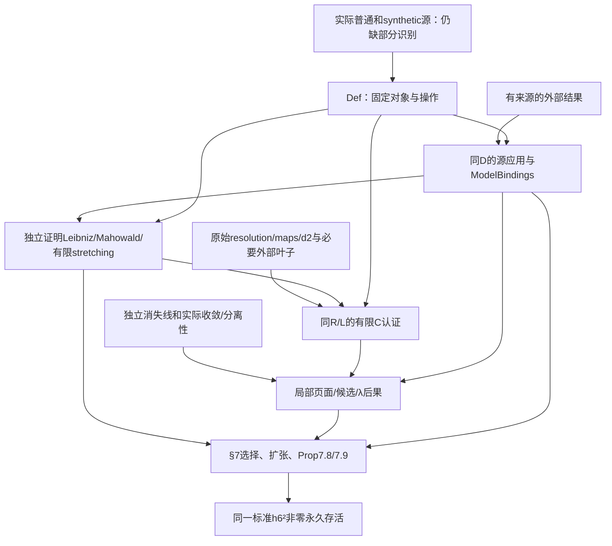

# 第 0 步架构重构与迭代自审报告

日期：2026-09-28。基线 commit：`57647d2158891da6cf7bd392f70f0f4158553dcd`。**报告对象是该 commit 上本次修改后的工作树，不是原始 commit 的内容。** 本次未提交、推送或创建 PR。

## 1. 结论

**第 0 步尚未完成。** 已完成新目录架构、旧总包链删除、标准 T 的定义隔离、两项 C 边界的完整类型同步，以及本报告列出的数学接口修正。全库 Lean 编译通过；完整工作树 Lean 文件指纹与检查记录见[证据清单](stage0-refactor-57647d2-evidence.json)。这不消除下面两项已确认的接口阻塞：

1. 普通稳定源只给出 CW 悬挂谱的 smash 比较，尚无实际 HF₂ Adams 塔所需的 source stable smash 与单位、乘法、coaction 比较声明。
2. Pstrągowski 的实际 synthetic 源及 ν 尚未准确绑定到所选路线 D；剩余 Pst/BHS/BX 等来源应用目标尚不能作为同一标准模型上的完整 A 接受。没有用任意 D 的总公理或自由 Prop 掩盖这一缺口。

这两项需要先补准确语言和同对象识别，证明允许 sorry。其余已明确类型的模型构造、认证和论文证明占位属于后续证明债，不是本次不通过的简单 sorry 计数理由。

| 验收方面 | 本轮判断 |
| --- | --- |
| M/T 的语言、次数、标准类、非零永久存活 | 已逐式核对并修正下述问题；**来源识别仍受阻塞 1、2 限制** |
| C 的含义、同模型绑定、范围、生产/消费同步 | 两项目标已同型；§7 的主要有限消费及尾部推导已有具名义务；未完成认证，未声称重放闭包已核实 |
| A 的来源、量词、同模型适用 | 经典/tmf 源与绑定已拆开；本文加强保留内部责任；**完整 synthetic A 仍未冻结** |
| 架构与旧阶段传递链 | 当前静态检查通过；Lean 声明一致性检查通过 |
| 冗余 | 单独清理及分类，不据此判失败 |

## 2. 基线、材料与实际范围

- Lean：`leanprover/lean4:v4.32.2`，工具链 commit `f3b06c705e6c85f5314019d5d3baab0fec5b580c`。
- Mathlib：`905b95818eb32af7874a58b427f50c1711a5e96c`；`lean-toolchain`、`lake-manifest.json` 未改。
- 主论文：*On the Last Kervaire Invariant Problem*，本地 LWX v2 TeX/PDF，`main.tex` SHA256 `1125462bcae4a4ec56e3bfcaad15df4febf98757dfb83462b155af162c99c9e0`；PDF SHA256 `7cae269851a88d10dd194651dbf7497b75ef8b8b914bc1901dfa3734cd8096b4`。`112.tex`、`main.bib`、`paper.txt` 同时保留原字节。以本地稳定 label 和行号定位，不把旧审计作为原文。
- Lin 数据：Zenodo 14875701，`v126.3.cw49`；原 `proofs.db`、S0 t261、Cν t200、谱间 map DB、UTF-16 CSV、`ss.json` 的实体均可读，不是 LFS 指针。`proofs.db` 为 623,042,560 字节，SHA256 `3a460683c023ee2d8f7e8f904ecef9044a474d88bb7184731e54978ba7dac248`。
- 初始 20 项固定文件重新核对全部字节相同，其中一个 Raw Lean 文件迁入 Def 后字节相同。原始论文、数据、依赖版本、CI 未改；迁移的生成 Lean import 与相应生成文件哈希清单已同步，不能把路径改动说成新认证。
- 原工作树已有 `.agents/` 下 19 项删除和 `AGENTS.md` 删除，本次保留。旧审计 `stage0-57647d2.md` 及其 evidence JSON 未覆盖。

主审负责架构、共同参数、最终条件接线、生成器、检查及交叉核对；三位并行审查者分别负责 M/T、A、C，使用同一基线和同一工作树。直接复读主论文 Theorem 7.1、Proposition 7.8/7.9、§3–6 工具及其 §7 消费、相关附录原表；没有把整个参考文献目录或 49 谱全集等同于 T 的必需范围。

A 来源直接核对包括 Pst 1803.01804v3、BHS 1910.14116v3、BX 2302.11869v3、BHSmot 2010.10325v2、Xu 1410.6199v1、IWX 2001.04511v3、BMQ 2011.08956v4、May 作者稿及 Belmont–Kong 的 Moss 推广。IWX 2022 原始 E₂/E∞ CSV 下载在隔离临时目录并实际解码。Moss 1970 扫描和 Toda 原书未取得，不标为直接读过；所需准确推广/低维输入与内部加强分别记录。详见 [A 来源与适配](../A_INPUT_FREEZE.md)。

普通源的点集/稳定模型比对另读 [May 的教材第 8、10、25 章](https://www.math.uchicago.edu/~may/CONCISE/ConciseRevised.pdf)、[Lurie Lecture 20](https://people.math.harvard.edu/~lurie/252xnotes/Lecture20.pdf)。这些来源不自动证明任意同伦范畴函子的张量识别。

没有完成：全部程序日志的数学重放、所选记录全部递归依赖叶子的提取、near-126 自由分辨率/共作用的构造、所有附录或几何推论的证明、完整 synthetic 源呈示。以下结论限于明列的检查范围，不凭抽样宣称全论文全部内容已认证。

## 3. 目录与交付链改动

迁移表保存在 [stage0-module-moves.json](../stage0-module-moves.json)。主要职责现在为：

| 位置 | 当前内容与边界 |
| --- | --- |
| `Def/Foundation`、`Def/Comparison` | 原阶段包中的必要数学结构、比较条件和通用证明；不再有总包存在公理或选择投影 |
| `Def/ClassicalAdams`、`Def/StableHomotopy/Source` | 固定源、standardFoundation、Milnor/cooperation、标准球 Adams 塔和类 |
| `Def/Computation/LinProgram` | 数据语法、生成记录、坐标、解释与 C 的命题语言；不是计算公理 |
| `Def/Kervaire/Inputs/Literature`、`Def/References` | 外部结果的命题类型、原文定位、来源/绑定类型；不是无条件接受这些命题 |
| `Def/Kervaire/Route/Goals` | 本文内部命题的精确语言；定义 Prop 不表示 M 已假设该 Prop 成立 |
| `Interface/Challenge/LinProgram` | `route_certification`、`basisTable_correct` 两个认证目标，均 `by sorry` |
| `Interface/Solution` | 保留实际有用的平方、表格证书等证明；没有冒充已完成 route_certification |
| `Main/Axiom/Computation` | 与上述两个 Challenge 完整同型的显式公理，不导入生产占位 |
| `Main/Axiom/Literature/Source` | 仅显式接受固定标准背景的 `classical_source`、`tmf_source`；完整 synthetic 接受集合仍缺 |
| `Main/Challenge/Final` | 唯一标准 T，依赖仅来自 Def 和基础库，证明 sorry |
| `Main/Solution` | 已有正确通用/文献运输证明、独立新工具、C 后果、§7 局部目标和标准条件结论 |

`Interface/` 直接子目录仅 Challenge、Solution；`Main/` 仅 Axiom、Challenge、Solution。已删除 `Challenge1.lean`、`Challenge2.lean`、其存在公理、全局 witness 及投影链、未用的 `A/ExternalA/CInput := Nonempty ...` 包装。旧无条件 Final Solution 的裸 sorry 已删除，保留条件推导，避免把无来源 A 的缺口掩在最终占位里。

历史 `LinE2Presentation`、`SphereBasisInterface`、`SphereTableCertificate` 改为显式条件参数，不再有默认全局见证/公理。其遗留通用辅助证明可复用；当前路线使用自己同一个 R/L，不从旧模型取值。它们不是新的一条阶段交付链。

规范入口 README、PROJECT_BOUNDARY、STAGE_LAYOUT、M/A/C 文档、生成脚本及检查已同步。旧审计保留历史口径，不再用作当前验收记录。

## 4. M/T 对象绑定与修正

下表路径相对 `KIP126/`；声明名是稳定定位。行号对应本轮工作树。

| 论文对象 | 定义、次数与同一对象绑定 | 状态 |
| --- | --- | --- |
| 完成球谱背景、HF₂ 及 unit | `Source/Prespectra.lean` 的真实基拓扑空间/prespectrum、稳定 π 商、两级局部化；`Source/Spheres.lean` 的 S⁰ 悬挂谱及 sphere-generator 求值所定 unit；`Source/Realization.lean:25` 的 `Source.Binding` | 载体/箭头明确；构造、连续性、比较有证明债；HF₂ 塔 smash 仍缺准确接口 |
| 唯一固定基础 | `Def/ClassicalAdams/StandardFoundation.lean`：`standardFoundation`、`standardSourceBinding` 均取同一 `Source.standardRealization` | 无独立另选背景；`standardRealization` 的返回结构受源识别条件约束，构造 sorry |
| Adams 塔 | `Def/ClassicalAdams/Tower/Data.lean:37`：`adamsUnit unit X=(λ_ X).inv≫unit▷X`；递归 fiber 给塔；`TowerSSData/Differential/Data.lean:33` | E₂ 起步，dᵣ 次数 `(r,r−1)`；actual HF₂⊗tower 的源比较是阻塞点 |
| 标准 h₆、h₆² | `StandardSphere/Classes/Data.lean:13/:21`：`standardH6`、`standardH6Square`；同 H/M 的 `Sphere.Internal.hi/hiSquare 6` | 分别 `(1,64)`、`(2,128)`，stem 63、126；不是 CSV 同名定义 |
| cobar/E₁/E₂/乘法 | `MilnorCohomology/Comparison/CycleMap/Data.lean` 的 `cyclesToFirstPageCycles/cycleClassMap/internalClassOfCocycle`；`SphereClasses/Product/Data.lean:17` | 同标准 Milnor 类经实际 E₁ 坐标和 homology/page 比较；实际塔/同伦乘法比较另有准确声明 |
| 固定 cooperation | 新 `StandardCooperations.lean:14`：`standardCooperationComparison` | 同 standardFoundation/standardMilnorCooperations；coordinates_eq 为 rfl；unit/diagonal/coproduct 等准确比较尚待证明 |
| 真正非零永久存活 | `Def/SpectralSequence/Permanence/Predicates.lean:28`：`NonzeroSurvival`；`TowerFiltration/Data.lean` 的 Z∞ 交及 B∞ 上确界 | 一个共同无限代表，E₂ 投影为指定 x，E∞ 投影非零；不等于全部出微分为零或有限页存活 |
| 标准 T | `KIP126.Challenge.Final.H6SquarePermanent.h6_sq_permanent`，`Main/Challenge/Final/h6_sq_permanent.lean:18` | 恰为 `NonzeroSurvival sphereAdamsData (2,128) standardH6Square`；无额外几何或阶数结论 |
| 同一 ν/λ/商/塔/恢复 | `Kervaire.Route.Model H M Syn`；`StandardRouteModel Syn`；`Model/Coherent/Data.lean` 及结构比较 | 参数身份明确，不能凭类型别名宣称是 Pst 源；源构造识别仍阻塞 |
| ν、Cν 与 normalized maps | `D.auxiliary.nuMap`、其真实 cofiber 三角；`NuSourceIdentification D`、`NuCofiberSourceResults`、Applicability 的三个 map 等式 | 文献存在合适提升与预选 normalized maps 相等已拆开；不接受任意提升版 |
| tmf 与 unit、G | `TmfSourceData/Results/Existence`，`TmfBinding D G`，`G.Standard`；C 的 `LabelsCorrect R L G` | 源 detector iso、unit、两标准标签、同一 convergence 都显示；共同源实例尚需构造 |
| λ 商乘法及检测 | 新 `Route/Multiplication/Operations.lean` 与 `Comparison.lean`；`AlgebraBinding` | 同实际 MonObj 的乘法/球作用、cobar/有限商/实际过滤比较；不写指定局部乘积值 |
| 上同调与 UCT | `StableHomotopy/Cohomology/Data.lean:39`：`Mod2Cohomology H n X=[Σ⁻ⁿX,HF₂]` | 修正确定的符号错误；UCT 同 n。πₙHF₂ 的 F₂ 模结构独立为 mod2HF2HomotopyModule；未把一般同伦群设为 F₂ 模 |
| C₃/C₄/C₅/D₁₂ | `Route/Conditions/Predicates.lean:24/:30/:44/:58` | C₃ 要真实 E₆ 代表；D₁₂ 非零在 E₁₂；C₄ 为 DetectsNonzero，C₅ 的靶为可零 Detects，不混同 |
| 检测/选择/不定性 | `Synthetic/Detection/Predicates.lean:23/:36` 及新一般差值/加法性质 | associated graded 关系；相同 leading term 的严格代表等式只在额外尾部消失后导出 |

独立展开标准 Final 的本库 import 闭包为 181 模块，未引入 Main/Axiom 或 Interface/Challenge，也未引入只供路线使用的新 standardCooperationComparison。Lean `FixedFinal` 检查条件结论与标准 Challenge 的目标表达式相同。这里只核查类型和定义身份，不表示来源缺口已经消除。

## 5. C 的覆盖、原始强度与推导责任

C 的唯一联合目标在 `Def/Computation/LinProgram/Route/Certification.lean:48`：

```lean
Certification D G := ∃ (R : Realization D) (L : Labels H),
  CertifiedRealization R L G
```

其中七字段是 basis、csv、products、labels、results、bottom、top。它们全部约束同一 R；R 的存在不是一个全局任选解释。`BasisCorrect` 覆盖完整局部基及所有 F₂ 线性组合（以 ℤ 线性比较表述）；`ProductCorrect` 对所选次数的所有输入连接实际 `Sphere.Internal.product`。`decode` 对缺次数、越界、不严格递增坐标返回 none，空坐标也不能使缺次数被解释为零。

Challenge 与 axiom 的参数同为固定标准基础上的 D、G，另保留同一实际 ν 的 h₂ 检测与非零存活条件，以及 `G.Standard`。这些条件可由 A 的源识别得到，已给无 C 依赖的 `ComputationPrerequisites` 证明；不是先用 Cν 输出证明自己的适用性。

以下所有原始行均属上述 `v126.3.cw49`；完整清单由 `Route/selected.json`、迁移后的 `Route/Selected.lean/Records.lean` 保存。`Main/Solution/Computation/Route.lean` 与 `Lambda.lean` 中的后果是待证明定理，未加入 C 字段。

| 论文消费点 | 数据及准确 C 强度 | 同 M 的桥梁/内部义务 |
| --- | --- | --- |
| Fact theta5sqAF；局部乘法/维数/零群 | 648 个次数、963 基向量、73 对乘法次数；保留完整空基；651 core rows，671 个有限断言 | BasisCorrect + CSV + ProductCorrect；SphereFacts 逐项派生，不能把 R 的任意线性映射当真实比较 |
| d₂h₆、d₂x₁₂₅,₈ 等 | log 5541、5990；`Records.lean:52/:57` 等普通微分等式 | `HasDifferential` 与后页非零区分；非零要由完整基和页面重建证明 |
| 仅两种 d₃ 候选 | log 2047477/2047478 是 root trial 的否定式 | `d3_x1266_candidates` 还要重建完整 E₃ 靶组；两个排除行本身不是候选穷尽 |
| W、V、Y、X 的页数 | S0_ss 2702→E₆，2569→E₁₂，2852→E₅，2433→E₆ | 有限 Reaches 与非零 Survival、NeverHit 分开；未知 d₅(Y) 未改成零 |
| U/correction/P/Q 的永久性 | 9000 特殊码只交付 ReachesPage 1000 | `named_survive1000` 另重建全部入边界；`nonzero_permanent_of_survives1000` 再加独立无限尾界 |
| 所有晚页/全部候选 | 有限记录覆盖不了 t>261 或任意 r | `SphereVanishingLine H`：正 stem 且 `0<t−s<2s−3` 消失；后页入源负过滤；独立准确范围引理，不是新数值 C |
| high125 唯一 E₅ 类 | log 154532–154537 六个 root refutations + 实际 d₄ 与完整基 | `high125_component` 在 E₅ 上非零且穷尽；不是 E₂ 非零冒充 E₅ 非零 |
| F²⁶π₁₂₅=0 与 tmf 代表唯一性 | 26≤s≤64 的有限 E₅ 消失；38 条 staircase；s≥65 用统一线 | `classical_stem125_filtration26_zero` 另需真实经典 Hausdorff 性；tmf 的任意选择加强保持内部推导 |
| ν-extension 的 Cν d₃ | log 212838 顶胞 [0]→[1,2,3]；Cnu_ss 3872/3873 底胞项 | 同一 ν cofiber 箭头、实际四次塔悬移；合并得到 [0,3,4]→[3]，不是只取单个 top row |
| 有限 stretching E₄→E₆ | 所需 b=0 crossing 源为球(9,131)/(10,132)，选集含完整空基 | `nu_stretching_crossing_absent` 明列；源 Z₅/靶 Z₃；只得有限 Q₅/Q₉ 关系，不升级无限相容提升 |
| BX λ 规范化 | π₆₂,₆₄ 与 π₁₂₄,₁₂₈ 的相关低过滤空源；S0_ss 2380 的 d₂h₇ 击中 h₀h₆² | 前两者为全幂单射；π₁₂₅,₁₃₀ **只需且只声明单步单射**，不预先排除 d₁₂ 分支的高幂 torsion |
| B 的 synthetic 二阶性、Moss/Toda | stem63 row494 d₂(6,69)→(8,70)，row513 d₂(7,70)→(9,71)，row512 d₄(7,70)→(11,73) | `lambda_kills_realization_kernel_62_71`、`two_torsion_62_70`；不套用 θ 的(62,64)单射；joint θ,b,q 的检测/阶/Toda成员另证 |
| Prop.7.9 最后反证 | Cν (14,139) 局部[2] | `CnuTargetThrough5` 精确为 E₆ 非零及 r=2..5 不被击中；与 `cnu_boundary_of_lambda_nu_divisibility` 的同一解码目标矛盾 |

范围线来源为 [Ravenel Th.3.4.5(a), pp.87,89](https://webhomes.maths.ed.ac.uk/~v1ranick/papers/ravenel2.pdf)；其原界更强，当前使用保守统一弱化，明确排除零 stem 的 h₀ tower。`sphere_vanishing_line` 是独立基础/比较证明任务，不能从有限 DB 得到。`ClassicalSphereSeparated` 由实际强收敛适配提供，其准确目标已声明；不是一个未定义的“尾部正确”Prop。

认证材料仍缺 near-126 自由分辨率差分/augmentation、Cν 共作用等。仓外找到的 `actual-s0/S0_Adams_res.db` 只有 16 generators、max(t)=8，commit `23d12c973db2b294a6c00c15bd106e70b0af3fa6`，不能当论文数据来源。当前认证目标已经明确；构造它需要补这些材料属于第一阶段，不因为尚未认证就自动否定准确命题的冻结。

程序 `reason=M` 的手工叶子 log71642/71643/71644 已只读定位：两个 image-of-J 球谱微分和 tmf 的 d₃v₂¹⁶=β⁵g。尚未证明它们全部属于所选最小重放闭包。根反证还访问 sphere stem128/129、155/156、tmf(125,25)。本次没有把只消费两谱误说成重放只需两谱，也没有要求无关全部49谱。详见 [C 认证边界](../C_ROUTE_CERTIFICATION_BOUNDARY.md)。

## 6. A 的来源、适用与内部加强

`Def/Kervaire/Inputs/Literature/Data.lean:41` 的 ExternalInputs 目前是 **13 组 source-application 目标**，不是已完全分离的纯 A；`:60` 的 ModelBindings 独立保存经典选择、synthetic η、乘法、tmf 和 normalized ν 识别。`:71` 的 Inputs 直接组合同 D/η/G，不构造全局 witness。当前两条显式 source axiom 不会交付整个 Inputs。

| 原结果/消费 | 原文定位及直接核对范围 | 当前接口和责任 |
| --- | --- | --- |
| 经典 θ₅ 存在、阶 | Xu v1 Cor.1.3 | `ClassicalSourceResults`：存在二阶检测者；全体 synthetic 选择二阶不在 A |
| π₆₂ 指数2、AF gap、低 Hopf 检测 | IWX v3 `cor:main-Adams` 及2022作者图表 | 同标准完成球；E∞ CSV物理行204–207为AF2/6/8/10；`ClassicalSourceBinding`/η绑定后普通运输已证 |
| BX 原始有限/无限判据 | BX v3 Prop.7.19及证明 | `BXDistinguishedInput` 留原始有限关系；λ规范化、任意选择、synthetic阶为内部 Lambda/Choice 目标 |
| Pst 源及提升 | Pst v3 定义 `defin:synthetic_spectrum_based_on_e`、Lem.4.23 | 实际 finite HF₂-projective ∞-site、球面谱值sheaves、连通mapping-spectrum sheafification；**源呈示/ν绑定缺失** |
| BHS λ商/刚性/E∞ | BHS v3 A.1、A.8、A.9、A.11、Lem.9.15 | 有限q>0与无限、存在提升/每个提升、次数和实际λ/ρ/δ标签已分开；剩余源应用性仍依赖上项 |
| 有限λ商代数 | Pst、BHSmot v2 Appendices B/C、BX Bockstein maps | AlgebraInput 源结果与 AlgebraBinding 的有限商/cobar/过滤乘法比较分开 |
| May TC3 | May 2001作者稿pp.12–14、Lemma4.6 | 保留带负号的边界式；消符号需显式指数2投影，内部适配，不把所有π设F₂ |
| Moss | Belmont–Kong v1 Thm1.1/4.11、Def2.10；IWX crossing方向 | 原推广直接核对；Moss1970原扫本次缺失。保留Massey存在、零复合、两个crossing和residual条件；局部值/零不定性归内部 |
| Toda低维源与加强 | BHS `prop:syn-toda-range` 的低环数据；IWX的motivic重述有范围限制 | η²及synthetic symmetric-two成员关系移至内部，未把C-motivic公式直接当synthetic事实；Toda原书未直接核验 |
| tmf源/高125产品 | BMQ v4 Fig1.1、§2、§7 | 接受真实unit产品κ̄⁴w像非零、π₆₂tmf=0等；任意same-leading-term代表非零需C给F26尾界，内部适配 |
| tmf标签 | IWX2022原始 E₂ CSV物理行59、275 | (4,24)的g、(9,54)的Δh₁g各唯一非零；G.Standard 与 C.LabelsCorrect 共用同G |
| ν三角 | Pst/BHS合适三个normalized lifts的存在 | NuCofiberSourceResults 与“这三个lift等于D所选map”的Applicability分开；不接受任意chosen maps |

出处、哈希、消费位置保存在 `Main/Axiom/Literature/Route/sources.json`；当前来源检查统计为29组、66声明、17固定文件哈希，另有5组binding/7组内部adapter。这是清单/文件身份检查，不能替代上表的原文强度核对。整个来源 inventory 的18来源/88材料也不等同于18项数学输入已经接入。

`Main/Axiom/Literature/Source.lean:24/:29` 的两个公理是固定 standard H/M 上的 `ClassicalSourceExistence` 与 `TmfSourceExistence`；不量化任意D。它们的存在见证必须与共同源构造一起选取并提供 binding，不能从两个独立存在命题自动推出任意预选收敛/检测器相同。普通源 smash 与 synthetic 源的残余阻塞会限制这些对象被称为论文模型的最终验收。

## 7. 论文推导、隐含前提与无环责任



这张图规定后续证明责任，不冒充已验证的整个程序重放图。若认证使用本文新规则，必须先完成 N 的独立证明；N 当前只取准确 A/绑定，不取 C 或 T。C 后的 `sphere_facts`、λ窗口、§7反证不得反过来认证自身依赖的记录。

`Main/Solution/Route/Conditional.lean` 明列 D、η、G、L、`Literature.Route.Inputs`、`Computation.Route.Inputs`，以及 V（独立消失线）、S（真实经典过滤分离性）。`proposition_7_8`、choice/reduction 等复杂证明仍 sorry。`proposition_7_9` 已将同一目标“r≤5被击中”与 C 的“r≤5不被击中”接成实际组合证明，但所用局部论文引理仍待证，不能把这段组合称为 Prop7.9 全证明完成。

`standard_final_of_inputs` 的结论与唯一标准 T 定义相同。`AcceptedComputation.lean:17` 的 `standard_final_of_accepted_computation` 真正消费显式 C 公理，局部消去一次 `∃R,L` 后保持这个 R/L；A/V/S仍为可见条件，没有构造缺失的 synthetic 源，也没有消费 Challenge sorry。

本文的广义Leibniz、广义Mahowald、stretching、选择无关性、Massey局部值/no crossing、λ规范化、synthetic θ/B二阶性、α₁/α₂/α₃、Y的全称选择、P/Q过滤以及 Prop7.8/7.9 均留在 Main/Solution 的内部责任。M 中只有这些命题的精确语言，没有将其成立塞进结构字段。

## 8. 迭代检查与实际验证

本次不是一次路径搬运后即验收。至少经历：

1. 按当前源码重新分类旧总包逐字段职责，迁移定义/证明，删除旧消费存在公理和选择链；静态闭包发现并修正越层 import。
2. 对照主论文及外部原文修正 UCT、May符号、tmf源量词、ν/η适用、有限λ乘法、C的共同解释存在式；分离内部加强。
3. 反向检查§7，补晚页/高过滤尾界、有限stretching所需cycle/crossing、Cν后页非零、λ单步与全幂区别、B阶二性和joint Toda见证。
4. 分模块编译后全库编译；修正命名空间迁移、显式参数造成的类型变化、权重等式cast、缺导出及过时的“禁止标准Milnor定义”回归规则。保留真正的公理/占位隔离检查，没有为了让测试通过放开任意项目公理。
5. 三位审查者交叉复核对象与量词；保留普通HF₂塔smash和synthetic来源两项阻塞；清除文档旧“已全部冻结/新增无sorry”说法，重新核对生成器和Blueprint声明。

实际结果：

| 检查 | 结果与限度 |
| --- | --- |
| `lake build KIP126` | **通过，4211 jobs**，日志 `kip126-refactor-build5.log`；全部预期 sorry/linter 警告保留。类型检查不是数学认证 |
| Source、UCT/Coefficients、有限λ比较、StandardCooperations 最小模块 | 通过，包含同一固定工具链的实际编译 |
| StageInputDeclarations、RouteCertification | 通过；Lean Expr 完整类型相同，producer不依赖consumer，consumer确为axiom |
| 实际消费端与独立新工具 `#print axioms` | 消费端仅另有显式 route_certification，独立工具无 C 公理；均如实含基础公理及 sorryAx |
| StandardFinalBoundary、FixedFinal | 通过；最终类型在定义层，标准条件结论与目标相同；允许且披露结构证明的sorryAx |
| `check_stage0_architecture.py` | 1504模块通过：目录、缺import、Def传递闭包、旧链、Solution不消费Challenge、认证不消费Main公理、无import环 |
| 路线生成 `select-route.py --check` | 648次数/963基/671断言/651core rows/73乘积/4底胞映射/8refutations一致；不证明筛选完整或结果正确 |
| `import-selected.py --check` | 6条log及1条basis.d2记录一致 |
| `import-staircase.py --check` | 23,822行/187shards一致；有限状态语义未改强 |
| 完整log importer隔离重生成 | 扫描2,672,275行，导出10,907条/86shards；87个Lean文件逐字节一致；仅迁移后的import文本导致manifest文件哈希更新，其他manifest字段相同 |
| A来源清单与66条Lean声明 | 检查及Lean存在性通过；13应用字段/29来源组/17文件哈希，不代表全部源应用已构造 |
| source inventory/Lean投影 | 18来源/88材料通过；相关25项集成测试通过 |
| importer回归/乘积检查自测 | 5项importer测试和4项乘积证书自测通过；不是near126实际乘法的Lean数学认证 |
| Blueprint当前声明检查 | 1508个当前TeX声明全部存在；修正95个迁移后缺引用并补已有模块导出，再次全库构建通过；只核查存在性，不将占位标成已证 |
| 原始材料及版本回查 | 20个固定文件全部同哈希；无工具链、依赖、CI或原始论文/数据库修改 |

沙箱内 Lake 定位本机工具链失败时，改在获准的同一固定工具链环境运行，最终实际检查通过；没有换 Lean/Mathlib、修改共享依赖或借用另一版本的成功日志。未运行“零sorry/零阶段公理”作为第0步验收门槛；未执行外部消息/发布。

## 9. 残余问题、分类与最小后续工作

| 编号/分类 | 核实证据与影响 | 最小行动及阶段 |
| --- | --- | --- |
| R0-01 **接口阻塞** | `Source/Realization.lean:86` 的 smashIso 仅量化 CW空间悬挂谱；实际 `Tower/Data.lean:37` 使用 HF₂⊗tower_s。尚缺源上的相应稳定smash/单位映射比较；不能由exact/closed或名字推出 | 第0步：精确定义所需source derived smash（只需实际塔/cooperation闭包），写出同一R的自然比较、unit/shift/coaction/product coherence；绑定到standardRealization。证明可sorry |
| R0-02 **接口阻塞** | Pst的∞site/球面谱值sheaves/ν sheafification与当前D尚未识别；ExternalInputs仍含源应用目标，完整A无法准确接受 | 第0步：用足够的高阶/富集或等价点集呈示表达实际源，准确识别ν/λ/双悬移/商/BHS tower；在共同构造上交付准确源公理和Bindings声明。勿以普通Ho上的set-valued sheaves或自由Prop替代 |
| R0-03 **证据缺口** | near126 resolution/augmentation/cofiber共作用实体未找到；仅有t8示例；程序全部重放叶子闭包未提取 | 第一阶段：取得对应release材料或另给可认证构造；按记录提取所需跨谱和外部规则。若选择新重放设计且发现遗漏适用条件，须补回第0步接口，不能假定已有完整soundness |
| R0-04 **证据缺口** | Moss1970、Toda原书本轮未直接取得 | 已用明确直接核对的推广/低维源并将加强归内部；若后续证明要调用原书额外定理，先补精确原文。不能凭历史记录标“本次核实” |
| R1-01 **后续证明债** | standardRealization、standardMilnor与cooperation、已有shift/cofiber/检测/有限λ比较中仍有sorry | 在准确签名与已补源识别前提下完成模型/比较证明；本身不是第0步须清零的任务 |
| R1-02 **后续证明债** | 两项C Challenge均sorry；路线无实际认证Solution | 第一阶段证明七字段联合目标及基础basis目标；保留同R/L/G与适用条件，不导入C公理 |
| R2-01 **后续证明债** | 新工具独立声明、范围/λ窗口、选择、局部扩张与Prop7.8等未证 | 第二阶段及认证规则前置证明；先独立规则再重放，明确无环，不改列A/C |
| R2-02 **后续证明债** | 标准Final仍未给无条件实际证明；现有结论条件中A/V/S公开 | 第二阶段在同模型上接好来源及C后完成T；不另造同名目标或将T塞进输入 |

R0-01/02 是缺少准确源操作/识别声明，不只是困难证明尚未写出。当前没有可靠依据把它们简化为一个无约束结构或任意模型公理；因此本轮不宣称达到停止标准。其他可核实修改和检查已经执行，而不是只留下计划。

## 10. 冗余与保留理由

| 内容 | 判断与处理 |
| --- | --- |
| 旧Challenge1/2总包、存在公理、一次选择投影 | 过时并与新职责冲突，已移除；必要字段逐项迁入Def/A/C |
| 未使用Nonempty A/ExternalA/CInput及固定基础兼容别名 | 已删除；不通过别名保留旧链 |
| 标准Final Solution裸sorry | 已删除；Challenge保留目标，Solution保留有明确前提的实际接线 |
| 通用Lin表示、旧全表证书、已有平方/边界/维数证明 | 合理复用：保留显式参数版本，不与路线R混用；没有全局默认实例 |
| 原始附录全表与老生成日志 | 项目扩展/可重放档案；不据路线范围宣称全部已覆盖，也不无依赖分析删除 |
| 空基与零次数 | 必需：候选穷尽、消失线有限段、stretching crossing排除，明确保留 |
| Browder/HHR几何结果、额外例子 | 不属当前指定T的必要终点；保留来源/有效通用证明，未强加到T验收 |
| 文献来源包装/manifest/Blueprint节点 | 作为出处、迁移和导航使用；不能代替原文、模型适用证明或认证 |

进一步清理不是当前两项来源阻塞的替代品。下一步应优先冻结 R0-01/02 的精确接口，再决定是否足以将其转为普通证明债；之后完成计算认证或论文证明，不应混入第0步验收条件。
